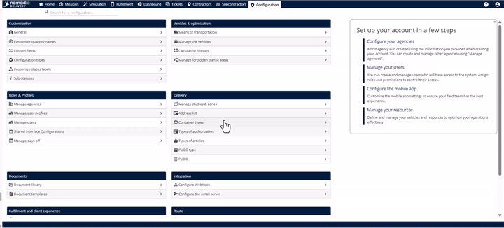
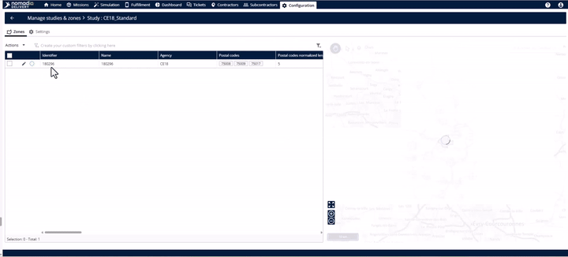
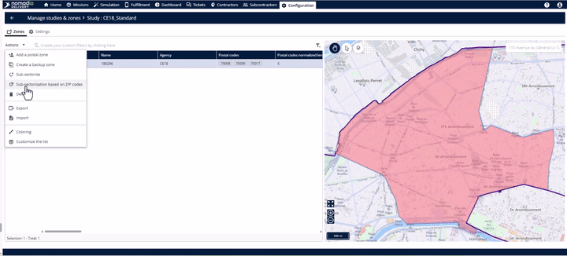
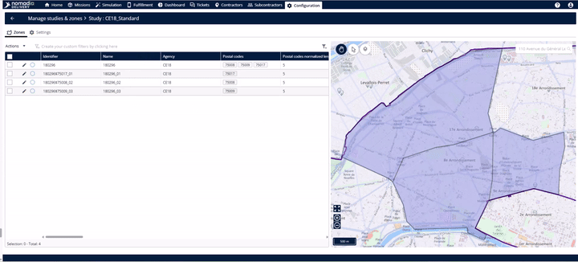

# Sub Sector Using Postal Code

In many areas, postal codes are so detailed that they already represent the perfect delivery territory. Instead of using complex tools to balance workloads or mission data, this feature allows you to turn **one postal code into one subzone** instantly.

**Key Benefits:**

* **Instant Results**: No waiting for processing or "balancing" calculations.
* **Precision**: Uses the exact, official boundaries of the postal codes.
* **Simplicity**: One click creates all your subzones at once.

***

### How to Subsector Your Zone

Follow these simple steps to transform your primary zone.

**Navigate to Your Study**

1. Open the **Configuration** module in the platform.
2. Select **Manage Studies and Zones**.

**Select Your Primary Zone**

1. Once inside the study, click on the **Zone** tab at the top.
2. Click on the **Primary Zone** you wish to break down.

**Run the Automatic Subsectoring**

1. With your zone selected, click to open the **Actions** menu.
2. Look for the option labeled **Subsectorize based on zip codes** and click it.
3. Clicking the option – Subzones appearing instantly in the table

<figure><figcaption></figcaption></figure>

***

### Visualizing Your Results

Immediately after clicking the button, you will see two major changes:

* **The Table**: All your new subzones will be listed clearly in the zone table.

***

### Productivity Tips

* 💡 **Choose the Right Tool**: Use the **Territory Manager** if you need to balance workloads based on mission numbers. Use **Postal Code Mapping** if your geography is already naturally divided by zip codes.
* 💡 **Save Time**: This feature eliminates the need for "wizards" or pop-up menus, making it the fastest path to a structured zone.
* 💡 **What's Next?**: Once your subzones are built, the platform can automatically assign new delivery missions to the correct person based on these territories.
