# 12. Custom Dashboards

The enhanced dashboard offers advanced features for better data access, visualization, and

customization. These improvements enable transporters and subcontractors to manage

large datasets more effectively, derive actionable insights, and customize dashboards to

meet specific operational requirements.

Pre-defined Dashboards:

A set of ready-to-use dashboards is available to provide actionable insights across different

operational areas:

Home Page KPIs: Enables users to monitor key indicators directly from Nomadia

Delivery home page.

Operational Dashboard: Helps users track delivery performance and identify potential

bottlenecks.

Administration Dashboard: Allows users to review application usage metrics.

Sustainability Dashboard: Lets users assess carbon footprint and fuel consumption trends.

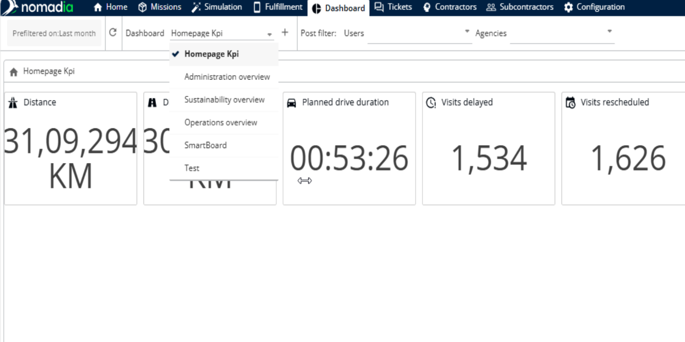

Pre-Filters for Improved Performance:

Users can configure pre-filters, such as Agency, Period, Contractor, and Subcontractor, to

define the data shown on the dashboard in advance.

By pre-filtering data on the server side, only the necessary information is downloaded,

enabling faster chart rendering and smoother performance.

This feature is especially useful for users handling large datasets.

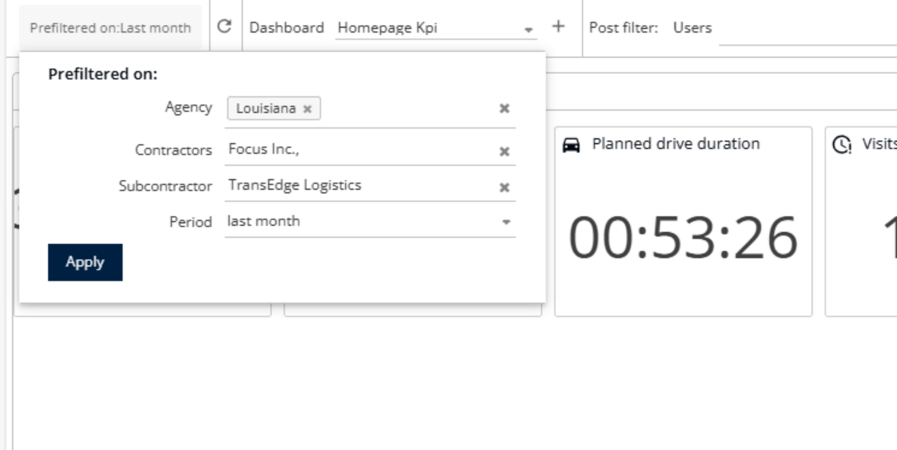

To set up a custom dashboard, users (transporters or subcontractors) should follow these steps:

Open the Nomadia Delivery application and go to the Dashboard tab.

Click the ‘+’ button to create a new custom dashboard.

Enter a title for the dashboard and click ‘Create’.

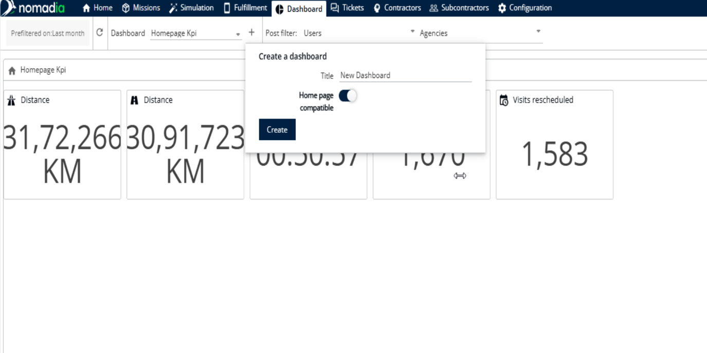

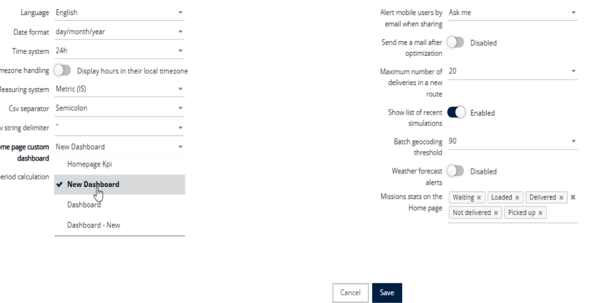

Optionally, set the dashboard as your home page dashboard by activating the toggle. This can later be accessed via Profile → My Preferences.

Note: Home page dashboards can include a maximum of 10 KPIs. The selected dashboard  will dis

The newly created dashboard will now appear in the dashboard list. Click ‘Edit Mode’ to start

designing it.

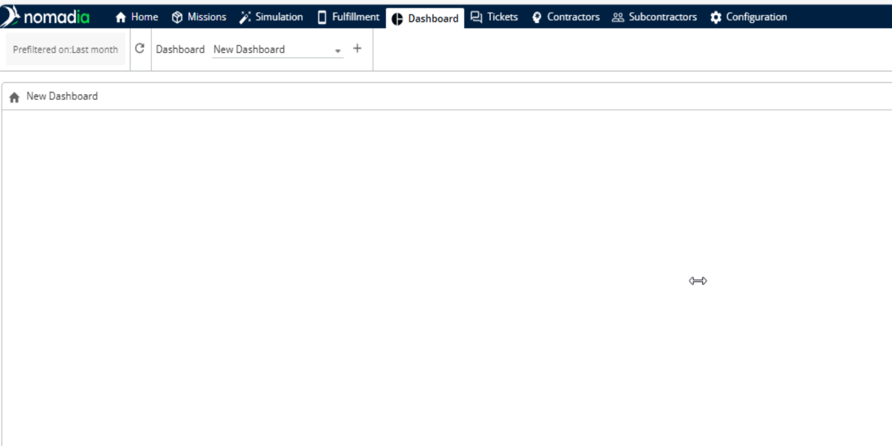

The Edit Mode provides a drag-and-drop interface for creating personalized dashboards.

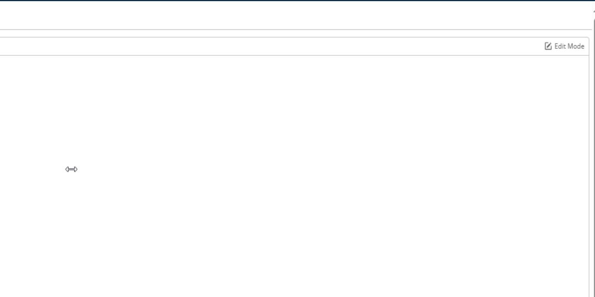

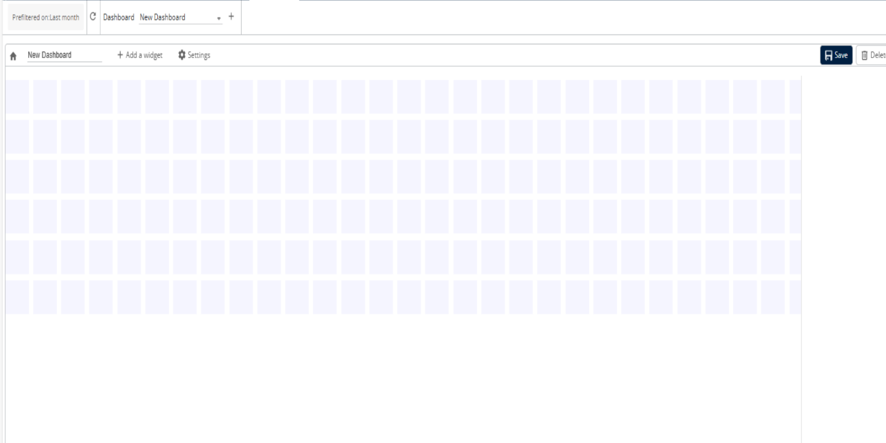

To add a widget, click ‘Add a widget’. A new widget will appear with a default ‘Counter’ representation.

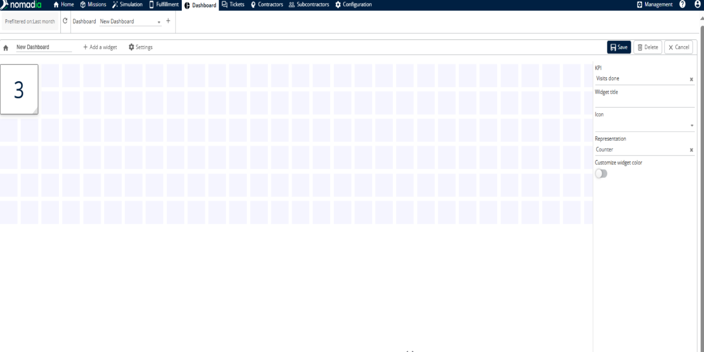

Click the widget to edit its parameters:

Select specific KPIs, visual representations (e.g., charts, counters), titles, and icons.

Apply advanced aggregation options, such as grouping data by users, agencies, or mission

status.

Customize dashboards to meet specific roles or operational needs.

Choose the desired KPI from the available list (e.g., Missions Delivered). The widget title and icon

will automatically update based on the selected KPI.

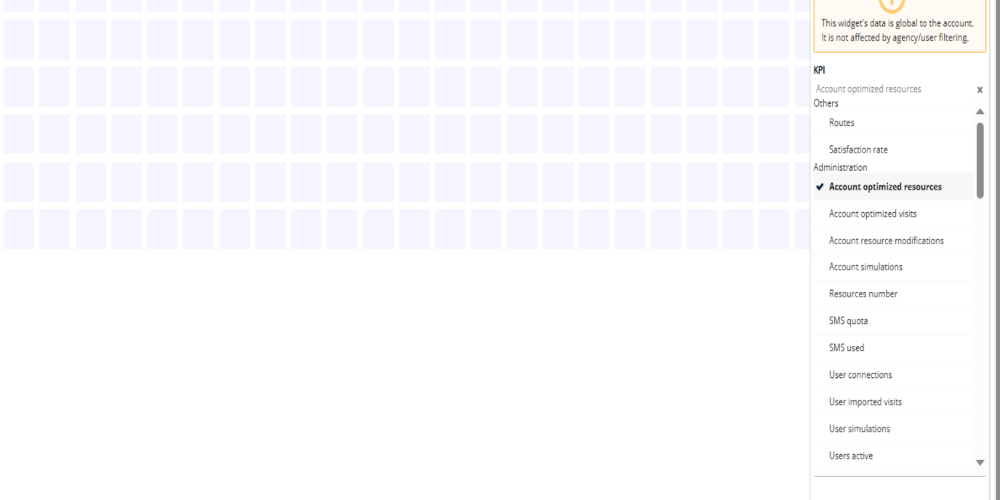

Click ‘Save’. A confirmation notification will appear.

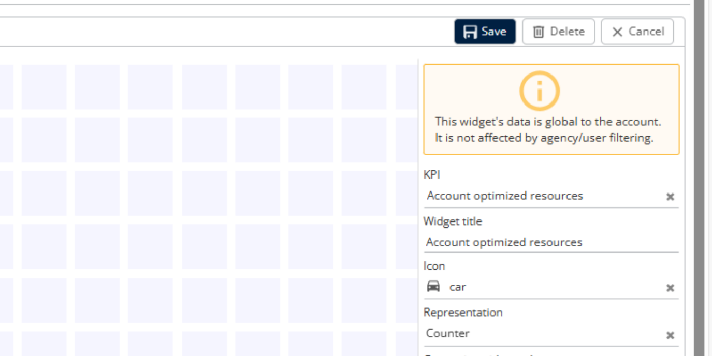

To edit an existing dashboard, click ‘Edit Mode’ again.

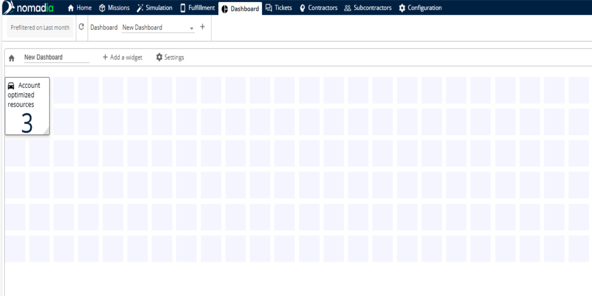

Resize widgets by moving the mouse to the bottom corner and dragging them to the desired

size.

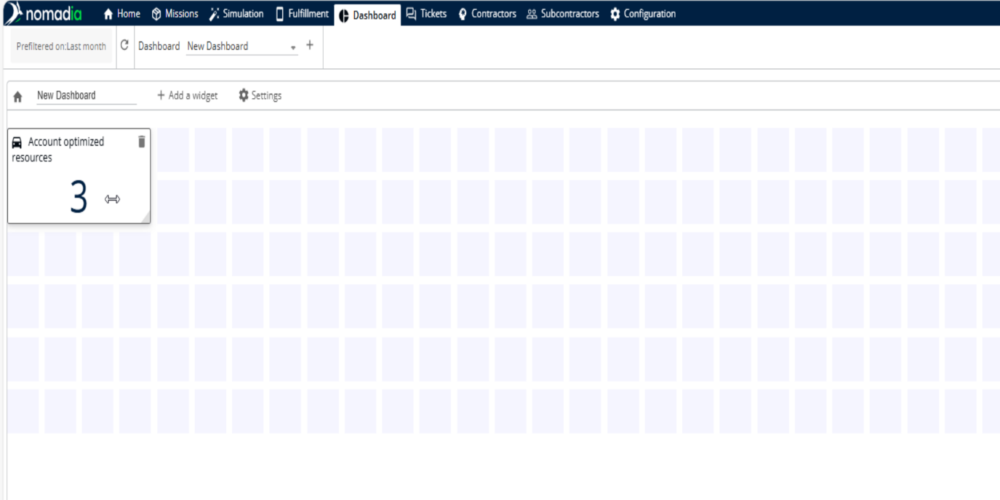

To add more widgets, click ‘Add a widget’. The new widget will occupy available space in the

grid.

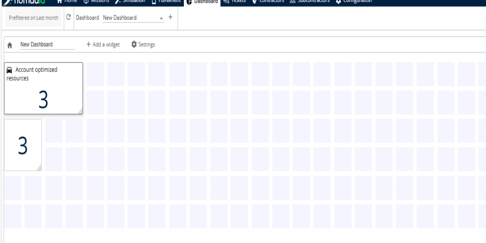

Drag widgets to reposition them as needed.

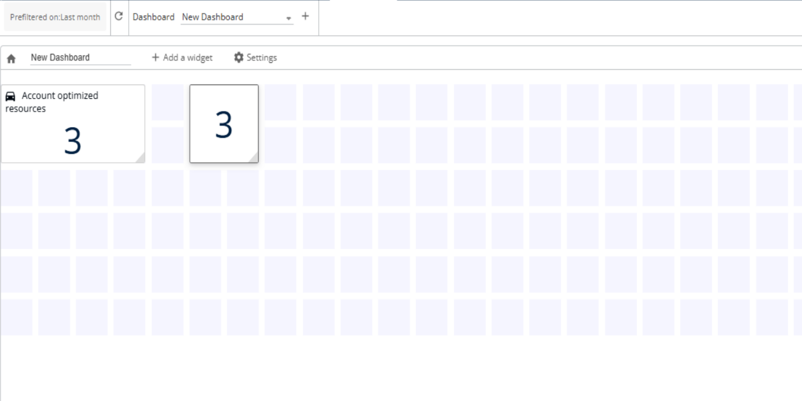

To edit a widget, click it, select the KPI (e.g., Missions Delivered), update the title (e.g., Mission

Delivered by Users), and choose the representation (e.g., Horizontal Bar).

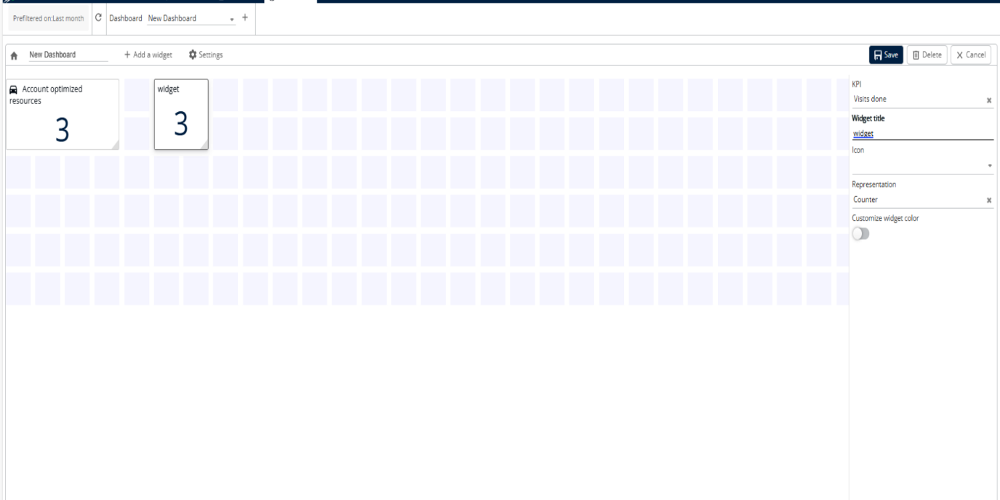

Set aggregation options (e.g., Aggregated by Users) to display data according to mobile users.

Continue adding all required KPIs, applying different representations and aggregations, to

complete the dashboard.

Once finalized, click ‘Save’ to save all changes.

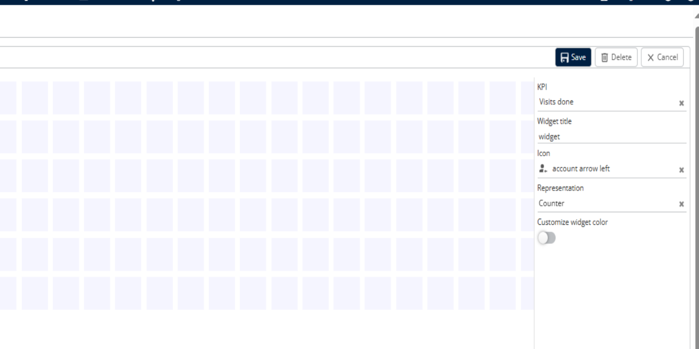

The newly created custom dashboard is now ready for regular monitoring by the author.

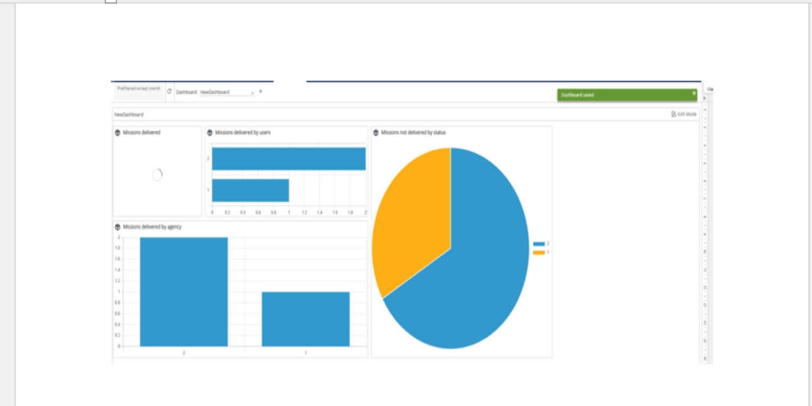

To remove a dashboard, follow these steps

Click the ‘Edit Mode’ button.

Click the ‘Delete’ button to remove the dashboard.

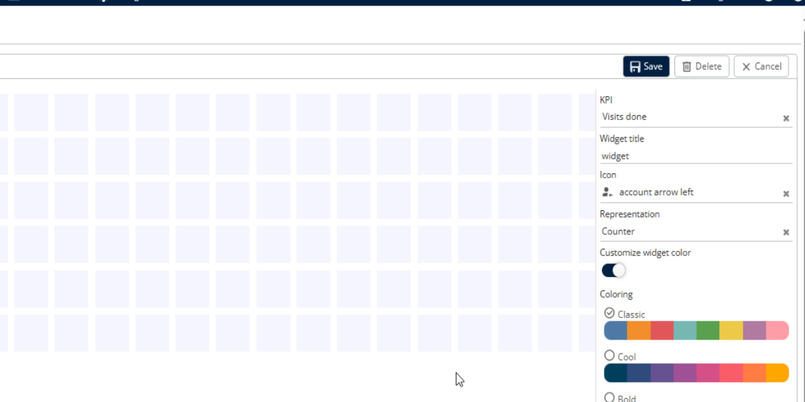

In the confirmation popup, click ‘Yes’ to proceed with the deletion.

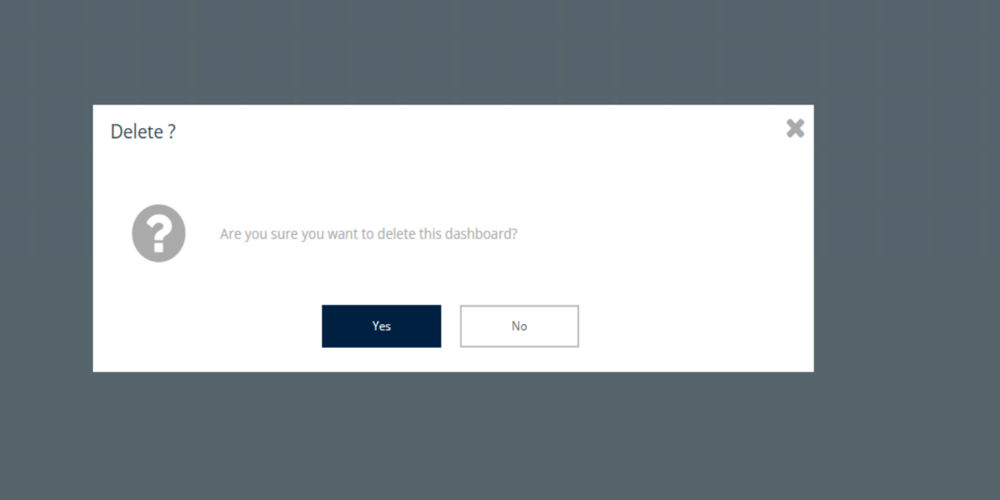

A notification will appear confirming that the dashboard has been deleted.

Deleting dashboards allows transporters to better manage and visualize data,supporting streamlined operations and informed decision-making.

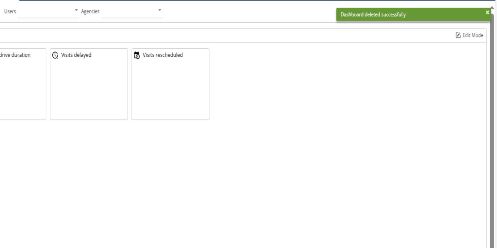