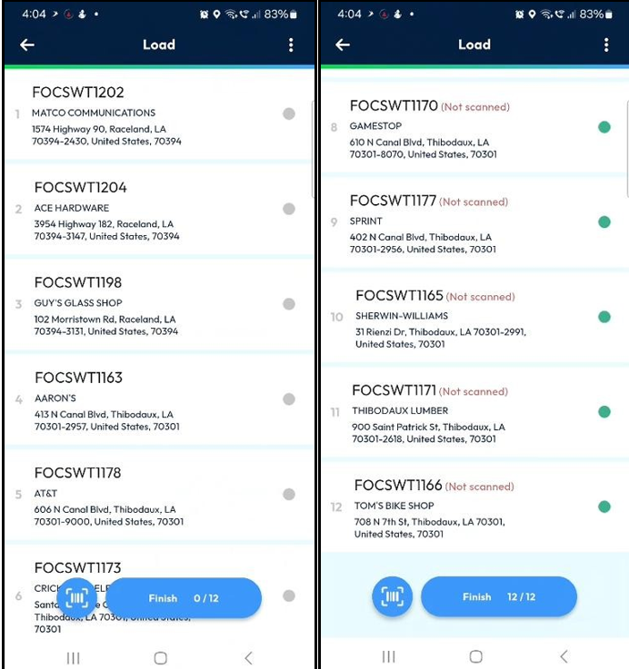

# Configuring Customized Surveys

As a transporter, configuring customized surveys is crucial for gathering valuable feedback from deliverers and contractors across different stages of their operations. This capability centralizes all data within a single platform, removing the complexity of managing scattered information and empowering data-driven decision-making.

Follow these steps to set up customizable surveys in Nomadia Delivery:

1. Open the Nomadia Delivery application and go to the Configuration tab.
2. From the drop-down, select Configure the surveys.
3. Click the Actions button and choose Create to set up a new survey.

.png>)

Survey Creator / Form Builder is a visual design tool that allows you to create surveys and forms. Surveys can be conducted for four specific use cases:

* Mission Creation – Filled by the contractor before creating a mission in Nomadia Delivery (only for manual creation via the wizard). This helps to capture all necessary details upfront for successful deliveries.
* Route Start – Filled by the deliverer before leaving the agency for delivery/pickup. Collects vehicle condition data to ensure readiness before beginning the route.
* Mission Fulfillment – Filled by the deliverer during delivery or pickup. Tracks deliver milestones and monitor progress in real time.
* Route End – Filled by the deliverer after returning to the agency at the end of the day. Provides insights into vehicle condition post-route, useful for maintenance and operational planning.

.png>)

4. Enter the Identifier and Name of the survey, select the survey type from the drop-down, set the Status to Active, and enable the Store all responses toggle to save survey results.

.png>)

5. Surveys can contain one or more pages. Each page may include panels and questions. Panels group questions together and can also contain nested panels for structured organization.

.png>)

6. For detailed guidance on creating a survey, refer to the documentation: [Create a simple  survey](https://surveyjs.io/form-library/documentation/design-survey/create-a-simple-survey)&#x20;
7. Once the survey is complete, click Save to create it.

.png>)

8. The Configure the surveys page will display all surveys created in the system.

.png>)

Additional Survey Configurations

For Contractors

1. Open the Contractors tab in Nomadia Delivery.
2. Edit a contractor by clicking the Pencil icon.

.png>)

3. In the Mission section, assign a survey for mission creation specific to that contractor, then click Save.

.png>)

4. When logged in as a contractor, creating a mission via the wizard will prompt the mission creation survey, which must be completed before proceeding.

.png>)

For Subcontractors

1. Open the Contractors tab.
2. Edit a subcontractor by clicking the Pencil icon.

.png>)

3. In the Mission section, assign surveys for route start and route end specific to that subcontractor, then click Save.

<figure><figcaption></figcaption></figure>

4. When logged in as a subcontractor deliverer, completing the loading process will trigger the route start survey, which must be filled before starting the missions.

<figure><figcaption></figcaption></figure>

For Sub-Status

1. Open the Configuration tab in Nomadia Delivery.
2. Select Sub status from the drop-down.
3. Edit a sub-status by clicking the Pencil icon.

.png>)

4. Assign the appropriate Fulfillment survey from the drop-down and click Save.

.png>)

5. When logged in as a transporter or subcontractor deliverer, attempting to fulfil a delivery/pickup will prompt the survey, which must be completed before proceeding.

.png>)

Analysing Survey Responses

1. Open the Nomadia Delivery application and go to the Configuration tab.
2. Select Configure the surveys from the drop-down.
3. Click the Circle icon next to the survey you wish to analyse.

.png>)

4. Choose the analysis period and click Apply.
5. Click Load to view results for the selected timeframe.

.png>)

6. Review and analyse survey responses in real time.

.png>)

