# 13. Configuring Customized Surveys

As a transporter, configuring customized surveys is crucial for gathering valuable feedback from deliverers and contractors across different stages of their operations. This capability centralizes all data within a single platform, removing the complexity of managing scattered information and empowering data-driven decision-making.

Follow these steps to set up customizable surveys in Nomadia Delivery:

Open the Nomadia Delivery application and go to the Configuration tab.

From the drop-down, select Configure the surveys.

Click the Actions button and choose Create to set up a new survey.

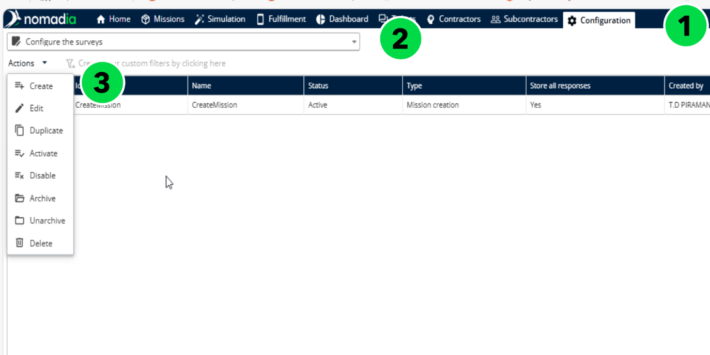

Survey Creator / Form Builder is a visual design tool that allows you to create surveys and forms. Surveys can be conducted for four specific use cases:

Mission Creation – Filled by the contractor before creating a mission in Nomadia Delivery (only for manual creation via the wizard). This helps to capture all necessary details upfront for

successful deliveries.

Route Start – Filled by the deliverer before leaving the agency for delivery/pickup. Collects

vehicle condition data to ensure readiness before beginning the route.

Mission Fulfillment – Filled by the deliverer during delivery or pickup. Tracks deliver milestones and monitor progress in real time.

Route End – Filled by the deliverer after returning to the agency at the end of the day. Provides   insights into vehicle condition post-route, useful for maintenance and operational planning.

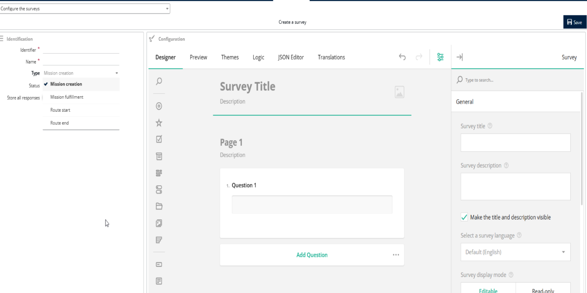

Enter the Identifier and Name of the survey, select the survey type from the drop-down, set the

Status to Active, and enable the Store all responses toggle to save survey results.

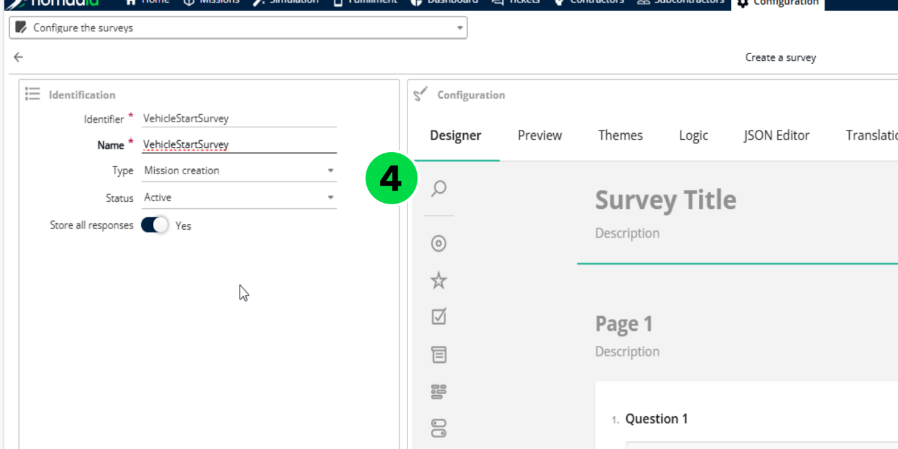

Surveys can contain one or more pages. Each page may include panels and questions. Panels

group questions together and can also contain nested panels for structured organization.

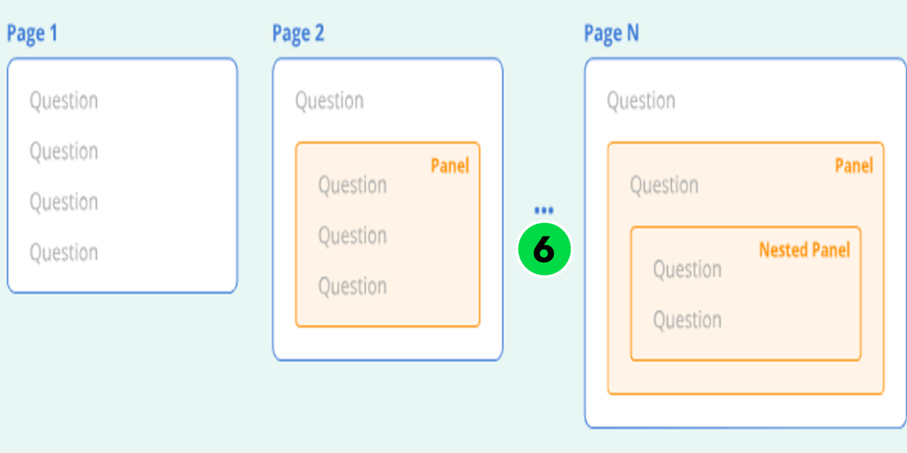

For detailed guidance on creating a survey, refer to the documentation: Create a simple  survey

Once the survey is complete, click Save to create it.

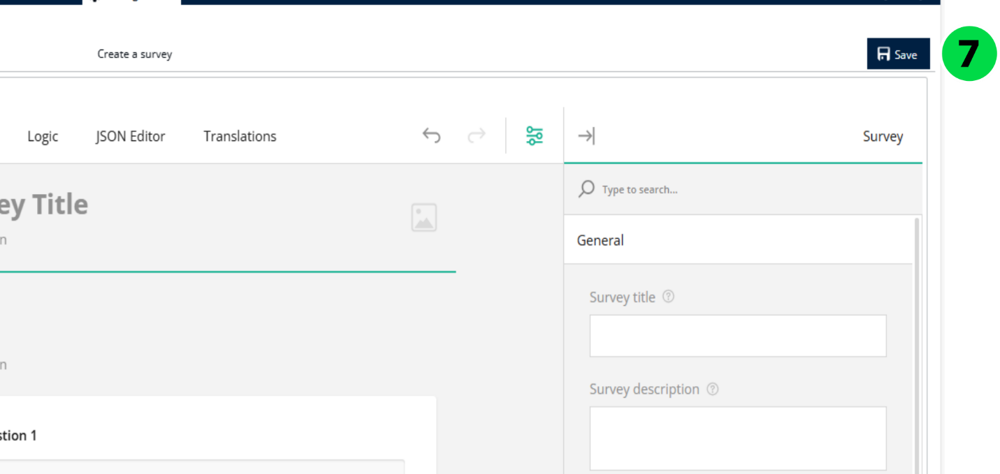

The Configure the surveys page will display all surveys created in the system.

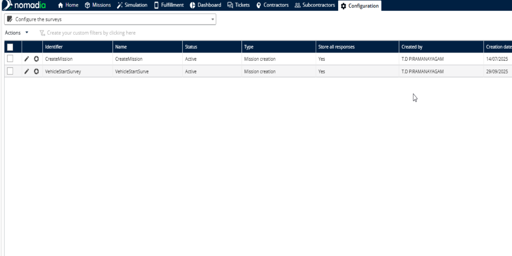

Additional Survey Configurations

For Contractors

Open the Contractors tab in Nomadia Delivery.

Edit a contractor by clicking the Pencil icon.

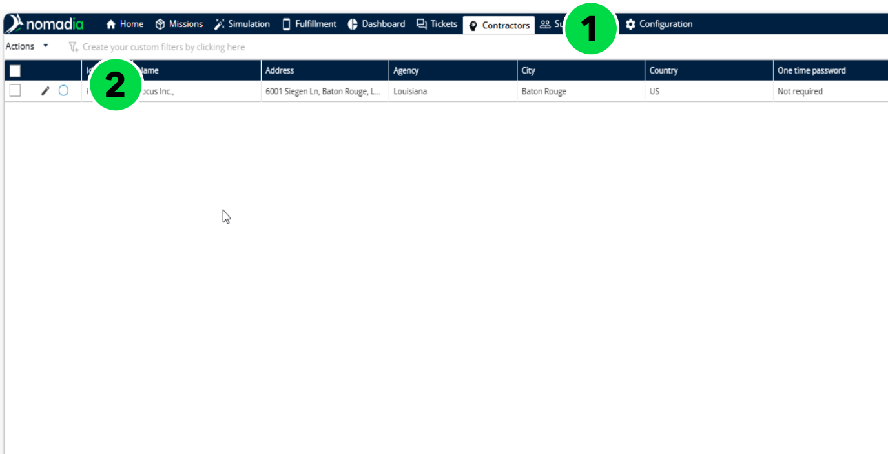

In the Mission section, assign a survey for mission creation specific to that contractor, then click

Save.

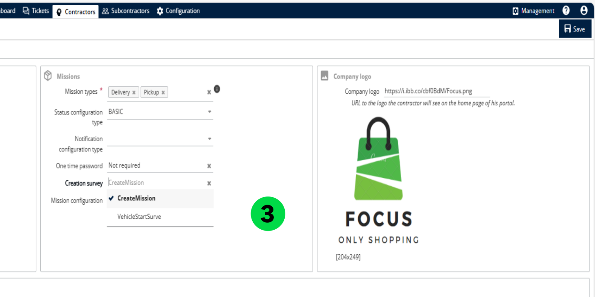

When logged in as a contractor, creating a mission via the wizard will prompt the mission creation

survey, which must be completed before proceeding.

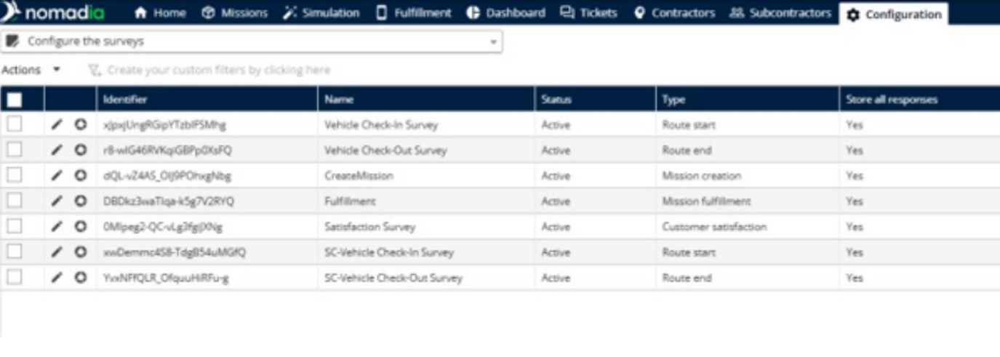

For Subcontractors

Open the Contractors tab.

Edit a subcontractor by clicking the Pencil icon.

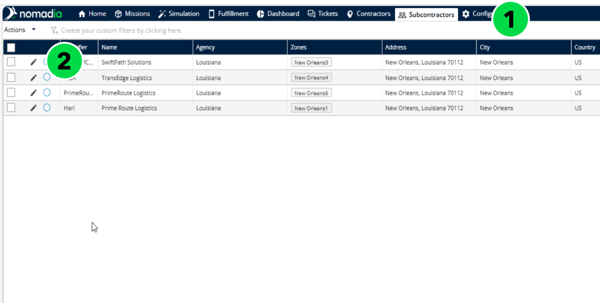

In the Mission section, assign surveys for route start and route end specific to that subcontractor,

then click Save.

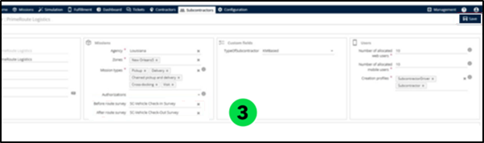

When logged in as a subcontractor deliverer, completing the loading process will trigger the

route start survey, which must be filled before starting the missions.

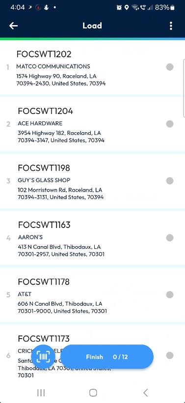

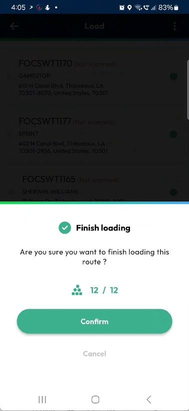

For Sub-Status

Open the Configuration tab in Nomadia Delivery.

Select Sub status from the drop-down.

Edit a sub-status by clicking the Pencil icon.

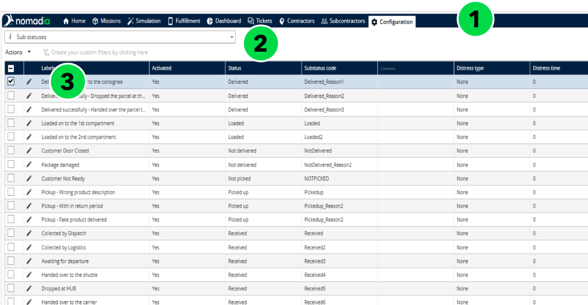

Assign the appropriate Fulfillment survey from the drop-down and click Save.

When logged in as a transporter or subcontractor deliverer, attempting to fulfil a delivery/pickup

will prompt the survey, which must be completed before proceeding.

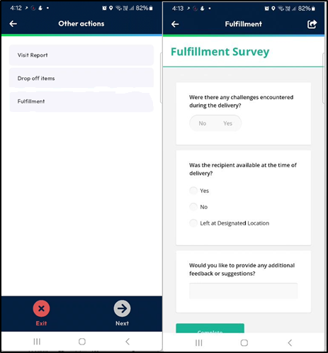

Analysing Survey Responses

Open the Nomadia Delivery application and go to the Configuration tab.

Select Configure the surveys from the drop-down.

Click the Circle icon next to the survey you wish to analyse.

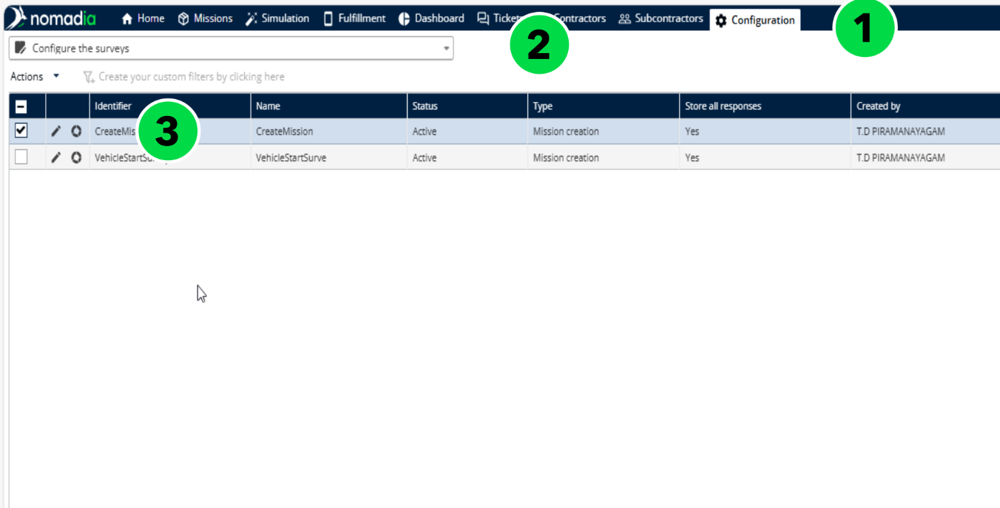

Choose the analysis period and click Apply.

Click Load to view results for the selected timeframe.

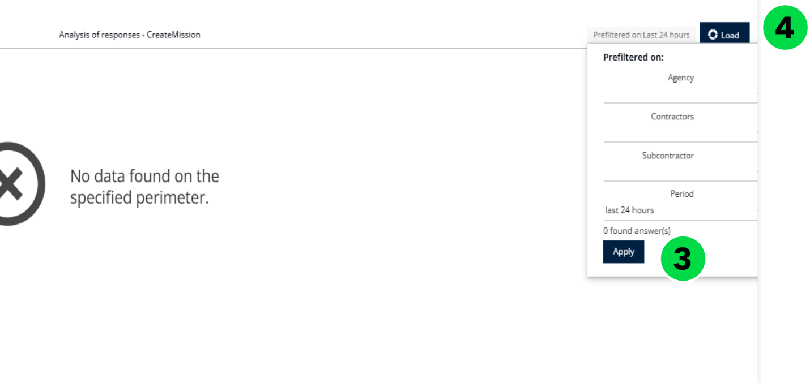

Review and analyse survey responses in real time.

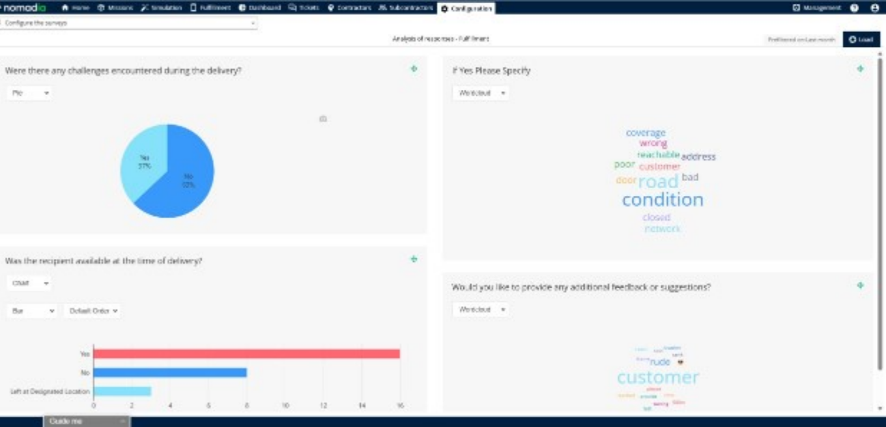

| S. No | version | Author | Release date | Reviewed by |
| --- | --- | --- | --- | --- |
| 1 | 1.0 | Harishankar | 14-10-2025 | Nayagam |
| 2 | 2.0 | Harishankar | 21-01-2026 | Nayagam |
| 3 | 3.0 | Harishankar | 17-02-2026 | Nayagam |
| 4. | 4.0 | Harishankar | 31-03-2026 | Nayagam |

| S. No | Topics Added in This Version | TOC Reference |
| --- | --- | --- |
|  | Mission Table | 6.4 |
|  | Create a Custom Configuration | 6.4.1 |
|  | Add a Mission | 6.4.2 |
|  | Group missions in one container | 6.4.4 |
|  | Prioritizing a mission | 6.4.5.1 |
|  | Create an urgent mission | 6.4.5.2 |
|  | Create an urgent pickup mission (Emergency Pickup) | 6.4.5.3 |
|  | Create a 'perform at once' mission | 6.4.5.4 |

| Code | Section | Purpose |
| --- | --- | --- |
| 1 | Navigation Tabs | Access the main parts of the app:
Missions – Provides a unified view of all missions with support for planning, tracking, and optimization based on 100+ constraints.
Dashboard – Provides data visualization tools to monitor missions, routes, administrative KPIs, fulfillment KPIs, and other key metrics.
Fulfillment – Used for tracking live locations and monitoring mission progress with Proof of Delivery (PoD) at the route level
Configuration – Customize the app to your needs. |
| 2 | User and Help Icons | Top-right icons:
Help Me – FAQs and documentation.
Account – User settings, updates, and logout. |
| 3 | My KPI’s | Users can select a homepage-compatible dashboard from 'My Preferences' and set it to display on the homepage. |
| 4 | Mission Statistics | Displays mission statuses from the past seven days with up to five KPI categories, customizable via “My Preferences”. |

| Roles and Rights | Description |
| --- | --- |
| Delivery | When enabled, users can perform delivery-related operations. |
| Docking | When enabled, users can access and manage docking activities |
| Loading / Unloading | When enabled, users can load and unload parcels in their vehicles. |
| Loading when not fully prepared | When enabled, users can load parcels even if the mission is not fully prepared. |
| Prepare | When enabled, users can prepare missions before execution. |
| Reception | When enabled, users can receive parcels at the destination or depot. |
| Storage | When enabled, users can move parcels into storage locations. |
| Scan unknown missions | When enabled, users can scan and process missions that are not predefined. |
| Create routes | When enabled, users can create and manage delivery routes. |
| Handle unassigned deliveries | When enabled, users can manage deliveries not assigned to any route or resource. |
| Handle unassigned pickups |  |
| Reassign missions | When enabled, users can reassign missions to different routes or resources. |
| Scan not mandatory | When enabled, scanning parcels is optional during operations. |
| Reposition addresses | When enabled, users can modify or correct mission addresses. |
| Supervisor screen | When enabled, users can access the supervisor monitoring screen. |
| Parcel transfer | When enabled, users can transfer parcels between missions or containers. |
| Group into a container | When enabled, users can group multiple parcels into a single container. |
| Modify missions | When enabled, users can edit mission details. |
| Make the call mandatory | When enabled, users must make a call before completing the mission |

| Roles and Rights | Description |
| --- | --- |
| Administration | When enabled, users can access administrative configuration features. |
| Manage articles | When enabled, users can create, update, and manage articles. |
| Missions |  |
| List of missions | When enabled, users can view the list of all missions. |
| Create missions | When enabled, users can create new missions. |
| Free address available | When enabled, users can create missions without selecting a predefined address. |
| Import missions | When enabled, users can import missions in bulk. |
| Delete missions | When enabled, users can delete existing missions. |
| Modify missions | When enabled, users can edit mission details. |
| Modify missions after printing | When enabled, users can modify missions even after they have been printed. |
| Watch the route | When enabled, users can view route details and progress. |
| Manage the route | When enabled, users can create, edit, and manage routes. |
| Customize display parameters | When enabled, users can customize mission display settings. |
| Tickets | When enabled, users can access ticket management features. |
| See the tickets list | When enabled, users can view the list of tickets. |
| Answer to tickets | When enabled, users can respond to tickets. |
| Optimization | When enabled, users can access optimization features. |
| Schedule | When enabled, users can create and manage optimized schedules. |
| See other people's simulations | When enabled, users can view simulations created by other users |
| Edit other people's simulations | When enabled, users can modify simulations created by other users. |
| Modify optimization settings | When enabled, users can configure optimization parameters. |
| Depot | When enabled, users can access depot-related features. |
| Manage the depots | When enabled, users can create, update, and manage depots. |
| Vehicles | When enabled, users can access vehicle management features. |
| Manage the vehicles | When enabled, users can create, update, and manage vehicles. |
| Customize the view of fleets and vehicles | When enabled, users can customize fleet and vehicle constraints. |
| Fulfillment | When enabled, users can access fulfillment features. |
| Fulfillment follow up | When enabled, users can track fulfillment progress and status. |
| See other people's schedules | When enabled, users can view schedules created by other users |
| Contractors | When enabled, users can access contractor management features. |
| List of contractors | When enabled, users can view the list of contractors. |
| Create contractors | When enabled, users can create new contractors. |
| Import contractors | When enabled, users can import contractors in bulk. |
| Delete contractors | When enabled, users can delete contractors. |
| Modify contractors | When enabled, users can edit contractor details. |
| Address list | When enabled, users can access address management features. |
| Address list | When enabled, users can view the list of addresses. |
| Create addresses | When enabled, users can create new addresses. |
| Import addresses | When enabled, users can import addresses in bulk. |
| Delete addresses | When enabled, users can delete addresses. |
| Modify addresses | When enabled, users can edit address details. |
| Subcontractors | When enabled, users can access subcontractor management features. |
| List of subcontractors | When enabled, users can view the list of subcontractors. |
| Create subcontractors | When enabled, users can create new subcontractors. |
| Update subcontractors | When enabled, users can update subcontractor details. |
| Delete subcontractors | When enabled, users can delete subcontractors. |
| Import subcontractors | When enabled, users can import subcontractors in bulk. |
| List of subcontractor’s schedule | When enabled, users can view subcontractors’ schedules. |
| List of subcontractors vehicles | When enabled, users can view subcontractors’ vehicles. |
| Dashboard and KPIs | When enabled, users can access dashboards and KPIs. |
| View dashboards | When enabled, users can view dashboards and KPI data. |
| Modify dashboards | When enabled, users can create and modify dashboards. |

| Section ID | Section | Description |
| --- | --- | --- |
| A | Mission Table | Displays ongoing missions in a table format. Supports up to 10,000 entries at a time. Includes sorting and filtering options for easy data access. |
| B | Map | Interactive map showing mission locations and route paths. Help visualize geographic distribution and real time spatial tracking of mission statuses. |
| C | Routes Table | Gantt-style view of routes, showing scheduling and duration. Useful for understanding workload and mission sequence. It outlines the agenda for the designated mobile user. |
| D | Details | Shows detailed information for selected missions or routes, such as deliverer name, time slots, and status. Helps in reviewing and making informed decisions. |

| Status | Description |
| --- | --- |
| Waiting | The mission is expected but not yet received |
| Received | The mission has been successfully received |
| To be Delivered | The mission is prepared for delivery |
| To be Loaded | The mission is waiting to be loaded. |
| Loaded | The package is now loaded and in transit |
| To be Picked up | Mission is scheduled and awaiting pick up |
| Picked up | Item has been collected from the origin |
| Delivered | The delivery is completed successfully. |
| Not Received | Indicates a mission was expected but couldn’t be received |
| Not Loaded | The mission couldn’t be loaded as expected |
| Not Picked up | Scheduled pickup was missed or failed. |
| Not Delivered | The delivery failed |
| Visited | Destination has been successfully visited |
| To be Visited | Destination is scheduled for a visit. |
| Not Visited | The scheduled visit was missed or unsuccessful. |

| Mission parameters tab | Parameter | Description |
| --- | --- | --- |
| Mission | Barcode | Automatically generated by Nomadia Delivery to uniquely identify the mission. |
| Mission | Agency - Mandatory | Mandatory field. Specifies the agency responsible for handling the mission. See Manage Agencies. |
| Mission | Subcontractor | The third-party delivery service provider contracted to complete the mission. |
| Mission | Sender Barcode | Barcode supplied by the contractor (optional). |
| Mission | Parent Container ID | Identifies the main container or group to which this item belongs. Used in scenarios where several missions are consolidated into one container. |
| Mission | Grouping key | Missions linked to the same customer are grouped to simplify handling for the deliverer. |
| Mission | Container type | Specifies the type of container (box, pallet, crate, etc.) used for the item. |
| Mission |  |  |
| Mission | Origin | Indicates the original location from where the delivery is dispatched. |
| Mission | Scheduled deliverer | Name of the person assigned to perform the delivery |
| Mission | Priority | Indicates the urgency or importance of the mission (e.g., High, Medium, Low). |
| Mission | Status configuration type | Defines which status workflow applies to this mission |
| Mission | One type of password | A security code type (e.g., PIN or OTP) that may be required for mission verification |
| Mission | Mission Status | Shows the current progress of the mission (e.g., Waiting, Delivered). |
| Mission | Sub-status | A more granular state within the main mission status (e.g., "Delivered to the neighbour, dropped at the drop step, Delivered to the consignee"). |
| Mission | Motive | Explains the reason for the current sub-status (e.g., "No access" or "Customer not available"). |
| Mission | Mission type | Delivery – Assigns a mission to deliver goods from a depot or agency to the customer’s location.
Pickup – Assigns a mission to collect goods or packages from a customer or specific site.
Chained Pickup and Delivery – Combines a pickup and delivery within a single mission flow, ensuring continuous handling of goods between two points.
Visit – Used for non-logistic missions such as inspections, maintenance, or customer appointments without goods transfer.
Drop Shipping – Manages direct shipments from a supplier to the customer, bypassing the depot or intermediary warehouse. |
| Mission | Provisional date | Tentative date assigned for the mission, subject to change. |
| Mission | Main depot scan date |  |
| Mission | Storage place | The specific location or zone within the depot where the item is stored. |
| Mission | Fixed visit duration | Estimated or standard time (in minutes) expected to complete the delivery/pickup at the address. |
| Mission | Compatibility with the resources | Indicates whether the delivery is compatible with the assigned resource (e.g., vehicle size, agent skill). |
| Mission | Require all skills to be compatible | If checked, the resource must match all required skills for the mission (e.g., heavy lifting, ID verification). |
| Mission | Delivery to be executed before any pickup | Enforces the sequence of deliveries before any pickups in a combined mission |
| Mission | Keys | Indicates whether physical keys or codes are required to access delivery location. |
| Mission | Position | Order of the mission in a planned route (e.g., 1st stop, 2nd stop). |
| Parcel | Product type | Specifies the type/category of product (e.g., electronics, groceries). |
| Parcel | Length | Physical dimensions of the package. |
| Parcel | Width | Physical dimensions of the package. |
| Parcel | Height | Physical dimensions of the package. |
| Parcel | Weight | Weight |
| Parcel | Volume | volume |
| Parcel | Package value | Declared monetary value of the package for insurance or invoicing purposes. |
| Parcel | Comment |  |
| Pickup | Address – Mandatory (if mission type is Pickup, cross-docking, drop-shipping, or chained pickup & delivery) | The full address where the item will be picked cannot be edited once the mission is routed. |
| Pickup | Pickup Designation / First name / Last name / Landline / Cell phone / Email | Contact details of the sender at the pickup location. |
| Pickup | Picked up by | Name or ID of the person or agent who performed the pickup |
| Pickup | Pickup asked date / end date | Time window requested by the customer for pickup. |
| Pickup | Scannable container code | Code or barcode that can be scanned to identify the container. |
| Pickup | Pickup instructions / Comment | Special handling or location-specific instructions for the pickup |
| Delivery | Address – Mandatory (if mission type is delivery or visit, cross-docking, drop-shipping, or chained pickup & delivery) |  |
| Delivery | Delivery Designation / First name / Last name / Landline / Cell phone / Email |  |
| Delivery | Delivered by | Name of the person or agent who completed the delivery. |
| Delivery | Delivery asked date / end date | Time window requested by the customer for delivery |
| Delivery | Cash on delivery | Amount to be collected from the customer upon successful delivery |
| Delivery | Delivery price | Cost of delivery, possibly shown to the customer or used for billing |
| Delivery | Delivery instructions / Comment |  |
| Articles | Type of article | Type of item being delivered or picked up. Defined in Manage Articles. |
| Articles | Planned | Quantity of articles initially planned for the mission. A quantity of 0 means it will not be linked. |
| Articles | Done | Quantity of articles that were delivered or picked up. |
| Opening Hours | Opening Slots | Time slots (days and time ranges) when the mission can be performed. |
| Photos | Photos | Images captured at pickup or delivery via the mobile app. |
| Signatures | Signatures | Signatures of the contractor, deliverer, and customer. |
| Documents | Documents | Documents associated with the mission, available from the Nomadia library or linked cloud services. |
| Logs | Mission’s events | A timeline record of all status changes and events related to the mission, each with a timestamp. |

| Field name in import file | Field name in back-office table | Description |
| --- | --- | --- |
| Id | Code | Mandatory. It should be unique among the other Zone ids |
| Name | Name | Mandatory |
| Organization | Agency | Mandatory |
| Postal Codes | Postal Codes |  |
| Normalized Size | Postal Codes normalized length |  |
| Normalize With | Prefix |  |
| All Skills Required | Require all skills to be compatible |  |
| Skills | N/A |  |
| Status Customization Types | N/A |  |
| Wkt Geometry | N/A |  |
| Opening Days | Opening day x | Suffix x is equal from 1 to 10 |
| Opening Hours | Opening Hours x | Suffix x is equal from 1 to 10 |

| Field name in import file | Field name in back office table | Description |
| --- | --- | --- |
| Id | Name | Mandatory and unique among all the articles id / Name |
| Labels | Labels | In the import file, for several languages the syntax is:
[language code on two characters] = [Translation]; [language code on two characters] = [Translation]. E.g.: “fr=Tournevis;en=Screwdriver” |

| Templates | Associated Variables |
| --- | --- |
| Route sheet | Mission, Route |
| Loading sheet | Mission, Route |
| Mission sheet | Mission |
| Sticker sheet | Mission |
| Consignment notes | Mission, Agency, Contractor, Company, Vehicle, Delivery Man, Custom Data, Documents, Status Changes |
| Visit Report | Mission Open Order |
| Small Stickers Sheet | Mission |

| Mission Section | Mission Field | Description |
| --- | --- | --- |
| General Information | Mission Number | A unique identifier automatically or manually assigned to the mission for tracking and reference purposes. |
|  | Sender Barcode | Barcode associated with the sender or shipment, used for scanning and quick identification during processing and delivery operations |
|  | Parent Container ID | Identifies the parent container to which the mission or shipment belongs, enabling hierarchical shipment tracking |
|  | Grouping key | A value used to group multiple missions together for planning, routing, or operational purposes. |
|  | Container Type | Defines the type of container used for the shipment (e.g., box, pallet, envelope), which may influence handling or transportation constraints. |
|  | Status Configuration Type | Specifies the status workflow configuration applied to the mission, determining available mission states and transitions. |
|  | Notification Configuration Type | Defines the notification rules associated with the mission, such as alerts sent to customers, drivers, or operators during mission progress. |
|  | Scheduled Deliverer | The planned resource (driver, technician, or agent) assigned to execute the mission. |
|  | Origin | The starting location from which the mission begins or where the goods are picked up. |
|  | Priority | Indicates the importance level of the mission, which may influence planning order and execution scheduling. |
|  | Storage place | Specifies the storage or warehouse location associated with the mission before dispatch or after completion. |
|  | Fixed Visit Duration | Defines the expected duration required to complete the mission at the location. |
|  | Keys | Reference identifiers or tags used for classification, filtering, or integration purposes. |
|  | Compatibility with the resources | Defines constraints ensuring that only compatible resources (based on skills, vehicle type, or configuration) can be assigned to the mission. |
|  | Require all skills to be compatible | When enabled, the assigned resource must possess all required skills defined for the mission. |
|  | Delivery to be executed before any pickup | Ensures delivery operations are completed before pickup tasks within the same mission sequence. |
|  | One time password | A security verification code required to validate mission completion or delivery confirmation. |
|  | Origin agency | The agency or operational unit responsible for initiating the mission. |
|  | Destination agency | The agency or operational unit responsible for receiving or completing the mission. |
|  | Leg | Represents a segment of a multi-stage mission or transportation route. |
|  | Mission status | Displays the current state of the mission within the operational workflow (e.g., Planned, Assigned, In Progress, Completed, Cancelled). |
| Pickup Information | Pickup (Address) | Specifies the primary address where the pickup operation will take place. |
|  | Pickup (Address Complement) | Provides additional address details such as building name, apartment number, floor, or access instructions to help locate the pickup point accurately. |
|  | Pickup Designation | Identifies the pickup location or organization name associated with the shipment. |
|  | Pickup (First name) | First name of the contact person available at the pickup location. |
|  | Pickup (Last name) | Last name of the contact person responsible for coordinating the pickup. |
|  | Pickup (Cell phone) | Mobile phone number of the pickup contact person, used for communication during mission execution. |
|  | Pickup (Landline phone) | Landline telephone number of the pickup location or contact person. |
|  | Pickup (Email) | Email address of the pickup contact for sending notifications or communication related to the mission. |
|  | Pickup asked date | The requested date and time when the pickup should begin. |
|  | Pickup asked end date | The latest acceptable date and time by which the pickup must be completed. |
|  | Pickup Instructions | Special instructions or operational notes provided to the resource performing the pickup (e.g., access procedures, handling requirements, security instructions). |
|  | Scannable container code | Barcode or scannable identifier associated with the container, enabling quick verification and tracking during pickup operations. |
| Delivery Information | Address | Specifies the primary destination address where the delivery must be completed. |
|  | Delivery (Address Complement) | Provides additional location details such as apartment number, building name, floor, gate number, or access instructions to help accurately locate the delivery point. |
|  | Designation | Indicates the name of the delivery location, company, or organization receiving the shipment. |
|  | First name | First name of the recipient or contact person at the delivery location. |
|  | Last name | Last name of the recipient or responsible contact person. |
|  | Cell phone | Mobile phone number of the delivery contact, used for communication during delivery execution. |
|  | Landline phone | Landline telephone number associated with the delivery location or recipient. |
|  | Email | Email address of the recipient used for notifications, confirmations, or delivery updates. |
|  | Delivery asked date | The requested date and time when the delivery should start or be performed. |
|  | Delivery asked end date | The latest acceptable date and time by which the delivery must be completed. |
|  | Cash on delivery | Specifies the amount to be collected from the recipient at the time of delivery, if applicable. |
|  | Delivery price | Defines the delivery charge associated with the mission for billing or accounting purposes. |
|  | Delivery instructions | Special notes or operational instructions provided to the delivery resource (e.g., access procedures, preferred delivery time, handling precautions). |
|  | Fallback delivery in PUDO | Indicates whether the shipment can be redirected to a Pick-Up and Drop-Off (PUDO) point if the primary delivery attempt fails or the recipient is unavailable. |
| Custom fields |  | The Custom Fields section allows users to define and capture additional information specific to business requirements that are not covered by the standard mission fields. |
| Articles |  | The Articles section contains detailed information about the items or goods associated with a mission. It allows users to define the characteristics, quantity, and handling requirements of the products being picked up or delivered. |
| Opening hours |  | The Opening Hours section defines the time periods during which a pickup or delivery location is available for operational activities. It ensures that missions are scheduled and executed only within the authorized working hours of the location. |
| PUDO Information | PUDO Id | A unique identifier assigned to the Pick-Up and Drop-Off point used for tracking and system reference. |
|  | PUDO (Address complement) | Provides additional address details such as building information, floor number, or specific access instructions to help locate the PUDO point easily. |
|  | PUDO Address | Specifies the physical address of the Pick-Up and Drop-Off location. |
|  | PUDO first name | First name of the contact person responsible at the PUDO location. |
|  | PUDO last name | Last name of the contact person managing or coordinating operations at the PUDO point. |
|  | PUDO landline phone | Landline telephone number of the PUDO location for operational communication. |
|  | PUDO cell phone | Mobile phone number of the PUDO contact person for real-time communication during mission execution. |
|  | PUDO email | Email address associated with the PUDO location used for notifications and operational correspondence. |
|  | PUDO fixed visit duration | Defines the standard time required to complete operations (pickup or drop-off) at the PUDO location. This duration is used by the planning system for scheduling and route optimization. |
|  | Pickup PUDO | Pickup PUDO refers to the Pick-Up and Drop-Off (PUDO) location designated as the pickup point for a mission instead of the standard pickup address. |
|  | Delivery PUDO | Delivery PUDO refers to the Pick-Up and Drop-Off (PUDO) location used as an alternative or final delivery destination instead of the recipient’s primary address. |

| Data type | Operator |
| --- | --- |
| Alphanumeric | = 
≠ 
Contains 
Does not contain 
Starts with 
Ends with 
Is empty 
Is not empty |
| Date | = 
=D+ 
=D- 
≤D+ 
≤D- 
≥ D+ 
≥ D- 
< 
≤ 
> 
≥ 
≠ 
Is empty 
Is not empty |
| Arithmetic | = 
≠ 
< 
≤ 
> 
≥ |

|  |  |  |  |  |  |  |  |  |
| --- | --- | --- | --- | --- | --- | --- | --- | --- |
| Only scheduled deliverers auto assigned are pushed to the optimization engine.

For example, in the below case, only Deliverer Mike is listed because he was auto assigned based on the zone mapping. | Only scheduled deliverers auto assigned are pushed to the optimization engine.

For example, in the below case, only Deliverer Mike is listed because he was auto assigned based on the zone mapping. | Only scheduled deliverers auto assigned are pushed to the optimization engine.

For example, in the below case, only Deliverer Mike is listed because he was auto assigned based on the zone mapping. | Other deliverers who are compatible with doing the missions are also passed on to the optimization engine along with the auto-assigned deliverers.

For example, in the below case, Deliverer John is also included as the user activated passing all compatible vehicles to the optimization. | Other deliverers who are compatible with doing the missions are also passed on to the optimization engine along with the auto-assigned deliverers.

For example, in the below case, Deliverer John is also included as the user activated passing all compatible vehicles to the optimization. | Other deliverers who are compatible with doing the missions are also passed on to the optimization engine along with the auto-assigned deliverers.

For example, in the below case, Deliverer John is also included as the user activated passing all compatible vehicles to the optimization. | Ignore	the	auto-assignment and optimize the missions with all the available deliverers.

For example, in the case below, the entire team is listed as the user wants to ignore the automatic assignment. | Ignore	the	auto-assignment and optimize the missions with all the available deliverers.

For example, in the case below, the entire team is listed as the user wants to ignore the automatic assignment. | Ignore	the	auto-assignment and optimize the missions with all the available deliverers.

For example, in the case below, the entire team is listed as the user wants to ignore the automatic assignment. |

| Log of the Delivered Child Mission | Log of the Not Delivered Child Mission |
| --- | --- |
|  |  |

| Plain text | Merged field |
| --- | --- |
| ${(contractor.name)!} | «${(contractor.name)!}» |

| Configuration
type | Applicable
for | Rules | Auto-assignment on
the mission object |
| --- | --- | --- | --- |
| BASIC | Substatus & Notification | Package value < 49€

Priority = 4

Follow all the rules = NO | If Mission’s package
value = 39€

Status configuration type = BASIC

Notification configuration type =
BASIC |
| INTERMEDIATE | Sub status & Notification | Package value < 100€ Package value > 50€ Priority = 3
Follow all the rules = YES | If Mission’s package
value = 99€

Status configuration type = INTERMEDIATE

Notification configuration type = INTERMEDIATE |
| ADVANCED | Substatus & Notification | Package value < 500€ Package value > 100€ Priority = 2
Follow all the rules = YES | If Mission’s package
value = 499€

Status configuration type = ADVANCED

Notification configuration type = ADVANCED |
| LUXURY | Substatus & Notification | Package value > 500€

Priority = 1

Follow all the rules = NO | If Mission’s package
value = 500€

Status configuration type = LUXURY

Notification configuration type =
LUXURY |