# 5. Manage Users

The Manage Users section allows administrators to create, configure, and maintain user accounts in Nomadia Delivery. From this screen, you can add new users, create users based on existing profiles, and manage user access to web and mobile applications. It also enables you to define user roles and permissions, assign agencies, configure working schedules, manage days off, and control access to key functional areas such as optimization, missions, depots, tickets, and vehicles. This ensures that each user has the appropriate access rights and availability based on their role and responsibilities within the organization.

## Enabling Mobile Access

Navigate to Configuration.

From the list, select Manage Users.

;

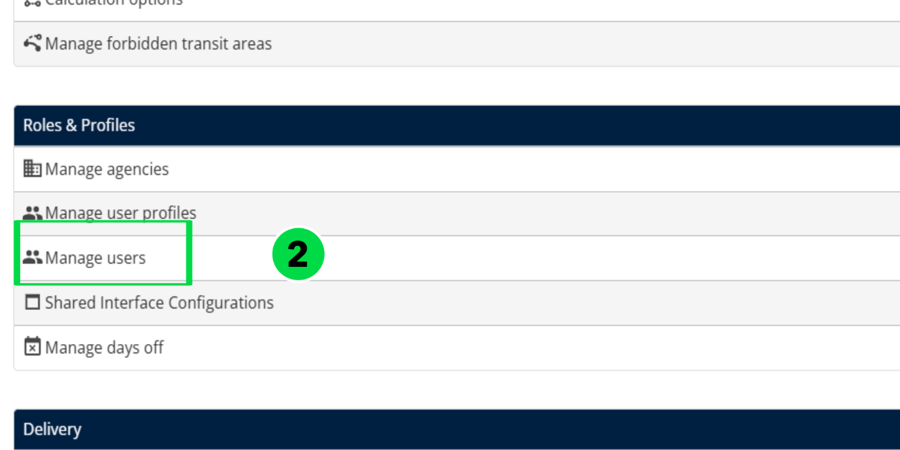

Click the Actions drop-down and choose Add.

To create a new user, set Create from existing user to No. Click OK. For step-by-step instructions, refer to section 5.3. Creating a User from an Existing User

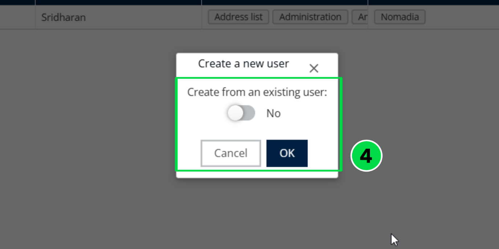

Select the appropriate Profile Name: Planner (Standard), Contractor, or Subcontractor.

If Planner (Standard) is selected, access can be granted to a Transporter.

If Contractor is selected, access can be granted to a Contractor.

If Subcontractor is selected, access can be granted to a Subcontractor

Enter the Login ID, First Name, and Last Name.

The Login ID is required to be in an email format. For Mobile Users, the login ID is not

required to be a valid email address.

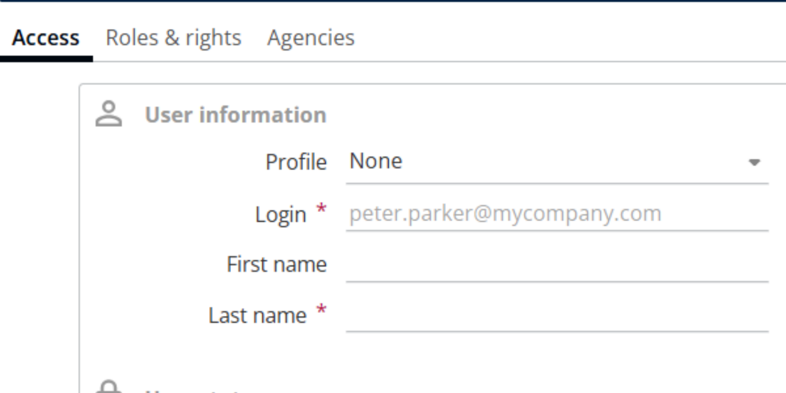

Set the User Status to Yes or No, as required.

When a profile is selected, all roles and access rights are inherited automatically. Roles

and rights cannot be enabled or disabled manually at the user level. To change any roles

or access rights, the modifications must be made in the profile configuration.

Enable Mobile Access and enter the user’s Password. For more information about the

password policy, refer to the link 5.1.2. Password policy for Mobile Access

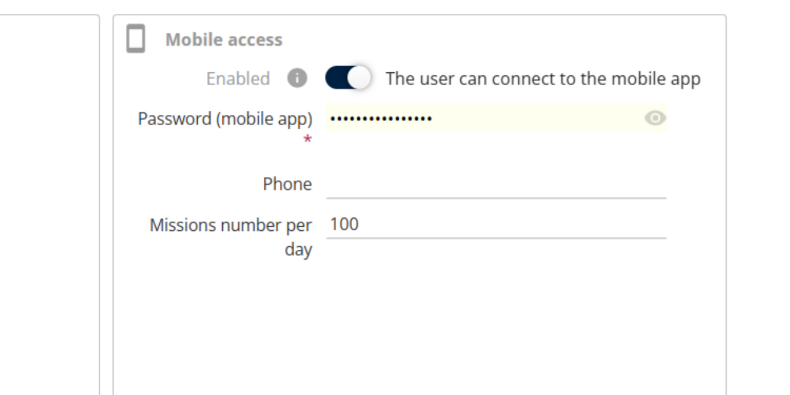

Open Roles and Rights and enable the required permissions:

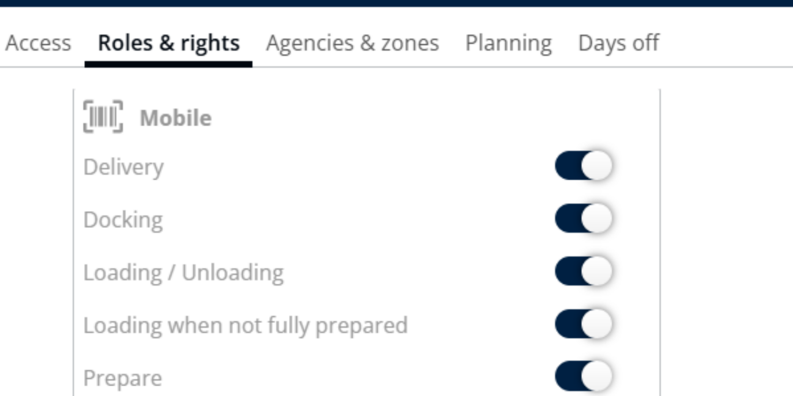

Go to Agency, select the available agency, and click the right arrow to assign it to the user.

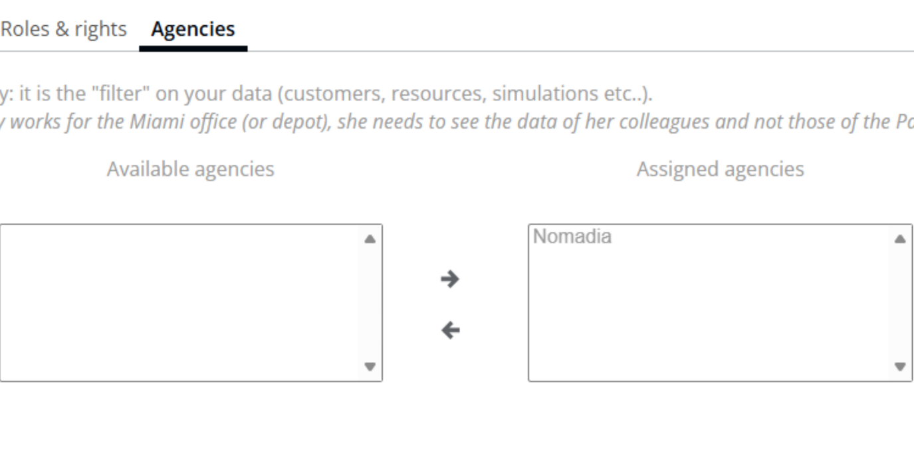

After completing all required details, click Save to create the user.

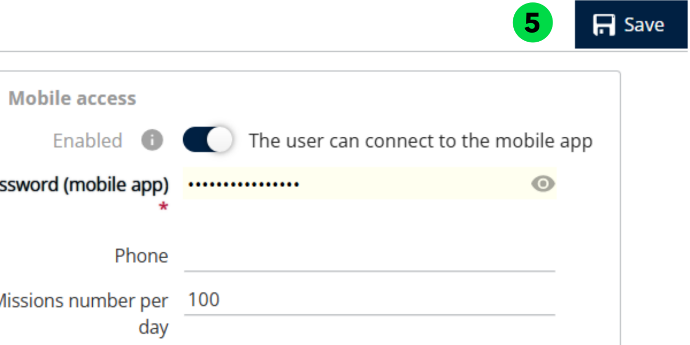

### 5.1.1. Roles and Rights

### 

### 5.1.2. Password policy for Mobile Access

The password must contain a minimum of 8 characters, including at least one uppercase

letter, one lowercase letter, and one number.

## Enabling Web Access

Navigate to Configuration.

From the list, select Manage Users.

Click the Actions drop-down and select Add.

To create a new user, set Create from existing user to No, then click OK.

Select the appropriate Profile Name: Planner (Standard), Contractor, or Subcontractor.

If Planner (Standard) is selected, access can be granted to a Transporter.

If Contractor is selected, access can be granted to a Contractor.

If Subcontractor is selected, access can be granted to a Subcontractor

Enter the Login ID, First Name, and Last Name.

For Web Users, the Login ID must be in an email format and must be a valid email

address.

Set the User Status to Yes or No, as required

When a profile is selected, all roles and access rights are inherited automatically. Roles

and rights cannot be enabled or disabled manually at the user level. To change any roles

or access rights, the modifications must be made in the profile configuration.

Enable or disable Web Access as required and select the Subcontractor Name, if

applicable.

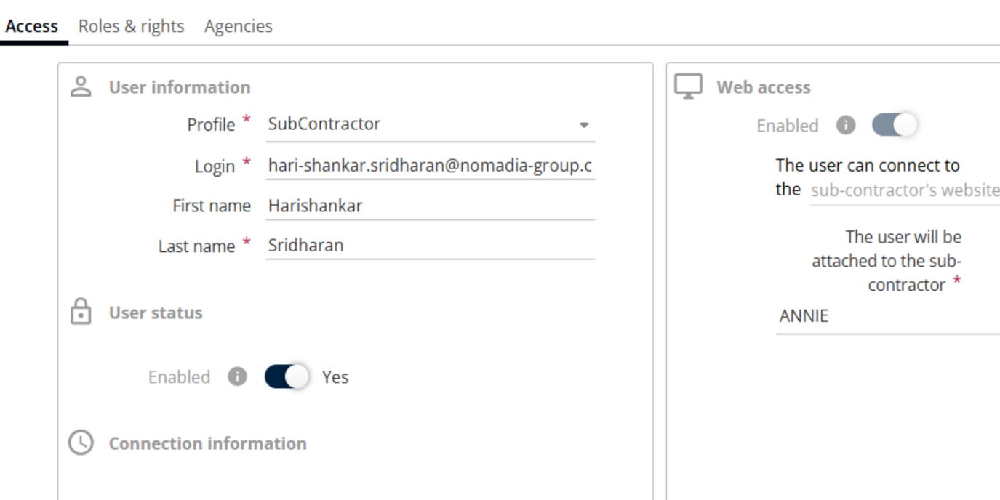

Click Save. A notification email is sent to the user.

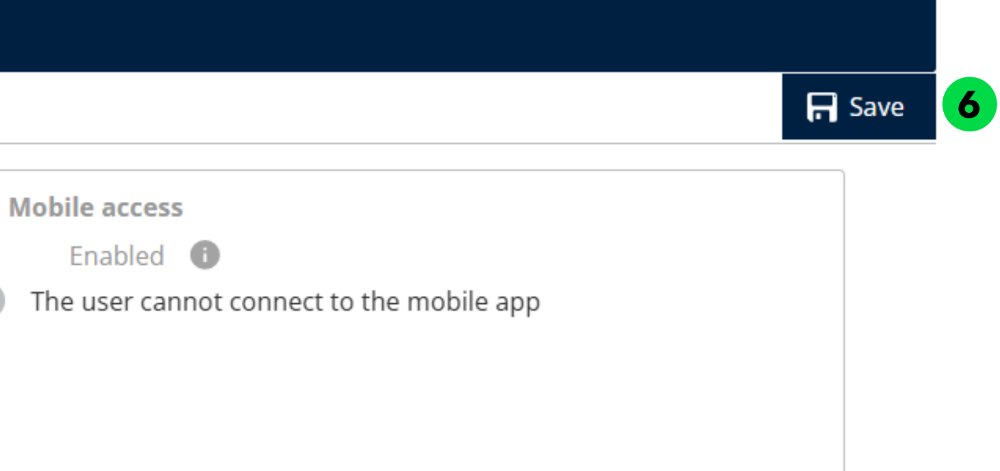

Open the email and click the provided link to set the password.

Enter your email address and click Send verification code.

Enter the received verification code and click Verify code.

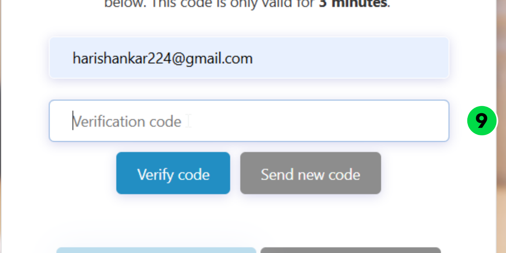

Click Continue.

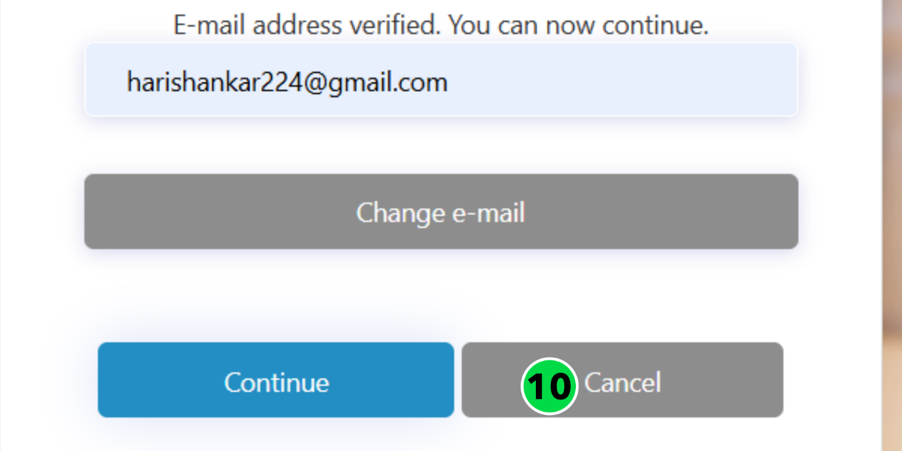

Enter the new password and confirm it. For more information about the password policy, refer to the link 5.2.2. Password policy for Web Access

Click Continue.

The password has been changed successfully.

### 

### 

### 5.2.1. Roles and Rights

### 5.2.2. Password policy for Web Access

The password must include at least three of the following character types:

Lowercase letters (a–z)

Uppercase letters (A–Z)

Numbers (0–9)

Symbols (special characters)

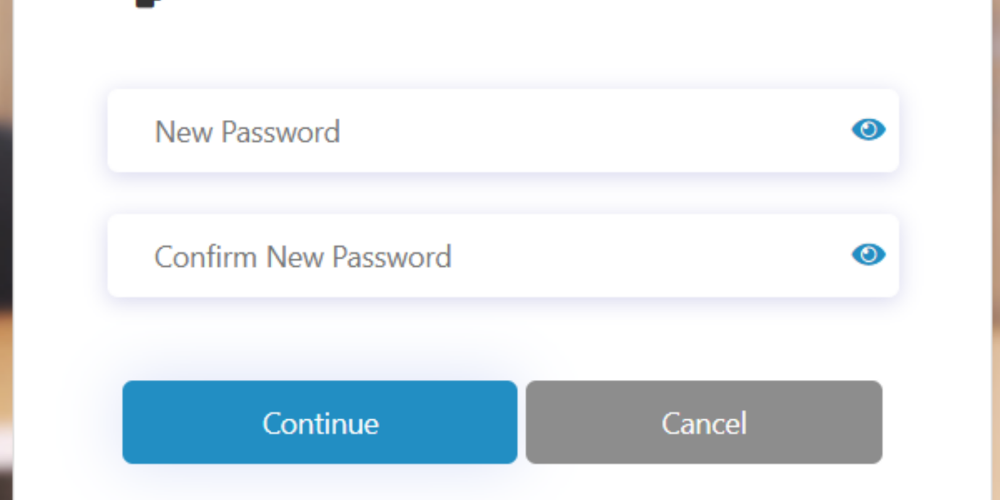

## 5.3. Creating a User from an Existing User

In Manage Users, click the Actions drop-down and select Add.

Set Create from existing user to Yes.

Select the existing user from the list.

Choose Yes or No for Import User’s Preferences, as required.

Click Ok

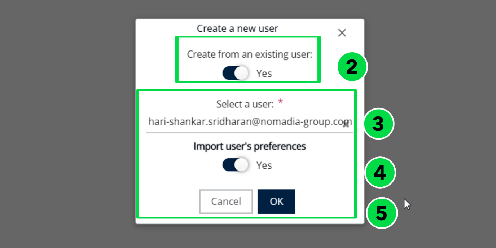

Modify the user details if necessary.

Click Save to complete the process.

## 5.4. Days off

If a user has planned leave or vacation, the Days Off section can be used to record the unavailable dates.

Navigate to Days Off.

Click the + (Add) icon.

Enter the From Date, To Date, and specify the Reason.

Click Add.

Click on Save to update the details

