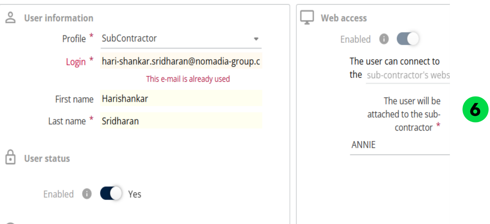
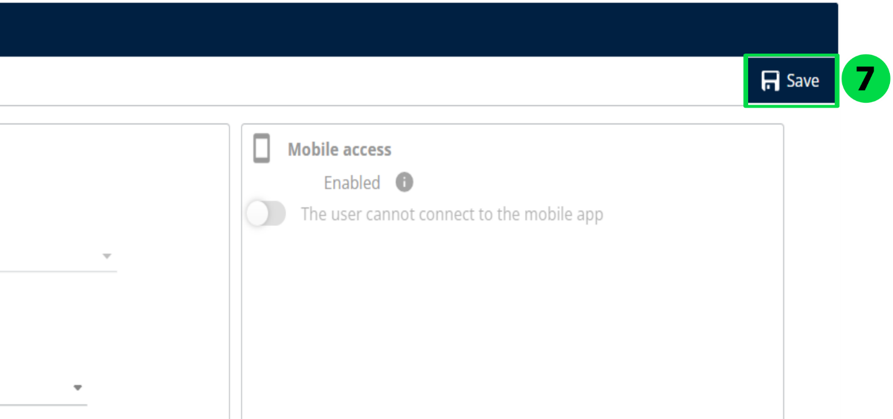

# Creating a User from an Existing User

1. In Manage Users, click the Actions drop-down and select Add.
2. Set Create from existing user to Yes.
3. Select the existing user from the list.
4. Choose Yes or No for Import User’s Preferences, as required.
5. Click Ok

6. Modify the user details if necessary.

7. Click Save to complete the process.

