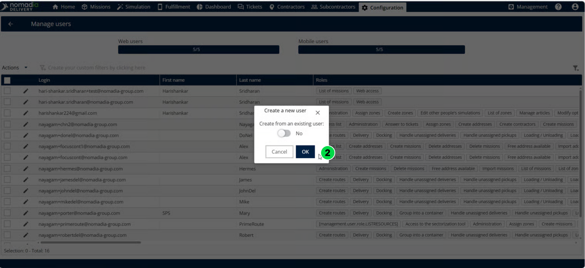
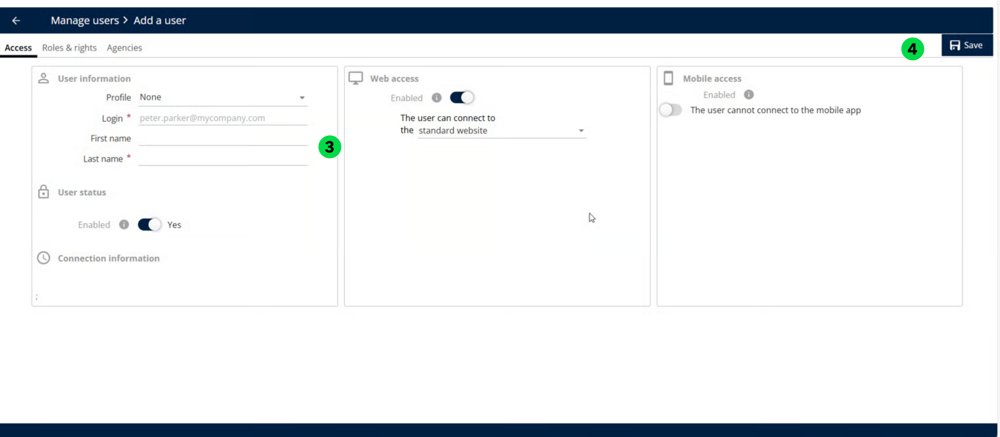

# Creating User from a Scratch

1. In Manage Users, click the Actions drop-down and select Add.
2. Set Create from existing user to No and click Ok

<figure><figcaption></figcaption></figure>

3. Enter the user details and enable Web and Mobile access as required.
4. Click Save to complete the process

<figure><figcaption></figcaption></figure>
