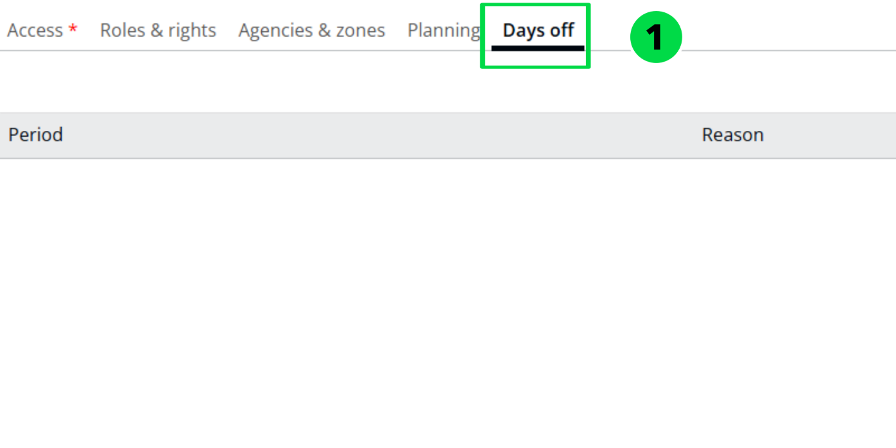
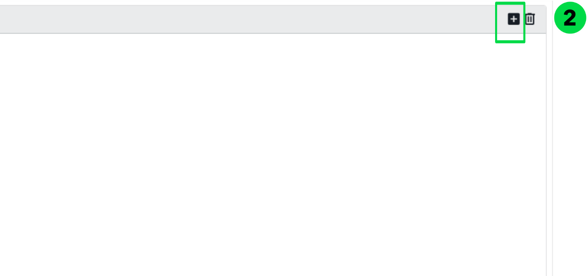
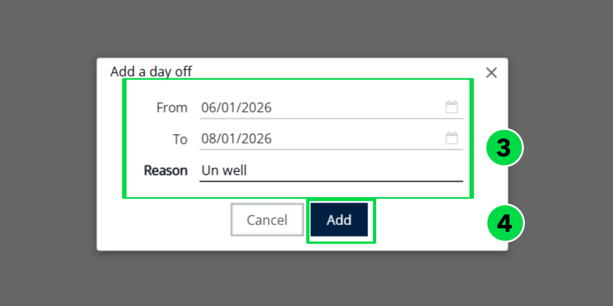
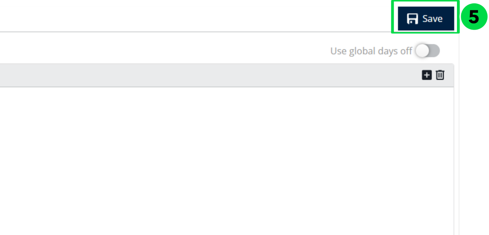

# Days off

If a user has planned leave or vacation, the Days Off section can be used to record the unavailable dates.

1. Navigate to Days Off.

2. Click the + (Add) icon.

3. Enter the From Date, To Date, and specify the Reason.
4. Click Add.

5. Click on Save to update the details

