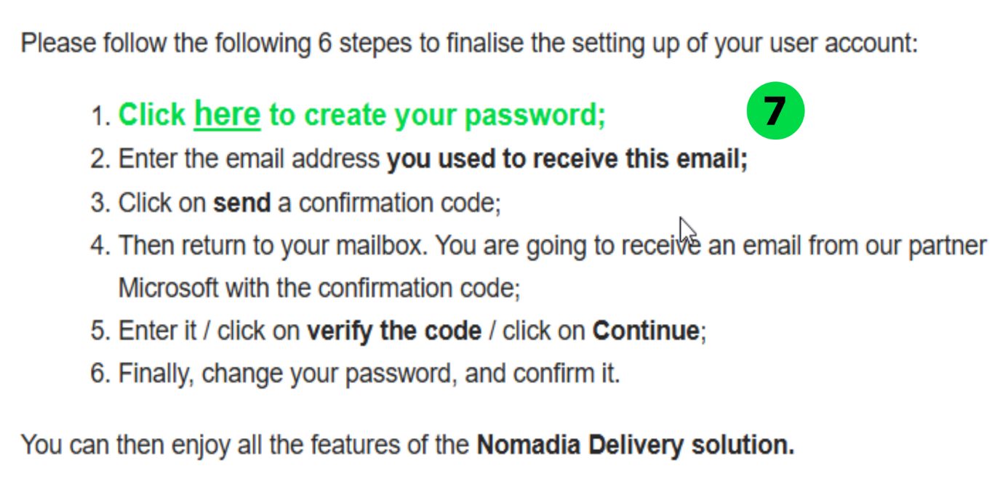
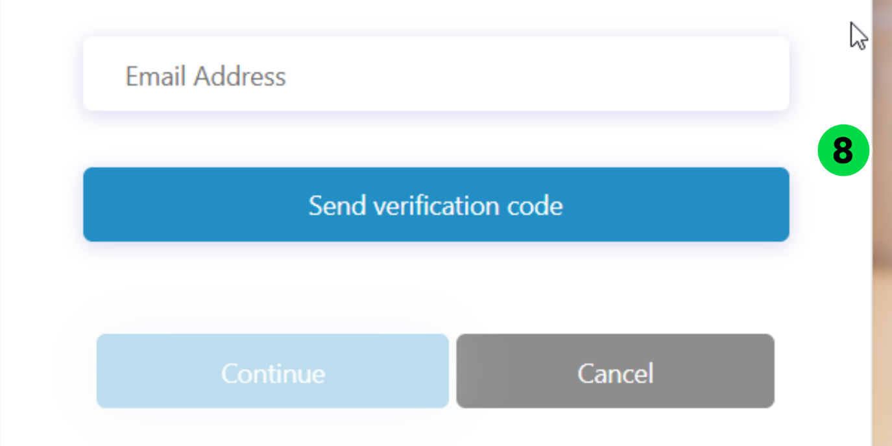

# Enabling Web Access

1. Navigate to **Configuration**.
2. From the list, select **Manage Users**.
3. Click the **Actions** drop-down and select **Add**.
4. To create a new user:
   * Set **Create from existing user** to **No**, then click **OK**.
   * Select the appropriate **Profile Name**:
     * Planner (Standard)
     * Contractor
     * Subcontractor
   * Based on the selected profile:
     * If _Planner (Standard)_ is selected, access can be granted to a **Transporter**.
     * If _Contractor_ is selected, access can be granted to a **Contractor**.
     * If _Subcontractor_ is selected, access can be granted to a **Subcontractor**.
   * Enter the following details:
     * **Login ID**
     * **First Name**
     * **Last Name**
   * For **Web Users**:
     * The **Login ID** must be in a valid email format (e.g., user@example.com)

* Set the **User Status** to **Yes** or **No**, as required.
* Roles and access rights:
  * When a profile is selected, all roles and access rights are inherited automatically.
  * Roles and rights cannot be enabled or disabled manually at the user level.
  * To change any roles or access rights, modifications must be made in the **profile configuration**.

5. Enable or disable **Web Access** as required and select the **Subcontractor Name**, if applicable.

6. Click **Save**. A notification email is sent to the user.

7. Open the email and click the provided link to set the password.

8. Enter your **email address** and click **Send verification code.**

9. Enter the received verification code and click **Verify code**.

10. Click **Continue**.

11. Enter the **new password** and confirm it. For more information about the password policy, refer to the link "**Password policy** for Web Access"
12. Click **Continue**.

The password has been changed successfully.
