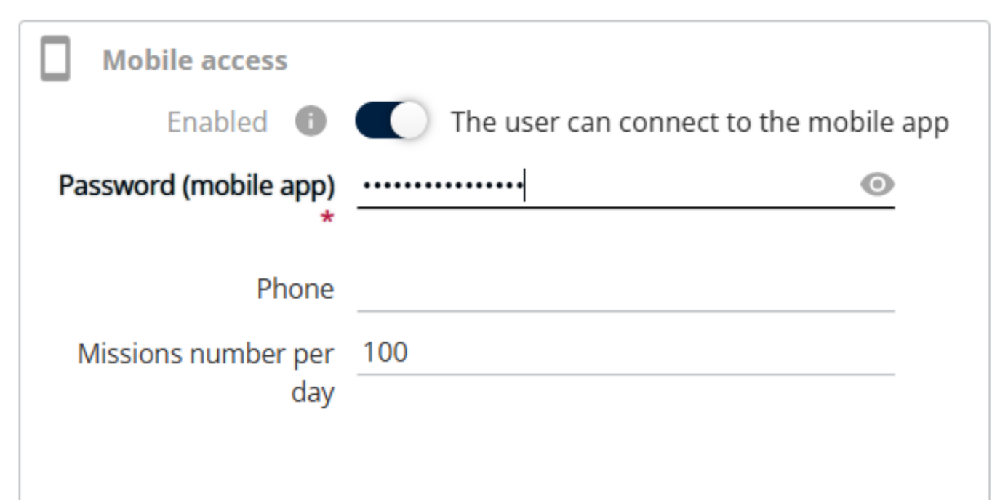

# Mobile - Roles and Rights

| Roles and Rights                | Description                                                                      |
| ------------------------------- | -------------------------------------------------------------------------------- |
| Delivery                        | When enabled, users can perform delivery-related operations.                     |
| Docking                         | When enabled, users can access and manage docking activities.                    |
| Loading / Unloading             | When enabled, users can load and unload parcels in their vehicles.               |
| Loading when not fully prepared | When enabled, users can load parcels even if the mission is not fully prepared.  |
| Prepare                         | When enabled, users can prepare missions before execution.                       |
| Reception                       | When enabled, users can receive parcels at the destination or depot.             |
| Storage                         | When enabled, users can move parcels into storage locations.                     |
| Scan unknown missions           | When enabled, users can scan and process missions that are not predefined.       |
| Create routes                   | When enabled, users can create and manage delivery routes.                       |
| Handle unassigned deliveries    | When enabled, users can manage deliveries not assigned to any route or resource. |
| Handle unassigned pickups       | When enabled, users can manage pickups not assigned to any route or resource.    |
| Reassign missions               | When enabled, users can reassign missions to different routes or resources.      |
| Scan not mandatory              | When enabled, scanning parcels is optional during operations.                    |
| Reposition addresses            | When enabled, users can modify or correct mission addresses.                     |
| Supervisor screen               | When enabled, users can access the supervisor monitoring screen.                 |
| Parcel transfer                 | When enabled, users can transfer parcels between missions or containers.         |
| Group into a container          | When enabled, users can group multiple parcels into a single container.          |
| Modify missions                 | When enabled, users can edit mission details.                                    |
| Make the call mandatory         | When enabled, users must make a call before completing the mission.              |

#### Password policy for Mobile Access

The password must contain a minimum of 8 characters, including at least one uppercase letter, one lowercase letter, and one number.

