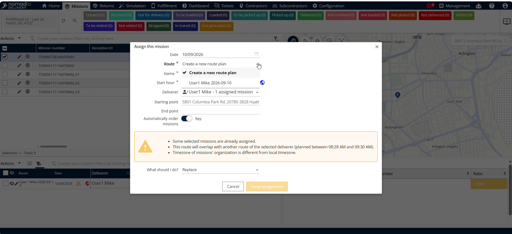
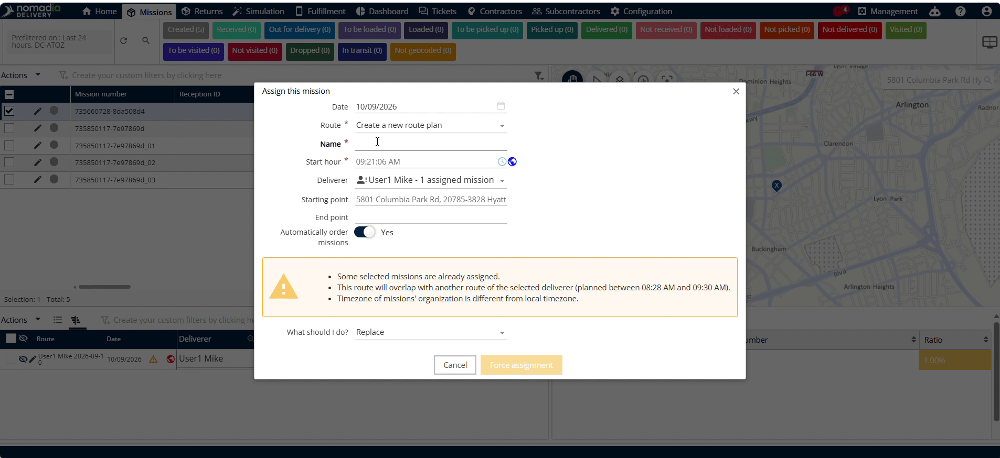
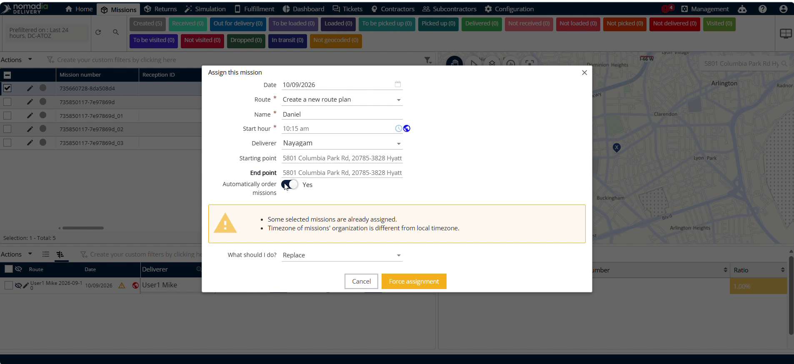

# Manual Route Creation

Manual route creation in **Nomadia Delivery** allows dispatchers to build and assign custom delivery routes. Use this feature to set schedule dates, assign deliverers, and define route endpoints manually. By creating routes manually, you maintain precise control over transport operations.

#### Getting Started

Prerequisites:

* Active account in **Nomadia Delivery**.
* Access permissions for mission and route management.

Initial setup steps:

1. Open the mission management dashboard.
2. Select the target **Mission** from the list.
3. Click **Actions** to view available options.
4. Select **Assign** to launch manual route creation.

#### Feature Overview

* **Mission**: Selected machine item designated for route assignment.
* **Actions**: Dropdown menu containing operational commands for the machine.
* **Assign**: Button that launches the manual route setup form.
* **Calendar Icon**: Date picker tool used to set the route schedule date.
* **Route Field**: Input field to select a new or existing route.
* **Route Name Field**: Text field to enter the route identifier.
* **Clock Icon**: Time selector tool used to set route timing.
* **Deliverer**: Selection dropdown to assign a specific driver.
* **Start Point and End Point**: Location fields setting route boundaries.
* **Force Assignment**: Confirmation button committing the final route assignment.

#### How To: Create and Assign a Route Manually

1. Select the target **Mission** from the list.
2. Click **Actions**.
3. Click **Assign**.

4. Click the **Calendar Icon**.
5. Select any date for the route.

6. Tap the **Route Field**.
7. Choose to create a new route or select an existing route.

8. Enter the route name in the **Route Name Field**.

9. Tap the **Clock Icon** to select the time.

10. Select the **Deliverer** to assign to the route.

11. Select the **Start Point** and **End Point**.

12. Enable **Automatically Order Missions** if needed.

13. Select **Ignore** or **Replace** for conflict handling.

14. Click **Force Assignment** to finalize the route assignment.

#### Productivity Tips

* 💡 **Automatic Machine Ordering**: Enable automatic machine ordering to sequence machines along the route automatically.
* ⚠️ **Conflict Handling Settings**: Select whether to ignore or replace conflicts before clicking **Force Assignment** to avoid unexpected route overwrites.
