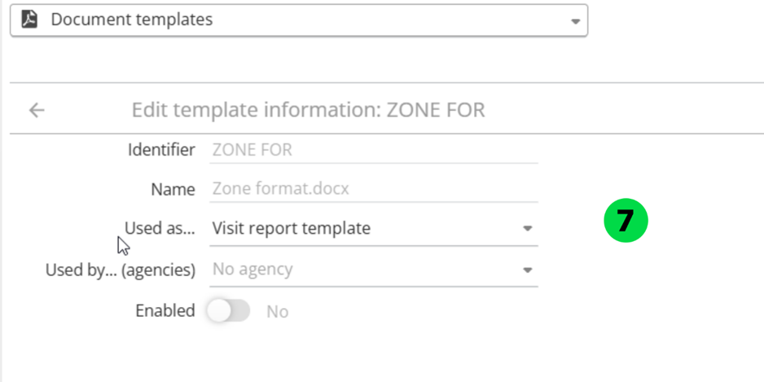

# Missions

### 1. Understanding the Missions Page

A Mission refers to a task that must be executed, typically involving a pick-up location and delivery address. Each mission moves through a sequence of statuses that reflect its current stage. Understanding these statuses is essential for monitoring the progress and handling any exceptions that may occur during the process.

 (1).png>)

<table data-header-hidden><thead><tr><th valign="top"></th><th valign="top"></th><th valign="top"></th></tr></thead><tbody><tr><td valign="top">Section ID</td><td valign="top">Section</td><td valign="top">Description</td></tr><tr><td valign="top">A</td><td valign="top">Mission Table</td><td valign="top">Displays ongoing missions in a table format. Supports up to 10,000 entries at a time. Includes sorting and filtering options for easy data access.</td></tr><tr><td valign="top">B</td><td valign="top">Map</td><td valign="top">Interactive map showing mission locations and route paths. Help visualize geographic distribution and real time spatial tracking of mission statuses.</td></tr><tr><td valign="top">C</td><td valign="top">Routes Table</td><td valign="top">Gantt-style view of routes, showing scheduling and duration. Useful for understanding workload and mission sequence. It outlines the agenda for the designated mobile user.</td></tr><tr><td valign="top">D</td><td valign="top">Details</td><td valign="top">Shows detailed information for selected missions or routes, such as deliverer name, time slots, and status. Helps in reviewing and making informed decisions.</td></tr></tbody></table>

### 1.1. Set missions display (prefilter)

From the Missions page:

1. Click the **"Prefiltered On"** button at the top left.\
   The display of this section may vary based on screen resolution.
2. Choose your filters:
   * **Agency**: Select one or more agencies.
   * **Reference**: Filter by creation date or modification date.
   * **Period**: Choose from options like the last hour, last 24 hours, last 7 days, or set a custom date range.
   * **Display Deleted Missions**: Enable this option to include deleted missions.
3. Click **Apply**.

 (1).png>)

4. The filtered missions will be displayed on your Missions page.

 (1).png>)

### 1.2. Pre-filters

The Pre-filters on the Missions Page are dynamic sections that provide users with detailed and contextual information based on their current selection or interaction. These pre-filters enhance navigation and productivity by allowing quick access to relevant data without switching screens.

 (1).png>)

### 1.3. Default Delivery statuses

Below are an overview of the various mission statuses and their significance:

<table data-header-hidden><thead><tr><th valign="top"></th><th valign="top"></th></tr></thead><tbody><tr><td valign="top">Status</td><td valign="top">Description</td></tr><tr><td valign="top">Waiting</td><td valign="top">The mission is expected but not yet received</td></tr><tr><td valign="top">Received</td><td valign="top">The mission has been successfully received</td></tr><tr><td valign="top">To be Delivered</td><td valign="top">The mission is prepared for delivery</td></tr><tr><td valign="top">To be Loaded</td><td valign="top">The mission is waiting to be loaded.</td></tr><tr><td valign="top">Loaded</td><td valign="top">The package is now loaded and in transit</td></tr><tr><td valign="top">To be Picked up</td><td valign="top">Mission is scheduled and awaiting pick up</td></tr><tr><td valign="top">Picked up</td><td valign="top">Item has been collected from the origin</td></tr><tr><td valign="top">Delivered</td><td valign="top">The delivery is completed successfully.</td></tr><tr><td valign="top">Not Received</td><td valign="top">Indicates a mission was expected but couldn’t be received</td></tr><tr><td valign="top">Not Loaded</td><td valign="top">The mission couldn’t be loaded as expected</td></tr><tr><td valign="top">Not Picked up</td><td valign="top">Scheduled pickup was missed or failed.</td></tr><tr><td valign="top">Not Delivered</td><td valign="top">The delivery failed</td></tr><tr><td valign="top">Visited</td><td valign="top">Destination has been successfully visited</td></tr><tr><td valign="top">To be Visited</td><td valign="top">Destination is scheduled for a visit.</td></tr><tr><td valign="top">Not Visited</td><td valign="top">The scheduled visit was missed or unsuccessful.</td></tr></tbody></table>

 (1).png>)

### 1.4. Understanding the mission parameters

Mission Parameters are the core data elements that define the characteristics, objectives, and execution details of each mission. Understanding these parameters is essential for ensuring that missions are properly configured, assigned, and executed in the field.

These parameters provide both operational and logistical information used by

coordinators, dispatchers, and deliverers.

#### 1.4.1. Access Mission Parameters

From the Mission page

1. Click the pencil icon next to the mission you want to edit

 (1).png>)

#### 1.4.2. Mission parameters description

### Mission

| Parameter                           | Description                                                                   |
| ----------------------------------- | ----------------------------------------------------------------------------- |
| Barcode                             | Automatically generated by Nomadia Delivery to uniquely identify the mission. |
| Agency - Mandatory                  | Mandatory field. Specifies the agency responsible for handling the mission.   |
| Subcontractor                       | Third-party delivery provider assigned to the mission.                        |
| Sender Barcode                      | Optional barcode supplied by the contractor.                                  |
| Parent Container ID                 | Identifies the main container grouping multiple missions.                     |
| Grouping key                        | Groups missions linked to the same customer.                                  |
| Container type                      | Type of container (box, pallet, crate, etc.).                                 |
| Origin                              | Original dispatch location.                                                   |
| Scheduled deliverer                 | Assigned delivery person.                                                     |
| Priority                            | Mission urgency (High, Medium, Low).                                          |
| Status configuration type           | Defines the status workflow applied.                                          |
| One type of password                | Security code (PIN/OTP) for verification.                                     |
| Mission Status                      | Current mission status.                                                       |
| Sub-status                          | Detailed status within the main status.                                       |
| Motive                              | Reason for the current sub-status.                                            |
| Mission type                        | Delivery / Pickup / Chained Pickup & Delivery / Visit / Drop Shipping         |
| Provisional date                    | Tentative mission date.                                                       |
| Main depot scan date                | Date and time scanned at depot.                                               |
| Storage place                       | Storage location in depot.                                                    |
| Fixed visit duration                | Estimated time to complete mission.                                           |
| Compatibility with resources        | Matches resource capabilities.                                                |
| Require all skills to be compatible | Resource must meet all skill requirements.                                    |
| Delivery before pickup              | Enforces delivery-first sequence.                                             |
| Keys                                | Indicates if keys/codes are required.                                         |
| Position                            | Order in route sequence.                                                      |

***

### Parcel

| Parameter     | Description                           |
| ------------- | ------------------------------------- |
| Product type  | Type/category of product.             |
| Length        | Package length.                       |
| Width         | Package width.                        |
| Height        | Package height.                       |
| Weight        | Package weight.                       |
| Volume        | Package volume.                       |
| Package value | Declared value for insurance/billing. |
| Comment       | Internal notes.                       |

***

### Pickup

| Parameter                     | Description                                      |
| ----------------------------- | ------------------------------------------------ |
| Address – Mandatory           | Pickup address (cannot be edited after routing). |
| Contact details               | Name, phone, email of sender.                    |
| Picked up by                  | Person who performed pickup.                     |
| Pickup asked date / end date  | Requested pickup time window.                    |
| Scannable container code      | Barcode for container identification.            |
| Pickup instructions / Comment | Special pickup instructions.                     |

***

### Delivery

| Parameter                       | Description                              |
| ------------------------------- | ---------------------------------------- |
| Address – Mandatory             | Delivery address (locked after routing). |
| Contact details                 | Recipient details.                       |
| Delivered by                    | Delivery agent.                          |
| Delivery asked date / end date  | Requested delivery window.               |
| Cash on delivery                | Amount to collect.                       |
| Delivery price                  | Delivery cost.                           |
| Delivery instructions / Comment | Special delivery instructions.           |

***

### Articles

| Parameter       | Description                 |
| --------------- | --------------------------- |
| Type of article | Defined in Manage Articles. |
| Planned         | Planned quantity.           |
| Done            | Completed quantity.         |

***

### Opening Hours

| Parameter     | Description                               |
| ------------- | ----------------------------------------- |
| Opening Slots | Allowed time slots for mission execution. |

***

### Photos

| Parameter | Description                     |
| --------- | ------------------------------- |
| Photos    | Images captured via mobile app. |

***

### Signatures

| Parameter  | Description                                     |
| ---------- | ----------------------------------------------- |
| Signatures | Contractor, deliverer, and customer signatures. |

***

### Documents

| Parameter | Description                             |
| --------- | --------------------------------------- |
| Documents | Linked documents from library or cloud. |

***

### Logs

| Parameter        | Description                                 |
| ---------------- | ------------------------------------------- |
| Mission’s events | Timeline of status changes with timestamps. |

### 1.5. Manage Mission Parameters

The Manage Mission Parameters section allows administrators to define and configure key parameters that govern how delivery missions are planned, executed, and optimized within the system. These parameters play a crucial role in tailoring the delivery operations to match business needs and logistical constraints.

#### 1.5.1. Manage Postal Zones

The Manage Postal Zones feature allows administrators and logistics managers to define and manage geographical delivery zones based on postal codes. These zones are essential for organizing deliveries, assigning resources, and optimizing routes within specific areas

#### 1.5.2. Import Postal Zones

1. Click on Configuration Tab

 (1).png>)

2. Click on Configuration Menu
3. Under My data section, click on Manage Zones

 (1).png>)

4. Click the Actions dropdown menu.
5. Click on Import

 (1).png>)

6. Click on Browse File to upload the file that contains the zone data.

 (1).png>)

7. Select a valid Zone file from your local system.

 (1).png>)

Postal Zones will be imported successfully.

 (1).png>)

#### 1.5.3. Add a Postal Zone

1. Click on Configuration Tab
2. Click on Configuration Menu
3. Under My data section, click on Manage Zones
4. Click the Actions dropdown menu.
5. Click on Add a Postal Zone.

 (1).png>)

6. Fill in the required fields: Code, Name, and Prefix.

**Note**: The Prefix is used to standardize postal codes to a fixed length of 6 digits. In regions where postal codes are shorter (e.g., 5 digits in some areas of France), the system automatically adds the defined prefix to reach the required length.

 (1).png>)

7. Click on Save

 (1).png>)

Postal Zones will be added successfully

 (1).png>)

#### 1.5.4. Create Postal Zones by Territory Management (Sectorization)

1. Click on Configuration Tab
2. Click on Configuration Menu
3. Under My data section, click on Manage Zones
4. Select a Mission
5. Click the Actions dropdown menu.
6. Click on New Sectorization.

For detailed information, refer to the Territory Manager Manual available at the following link:

[Nomadia Districting Documentation](https://mynomadia.com/doc/tm/docs/en/tm-book/_districting.html)

 (1).png>)

7. Select the appropriate Indicators and define the Time Period
8. Click on Assign Territories

 (1).png>)

9. Click on Automation

 (1).png>)

10. In the Balancing Points section, click Start to prepare the system for automatic balancing.

 (1).png>)

11. Click “Let’s go!” to launch the automated balancing of territories.

 (1).png>)

12. Sectors are generated according to the balancing rules set by the user.
13. To ensure the sectorization respects postal code boundaries, click on Administrative Borders and select Postal Code from the dropdown menu.

 (1).png>)

Sectors are aligned based on postal boundaries

**Disclaimer**: Postal code boundary data is unavailable for certain countries.

#### 1.5.5. Delete a Postal Zone

1. Click on Configuration Tab
2. Click on Configuration Menu
3. Under My data section, click on Manage Zones
4. Select a Zone

 (1).png>)

5. Click the Actions dropdown menu.
6. Click on Delete

 (1).png>)

7. You will see a confirmation pop-up message stating: "Are you sure you want to delete this zone?"
8. Click on Yes

 (1).png>)

Postal Zone will be deleted successfully

 (1).png>)

#### 1.5.6. Export a Postal Zone

1. Click on Configuration Tab
2. Click on Configuration Menu
3. Under My data section, click on Manage Zones
4. Select a Zone
5. Click the Actions dropdown menu.
6. Click on Export

.png>)

Postal Zone will be exported successfully

.png>)

#### 1.5.7. Color a Postal Zone

Apply conditions based on zone attributes such as type of mission (Delivery, Pickup), Zone priority, Assigned deliverer, Postal code prefix, etc.

1. Click on Configuration Tab
2. Click on Configuration Menu
3. Under My data section, click on Manage Zones
4. Select a Zone
5. Click the Actions dropdown menu.
6. Click on Coloring

.png>)

7. Choose a Color
8. Click on Save

.png>)

The selected color has been applied successfully.

.png>)

#### 1.5.8. Customize Zones Table

Refer to 1.5.2. Import Postal Zones to have the complete list of available fields.

1. Click on Configuration Tab
2. Click on Configuration Menu
3. Under My data section, click on Manage Zones
4. Select a Zone
5. Click the Actions dropdown menu.
6. Click on Customize Limit

.png>)

7. Choose which fields you want to display on the table.

**Note**: Avoid selecting too many fields at once, as it may become difficult to read or

navigate.

8. Click on Save

.png>)

The selected fields have been displayed on the table.

.png>)

### 1.6. Manage Vehicle Fleets

The Manage Vehicle Fleets in Nomadia Delivery allows administrators and planners to maintain an up-to-date registry of the vehicles used for delivery operations. This includes adding, editing, or deactivating vehicles, assigning specific characteristics, and ensuring that each vehicle is properly configured to meet logistical needs.

#### 1.6.1. Import Vehicles fleets

1. Go to Configuration.

.png>)

2. Click on Configuration menu
3. Under My Data, click on Manage the Vehicles.

.png>)

4. Under My Fleets, click the Actions dropdown menu.
5. Click on Import

.png>)

6. Click on Browse File to upload the file

.png>)

7. Select a Valid file from your local system.

.png>)

The vehicle fleets have been imported successfully.

.png>)

#### 1.6.2. Add a Vehicles fleets

1. Go to Configuration.
2. Click on Configuration Menu
3. Under My Data, click on Manage the Vehicles.
4. Under My Fleets, click the Actions dropdown menu.
5. Click on Add

.png>)

6. Enter the Name and Agency name
7. Click on Add

.png>)

The vehicle fleets have been added successfully.

.png>)

#### 1.6.3. Delete a Vehicles fleets

1. Go to Configuration.
2. Click on Configuration Menu
3. Under My Data, click on Manage the Vehicles.
4. Select a Team
5. Under My Fleets, click the Actions dropdown menu.
6. Click on Delete

.png>)

7. You will see a confirmation pop-up message stating: "Do you want to delete the Vehicle?"
8. Click on Delete

.png>)

The Vehicle fleets have been deleted successfully.

.png>)

###

### 1.7. Manage Vehicles in a fleet

#### 1.7.1. Add a Vehicle

1. Go to Configuration.
2. Click on Configuration Menu
3. Under My Data, click on Manage the Vehicles.
4. Click the Desired Name
5. Click on Actions
6. Click on Add from the dropdown menu

.png>)

7. Enter the Name

.png>)

8. Click on Add

.png>)

#### 1.7.2. Customize the constraints

1. Go to Configuration.
2. Click on Configuration Menu
3. Under My Data, click on Manage the Vehicles.
4. Click on the Desired name
5. Click on Actions
6. Click on Add
7. Click on Constraints

.png>)

8. Choose which fields you want to display on the table.

**Note**: Avoid selecting too many fields at once, as it may become difficult to read or navigate.

9. Click on Save

.png>)

The Fields have been displayed successfully.

.png>)

#### 1.7.3. Delete a Vehicle

1. Go to Configuration.
2. Click on Configuration Menu
3. Under My Data, click on Manage the Vehicles.
4. Click the Desired Name
5. Click on Actions
6. Click on Delete from the dropdown menu

.png>)

7. You will see a confirmation pop-up message stating: "Do you want to delete the Vehicle?"
8. Click on Delete.

.png>)

Vehicles have been deleted successfully

.png>)

#### 1.7.4. Export a Vehicle

1. Go to Configuration.
2. Click on Configuration Menu
3. Under My Data, click on Manage the Vehicles.
4. Click the Desired Name
5. Click on Actions
6. Click on Export from the dropdown menu

.png>)

The vehicles have been exported successfully.

.png>)

#### 1.7.5. Color a Vehicle

1. Go to Configuration.
2. Click on Configuration Menu
3. Under My Data, click on Manage the Vehicles.
4. Click the Desired Name
5. Click on Actions
6. Click on Coloring from the dropdown menu

.png>)

7. Choose a Color
8. Click on Save

.png>)

The color has been applied successfully.

.png>)

#### 1.7.6. Customize Vehicles table

1. Go to Configuration.
2. Click on Configuration Menu
3. Under My Data, click on Manage the Vehicles.
4. Click the Desired Name
5. Click on Actions
6. Click on Customize the list from the dropdown menu

.png>)

7. Choose which fields you want to display on the table.

**Note**: Avoid selecting too many fields at once, as it may become difficult to read or

navigate.

8. Click on Save

.png>)

The selected fields will be displayed on the table successfully

.png>)

#### 1.7.6. Export a Vehicles fleets

1. Go to Configuration.
2. Click on Configuration Menu
3. Under My Data, click on Manage the Vehicles.
4. Select a Team
5. Under My Fleets, click the Actions dropdown menu.
6. Click on Export

.png>)

The vehicles fleets will be exported successfully.

.png>)

#### 1.7.7. Color a Vehicles fleets

Apply conditions based on zone attributes such as type of mission (Delivery, Pickup), Zone priority, Assigned deliverer, Postal code prefix, etc.

1. Go to Configuration.
2. Click on Configuration Menu
3. Under My Data, click on Manage the Vehicles.
4. Select a Team
5. Under My Fleets, click the Actions dropdown menu.
6. Click on Coloring

.png>)

7. Choose a Color
8. Click on Save

.png>)

The selected color has been applied successfully

.png>)

#### 1.7.8. Customize Vehicles fleets table

1. Go to Configuration.
2. Click on Configuration Menu
3. Under My Data, click on Manage the Vehicles.
4. Select a Team
5. Under My Fleets, click the Actions dropdown menu.
6. Click on Customize the list

.png>)

7. Choose which fields you want to display on the table.

**Note**: Avoid selecting too many fields at once, as it may become difficult to read or navigate.

8. Click on Save

.png>)

The selected fields have been displayed on the table successfully

.png>)

#### 1.7.9. Customizing Status Labels.

Previously, statuses in Nomadia Delivery were static and could not be customized to adapt to customer workflows. Customizable status labels now enhance mission tracking by giving users full control to configure status labels and colors to align with their business workflows.

* Status Labels – Description
* Waiting - Initial status. The Parcel is expected to arrive at the agency.
* Received - Optional Status: Indicates the parcel has been received by the deliverer. The exact location depends on context.
* Not received - Optional Status: Indicates the parcel was expected but not received by the deliverer. Location is dependent on context.
* To be delivered - Parcel is scheduled for delivery by the transporter or subcontractor.
* To be loaded - Optional Status: Parcel is ready at the docking area, awaiting loading onto the vehicle.
* Loaded - Optional Status: Parcel has been successfully loaded onto the truck by the deliverer.
* Not loaded - Optional Status: Parcel was expected but not loaded onto the truck
* Not delivered - Delivery attempt failed; parcel was not handed over to the customer.
* Delivered - Parcel has been delivered to the final recipient.
* To be picked up - Parcel is scheduled for pickup by the transporter or subcontractor.
* Picked up - Parcel has been collected from the contractor or end-customer.
* Not Picked up - Pickup attempt failed; parcel was not collected.
* To be Visited - Visit is scheduled by the transporter or subcontractor.
* Visited - Visit was completed by the deliverer.
* Not Visited - Visit was scheduled but not completed.

To customize status labels in Nomadia Delivery, follow the steps below.

1. Open the Nomadia Delivery application and navigate to the Configuration tab.

.png>)

2. Select Customize Status Labels from the list.

.png>)

This page displays all statuses in Nomadia Delivery.

.png>)

3. Click the text box next to the status and update the label to match your business workflow.

.png>)

4. Click the Other Languages accordion to update labels for users in different languages or countries.

.png>)

5. Click the Color Picker to change the background color of a status label. Ensure you choose a contrasting color that maintains text readability in the UI.

.png>)

6. After making the changes, click Save to apply the label and color updates across both the web and mobile applications.

.png>)

7. After saving the changes, return to the mission page to view the updated labels and colors in the pre-filter area

.png>)

This provides a smooth, business-aligned experience for both planners and deliverers.

### 1.8. Manage Sub Statuses

The Manage Sub Statuses feature allows administrators to create, edit, and assign detailed status labels that reflect the real-time progress or condition of a delivery task. These sub statuses provide a more granular tracking mechanism within the broader status categories such as "Pickup", "Waiting", or "Delivered"

### 1.8.1. Create a Sub status

1. Go to Configuration.
2. Click on Configuration Menu
3. Under My Data, click on Sub statuses.

.png>)

4. Click the Actions dropdown menu
5. Click on Add

.png>)

6. Enter the Sub status code
7. Select the Status configuration type

.png>)

8. Click on Save

.png>)

Sub status has been created successfully

.png>)

#### 1.8.2. Delete a Sub status

1. Go to Configuration.
2. Click on Configuration Menu
3. Under My Data, click on Sub statuses.
4. Select a Sub statuses
5. Click the Actions dropdown menu
6. Click on Delete

.png>)

You will see a confirmation pop-up message stating: "Do you want to delete the sub-status?"

7. Click on Yes

.png>)

Sub status has been deleted successfully

.png>)

#### 1.8.3. Coloring a Sub status

Apply conditions based on zone attributes such as type of mission (Delivery, Pickup), Zone priority, Assigned deliverer, Postal code prefix, etc.

1. Go to Configuration.
2. Click on Configuration Menu
3. Under My Data, click on Sub statuses.
4. Select a Sub statuses
5. Click the Actions dropdown menu
6. Click on Coloring

.png>)

7. Choose a Color
8. Click on Save

.png>)

The selected color has been applied successfully.

.png>)

#### 1.8.4. Customize Sub statuses table

1. Go to Configuration.
2. Click on Configuration Menu
3. Under My Data, click on Sub statuses.
4. Select a Sub statuses
5. Click the Actions dropdown menu
6. Click on Customize the Limit

.png>)

7. Choose which fields you want to display on the table.

**Note**: Avoid selecting too many fields at once, as it may become difficult to read or navigate.

8. Click on Save

.png>)

The selected fields have been displayed on the table successfully

.png>)

#### 1.8.5. MANAGING SUB-STATUS CONFIGURATION TYPES

Nomadia Delivery provides three types of sub-status templates that enable users to personalize the delivery workflow according to the customer type or category. These templates are Basic, Intermediate, and Advanced.

Basic Configuration types: Designed for customers who require only a single verification step,

such as capturing a photo or collecting a signature. It simplifies the delivery process by including

only the essential checks.

Intermediate Configuration types: Suitable for customers who need multiple verification steps but do not require the full range of options available on the advanced template.

Advanced Configuration types: Intended for customers who demand comprehensive verification, such as taking photos at every stage of the delivery. It provides maximum flexibility to configure detailed workflows.

Note: The Configuration types options are provided solely to help differentiate delivery workflows based on customer categories. However, the complexity of the workflow is entirely at the user’s discretion. For example, a Basic template can still be configured to support a complex delivery process if needed.

To configure and manage sub-status configuration types in Nomadia Delivery, follow these steps:

1. Open the Nomadia Delivery application and go to the Configuration module.

.png>)

2. Click on the Actions button, then choose Add to create a new sub-status.

.png>)

3. Assign the created sub-status to one or more templates.

.png>)

4. Define the required actions for each sub-status, such as making signature mandatory, requiring a photo, etc.

<figure><figcaption></figcaption></figure>

5. Repeat the process to create additional sub-statuses and link them to the desired templates.

<figure><figcaption></figcaption></figure>

6. Once all templates are configured, navigate to the Missions tab.
7. Click on the Mission Editor button to attach a sub-status template to a mission.

<figure><figcaption></figcaption></figure>

8. Select the status configuration template for the chosen mission

<figure><figcaption></figcaption></figure>

9. Alternatively, configure templates in bulk during mission import by mapping the Excel field to the Status configuration type with values like BASIC, INTERMEDIATE, or ADVANCED.

<figure><figcaption></figcaption></figure>

#### 1.8.6. Trigger Notifications for Sub Status Changes

The Trigger Notifications for Sub-Status Changes feature enables accurate, real-time communication with all stakeholders involved in parcel movement. It improves transparency, coordination, and overall service quality across first-mile, mid-mile, and last-mile operations.

To configure notifications for sub-status changes, follow the steps below:

1. Open the Nomadia Delivery application and go to the Configuration tab.

<figure><figcaption></figcaption></figure>

2. Select Sub-statuses from the list.

<figure><figcaption></figcaption></figure>

3. Click the Pencil icon next to the existing sub-status to edit it.

<figure><figcaption></figcaption></figure>

4. The Custom Messages Configuration section is displayed at the bottom of the page.

<figure><figcaption></figcaption></figure>

5. Click the + button to add the notification configuration to the sub status.

<figure><figcaption></figcaption></figure>

6.  Notifications can be made for the following recipients:

    * **Sender** – The original sender of the mission. Notifications are sent to the contractor’s email address or mobile number stored in the mission details.
    * **Consignee** – The original recipient of the mission (customer). Notifications are sent to the delivery email address or mobile number stored in the mission details.
    * **Other Recipients** – Internal stakeholders such as dispatch or logistics teams. This field accepts multiple email addresses or phone numbers, separated by commas.

    <figure><figcaption></figcaption></figure>
7.  Notifications can be sent via Email or SMS.

    * To create a notification configuration, select a **recipient**, **message type**, and **message template**.
    * Only **custom message templates** are supported for this case.

    <figure><figcaption></figcaption></figure>
8.  The Other Recipients field allows you to enter multiple email addresses or phone numbers, separated by commas.

    * This field is enabled only when **Other Recipients** is selected in the **Recipient** column.

    <figure><figcaption></figcaption></figure>
9. After completing the configuration, click Save to apply and store the changes.

<figure><figcaption></figcaption></figure>

When the mobile user triggers a sub-status, all configured recipients automatically receive the update via Email or SMS at the same time, providing real-time information on the mission’s movement.

<figure><figcaption></figcaption></figure>

### 1.9. Manage Articles

The Manage Articles feature in Nomadia Delivery allows users to maintain and organize a centralized catalog of products (articles) that are part of the delivery workflow. This feature supports the complete lifecycle of articles — including creation, editing, activation/deactivation, and deletion — enabling seamless tracking and accurate planning of deliveries.

#### 1.9.1. Manage Article types

The Manage Article Types feature allows administrators to define and categorize the various kinds of articles handled within the delivery process. This classification ensures better organization, filtering, and reporting of items during route planning, loading, and delivery execution.

<table data-header-hidden><thead><tr><th valign="top"></th><th valign="top"></th><th valign="top"></th></tr></thead><tbody><tr><td valign="top">Field name in import file</td><td valign="top">Field name in back office table</td><td valign="top">Description</td></tr><tr><td valign="top">Id</td><td valign="top">Name</td><td valign="top">Mandatory and unique among all the articles id / Name</td></tr><tr><td valign="top">Labels</td><td valign="top">Labels</td><td valign="top">
In the import file, for several languages the syntax is:

[language code on two characters] = [Translation]; [language code on two characters] = [Translation]. E.g.: “fr=Tournevis;en=Screwdriver”
</td></tr></tbody></table>

#### 1.9.2. Import Article types.

1. Go to Configuration.
2. Click on Configuration Menu
3. Under Customization, click on Types of Articles.

<figure><figcaption></figcaption></figure>

4. Click the Actions dropdown menu
5. Click on Import

<figure><figcaption></figcaption></figure>

6. Click on Browse File to upload the file that contains the zone data.

<figure><figcaption></figcaption></figure>

7. Select a valid file from your local system.

<figure><figcaption></figcaption></figure>

8. The articles have been imported successfully.

<figure><figcaption></figcaption></figure>

#### 1.93. Create an Article type

1. Go to Configuration.
2. Click on Configuration Menu
3. Under Customization, click on Types of Articles.
4. Click the Actions dropdown menu
5. Click on Add

<figure><figcaption></figcaption></figure>

6. Enter the Name and Translation

<figure><figcaption></figcaption></figure>

7. Click on Save

<figure><figcaption></figcaption></figure>

The article type has been created successfully

<figure><figcaption></figcaption></figure>

#### 1.9.4. Edit an Article type

1. Go to Configuration.
2. Click on Configuration Menu
3. Under Customization, click on Types of Articles.
4. Select an Article
5. Click the Pencil icon

<figure><figcaption></figcaption></figure>

6. Edit the information as needed

<figure><figcaption></figcaption></figure>

7. Click on Save

<figure><figcaption></figcaption></figure>

#### 1.9.5. Export Article types

1. Go to Configuration.
2. Click on Configuration Menu
3. Under Customization, click on Types of Articles.
4. Select an Article
5. Click the Actions dropdown menu
6. Click on Export

<figure><figcaption></figcaption></figure>

The article types have been exported successfully

<figure><figcaption></figcaption></figure>

#### 1.9.6. Delete an article type

1. Go to Configuration.
2. Click on Configuration Menu
3. Under Customization, click on Types of Articles.
4. Select an Article
5. Click the Actions dropdown menu
6. Click on Delete

<figure><figcaption></figcaption></figure>

7. You will see a confirmation pop-up message stating: "Do you want to delete the article?"
8. Click on Delete

<figure><figcaption></figcaption></figure>

The article types have been deleted successfully

<figure><figcaption></figcaption></figure>

#### 1.9.7. Add Articles to a Mission

From the Mission page

1. Click on Actions
2. Select Add from the dropdown menu.

<figure><figcaption></figcaption></figure>

3. Click on Articles
4. Click on Add Articles

<figure><figcaption></figcaption></figure>

5. Enter the required information, including the Article name and Planned quantity

<figure><figcaption></figcaption></figure>

6. Click on Add

<figure><figcaption></figcaption></figure>

The Articles will be added successfully.

<figure><figcaption></figcaption></figure>

#### 1.9.8. Edit a Mission Article

From the Mission page

1. Click the pencil icon of the chosen mission

<figure><figcaption></figcaption></figure>

2. In the left-hand menu, click the Articles tab

<figure><figcaption></figcaption></figure>

3. Edit the Article

<figure><figcaption></figcaption></figure>

4. Update the necessary details such as Planned, Done, and Returned quantities
5. Click on Save

<figure><figcaption></figcaption></figure>

#### 1.9.9. Delete a Mission Article

From the Mission page

1. Click the pencil icon next to the desired mission
2. In the left-hand menu, select the Articles tab
3. Click on the Bin icon of the Article to delete

<figure><figcaption></figcaption></figure>

4. Mission articles will be deleted successfully.

<figure><figcaption></figcaption></figure>

### 1.10. Manage Documents

The "Manage Documents" feature allows users to upload, view, organize, and associate various documents with delivery operations to streamline communication and ensure all necessary information is easily accessible in the field and at the back office.

#### 1.10.1. Manage Templates for Mission documents

The Manage Document Templates feature allows administrators and back-office users to create, configure, and maintain reusable templates for documents such as delivery slips, invoices, proof of delivery, and task reports. These templates standardize documentation across operations and ensure consistency in branding, structure, and required information.

You can design your own templates to replace the default one.

<table data-header-hidden><thead><tr><th valign="top"></th><th valign="top"></th></tr></thead><tbody><tr><td valign="top">Templates</td><td valign="top">Associated Variables</td></tr><tr><td valign="top">Route sheet</td><td valign="top">Mission, Route</td></tr><tr><td valign="top">Loading sheet</td><td valign="top">Mission, Route</td></tr><tr><td valign="top">Mission sheet</td><td valign="top">Mission</td></tr><tr><td valign="top">Sticker sheet</td><td valign="top">Mission</td></tr><tr><td valign="top">Consignment notes</td><td valign="top">Mission, Agency, Contractor, Company, Vehicle, Delivery Man, Custom Data, Documents, Status Changes</td></tr><tr><td valign="top">Visit Report</td><td valign="top">Mission Open Order</td></tr><tr><td valign="top">Small Stickers Sheet</td><td valign="top">Mission</td></tr></tbody></table>

#### 1.10.2. Download a Document Template

1. Go to Configuration.
2. Click on Configuration Menu
3. Under Customization, click on Document Templates
4. Select the Desired document from the list

<figure><figcaption></figcaption></figure>

5. Click the Actions dropdown menu
6. Click on Download

<figure><figcaption></figcaption></figure>

The document templates will be downloaded successfully.

<figure><figcaption></figcaption></figure>

#### 1.10.3. Edit a Document Template

1. Go to Configuration.
2. Click on Configuration Menu
3. Under Customization, click on Document Templates
4. Select the Desired document from the list
5. Click the Actions dropdown menu
6. Click on Edit

<figure><figcaption></figcaption></figure>

7. Edit the information as needed

<figure><figcaption></figcaption></figure>

7. Click on Save

<figure><figcaption></figcaption></figure>

#### 1.10.4. Import a Document Template

1. Go to Configuration.

<figure><figcaption></figcaption></figure>

2. Click on Configuration Menu
3. Under Customization, click on Document Templates

<figure><figcaption></figcaption></figure>

4. Click the Actions dropdown menu
5. Click on Import

<figure><figcaption></figcaption></figure>

6. Click on Browse Computer to upload the file.

<figure><figcaption></figcaption></figure>

7. Select a Valid file from a local system

<figure><figcaption></figcaption></figure>

The document templates will be imported successfully.

<figure><figcaption></figcaption></figure>

#### 1.10.5. Enable/Disable a Document Template

1. Go to Configuration.
2. Click on Configuration Menu
3. Under Customization, click on Document Templates
4. Select the Desired document from the list
5. Click the Actions dropdown menu
6. Click on Enable/Disable

<figure><figcaption></figcaption></figure>

7. The document templates will be enabled / disabled successfully.

#### 1.10.6. Delete a document Template

1. Go to Configuration.
2. Click on Configuration Menu
3. Under Customization, click on Document Templates
4. Select the Desired document from the list
5. Click the Actions dropdown menu
6. Click on Delete

<figure><figcaption></figcaption></figure>

7. The document templates will be deleted successfully.

<figure><figcaption></figcaption></figure>

#### 1.10.7. Show/Hide default templates

1. Go to Configuration.
2. Click on Configuration Menu
3. Under Customization, click on Document Templates
4. Select the Desired document from the list
5. Click the Actions dropdown menu
6. Click on Show/Hide Default Template

<figure><figcaption></figcaption></figure>

### 1.11. Manage Document Library

The Manage Document Library feature provides a centralized repository to store, organize, and distribute commonly used documents across the delivery organization. It ensures quick access to reference materials such as safety instructions, compliance guidelines, operating procedures, and training manuals for both back-office staff and field agents.

Ensure your file is in one of these supported formats before proceeding: XLSX, DOCX, PDF, JPG, or PNG

1. Go to Configuration.
2. Click on Configuration Menu
3. Under My data, click on Document Library

<figure><figcaption></figcaption></figure>

4. Click on Browse Computer to upload the file

<figure><figcaption></figcaption></figure>

5. Select a Valid file from a local system.

<figure><figcaption></figcaption></figure>

6. The documents will be imported successfully.

<figure><figcaption></figcaption></figure>

### 1.12. Document recommendations

The Document Recommendations feature ensures that all required paperwork is available for each international shipment. It helps maintain compliance, prevents missing documents, and improves overall process reliability.

#### 1.12.1. Recommendations While Adding the Document

1. Open the Nomadia Delivery application and navigate to the Missions tab

<figure><figcaption></figcaption></figure>

2. Click Actions and select Add (Beta).

<figure><figcaption></figcaption></figure>

3. Enter the Agency name.

<figure><figcaption></figcaption></figure>

4. Click the Pencil icon in the top-right corner.

<figure><figcaption></figcaption></figure>

5. Enable the Add documents toggle and click Save.

<figure><figcaption></figcaption></figure>

<figure><figcaption></figcaption></figure>

6. Enter the delivery address.

<figure><figcaption></figcaption></figure>

7. Click Add.

<figure><figcaption></figcaption></figure>

Once the delivery address is added, the Document Recommendation list is automatically displayed based on the consignee’s country (delivery country). This helps users identify the mandatory documents that must be uploaded to meet legal requirements when transporting missions across countries.

<figure><figcaption></figcaption></figure>

#### 1.12.2. Recommendations While Editing the Document

To set up recommendations for Nomadia Delivery, follow the steps below.

1. Open the Nomadia Delivery application and go to the Configuration tab.

<figure><figcaption></figcaption></figure>

2. Select Document Library from the list.

<figure><figcaption></figcaption></figure>

3. Select the Document Recommendations tab.

<figure><figcaption></figcaption></figure>

4. Click the Actions menu, then select Add to create a new document recommendation.
5. Alternatively, users can import the document recommendation list using an Excel file from the same Actions menu.

<figure><figcaption></figcaption></figure>

6.  A recommendation list can be applied to multiple countries simultaneously.

    * Alternatively, a country can have both a general recommendation list and a country-specific recommendation list. In such cases, both lists are merged and displayed during mission creation or editing.
    * Links can be added to the recommendation list, allowing users to access online or cloud-hosted documents such as SharePoint.

    <figure><figcaption></figcaption></figure>

7. Enable the toggle to activate the recommendation list.

<figure><figcaption></figcaption></figure>

8. Click Add to create the document recommendation list.

<figure><figcaption></figcaption></figure>

The document recommendation lists are displayed on the table.

<figure><figcaption></figcaption></figure>

When creating or editing a mission, the document recommendation list is displayed based on the consignee’s country (delivery country). This helps users identify the documents that must be uploaded to comply with legal requirements when transporting missions from one country to another.

<figure><figcaption></figcaption></figure>

If a country has multiple recommendation lists, they are seamlessly merged and displayed with a separator.

<figure><figcaption></figcaption></figure>

### 1.13. Manage Container Types

The Manage Container Types feature enables logistics managers and dispatchers to define, configure, and manage the various types of containers or packaging units used in delivery operations. This helps optimize space planning, improve tracking, and ensure accurate handling of goods during transport.

The system supports three default container types: Cardboard, Pallet, and Parcel.

You can group multiple containers together and track the quantity of each container type at client locations for better inventory and logistics management.

#### 1.13.1. Create a Container type

1. Go to Configuration.

<figure><figcaption></figcaption></figure>

2. Click on Configuration Menu
3. Under Customization, click on Container Types

<figure><figcaption></figcaption></figure>

4. Click the Actions dropdown menu
5. Click on Add

<figure><figcaption></figcaption></figure>

6. Enter the Code and Translation

<figure><figcaption></figcaption></figure>

7. Click on Save

<figure><figcaption></figcaption></figure>

Container type will be created successfully.

<figure><figcaption></figcaption></figure>

#### 1.13.2. Edit a Container Type

1. Go to Configuration.
2. Click on Configuration Menu
3. Under Customization, click on Container Types
4. Click the Pencil icon of the chosen container type
5. Edit the information as needed

<figure><figcaption></figcaption></figure>

6. Click on Save

<figure><figcaption></figcaption></figure>

#### 1.13.3. Delete a Container Type

1. Go to Configuration.
2. Click on Configuration Menu
3. Under Customization, click on Container Types
4. Select the Container Types
5. Click on Actions
6. Click on Delete

<figure><figcaption></figcaption></figure>

The container type will be deleted successfully

<figure><figcaption></figcaption></figure>

### 1.14. Manage Mission’s Notifications

The Manage Mission’s Notifications enable administrators and dispatchers to configure and automate notifications related to delivery missions. These notifications ensure real-time communication with customers, field agents, and internal stakeholders, improving operational visibility and customer satisfaction.

#### 1.14.1. Enable Email Notification

1. Go to Configuration.

<figure><figcaption></figcaption></figure>

2. Click on Configuration Menu
3. Under Fulfillment and Client Experience, click on Configure Outgoing Messages

<figure><figcaption></figcaption></figure>

4. Select the General Configuration
5. Under Configure Outgoing Emails to the Customers, enable the Customers Outgoing Email Service

<figure><figcaption></figcaption></figure>

6. Click on Save

<figure><figcaption></figcaption></figure>

#### 1.14.2. Enable SMS Notifications

1. Go to Configuration.
2. Click on Configuration Menu
3. Under Fulfillment and Client Experience, click on Configure Outgoing Messages
4. Select the General Configuration
5. Under Configure Outgoing SMS to the Customers, enable the Customers Outgoing SMS Service
6. Click on Save

<figure><figcaption></figcaption></figure>

**Note**: SMS notifications are provided as an additional service.

### 1.15. Manage Missions Documents

The "Manage Missions" documents specifically refer to guides and documentation that help users oversee and operate delivery-related missions within the logistics and field execution workflows.

#### 1.15.1. Import a Document from the Document Library

1. Go to Configuration.
2. Click on Configuration Menu
3. Click on Document Library
4. Click on Actions
5. Click on Import
6. Click on Browse Computer

<figure><figcaption></figcaption></figure>

7. Select a Valid file to import a document

<figure><figcaption></figcaption></figure>

The mission documents will be imported successfully

#### 1.15.2. Upload a Document

1. Navigate to the Missions Tab.
2. Locate the desired mission and click the pencil icon to open it in edit mode.

<figure><figcaption></figcaption></figure>

3. In the left-hand menu, select Documents.
4. Click Browse Computer to open your file explorer.

<figure><figcaption></figcaption></figure>

5. Select a valid document from your local system to upload.

<figure><figcaption></figcaption></figure>

6. The mission documents will be uploaded successfully.

<figure><figcaption></figcaption></figure>

#### 1.15.3. Download a Document

1. Navigate to the Missions section.
2. Locate the desired mission and click the pencil icon to open it in edit mode.
3. In the left-hand menu, select Documents.
4. Click on Download

<figure><figcaption></figcaption></figure>

5. The mission documents will be downloaded successfully.

<figure><figcaption></figcaption></figure>

#### 1.15.4. Delete a Document

1. Navigate to the Missions section.
2. Locate the desired mission and click the pencil icon to open it in edit mode.
3. In the left-hand menu, select Documents.
4. Click on the Bin icon of the chosen document

<figure><figcaption></figcaption></figure>

5. The mission documents will be deleted successfully.

<figure><figcaption></figcaption></figure>

#### 1.15.5. ACCESSING ECMR

An eCMR (Electronic Consignment Note) is the digital equivalent of the traditional paper-

based CMR used in road transport. It acts as proof of the carriage contract, acknowledgment of goods received, and a document of title.

Download the eCMR PDF directly through the delivery management system.

1. Log in to the delivery management system and go to the Missions tab.

<figure><figcaption></figcaption></figure>

2.  Before generating the eCMR, ensure that the company name, address, and SIRET number are configured in **Configuration → General**.

    * These details are required by law and will be displayed on the eCMR.

    <figure><figcaption></figcaption></figure>
3. Select the routes for which you want to generate the eCMR.
4. Click Actions → Consignment notes.

<figure><figcaption></figcaption></figure>

5. Click the Download button.

<figure><figcaption></figcaption></figure>

The system will generate the eCMR PDF, which you can download and share with deliverers.

<figure><figcaption></figcaption></figure>

##

##

##

## 6.4. Manage Missions

The following fields are available at the mission level, allowing you to configure various mission constraints based on your business requirements.

### 6.4.1. Mission Creation Configuration

Fields can be organized within their respective blocks/sections to structure the mission creation layout according to your requirements. While the arrangement of fields inside a block remains fixed, you can modify the overall layout by changing the order of the blocks or sections.

Blocks or sections can be reordered using drag-and-drop functionality. Any changes made through drag-and-drop are automatically synchronized with the visibility and order displayed in the left-hand side user interface.

Go to Manage Missions

Click Add Mission

Enter the Mission type, Agency

Click Next

Click the pencil icon in the top right corner.

View the available information blocks:

General Information

Pickup Information

Delivery Information

PUDO Information

Custom Fields

Configure fields within each block:

Set fields as editable, read-only, or disabled.

Use drag and drop to:

Reorder fields within a block.

Group multiple fields into a single container using the six-dot handle.

Group the duplicated parcels in one container

Selecting Yes automatically creates a mission based on the type selected below.

Selecting No prevents automatic mission creation.

Optional — The user is prompted with this option during mission creation.

Expand or collapse blocks as needed.

Save the new mission configuration.

### 6.4.2. Add a Mission

Adding Mission allows users to create a mission by selecting a mission type, choosing a configuration, and entering mandatory mission information. The system enforces validations based on the selected mission type.

Go to Missions

Click Add from the Actions menu

Select Mission Type, (Pickup information - delivery) Delivery information -pickup), Agency.

Click Next.

Select a Mission Configuration:

Default configuration, or

Any Custom configuration was created earlier.

Enter mandatory mission details based on mission type.

Click Add or Add and Print.

### 6.4.3 Add Mission Beta

The Add (Beta) interface introduces a simplified, single-page mission creation experience in Nomadia Delivery. Designed to minimize repetitive steps and improve clarity, this interface replaces the traditional multi-step wizard with a unified view that brings together all mission parameters, constraints, and dependencies in one place.

Custom Field Grouping: Custom fields can now be grouped under a defined group name. During mission creation, these fields are displayed together under their respective group, making it easier to identify sections and enter information efficiently.

Group Ordering: Custom field groups can be reordered using drag-and-drop while creating or editing a configuration. The mission creation form reflects this order, allowing users to follow a workflow that best suits their process.

Sorting Fields Within Groups: Custom fields within a group can be sorted based on Name (default) or Identifier (for custom ordering), giving users precise control over how fields are displayed within each group.

Custom Fields for Parcels: Previously limited to the mission level, custom fields can now be associated with individual parcels when duplicating missions. Custom fields used for parcels cannot be enabled at the mission level, providing greater flexibility when duplicating missions for the same customer or address.

Group Missions in a Container: When duplicating missions, users can now group them by default within a parent container.

Immediate Document Attachment: Earlier, documents could only be added after mission creation through the mission editor. With this enhancement, the Add Document page is displayed immediately after mission creation, allowing documents to be attached right away.

To group custom fields in the mission creation form using a group name, follow the steps below:

Open the Nomadia Delivery application and go to the Configuration tab.

From the list, select Custom fields,

Click on Missions

Click the Pencil icon to edit an existing custom field.

In the Group name autocomplete field, enter a group name. You can choose an existing group or create a new one on the fly.

Once the group name is selected, click Save to apply the changes.

The assigned group name will be displayed in the Custom Fields table.

To arrange custom field groups in the desired order during mission creation, follow the steps below:

Open the Nomadia Delivery application and navigate to the Configuration tab.

Go to the Missions tab.

Click the Actions menu and select Add (beta).

Choose the mission type and agency, then click Next.

Click the Pencil icon to edit the mission configuration.

Expand the Custom fields accordion.

All custom field groups are displayed as separate accordions.

Click a Custom field group accordion to expand it.

The custom fields belonging to the selected group are listed.

Select the fields you want to display in the mission creation form.

The mission creation form dynamically updates the field visibility based on your selections.

Drag and drop the custom field groups to reorder them and control how they appear in the mission creation form.

To change the order of fields within a group, enable field display by toggling them using the identifier or name.

In addition to the default mandatory fields, you can mark custom fields as mandatory directly in the mission configuration by enabling the corresponding toggle.

Once all changes are complete, click Save to apply them.

You can use the same procedure to activate custom fields for parcels.

To group missions within a container, follow the steps below:

Open the Nomadia Delivery application and navigate to the Configuration tab.

Go to the Missions tab.

Click the Actions menu and select Add (beta).

Choose the mission type and agency, then click Next.

Click the Pencil icon to edit the mission configuration.

From the Group your parcels drop-down list, select one of the available options.

Yes: Group missions in a container automatically if multiple parcels are added to the mission.

No: Do not group missions even if multiple parcels are added to the mission.

Optional: Let the user decide the choice during the mission creation process.

If set to ‘Yes’, select the default type of container to be created in the container type for grouping drop-down.

Please note that only aggregable containers that can contain other missions will be displayed in this drop-down.

After making the changes to the mission configuration, click the ‘Save’ button to save the changes.

To add documents to missions immediately after the mission creation, follow the steps below:

Open the Nomadia Delivery application and navigate to the Configuration tab.

Go to the mission tab.

Click the ‘Actions’ menu and click the ‘Add(beta)’ menu item

Select the mission type and the agency and click the ‘Next’ button

Edit the mission configuration by clicking the ‘Pencil’ icon.

Activate the toggle ‘Add documents’ in the mission creation.

After making the changes to the mission configuration, click the ‘Save’ button to save the changes.

If set to yes, the question to add documents to the mission is asked immediately after the mission is created.

The user can opt to add documents from the local computer or from the document library and click ‘Save’ to attach documents to the mission.

The documents will be added successfully to the newly created mission.

### 6.4.4. Group missions in one container

This feature allows multiple missions to be grouped into a single parent container, such as a pallet, box, or cardboard container. Grouping facilitates the management of bulk orders for a single customer or location, allowing the system to treat several child missions as part of one parent entity.

Grouping via Mission Duplication

Navigate to the Mission tab.

Create a new mission from the Actions menu

Select the mission and use the Duplicate feature. Duplication can be completed within the Parcel section. If the Parcel details are not visible, please enable the Parcel section in the mission configuration.

Select the desired Container Type (e.g., Pallet, Box) from the dropdown menu.

When the system prompts "Group in container?", select Yes.

Parent containers and Child missions have been created.

This option is available in the Sub-status configuration.

Grouping Existing Missions via Actions

Select the mission(s) intended for grouping.

Click the Actions menu.

Select Group in one container.

Choose either new container to create a new parent or select an existing container by its ID.

Click Apply to update the Parent ID for the selected missions.

The missions have been grouped in the parent mission

### 6.4.5. Manage Urgent Missions

### 6.4.5.1. Prioritizing a mission

Prioritization allows users to set the urgency of a mission to ensure it is handled according to specific timelines or customer commitments. The system supports manual priority assignment, automatic assignment based on dates, and priority recalculation during route optimization.

Manual Priority Assignment

Select the mission(s) to be prioritized.

Click the Prioritize button from the Actions menu

Select the priority level: Normal, High, or Highest.

Automatic Priority via Delivery Dates

Open the mission creation or edit screen.

Navigate to Delivery Information.

Populate the Delivery Asked Date and Delivery Asked End Date.

Save the mission; the system automatically sets the priority to Highest based on these commitment dates.

Recalculating Priorities during Optimization

Select the missions or parent route for optimization.

Click Optimize from the Actions menu

Switch the Recalculate Priorities toggle to ON.

Run the optimization.

### 6.4.5.2. Create an urgent mission

Urgent missions follow a "Chained" model where a pickup is immediately followed by a delivery for the same order, like on-demand food or healthcare delivery. This feature ensures a strict 1-to-1 sequence of operations and uses a dedicated assignment workflow for available drivers.

Open the mission creation screen.

Select the mission type Chained Pickup and Delivery.

Enter the Pickup Information (Origin).

Enter the Delivery Information (Destination).

Select the created mission from the list.

Click the Assign Urgent Mission button.

The new pickup mission will be dynamically added to the existing route

### 6.4.5.3. Create an urgent pickup mission (Emergency Pickup)

This feature allows an unplanned pickup mission to be inserted into an existing, published route while the driver is already in the field. It is specifically designed for pickup scenarios, such as a customer requesting an immediate return of a damaged item.

Create a new Pickup mission.

Select the mission from the list.

Click the Actions menu.

Select Emergency Pickup.

Choose the insertion point of the driver:

Assign After: Adds the pickup as the very next stop.

Assign at End: Adds the pickup to the end of the current route.

Click Replace

These grouped missions will be executed only once on the mobile application, significantly reducing field execution time. Additionally, even if missions are not grouped beforehand, the mobile app automatically groups missions that share the same address information.

### 6.4.5.4. Create a 'perform at once' mission

'Perform at once' links multiple individual missions destined for the same customer/address. Unlike container grouping, this relies on a "Grouping Key" to tell the mobile app that these items should be fulfilled together, allowing for a single validation step (one signature or one photo) for all linked items.

Select multiple missions that share the exact same delivery address.

Click the Actions menu.

Select Perform at once.

The system generates a Grouping Key for the selected missions.

### 6.4.6. Mission Wizard: A Guided step by step process

The Mission Creation Wizard in Nomadia Delivery provides a user-friendly, step-by-step

process for creating and adding missions effortlessly. From entering basic mission details to

specifying customer opening hours, the wizard simplifies mission setup while ensuring

accuracy and efficiency throughout.

Follow these steps to create a mission using the wizard

Open the delivery management system, then navigate to the ‘Missions’ tab

Click the ‘Actions’ button and choose ‘Add’ to launch the mission creation wizard

Select the type of mission and agency

Pickup Address details

For Pickup Missions: Enter the pickup address details, such as the address line, city,

state/province, postal code, and any additional instructions or landmarks. This helps ensure the

pickup point is accurately identified and located.

For Delivery Missions: The agency address is used by default.

Delivery Address details

For Delivery Missions: Enter the delivery address details. Providing clear and accurate

information is essential to ensure successful and timely deliveries.

For Pickup Missions: The agency address is used by default.

Parcel Information (Optional): In this step, provide details about the parcels, such as

dimensions, weight, contents, and any special handling requirements. Supplying accurate parcel

information helps ensure proper handling and maintains delivery integrity.

Customer Opening Hours Definition (Optional): Specify the customer’s opening hours to schedule deliveries within appropriate time slots. This ensures delivery timings aligned with customer availability, reducing the chances of missed deliveries or rejections.

Add Mission to Delivery Management System: After entering all required information, click

the ‘Add’ button to save the mission in the delivery management system.

The mission has been successfully created. This wizard streamlines the process by guiding

users’ step by step, ensuring that all required information is entered accurately.

### 6.4.7. Import Missions

From the Missions page

Click Actions.

Select Import from the dropdown menu.

Click Browse (Excel).

Choose the desired Excel file from your local system to upload and import it.

Missions will be imported successfully.

### 6.4.8. Map the import mission file fields

### 6.4.8.1. Map the address fields

From the Missions page

Click Actions.

Select Import from the dropdown menu.

Click Browse (Excel).

Select the Address from the location indicators

Click on Validate

The address fields will be mapped successfully

### 6.4.8.2. Map the addresses fields from the global address list

The Global Address List now offers enhanced control over how addresses are managed and accessed in Nomadia Delivery. It is no longer restricted to contractors and is now available directly from the Configuration module. Addresses added to the Global Address List are visible and usable by all Nomadia Delivery users, regardless of contractor.

To use addresses from the Global Address List, follow the steps below:

1. Open the Nomadia Delivery application and go to the Configuration tab.

Select Address List from the menu.

Create a new address or import addresses from an Excel file.

Once the address list is created, navigate to the Mission page.

From the mission table, select Actions → Add (Beta).

Select an agency from the dropdown list and click Next.

In the address picker (pickup/delivery), enter an address from the Address List.

The autocomplete suggests addresses from the Global Address List.

If a contractor is selected during mission creation, the autocomplete combines contractor addresses and Global Address List entries into a single dropdown.

Items in the dropdown are distinguished by an icon and tooltip, indicating whether they come from the Global Address List or the contractor’s address list.

This ensures a seamless and unified experience when entering mission addresses.

### 6.4.9. Improve the Missions addresses geocoding

### 6.4.9.1. Correct geocoding with a new address

From the Missions page

Click Actions.

Select Import from the dropdown menu.

Click Browse (Excel).

Disable the Pickup address field

Select the Latitude and Longitude from the location indicators

Click on Validate

Update the New address in the new address field

### 6.4.10. Select Missions from the map

From the Map view.

Use the Selection button to choose the selection method (e.g., Polygon, Circle).

Draw/select the region to highlight missions.

Selected missions will appear in the table view on the left panel.

##

### 6.4.11. Manage Missions Table

### 6.4.11.1. Customize the Table Display

Click on the Table action menu

Click on Customize List.

Select the desired fields from the Available Fields list and click the arrow icon to move them to

the Display Fields section.

Click on Save

The selected fields will be displayed on the table

### 6.4.11.2. Sort the Table

Click on the column header (e.g., Last Name).

Select Ascending or Descending order.

The table reorders based on the selection.

### 6.4.11.3. Filter the Table

### 6.4.11.3.1. Filter Table using Mission statuses shortcuts

Click on the Mission Status dropdown or shortcut button.

Choose the desired status like Waiting, Picked Up, etc.

The table will refresh and show only matching entries.

###

###

###

### 6.4.11.3.2. Change the order of Mission statuses shortcuts

Click on the Filter configuration icon (grey panel).

Drag mission statuses into the preferred sequence.

Save or apply changes (For new filter creation Only)

###

###

### Filter the Table using criteria

Click on the Filter input field.

Select the appropriate condition from the suggestions.

Choose the relevant operator from the dropdown.

Enter the required value for the condition.

Press the Enter key to apply the filter.

### 6.4.11.3.4. Create a Filter

Click on the Filter input field.

Select the appropriate condition from the suggestions.

Click the Load saved filter icon

Enter the Appropriate name in the input field

Click on Save

### 6.4.11.3.5. Pin a Filter

Click Load saved filters icon.

Click on the pin icon of the filter to pin.

### 6.4.11.3.6. Delete a Filter

Click on the Filter input field.

Select the appropriate condition from the suggestions.

Click the filter option.

Click the "Delete" icon to delete the selected status

### 6.4.11.4. Color the Missions

From the Missions page

Click Actions.

Select Coloring from the dropdown menu.

Select the appropriate condition from the suggestions.

Choose the Color

Click on Save

The selected color will be applied successfully.

### 6.4.11.5. Search for a Mission

Click the Search icon.

You can search using any of the following fields

Mission Number

Sender Barcode

Phone Number

Customer Name

Postal Code

City

Enter the Desired Criterion in the input field.

The corresponding mission details will appear below.

### 6.4.11.6. View a Mission information

Click the Pen icon corresponding to the desired mission.

A details panel will open showing information such as:

Pickup details

Delivery location

Parcel barcode and contents

Contact information, etc.

### 6.4.12. Mission Ticketing System

The mission ticketing system in Nomadia Delivery simplifies the process of managing mission- or parcel-related queries. It allows contractors to raise tickets directly from the mission editor via the

Help tab. This ensures that any issues or concerns arise during a mission is reported quickly and resolved efficiently.

To access the ticket module, users must have the appropriate rights granted by administrators. To enable the ticket module for contractors or transporters,

follow these steps:

Open the Nomadia Delivery application and navigate to the Configuration tab.

Select manage users from the drop-down.

Click the pencil icon next to the user to edit a user.

Go to the ‘Roles & Rights’ tab.

Activate the necessary rights under the Tickets section.

Click ‘Save’ to save the configuration.

To create a ticket a contractor user should follow these steps:

Open the Nomadia Delivery application and go to the Missions tab.

Apply the Not delivered / Not picked pre-filter to display missions that are in distress.

Click the pencil icon next to the relevant mission to switch to edit mode.

Open the Help tab and select Create a ticket to initiate a support ticket for the mission.

Enter your query in the provided field and click Send to submit the ticket to the transporter.

The ticket is created, and the transporter will receive an email notification about the reported

issue.

To reply to a ticket, the transporter should follow these steps:

Once a contractor creates a ticket, the transporter receives an email containing the query and a

direct link to the related mission.

Click the link to open the Mission Editor and view the ticket details.

Alternatively, transporters can locate missions with active tickets by applying the Open ticket filter

\= Yes in the Missions tab and saving it as a pre-filter for ongoing monitoring

To respond, open the Help tab, enter your reply in the message box, and click Reply to send the

response.

To reply to a ticket, the contractor should follow these steps

When the transporter replies to a ticket, the contractor receives an email with the response and a

direct link to the related mission.

To reply, open the Mission Editor, go to the Help tab, type your message in the response box,

and click Reply.

To close a ticket, the transporter should follow these steps:

After sharing the required information with the contractor, the transporter can close the ticket by

selecting the Close Ticket button in the Mission Editor.

To reopen a ticket, the contractor should follow these steps:

As soon as the ticket is closed by the transporter an email will be sent to the contractor about the

ticket closure.

The contractor can click on the link and reopen the ticket if the resolution provided by the

transporter is not satisfactory.

In the help tab of the mission editor, click on the reopen button to reopen the ticket if the response

is not satisfactory.

To perform a bulk edit of tickets, contractors or transporters should follow these steps:

Go to the Tickets module to fetch the list of the tickets created in the system

Select one or many tickets and click -> Actions

Click ‘Reopen’ to reopen all the selected closed tickets OR click ‘Close ticket’ to Close all the

replied tickets.

A warning message is displayed to validate the action.

Click ‘Yes’ to confirm the actions

A notification message is displayed confirming the action.

###

### 6.4.13. Attaching Documents to the Mission

Nomadia Delivery now includes a feature that enables transporters and contractors to upload and link essential documents directly to missions. This ensures better compliance and safety throughout the transportation process.

To build and manage a document library within Nomadia Delivery, follow these steps:

Open the Nomadia Delivery application and go to the Configuration tab.

From the drop-down menu, select Document Library.

Click the Actions button and choose Import to upload a document from your computer.

Enter a clear and relevant identifier to help you recognize the document later.

Click Save to store the document in the Document Library.

The uploaded document will now be available in the Document Library section.

Steps to attach a document to a mission:

Open the Nomadia Delivery application and go to the Missions tab

Select the mission you want to update and click the pencil icon to edit it.

Navigate to the Documents tab.

Choose the source of the document you want to upload:

The default Document Library within Nomadia Delivery

Your local computer

Cloud storage services

Select the source and follow the on-screen instructions to complete the upload.

If uploading from the Document Library, click Browse the Library, then choose the

document(s) you want to attach.

Click Import.

Click Save.

The document is now successfully attached to the mission

### 6.4.14. Duplicating Missions with Quantities

This guide explains how contractors and transporters can duplicate missions with quantities in Nomadia Delivery. The feature simplifies the handling of multiple items, enhancing both efficiency and accuracy in mission management.

Steps to duplicate missions with quantities:

Open the Nomadia Delivery application and go to the Missions tab.

In the Mission table, click the Actions drop-down menu and select Add.

In the mission wizard, complete the mandatory fields according to the mission type (e.g., agency,

pickup address, delivery address, etc.).

Under the Parcel section, enter parcel details such as length, width, height, weight, volume,

and solver constraints.

To add a new parcel with different values, click the “+” symbol.

To duplicate an existing parcel with the same details, click the Copy icon.

If you mistakenly add a parcel, click the Delete icon to remove it.

After finalizing the parcels to be duplicated, click Add to generate the required number of

missions.

The duplicated missions will now appear in the mission table.

### 6.4.15. Cross Docking Missions

Cross-docking missions are a newly introduced feature in Nomadia Delivery aimed at improving efficiency and ensuring full traceability across both mid-mile and last mile logistics. The same mission ID (Barcode) is maintained throughout the process, allowing transporters to seamlessly manage parcel movements from the point of pickup to final delivery.

A cross-docking mission is divided into two main legs:

Leg 1 – Mid-Mile Pickup Tour

Plan the Pickup Tour: Organize and assign missions for the pickup route, starting from the

agency.

Collect Parcels: Deliverers pick up parcels directly from the contractor’s warehouse or

designated location.

Return to Agency: All collected parcels are brought back to the agency for sorting and

processing.

Leg 2 – Last-Mile Delivery Tour

Plan the Delivery Tour: After parcels are sorted at the agency, prepare and assign the final

delivery route.

Load for Delivery: Deliverers collect the sorted parcels from the agency.

Deliver to Customers: Parcels are delivered to end recipients, with the same mission ID

(Barcode) ensuring consistent tracking and traceability.

To set up a cross-docking mission, proceed with the following steps.

Open the Nomadia Delivery application and go to the Missions tab.

Click the Actions menu and select Add.

In the Mission type drop-down, select Cross-docking to create a cross-docking mission.

From the Contractor identifier drop-down, choose the contractor linked to the cross-docking

mission.

Note: For cross-docking missions, if the contractor is mapped, their registered address will automatically be used as the default pickup address for Leg 1 | Mid-Mile Pickup Tour. This address is retrieved from the contractor configuration.

Select the Agency from which deliverers will start for the Leg 1 | Mid-Mile Pickup Tour.

Click Next to continue.

By default, the contractor’s address will be used as the pickup address. If required, you can select

a different pickup address for Leg 1 | Mid-Mile Pickup Tour by clicking the Edit button next to the

address field.

Enter the delivery address of the end customer in the address section to complete the cross-

docking mission setup.

Click Add to create the cross-docking mission.

A new mission of type Cross-docking will now be added to the delivery management system.

To create a cross-docking mission Leg1 | Mid-Mile Pickup Tour, follow these steps

Select the created mission, open the Actions menu, and choose Assign. Assign the mission to a

deliverer.

Provide a name for the route, select the deliverer, and specify the date and time for the pickup

mission – Leg 1 | Mid-Mile Pickup Tour. Click OK to create the tour.

The Leg 1 | Mid-Mile Pickup Tour route will now be created in the delivery management system

and will be ready for publishing to the deliverer’s mobile app.

Open the Actions menu again and select Publish on mobile app.

Click OK to confirm and push the tour details to the mobile app.

The Leg 1 | Mid-Mile Pickup Tour will now be available on the deliverer’s mobile app.

The deliverer must perform the pickup in real time to complete the Leg 1 | Mid-Mile Pickup Tour.

Once completed, the confirmation of the tour will be displayed in the Gantt chart with a green

tick mark.

Missions for Leg 2 | Last-Mile Delivery Tour can only be planned once the goods are returned to

the depot.

To create a cross-docking mission, follow these steps:

Select the Returned to Depot mission, open the Actions menu, and choose Assign. Assign

the mission to a deliverer.

Enter a name for the route, select the deliverer, and set the date and time for the delivery

mission – Leg 2 | Last-Mile Delivery Tour. Click OK to create the tour.

The Leg 2 | Last-Mile Delivery Tour route will now be created in the delivery management

system and will be ready for publishing to the deliverer’s mobile app.

From the Actions menu, select Publish on mobile app.

Click OK to confirm and push the tour details to the mobile app.

The Leg 2 | Last-Mile Delivery Tour will now be published to the deliverer’s mobile app.

The deliverer must carry out the deliveries in real time to complete the Leg 2 | Last-Mile

Delivery Tour.

Once completed, the tour confirmation will be displayed in the Gantt chart with a green

tick mark.

### 6.4.16. Drop Shipping Missions

Drop-shipping missions simplify delivery operations by allowing transporters to deliver parcels

directly from suppliers to end customers, without returning to the agency. This method improves

efficiency and is particularly suited to logistical scenarios where direct delivery is more practical than

traditional models such as cross-docking.

To create a drop-shipping mission, users (contractors, transporters, or subcontractors) should

follow these steps

Open the Nomadia Delivery application and go to the Missions tab.

Click on the Actions menu and select Add.

In the Mission Type drop-down, choose Drop-Shipping.

From the Contractor Identifier drop-down, select the contractor associated with the mission.

For drop-shipping missions, the contractor’s address (from contractor configuration) will be

automatically used as the default pickup address.

Select the Agency from which the deliverers will begin their tour.

Click Next.

The system will display the contractor’s address as the pickup location by default.

If needed, click the Edit button next to the address field to set a different pickup address.

Click Next to continue.

Enter the delivery address of the end customer in the address section.

Click Add to create the drop-shipping mission.

Once completed, a new mission of type Drop-Shipping will be added to the delivery management system.

Follow these steps to create a drop-shipping mission tour Drop-shipping missions are exclusively managed through the optimization engine to ensure accuracy and strict compliance with the delivery chain. Manual route planning is restricted to preserve workflow integrity.

Deliveries are permitted only after all pickups are completed, preventing disruptions or errors

Select the missions you have created, open the ‘Actions’ menu, and choose ‘Optimize’ to

perform a batch optimization.

Define the optimization scope by selecting the date range, team, and vehicles, then click ‘Optimize’.

Once you are satisfied with the results, click ‘Stop and see the result’.

The optimization summary is displayed. Click ‘Display the simulation’ to analyze the results.

Alternatively, click ‘Validate routes’ to publish the results directly without reviewing them.

In the ‘Deliveries’ panel, the application prefixes all delivery mission numbers with ‘DROP’ to

differentiate pickup and drop events.

In the ‘Routes’ panel, select the routes you want to validate, open the ‘Actions’ menu, and click

‘Validate’.

Click ‘OK’ to confirm validation.

After validation, confirmation notification is displayed.

At the bottom of the popup, enable the ‘Publish to the mobile app’ toggle if you want to share

the route with the driver.

If conflicts occur, the popup will list all problems detected. In such cases, click ‘Force’ to proceed

with validation.

The validated route with drop-shipping missions is then published to the mobile app.

Transporters can create routes that start from the agency, pick up parcels directly from the contractor (supplier) location, and deliver them to end customers. Unlike cross-docking missions, these routes do not require returning to the agency after the pickups are completed.

### 6.4.17. Visit – A New Mission Type

The Visit missions are a new category of operational tasks that enable transporters to schedule visits to customer locations without handling parcel pickups or deliveries. They offer greater flexibility for non-transactional activities and enhance planning efficiency across various logistical scenarios.

Transporters can monitor and manage visit missions through customized statuses.

To Be Visited: The visit is planned but has not yet taken place.

Visited: The visit was completed successfully.

Not Visited: The visit was not carried out, with the option of providing a reason if required.

To set up a visit mission, users (contractors, transporters, or subcontractors) should follow

these steps:

Open the Nomadia Delivery application and go to the Missions tab.

Click the ‘Actions’ menu and select ‘Add’.

In the Mission Type drop-down, choose the new mission type ‘Visit’ to create a visit mission.

’

Since a visit mission does not involve pickups or deliveries, the wizard includes only the Visit

address and opening hours.

Select the agency that will serve as the starting point for the deliverers.

Click ‘Next’ to proceed to the following step.

Enter the visit address of the end customer in the address field.

Click ‘Add’ to create the visit mission.

A new visit-type mission will now appear in the delivery management system.

To set up a tour including visit missions, follow these steps:

Select the created mission, click the ‘Actions’ menu, select the ‘Assign’ menu item and assign the

created mission for a deliverer.

Give a name to the route, select the deliverer, date, and time for the visit mission, and click the

‘OK/Force assignment’ button to create the tour.

The visit route will be created in the delivery management system, and it is ready to be published

to the mobile app of the deliverer.

Click the ‘Actions’ menu and select the ‘Publish on mobile app’ menu item.

Click the ‘OK’ button to confirm and push the data to the mobile app

The visit route will be published on the mobile app. The status of the mission is now changed to

‘To be visited”.

The deliverer, upon logging in to the mobile app, will be able to fulfill the visit with a new status

like Visited & Not Visited.

### 6.4.18. Auto-Assign Missions to Deliverers

The auto-assignment feature in Nomadia Delivery simplifies dispatching by automatically assigning missions to the right deliverers and vehicles based on predefined spatial or postal zones. This reduces manual effort, minimizes administrative workload, and improves efficiency, particularly in high-volume operations.

Prerequisite: To use automatic mission assignments, you must have a postal code zone or a spatial zone configured in advance. For step-by-step guidance, refer to the Zone Creation by Automatic Sectorization guide.

Follow the steps below to link zones with users and vehicles:

Open the Nomadia Delivery application and go to the Configuration tab.

From the drop-down, select Manage users.

Note: Zones can only be associated with users who have mobile access.

Click the Pencil icon next to the desired mobile user.

Users with mobile access will see an additional tab for configuring zone rights. Click Agencies

and zones to set up zone assignments.

Move the available zones of the associated agencies to the right-hand panel to assign them to the

user.

After adjusting the zone settings, click Save to confirm the changes.

If the user is linked to a vehicle, all zone settings will automatically synchronize with that vehicle.

Nomadia Delivery also allows users and vehicles to be assigned to different zones in exceptional cases, such as sick leave or sudden unavailability. In such scenarios, a synchronization error will appear in the vehicle’s General section.

Once users and vehicles are properly synchronized with their zone settings, missions are automatically assigned based on spatial alignment. If a mission’s pickup or delivery location falls within a configured zone, the corresponding user or vehicle linked to that zone is automatically assigned, and the Scheduled Deliverer field is updated.

If multiple users share the same zone, the system assigns the mission to the first user.

During optimization, the planner has three options:

Use only the auto-assigned scheduled deliverer.

Allow all compatible vehicles to be considered for optimization.

Ignore the auto-assigned deliverers.

### 6.4.19. Container Child Missions

Container-Child Missions enable planners to group several related deliveries—such as parcels going to the same address—into a single container mission. This approach streamlines planning, strengthens traceability, and boosts operational efficiency by managing the grouped deliveries as one unit while still retaining detailed parcel-level information.

Here are the steps to create a container mission:

Open the Nomadia Delivery application and go to the Mission tab.

Click Actions and select Add to create a new mission.

Create a delivery or pickup mission and use the parcel duplication feature to generate multiple

missions for the same address.

Click Add to confirm and create the missions.

Select the missions you created, then click Actions and choose Group in one container.

A new container mission will be generated, automatically inheriting the address and other details

from the selected missions.

Open the new container mission and go to the Child Missions tab to view the list of missions

grouped inside.

To modify details of the child missions, click the Pencil icon next to them.

Users can assign or optimize missions by selecting only the parent container mission. To filter

container missions specifically, use the parent container is empty condition.

Here are the steps to plan or optimize container missions:

Click the Actions button to assign or optimize the selected container missions.

To require scanning of all child missions during delivery in the Nomadia Delivery mobile app,

enable the Scan all the items in the container toggle in the Delivered/Not Delivered sub-statuses.

Once enabled, the app will enforce scanning of each child mission inside the container. The

deliverer can then manage the sub-status of individual child missions, allowing for either a full or

partial delivery/pickup.

Any partially delivered missions remain linked to the route for improved traceability.

To review child mission logs, click the Pencil icon on the container mission, then open the Child

Missions tab.

Use the Log tab to view child mission logs. Activate the Also display logs of parent container

toggle to see both container and child mission logs simultaneously.

The Fulfillment tab shows only the container mission’s status for completed deliveries/pickups

and displays the Not Delivered status of child missions in the case of partial deliveries.

## 6.5. Bulk Edit Mission Data

### 6.5.1. Create Bulk Edit Configuration

Bulk editing mission data enables large-scale updates to mission information, reducing manual effort and saving time by avoiding repetitive tasks.

To edit mission data in bulk, follow the steps below.

Open the Nomadia Delivery application and go to the Configuration tab.

From the main header, click the Missions page.

Choose the missions you’re interested in from the mission table.

Enter a name for the bulk edit configuration in the Bulk Edit pop-up.

Select the fields to be enabled for bulk editing and use the arrow button to move them to the right-hand side.

Repeat the same steps for the custom fields in the Bulk Edit pop-up.

Click the ‘Save’ button to save the bulk edit configuration.

After the configuration is saved, a notification message is displayed.

### 6.5.2. Bulk Edit Mission Data

The Bulk Edit pop-up displays the number of selected missions.

The Bulk Edit pop-up displays the list of fields selected during configuration.

Choose the required values for the listed mission fields and click ‘Save’.

4. Click on Save

All selected missions are updated simultaneously with the values chosen in the Bulk Edit pop-up.

This feature improves efficiency while maintaining control and data integrity across teams.
