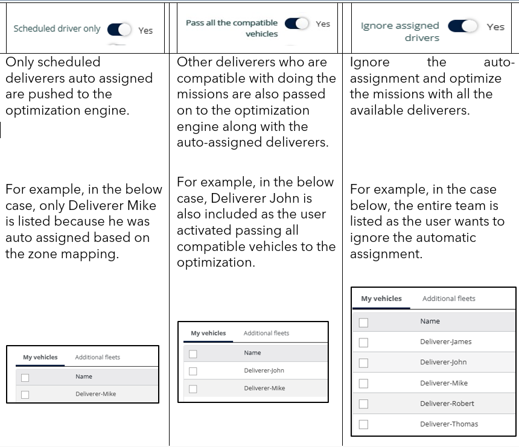

# Missions

### 1.1. Set missions display (prefilter)

From the Missions page:

1. Click the **"Prefiltered On"** button at the top left.\
   The display of this section may vary based on screen resolution.
2. Choose your filters:
   * **Agency**: Select one or more agencies.
   * **Reference**: Filter by creation date or modification date.
   * **Period**: Choose from options like the last hour, last 24 hours, last 7 days, or set a custom date range.
   * **Display Deleted Missions**: Enable this option to include deleted missions.
3. Click **Apply**.

 (1).png>)

4. The filtered missions will be displayed on your Missions page.

 (1).png>)

### 1.2. Pre-filters

The Pre-filters on the Missions Page are dynamic sections that provide users with detailed and contextual information based on their current selection or interaction. These pre-filters enhance navigation and productivity by allowing quick access to relevant data without switching screens.

 (1).png>)

### 1.3. Default Delivery statuses

Below are an overview of the various mission statuses and their significance:

<table data-header-hidden><thead><tr><th valign="top"></th><th valign="top"></th></tr></thead><tbody><tr><td valign="top">Status</td><td valign="top">Description</td></tr><tr><td valign="top">Waiting</td><td valign="top">The mission is expected but not yet received</td></tr><tr><td valign="top">Received</td><td valign="top">The mission has been successfully received</td></tr><tr><td valign="top">To be Delivered</td><td valign="top">The mission is prepared for delivery</td></tr><tr><td valign="top">To be Loaded</td><td valign="top">The mission is waiting to be loaded.</td></tr><tr><td valign="top">Loaded</td><td valign="top">The package is now loaded and in transit</td></tr><tr><td valign="top">To be Picked up</td><td valign="top">Mission is scheduled and awaiting pick up</td></tr><tr><td valign="top">Picked up</td><td valign="top">Item has been collected from the origin</td></tr><tr><td valign="top">Delivered</td><td valign="top">The delivery is completed successfully.</td></tr><tr><td valign="top">Not Received</td><td valign="top">Indicates a mission was expected but couldn’t be received</td></tr><tr><td valign="top">Not Loaded</td><td valign="top">The mission couldn’t be loaded as expected</td></tr><tr><td valign="top">Not Picked up</td><td valign="top">Scheduled pickup was missed or failed.</td></tr><tr><td valign="top">Not Delivered</td><td valign="top">The delivery failed</td></tr><tr><td valign="top">Visited</td><td valign="top">Destination has been successfully visited</td></tr><tr><td valign="top">To be Visited</td><td valign="top">Destination is scheduled for a visit.</td></tr><tr><td valign="top">Not Visited</td><td valign="top">The scheduled visit was missed or unsuccessful.</td></tr></tbody></table>

 (1).png>)

###

####

####

### 1.11. Manage Document Library

###

###

####

### 2. Manage Missions

### 2.1. Mission Creation Configuration

### 2.5. Manage Urgent Missions

### 2.6. 2.8.2. Map the addresses fields from the global address list

The Global Address List now offers enhanced control over how addresses are managed and accessed in Nomadia Delivery. It is no longer restricted to contractors and is now available directly from the Configuration module. Addresses added to the Global Address List are visible and usable by all Nomadia Delivery users, regardless of contractor.

To use addresses from the Global Address List, follow the steps below:

1. Open the Nomadia Delivery application and go to the Configuration tab.

<figure><figcaption></figcaption></figure>

2. Select Address List from the menu.

<figure><figcaption></figcaption></figure>

3. Create a new address or import addresses from an Excel file.

<figure><figcaption></figcaption></figure>

Once the address list is created, navigate to the Mission page.

<figure><figcaption></figcaption></figure>

4. From the mission table, select Actions → Add (Beta).

<figure><figcaption></figcaption></figure>

5. Select an agency from the dropdown list.

<figure><figcaption></figcaption></figure>

Click Next

<figure><figcaption></figcaption></figure>

6. In the address picker (pickup/delivery), enter an address from the Address List.

<figure><figcaption></figcaption></figure>

* The autocomplete suggests addresses from the Global Address List.
* If a contractor is selected during mission creation, the autocomplete combines contractor addresses and Global Address List entries into a single dropdown.

<figure><figcaption></figcaption></figure>

* Items in the dropdown are distinguished by an icon and tooltip, indicating whether they come from the Global Address List or the contractor’s address list.

<figure><figcaption></figcaption></figure>

This ensures a seamless and unified experience when entering mission addresses.

### 2.9. Improve the Missions addresses geocoding

### 2.9.1. Correct geocoding with a new address

From the Missions page

1. Click Actions.
2. Select Import from the dropdown menu.
3. Click Browse (Excel).
4. Disable the Pickup address field
5. Select the Latitude and Longitude from the location indicators
6. Click on Validate
7. Update the New address in the new address field

<figure><figcaption></figcaption></figure>

#### 2.9.2. Select Missions from the map

From the Map view.

1. Use the Selection button to choose the selection method (e.g., Polygon, Circle).

<figure><figcaption></figcaption></figure>

2. Draw/select the region to highlight missions.

<figure><figcaption></figcaption></figure>

3. Selected missions will appear in the table view on the left panel.

<figure><figcaption></figcaption></figure>

##

### 2.10. Manage Missions Table

#### 2.10.1. Customize the Table Display

1. Click on the Table action menu
2. Click on Customize List.

<figure><figcaption></figcaption></figure>

3. Select the desired fields from the Available Fields list and click the arrow icon to move them to the Display Fields section.
4. Click on Save

<figure><figcaption></figcaption></figure>

The selected fields will be displayed on the table

#### 2.10.2. Sort the Table

1. Click on the column header (e.g., Last Name).
2. Select Ascending or Descending order.
3. The table reorders based on the selection.

<figure><figcaption></figcaption></figure>

#### 2.10.3. Filter Table using Mission statuses shortcuts

1. Click on the Mission Status dropdown or shortcut button.
2. Choose the desired status like Waiting, Picked Up, etc.
3. The table will refresh and show only matching entries.

<figure><figcaption></figcaption></figure>

#### Filter the Table using criteria

1.

#### 2.10.6. Create a Filter

1. Click on the Filter input field.
2. Select the appropriate condition from the suggestions.
3. Click the Load saved filter icon
4. Enter the Appropriate name in the input field
5. Click on Save

<figure><figcaption></figcaption></figure>

#### 2.10.7. Pin a Filter

1. Click Load saved filters icon.
2. Click on the pin icon of the filter to pin.

<figure><figcaption></figcaption></figure>

#### 2.10.8. Delete a Filter

1. Click on the Filter input field.
2. Select the appropriate condition from the suggestions.
3. Click the filter option.
4. Click the "Delete" icon to delete the selected status

<figure><figcaption></figcaption></figure>

####

### 2.11. View a Mission information

1. Click the Pen icon corresponding to the desired mission.
2.  A details panel will open showing information such as:

    * Pickup details
    * Delivery location
    * Parcel barcode and contents
    * Contact information, etc.

    <figure><figcaption></figcaption></figure>

### 2.14. Duplicating Missions with Quantities

This guide explains how contractors and transporters can duplicate missions with quantities in Nomadia Delivery. The feature simplifies the handling of multiple items, enhancing both efficiency and accuracy in mission management.

Steps to duplicate missions with quantities:

1. Open the Nomadia Delivery application and go to the Missions tab.

<figure><figcaption></figcaption></figure>

2. In the Mission table, click the Actions drop-down menu and select Add.

<figure><figcaption></figcaption></figure>

3. In the mission wizard, complete the mandatory fields according to the mission type (e.g., agency, pickup address, delivery address, etc.).

<figure><figcaption></figcaption></figure>

4. Under the Parcel section, enter parcel details such as length, width, height, weight, volume, and solver constraints.

<figure><figcaption></figcaption></figure>

5. To add a new parcel with different values, click the “+” symbol.

<figure><figcaption></figcaption></figure>

6. To duplicate an existing parcel with the same details, click the Copy icon.

<figure><figcaption></figcaption></figure>

7. If you mistakenly add a parcel, click the Delete icon to remove it.

<figure><figcaption></figcaption></figure>

8. After finalizing the parcels to be duplicated, click Add to generate the required number of missions.

<figure><figcaption></figcaption></figure>

9. The duplicated missions will now appear in the mission table.

<figure><figcaption></figcaption></figure>

###

### 2.18. Auto-Assign Missions to Deliverers

The auto-assignment feature in Nomadia Delivery simplifies dispatching by automatically assigning missions to the right deliverers and vehicles based on predefined spatial or postal zones. This reduces manual effort, minimizes administrative workload, and improves efficiency, particularly in high-volume operations.

Prerequisite: To use automatic mission assignments, you must have a postal code zone or a spatial zone configured in advance. For step-by-step guidance, refer to the Zone Creation by Automatic Sectorization guide.

Follow the steps below to link zones with users and vehicles:

1. Open the Nomadia Delivery application and go to the Configuration tab.
2. From the drop-down, select Manage users.

Note: Zones can only be associated with users who have mobile access.

3. Click the Pencil icon next to the desired mobile user.

<figure><figcaption></figcaption></figure>

4. Users with mobile access will see an additional tab for configuring zone rights. Click Agencies and zones to set up zone assignments.
5. Move the available zones of the associated agencies to the right-hand panel to assign them to the user.

<figure><figcaption></figcaption></figure>

6. After adjusting the zone settings, click Save to confirm the changes.

<figure><figcaption></figcaption></figure>

If the user is linked to a vehicle, all zone settings will automatically synchronize with that vehicle.

<figure><figcaption></figcaption></figure>

Nomadia Delivery also allows users and vehicles to be assigned to different zones in exceptional cases, such as sick leave or sudden unavailability. In such scenarios, a synchronization error will appear in the vehicle’s General section.

<figure><figcaption></figcaption></figure>

Once users and vehicles are properly synchronized with their zone settings, missions are automatically assigned based on spatial alignment. If a mission’s pickup or delivery location falls within a configured zone, the corresponding user or vehicle linked to that zone is automatically assigned, and the Scheduled Deliverer field is updated.

<figure><figcaption></figcaption></figure>

If multiple users share the same zone, the system assigns the mission to the first user.

<figure><figcaption></figcaption></figure>

During optimization, the planner has three options:

* Use only the auto-assigned scheduled deliverer.
* Allow all compatible vehicles to be considered for optimization.
* Ignore the auto-assigned deliverers.

<figure><figcaption></figcaption></figure>

### 2.20. Bulk Edit Mission Data

#### 2.20.1. Create Bulk Edit Configuration

Bulk editing mission data enables large-scale updates to mission information, reducing manual effort and saving time by avoiding repetitive tasks.

To edit mission data in bulk, follow the steps below.

1. Open the Nomadia Delivery application and go to the Configuration tab.

<figure><figcaption></figcaption></figure>

2. From the main header, click the Missions page.

<figure><figcaption></figcaption></figure>

3. Choose the missions you’re interested in from the mission table.

<figure><figcaption></figcaption></figure>

4. Enter a name for the bulk edit configuration in the Bulk Edit pop-up.

<figure><figcaption></figcaption></figure>

5. Select the fields to be enabled for bulk editing and use the arrow button to move them to the right-hand side.

<figure><figcaption></figcaption></figure>

6. Repeat the same steps for the custom fields in the Bulk Edit pop-up.

<figure><figcaption></figcaption></figure>

7. Click the ‘Save’ button to save the bulk edit configuration.

<figure><figcaption></figcaption></figure>

After the configuration is saved, a notification message is displayed.

<figure><figcaption></figcaption></figure>

#### 2.20.2. Bulk Edit Mission Data

1. The Bulk Edit pop-up displays the number of selected missions.
2. The Bulk Edit pop-up displays the list of fields selected during configuration.
3. Choose the required values for the listed mission fields.&#x20;

<figure><figcaption></figcaption></figure>

4. Click on Save

<figure><figcaption></figcaption></figure>

All selected missions are updated simultaneously with the values chosen in the Bulk Edit pop-up.

<figure><figcaption></figcaption></figure>

This feature improves efficiency while maintaining control and data integrity across teams.

