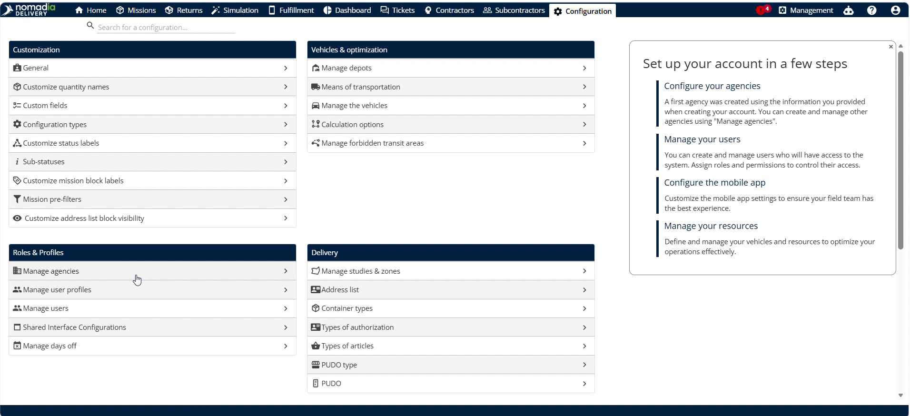
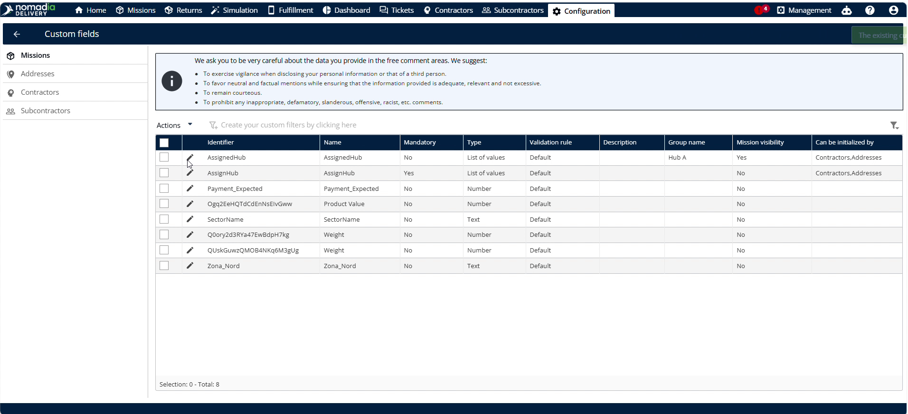
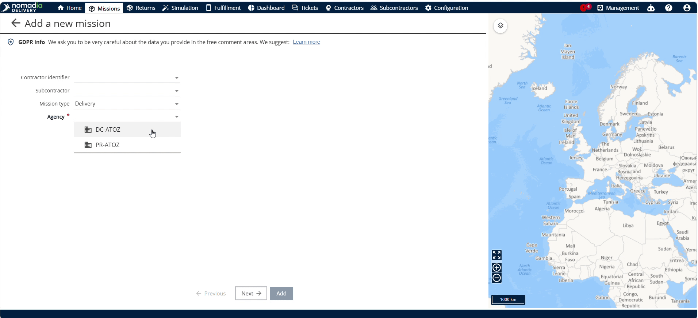
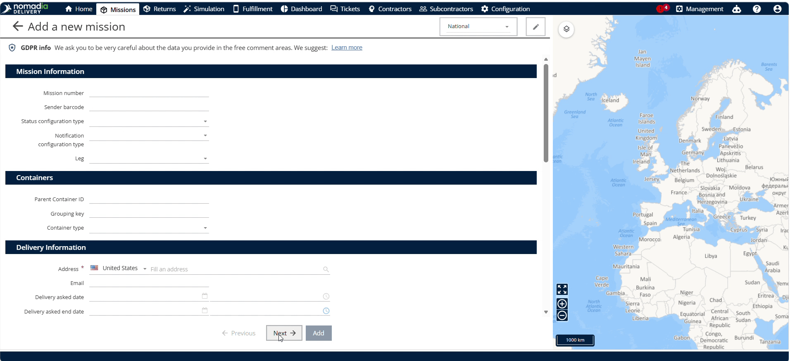
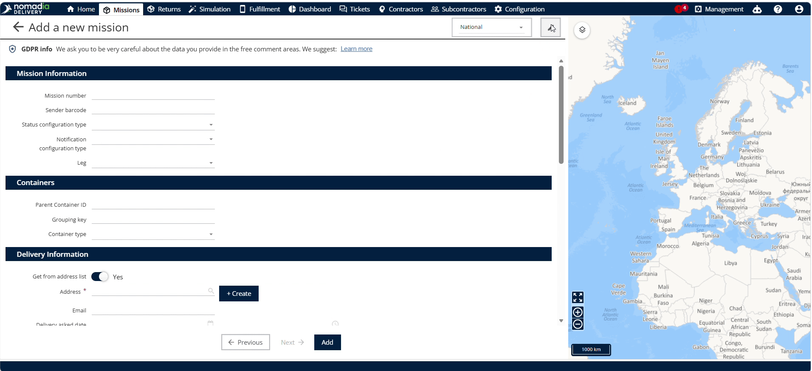
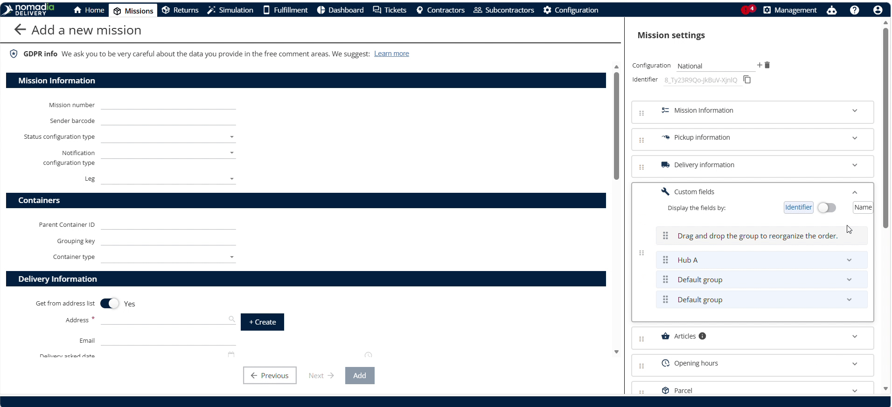

# Customize the Validation of Mission form fields

Customizing mandatory validation enforces required data entries on mission form fields in **Nomadia Delivery**. Dispatchers require mandatory fields to prevent incomplete mission form submissions during daily operations. Configure mandatory fields to ensure accurate field reporting and complete data compliance.

#### Getting Started

Administrative requirements and setup steps:

* Administrative access to **Nomadia Delivery** configuration settings.
* Active machine form profile with field identifiers.

Initial setup steps:

1. Select **Configuration** from the main menu.

2. Click **Custom fields** to manage form fields.

#### Feature Overview

Key user interface elements:

* **Configuration**: Opens global system preferences and customization options.
* **Custom fields**: Displays customizable form fields for missions profiles.
* **Identifier**: Represents a specific mission field selected for validation settings.
* **Mandatory**: Toggles required validation status to force data input before saving.
* **Assign Help**: Defines mandatory field assistance guidelines for field operators.
* **Missions**: Displays the fleet machinery database to test updated field validations.

#### How To: Configure Mandatory Validation Rules

Configure mandatory validation for machine form fields:

1. Click **Configuration**.

2. Click **Custom fields**.

3. Select any **Identifier**.

4. Toggle **Mandatory** to enable mandatory field validation.

5. Click **Save**.

6. Select **Assign Hub** and make it mandatory.

7. Click **Save**.

#### How To: Apply Validation to Mission Records

Apply mandatory validation rules when editing machine profiles:

1. Navigate to **Missions**.

2. Click **Actions**.

3. Click **Add**.
4. Click **Agency**.

5. Click **Next**.

6. Select **Edit**.

7. Click **Custom fields** and check if the Hub A is Mandatory.

**Troubleshooting**

Troubleshoot form submission errors:

* **Cannot Save Mission Entry**: Unselected mandatory fields block submission. Select **Assign Hub** before saving.

#### Productivity Tips

Best practices and operational warnings:

* 💡 **Automatic Mandatory Updates**: Toggle mandatory field validation to update mandatory rules across mission forms instantly.
* ⚠️ **Unselected Mandatory Fields**: Do not leave mandatory fields unselected, or the system prevents saving the mission entry.
