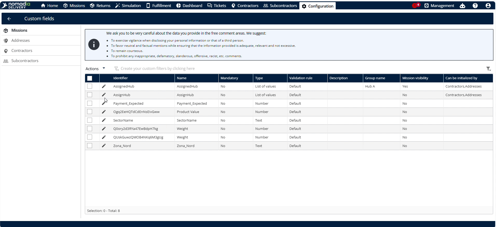
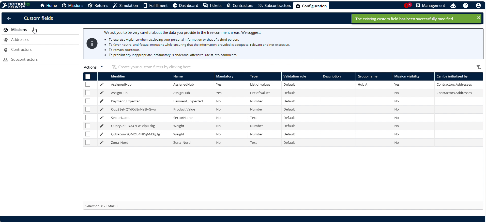
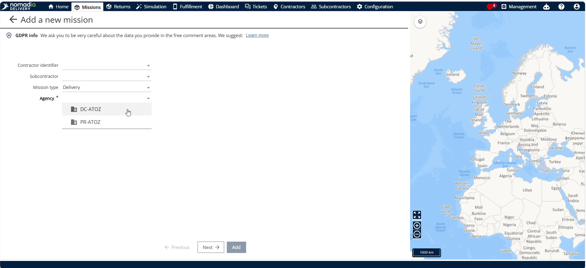

# Customize the validation of mission form fields

Customizing mandatory validation enforces required data entries on mission form fields in **Nomadia Delivery**. Dispatchers require mandatory fields to prevent incomplete mission form submissions during daily operations. Configure mandatory fields to ensure accurate field reporting and complete data compliance.

#### Getting started

Administrative requirements and setup steps:

* Administrative access to **Nomadia Delivery** configuration settings.
* Active mission form profile with field identifiers.

Initial setup steps:

1. Select **Configuration** from the main menu.

2. Click **Custom fields** to manage form fields.

#### Feature overview

Key user interface elements:

* **Configuration**: Opens global system preferences and customization options.
* **Custom fields**: Displays customizable form fields for missions profiles.
* **Identifier**: Represents a specific mission field selected for validation settings.
* **Mandatory**: Toggles required validation status to force data input before saving.
* **Assign Help**: Defines mandatory field assistance guidelines for field operators.
* **Missions**: Displays the mission database to test updated field validations.

#### Configure mandatory validation rules

Configure mandatory validation for mission form fields:

1. Click **Configuration**.

2. Click **Custom fields**.

3. Select any **Identifier**.

4. Toggle **Mandatory** to enable mandatory field validation.

5. Click **Save**.

6. Select **Assign Hub** and make it mandatory.

7. Click **Save**.

#### Apply validation to mission records

Apply mandatory validation rules when editing mission profiles:

1. Navigate to **Missions**.

2. Click **Actions**.

3. Click **Add**.
4. Click **Agency**.

5. Click **Next**.

6. Select **Edit**.

7. Click **Custom fields** and check if the Hub A is Mandatory.

**Troubleshooting**

Troubleshoot form submission errors:

* **Cannot Save Mission Entry**: Unselected mandatory fields block submission. Select **Assign Hub** before saving.

#### Productivity tips

Best practices and operational warnings:


**Automatic Mandatory Updates**: Toggle mandatory field validation to update mandatory rules across mission forms instantly.



**Unselected Mandatory Fields**: Do not leave mandatory fields unselected, or the system prevents saving the mission entry.

