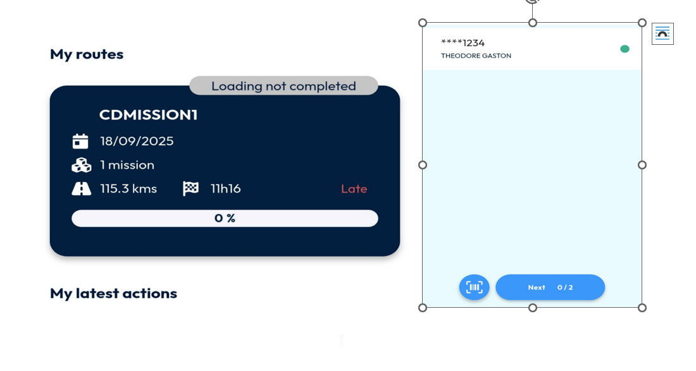

# Cross Docking Missions

Cross-docking missions are a newly introduced feature in Nomadia Delivery aimed at improving efficiency and ensuring full traceability across both mid-mile and last mile logistics. The same mission ID (Barcode) is maintained throughout the process, allowing transporters to seamlessly manage parcel movements from the point of pickup to final delivery.

**A cross-docking mission is divided into two main legs:**

**Leg 1 – Mid-Mile Pickup Tour**

* Plan the Pickup Tour: Organize and assign missions for the pickup route, starting from the agency.
* Collect Parcels: Deliverers pick up parcels directly from the contractor’s warehouse or designated location.
* Return to Agency: All collected parcels are brought back to the agency for sorting and processing.

**Leg 2 – Last-Mile Delivery Tour**

* Plan the Delivery Tour: After parcels are sorted at the agency, prepare and assign the final delivery route.
* Load for Delivery: Deliverers collect the sorted parcels from the agency.
* Deliver to Customers: Parcels are delivered to end recipients, with the same mission ID (Barcode) ensuring consistent tracking and traceability.

To set up a cross-docking mission, proceed with the following steps.

1. Open the Nomadia Delivery application and go to the Missions tab.

<figure><figcaption></figcaption></figure>

2. Click the Actions menu and select Add.

<figure><figcaption></figcaption></figure>

3. In the Mission type drop-down, select Cross-docking to create a cross-docking mission.

<figure><figcaption></figcaption></figure>

4. From the Contractor identifier drop-down, choose the contractor linked to the cross-docking mission.

Note: For cross-docking missions, if the contractor is mapped, their registered address will automatically be used as the default pickup address for Leg 1 | Mid-Mile Pickup Tour. This address is retrieved from the contractor configuration.

<figure><figcaption></figcaption></figure>

5. Select the Agency from which deliverers will start for the Leg 1 | Mid-Mile Pickup Tour.

<figure><figcaption></figcaption></figure>

6. Click Next to continue.

<figure><figcaption></figcaption></figure>

7. By default, the contractor’s address will be used as the pickup address. If required, you can select a different pickup address for Leg 1 | Mid-Mile Pickup Tour by clicking the Edit button next to the address field.

<figure><figcaption></figcaption></figure>

8. Enter the delivery address of the end customer in the address section to complete the cross- docking mission setup.

<figure><figcaption></figcaption></figure>

9. Click Add to create the cross-docking mission.

<figure><figcaption></figcaption></figure>

A new mission of type Cross-docking will now be added to the delivery management system.

<figure><figcaption></figcaption></figure>

**To create a cross-docking mission Leg1 | Mid-Mile Pickup Tour, follow these steps**

1. Select the created mission, open the Actions menu, and choose Assign. Assign the mission to a deliverer.

<figure><figcaption></figcaption></figure>

2. Provide a name for the route, select the deliverer, and specify the date and time for the pickup mission – Leg 1 | Mid-Mile Pickup Tour. Click OK to create the tour.

<figure><figcaption></figcaption></figure>

3. The Leg 1 | Mid-Mile Pickup Tour route will now be created in the delivery management system and will be ready for publishing to the deliverer’s mobile app.

<figure><figcaption></figcaption></figure>

4. Open the Actions menu again and select Publish on mobile app.

<figure><figcaption></figcaption></figure>

5. Click OK to confirm and push the tour details to the mobile app.

<figure><figcaption></figcaption></figure>

6. The Leg 1 | Mid-Mile Pickup Tour will now be available on the deliverer’s mobile app.

<figure><figcaption></figcaption></figure>

7. The deliverer must perform the pickup in real time to complete the Leg 1 | Mid-Mile Pickup Tour.

<figure><figcaption></figcaption></figure>

8. Once completed, the confirmation of the tour will be displayed in the Gantt chart with a green tick mark.

<figure><figcaption></figcaption></figure>

9. Missions for Leg 2 | Last-Mile Delivery Tour can only be planned once the goods are returned to the depot.

<figure><figcaption></figcaption></figure>

To create a cross-docking mission, follow these steps:

1. Select the Returned to Depot mission, open the Actions menu, and choose Assign. Assign the mission to a deliverer.

<figure><figcaption></figcaption></figure>

2. Enter a name for the route, select the deliverer, and set the date and time for the delivery mission – Leg 2 | Last-Mile Delivery Tour. Click OK to create the tour.

<figure><figcaption></figcaption></figure>

3. The Leg 2 | Last-Mile Delivery Tour route will now be created in the delivery management system and will be ready for publishing to the deliverer’s mobile app.

<figure><figcaption></figcaption></figure>

4. From the Actions menu, select Publish on mobile app.

<figure><figcaption></figcaption></figure>

5. Click OK to confirm and push the tour details to the mobile app.

<figure><figcaption></figcaption></figure>

6. The Leg 2 | Last-Mile Delivery Tour will now be published to the deliverer’s mobile app.&#x20;

<figure><figcaption></figcaption></figure>

7. The deliverer must carry out the deliveries in real time to complete the Leg 2 | Last-Mile Delivery Tour.

<figure><figcaption></figcaption></figure>

8. Once completed, the tour confirmation will be displayed in the Gantt chart with a green tick mark.

<figure><figcaption></figcaption></figure>
