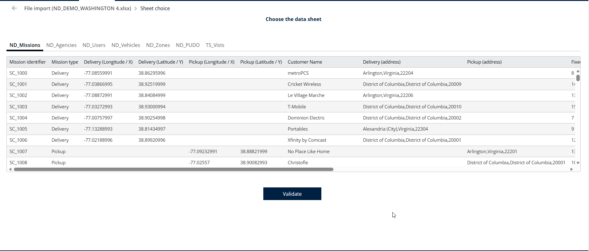
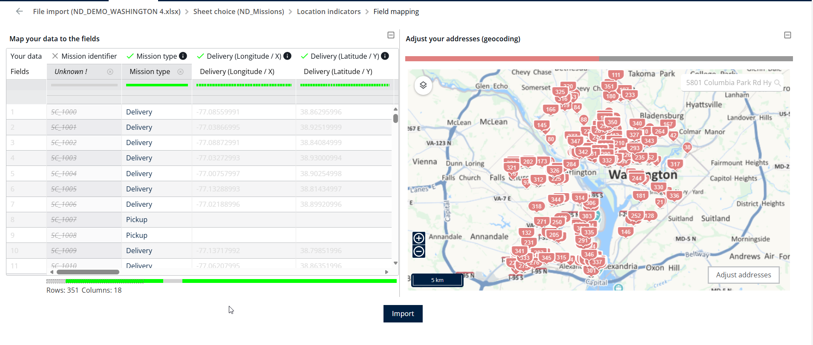
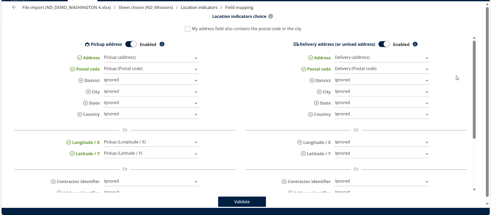
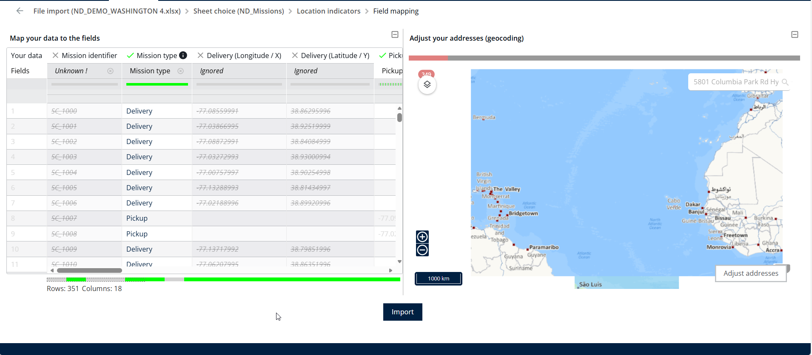

# Import Missions

From the Missions page

1. Click **Actions**.
2. Select **Import** from the dropdown menu.

<figure><figcaption></figcaption></figure>

3. Click **Browse (Excel)**.

<figure><figcaption></figcaption></figure>

4. Choose the **Desired Excel file** from your local system to upload and import it.

<figure><figcaption></figcaption></figure>

5. The preview of the available Excel sheets is displayed. Select the required dataset and click **Validate**.

<figure><figcaption></figcaption></figure>

6. A preview of the data is displayed in both the table view and the map view.

<figure><figcaption></figcaption></figure>

7. Map either the address field or the latitude and longitude fields for the mission locations.

<figure><figcaption></figcaption></figure>

8. Click Import

<figure><figcaption></figcaption></figure>

8. Missions will be imported successfully.

<figure><figcaption></figcaption></figure>
