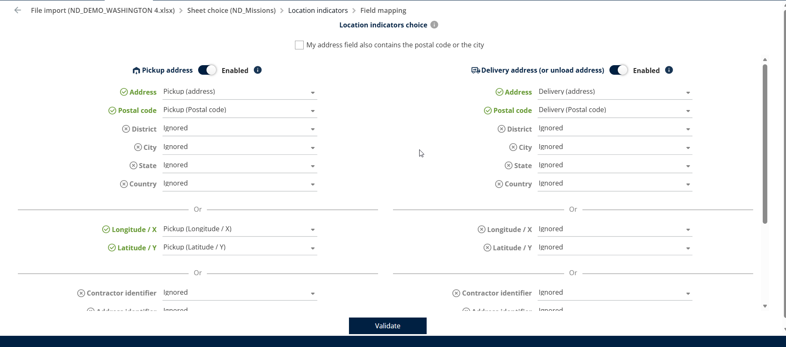
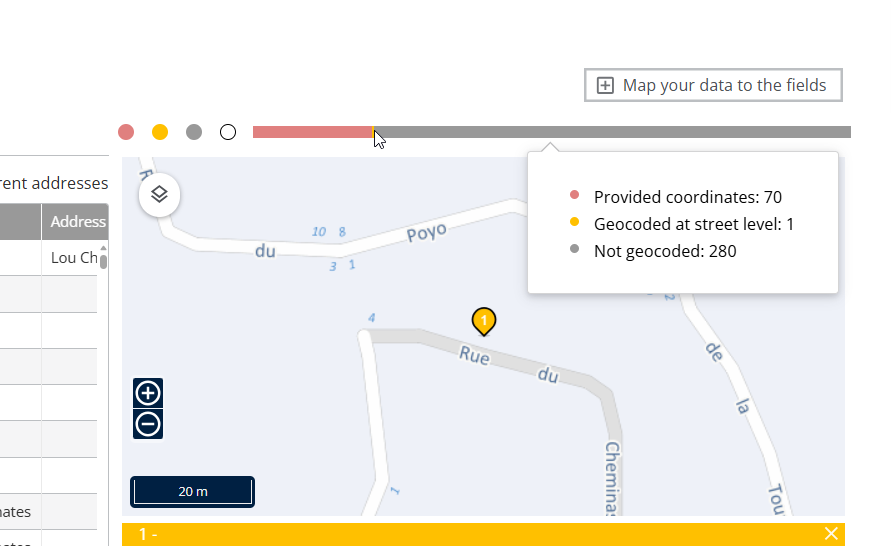
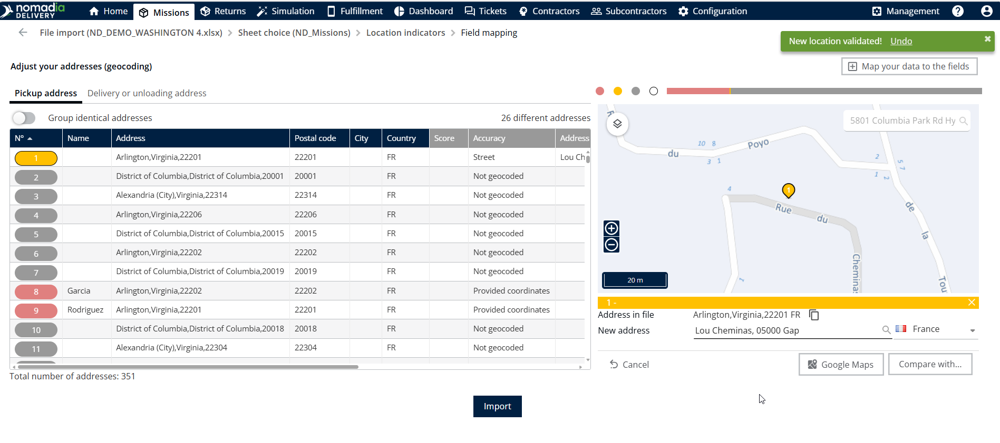

# Improve the Missions addresses geocoding

This process is applicable only when the pickup address or delivery address is selected for importing the location indicators instead of mapping the latitude and longitude fields.

1. Select the **Pickup Address** or **Delivery Address** in the location indicator mapping section.
2. Click **Validate** to process the selected address fields.

<figure><figcaption></figcaption></figure>

3. Nomadia Delivery automatically geocodes the selected addresses during the validation process.
4. The generated latitude and longitude values are used as the mission location coordinates.
5. The **Geocoding Status** bar displays the missions that have been geocoded at different geocoding levels.

<figure><figcaption></figcaption></figure>

6. If some mission addresses are not geocoded correctly, click **Adjust Address** at the bottom of the map.
7. Select either the **city-level Geocoded Missions** or **Non-geocoded Missions**.
8. Enter the updated address in the **New Address** field.
9. The updated location is displayed on the map, and a confirmation popup stating **New location validated** is displayed.
10. Once the address validation is completed, click **Import** to import the missions.

<figure><figcaption></figcaption></figure>

