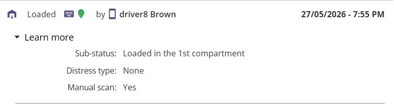

# Mission Logs

The **Mission Log** provides a complete audit trail of all activities performed during the lifecycle of a mission. It records key events such as parcel loading, delivery completion, status changes, signatures, photos, timestamps, and user actions. This information helps supervisors and drivers track mission progress and verify delivery operations.

### Accessing the Mission Log

1. Open the required mission from the mission list.
2. Navigate to the **Mission Details** screen.
3. Scroll to the **Mission Log** section.
4. Review the chronological list of events associated with the mission.

### Viewing Mission Log Events

Each log entry displays important information, including:

* Event status (e.g., Loaded, Delivered, Failed Delivery)
* Date and time of the event
* User or driver who performed the action
* Sub-status details
* Distress information (if applicable)
* Manual scan indicator
* Additional proof of execution data

<figure><figcaption></figcaption></figure>

### Expanding Event Details

Select **Learn more** to view additional information for a specific mission event.

The expanded view may include:

* Sub-status information
* Distress type
* Distance from delivery location
* Manual scan status
* Additional operational details

<figure><figcaption></figcaption></figure>

### Viewing Delivery Proof

For completed deliveries, the Mission Log stores proof of execution information that can be reviewed at any time.

The proof of delivery may include:

* Customer signature
* Driver or worker signature
* Delivery photographs

<figure><figcaption></figcaption></figure>

### Understanding Mission Log Information

| Field                  | Description                                                                 |
| ---------------------- | --------------------------------------------------------------------------- |
| Status                 | Current mission event status.                                               |
| Sub-status             | Additional information related to the status.                               |
| Date & Time            | When the event occurred.                                                    |
| User                   | Driver or user who performed the action.                                    |
| Distress Type          | Indicates any issue reported during execution.                              |
| Manual Scan            | Shows whether the parcel was scanned manually.                              |
| Distance from Delivery | Distance recorded between the delivery location and the confirmation point. |
| Signature              | Customer confirmation signature.                                            |
| Worker Signature       | Driver or worker acknowledgment signature.                                  |
| Picture                | Photo evidence captured during delivery.                                    |

### Key Benefits

* Provides a complete history of mission activities.
* Improves delivery traceability and accountability.
* Stores proof of delivery for verification purposes.
* Helps investigate delivery issues and exceptions.
* Supports operational auditing and reporting.

**Note:** The information displayed in the Mission Log depends on the actions performed during mission execution and the proof-of-delivery requirements configured for your organization.
