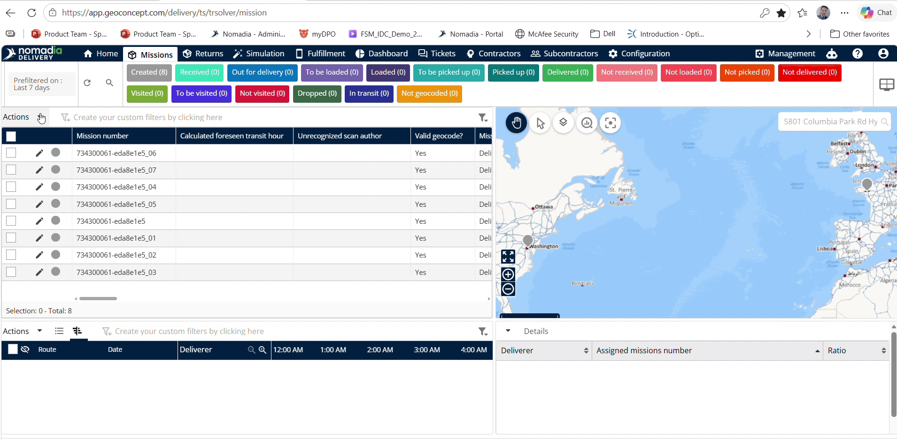
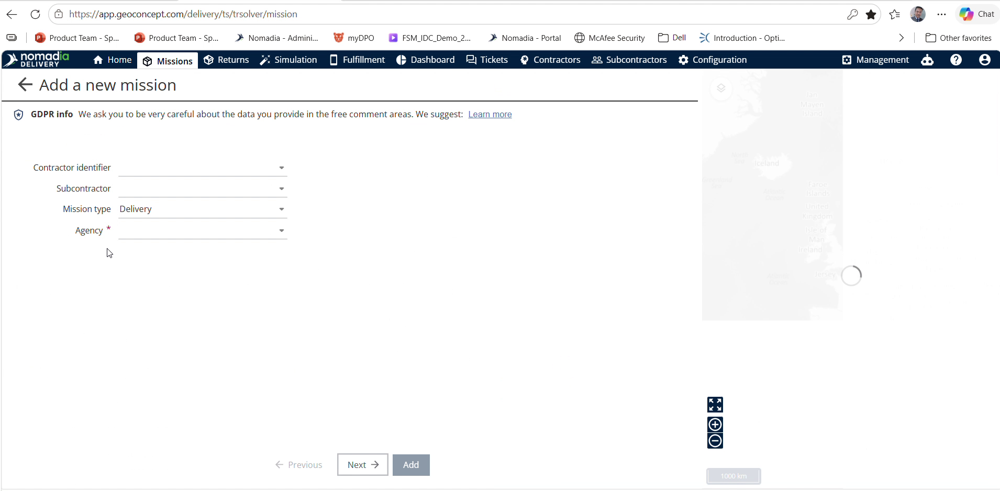
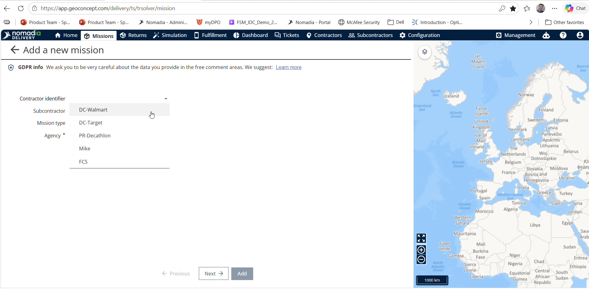
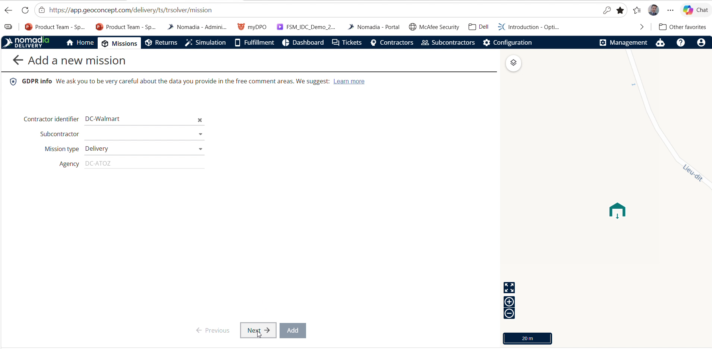
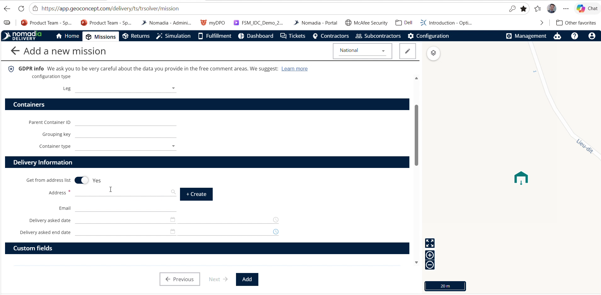
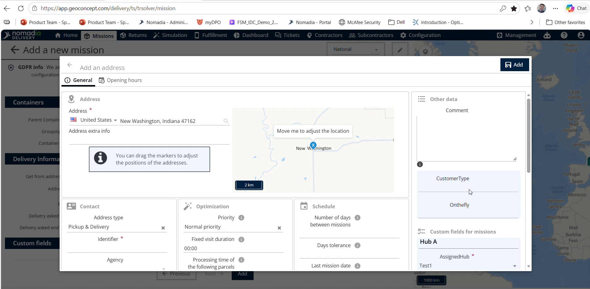
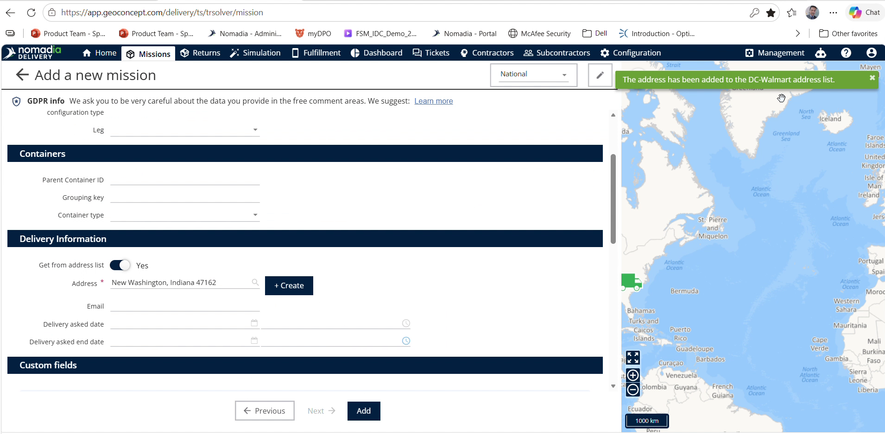

# adhocaddresscreation
# adhocaddresscreation

Create and save a new address on the fly while adding a machine in Nomadia Delivery. This eliminates pre-configuring location data beforehand, saving setup time for dispatchers. Assign new addresses directly to specific contracts or store them in the global address list.

### Getting Started

- Access to **Nomadia Delivery** with dispatcher permissions.
- Valid **Machine Type**, **Contract**, and **Agency** details.

1. Navigate to the **Machine** menu in **Nomadia Delivery**.

2. Click **Actions** and select **Add**.

### Feature Overview

- **Contract Field**: Selects the associated contract test for the address. If left blank, the address saves to the global address list.

- **Machine Type Field**: Specifies the machine category during setup. Ensures correct asset classification.

- **Agency Field**: Defines the assigned agency for the machine and address record. Ensures proper organizational routing.

- **Next Button**: Advances from initial details to the address configuration form. Moves the workflow forward.

- **Create Button**: Confirms initial address entry and opens detailed field mapping. Generates the location record.

- **Binded Fields Dropdown**: Maps required location properties and fields to the address record. Ensures data completeness.

- **Add Button**: Finalizes and saves the on-the-fly address to the system. Completes address creation.

- **Contractors Menu**: Accesses contractor profiles and associated address records. Allows verification of saved addresses.

- **Address List Tab**: Displays all saved location addresses for a selected contractor. Provides confirmation of created locations.

### How To: Create an Ad-Hoc Address

1. Navigate to the **Machine** screen and click **Actions**.

2. Select **Add** from the drop-down menu.

3. Select the **Contract** test, **Machine Type**, and **Agency**.

4. Click **Next**.

5. Enter the address information that needs to be saved.

6. Click **Create**.

7. Enter the additional address details.

8. Select the **Binded Fields** options.

9. Click **Add** to complete saving the address.

### How To: Review a Saved Address

1. Click **Contractors** in the main menu.

2. Select the specific contractor from the list.

3. Select the appropriate **Binded Fields**.

4. Click **Address List**.

5. Review the saved address entries.

### Productivity Tips

- 💡 **Global Address Assignment**: Leave the **Contract** selection unselected to automatically save the address to the global address list for company-wide use.
- ⚠️ **Contract Assignment Omission**: Avoid leaving the **Contract** field blank if the address must be restricted to a specific contract.
- 💡 **Saved Address Review**: Navigate through **Contractors** to **Address List** to quickly verify newly created addresses.

