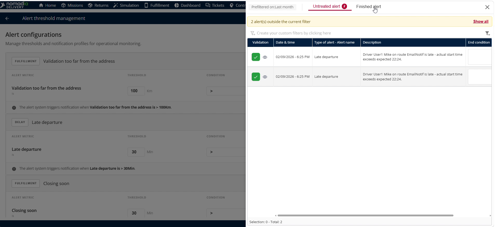
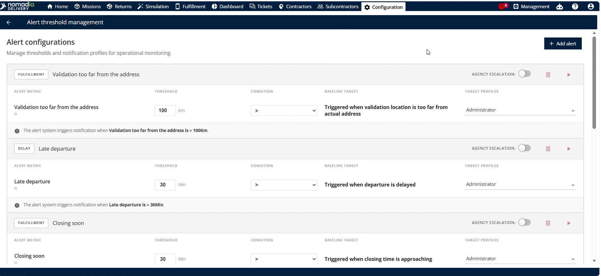
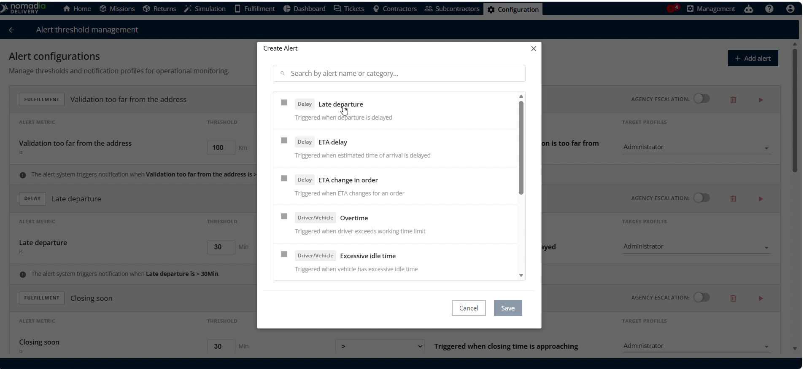
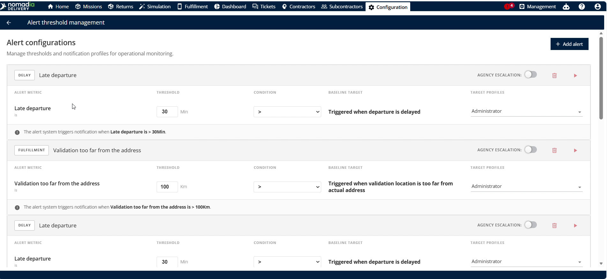
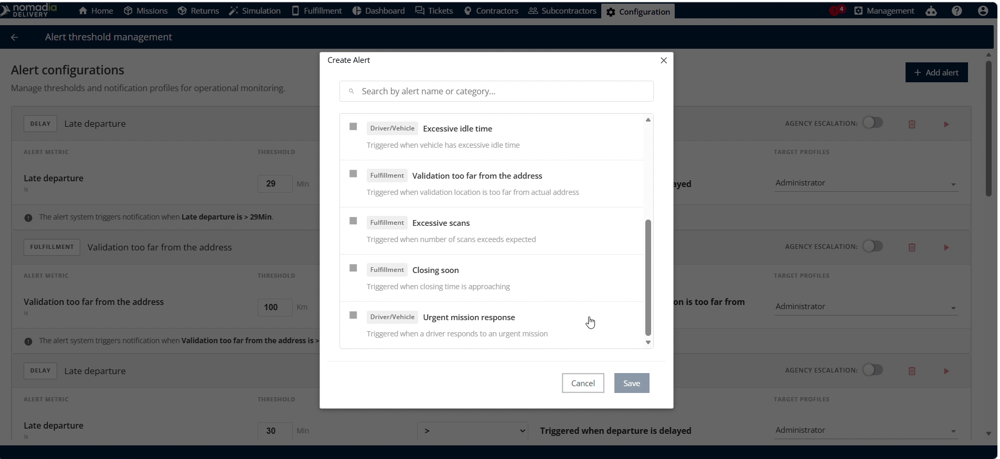

# Alert Management

Alert Threshold Management in **Nomadia Delivery** allows dispatchers to set operational trigger limits. This feature helps planners monitor disruptions like late departures, route delays, and overtime in real time. Configure alert rules to maintain full operational oversight and improve delivery reliability.

#### Getting Started

Prerequisites:

* Active dispatcher account for **Nomadia Delivery**.
* Permissions to access the **Configuration** menu.

Setup Steps:

1. Select **Configuration** in the main navigation menu.

2. Click **Alert Threshold Management** under the route options.

#### Feature Overview

* **Red Icon**: Icon located in the top right corner to access the pre-filter modal.
* **Pre-filter**: Modal menu to select previous search criteria and agency filters.
* **Quantitative Alert**: View that lists active numerical alert thresholds and live alerts.
* **Finished Alert**: View that archives completed and resolved alerts for historical tracking.
* **Add Alert**: Action button that opens the menu to create new alert rules.
* **Time Threshold**: Input box to specify duration limits for triggering alerts.
* **Late Departure**: Alert triggered when vehicle departure is delayed beyond scheduled time.
* **ETA Delay**: Alert triggered when ETA (estimated time of arrival) is delayed.
* **ETA Change**: Alert triggered when the estimated arrival time for an order changes.
* **Overtime**: Alert triggered when vehicle arrival exceeds set working time limits.
* **Excessive Idle Time**: Alert triggered when a vehicle remains stationary for too long.

* **Validation Too Far From Address**: Alert triggered when validation location is too far from actual address.
* **Excessive Scan**: Alert triggered when package scan counts exceed expected limits.
* **Closing Soon**: Alert triggered when destination location closing time is approaching.
* **Urgent Mission Response**: Alert triggered when a driver responds to an RZ machine (driver communication terminal) prompt.

#### How To: Pre-Filter Alerts

1. Click the **Red Icon** in the top right corner of the **Alert Threshold Management** page.
2. Select the previous search criteria from the **Previous** field.
3. Select the target agency from the **Agency** drop-down menu.
4. Click **Apply** to run the pre-filter.

<figure><figcaption></figcaption></figure>

#### How To: View Active and Finished Alerts

1. Review filtered alert details on the **Alert Threshold Management** page.

2. Select **Untreated Alert** to inspect active quantitative thresholds.

3. Select **Finished Alert** to inspect completed operational alerts.

<figure><figcaption></figcaption></figure>

#### How To: Configure a New Alert Threshold

1. Click **Add Alert** on the **Alert Threshold Management** page.

2. Select the desired alert type from the **Multiple Alerts** list.

3. Enter the threshold value in the **Time Threshold** input field.

4. Click **Save** to confirm and activate the new alert threshold.

5. Click **Cancel** to discard changes and close the setup window.

#### Productivity Tips

* 💡 **Agency Pre-Filtering**: Select agency pre-filters to isolate specific operational units and speed up alert searches.
* 💡 **Historical Alert Auditing**: Check the finished alert tab to review historical alert resolutions and evaluate driver performance.
* ⚠️ **Unsaved Configurations**: Avoid navigating away without clicking save when configuring thresholds or changes will be lost.

