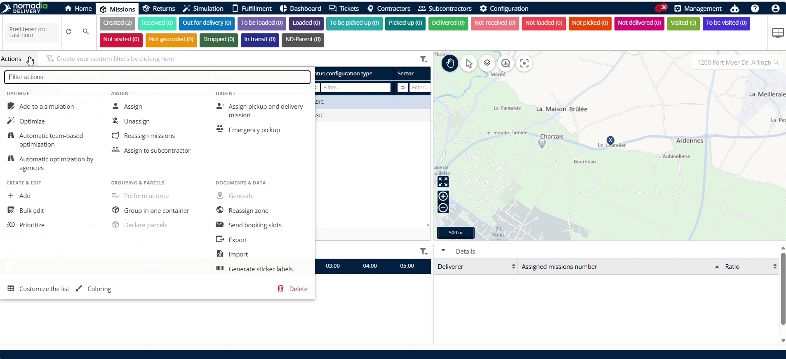
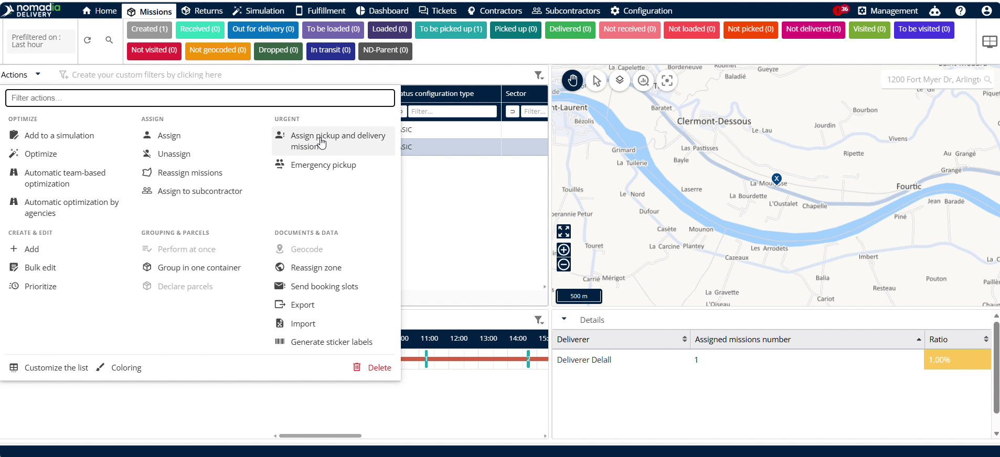

# Assign Pick up and Delivery Missions

The **Assign Pickup and Delivery Missions** feature lets dispatchers assign pickup and delivery routes to drivers and vehicles. You need it to optimize route placement and manage driver assignments in real time. By using this feature, you will achieve faster deliveries and manage driver acceptance timeouts.

#### Getting Started

Prerequisites:

* Assigned driver and vehicle details.
* Driver authorizations for required skills.
* Mobile app accept timeout minutes configured.

Initial setup steps:

1. Navigate to **Configuration**.
2. Click **Configure Mobile App**.
3. Enter minutes in **Accept Timeout Minutes**.
4. Click **Save**.

#### Feature Overview

* **Driver Name and Vehicle Name**: Displays driver identity and vehicle info to track active units.
* **Available Missions**: Lists unassigned missions ready for route assignments.
* **Authorizations**: Indicates driver skills and permissions to ensure task compatibility.
* **Assigned Missions**: Lists missions currently linked to the selected driver.
* **Current Route Kilometer**: Tracks total mileage on the driver active route.
* **Position**: Shows driver location status relative to agency.
* **Assign Optimal**: Adjusts existing unstarted routes to deliver current assignments faster.
* **Assign After Current State**: Inserts task directly after driver current task state.
* **Assign at the End**: Appends task to the end of driver scheduled route.
* **Acceptance Status**: Displays whether driver accepts or denies assigned route.
* **Accept Timeout Minutes**: Sets duration in minutes allowed for driver route decision.

#### How To: Assign Drop Shipping Route

1. Go to **Missions**.
2. Select **Drop shipping machine**.

3. Click **Actions**.
4. Click **Assign pickup and delivery mission**.

5. Click **Assign**.
6. Click **Confirm**.

#### How To: Assign Pickup and Delivery mission Route

1. Go to **Missions**.
2. Select a **Chained Pick and Delivery Mission**
3. Select **Assign pickup and delivery** mission.
4. Click **Actions**.
5. Click **Assign pickup and delivery machine**.

5. Select **Assign Optimal** to modify the existing route.

#### Productivity Tips

* 💡 **Optimal Route Sequencing**: Select **Assign Optimal** to re-sequence unstarted routes and accelerate delivery schedules.
* ⚠️ **Started Route Lock**: Avoid selecting **Assign Optimal** for active drivers who have already started their route because changes will fail.
* 💡 **Driver Response Limits**: Set **Accept Timeout Minutes** to enforce response deadlines for driver route acceptance.
