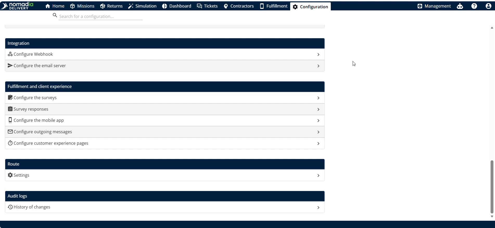
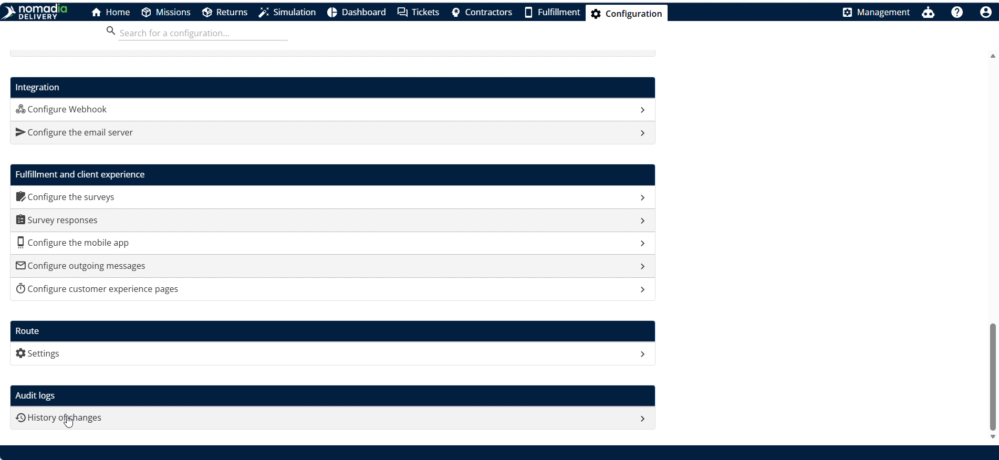
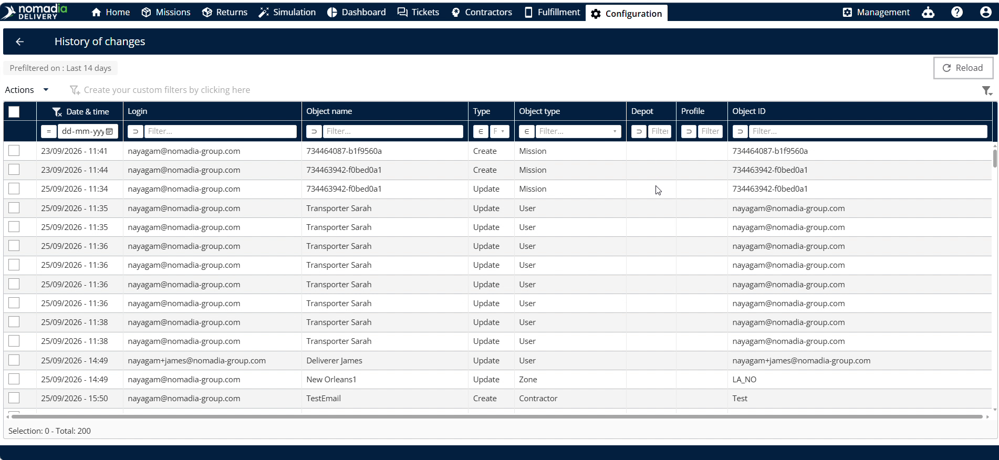
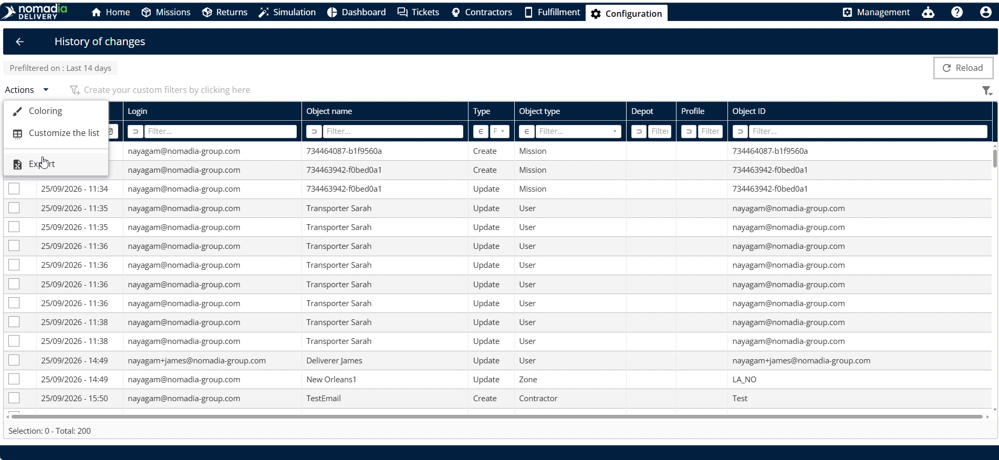
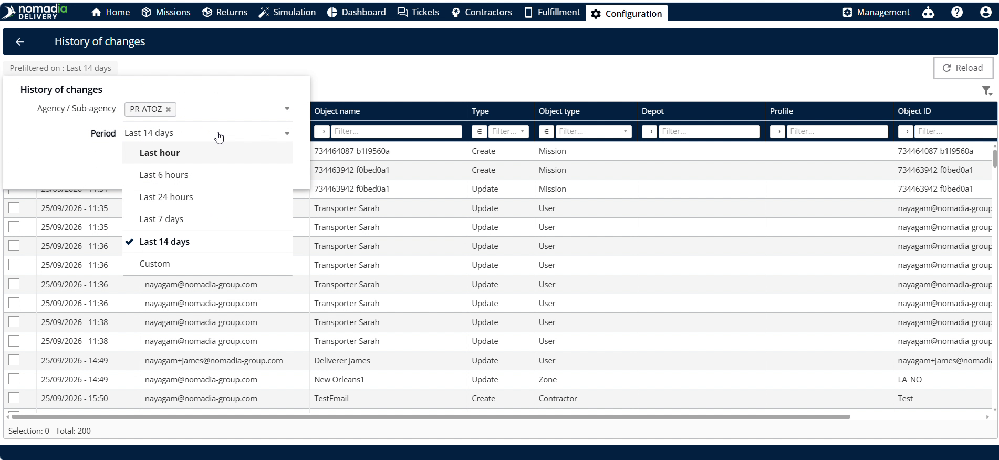
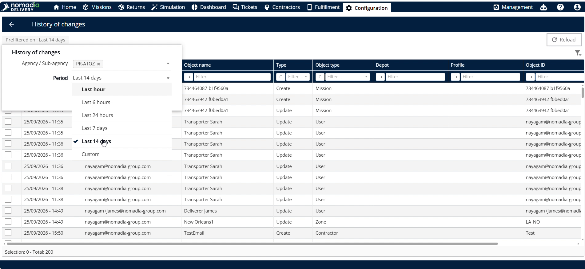

# auditlogs
# auditlogs

The **auditlogs** feature in Nomadia Delivery tracks and records system activity and recent changes made across the platform. Dispatchers and planners need it to maintain operational oversight, verify modifications, and audit configuration actions. Using this tool, you can review change history, filter logs by agent or timeframe, and export records to Excel.

### Getting Started

Prerequisites and system requirements:
- Active access to a **Nomadia Delivery** dispatcher or planner account.
- Permissions to view system **Configuration** and **History of Changes**.

Initial setup steps:
1. Navigate to **Configuration** in the main navigation menu.

   

2. Scroll down and click **History of Changes**.

   

### Feature Overview

- **Date and Time**: Displays the exact timestamp when a change occurred.

  

- **Login Details**: Shows the user account responsible for the modification.

  

- **Object Name**: Identifies the specific item or record changed.

  

- **Type**: Indicates the category of the recorded change.

  

- **Report**: Reflects user-defined reports created or modified in the platform.

  

- **Profile**: Displays the user profile associated with the activity.

  

- **Object ID**: Shows the unique system identifier for the modified item.

  

- **Action**: Allows exporting displayed change records to an Excel file.

  

- **Reload**: Refreshes the log table to display recent changes if loading fails.

  

- **Refilter**: Opens options to filter log entries by agent or time period.

  

### How To: View and Export Audit Logs

1. Navigate to **Configuration** and scroll down to click **History of Changes**.

   

2. Review the table showing **Date and Time**, **Login Details**, **Object Name**, **Type**, **Report**, **Profile**, and **Object ID**.

   

3. Click **Action** above the recent changes table.

   

4. Select export to download the log data into an Excel spreadsheet.

   

#### Troubleshooting

- **Logs or file fail to load**: Click **Reload** to fetch the most recent system changes.

  

### How To: Filter Audit Logs by Agent and Time Period

1. Click **Refilter** on the **History of Changes** screen.

   

2. Select the target agent or agency from the **Agent** dropdown menu.

   

3. Choose a time range under **Period**, such as last hours, twenty-four hours, seven days, or twenty-four days.

   

4. Select **Custom** to set a specific custom date range.

   

### Productivity Tips

- 💡 **Reload Failed Logs**: Click reload whenever log entries fail to load to display recent system changes immediately.
- 💡 **Custom Date Search**: Select the custom period option to isolate specific timeframe windows during audits.
- ⚠️ **Unloaded Data Assumption**: Avoid assuming no changes occurred if the list is blank; click reload to fetch missing logs.

---

💡 Would you like me to turn this user guide into a standalone PDF report or a quick-reference flashcard set for your dispatchers?

