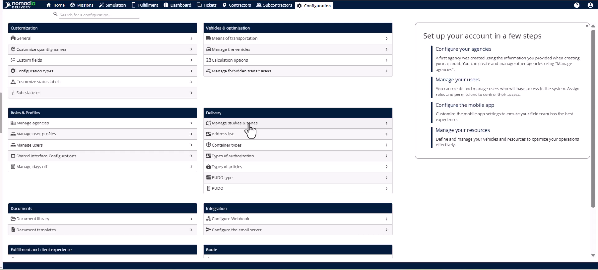

# 01_StudyCreationWithPrimaryZone
# Case Studies

Studies allow you to organize delivery territories and manage seasonal volume changes effectively. You can create multiple studies with specific activation windows to ensure your logistics operations always reflect accurate coverage. By the end of this guide, you will be able to configure a study and map a primary zone for your field teams.

### Getting Started

*   Access to the Nomadia Delivery SaaS application.
*   User permissions for **List of zones**, **Create and update zones**, and **Delete studies**.

1.  Open the **Configuration** module in the application banner.
    
2.  Navigate to the **Manage Users** page.
    
3.  Select and edit a specific user.
4.  Open the **Roles and rights** tab.
    
5.  Enable the rights associated with the **Zone module**.
6.  Click the **Save** button.

### Feature Overview

*   **Study**: A structured object defining the organization of your delivery territories.
    
*   **Primary Zone**: A top-level geographical area tied to postal codes and assigned to a team.
    
*   **Validity Start/End Date**: The fields defining the overall calendar duration for a study.
*   **Actions Menu**: The dropdown used to create, import, or manage studies and zones.
    

### How To: Create a Study

1.  Navigate to the **Configuration** module.
2.  Click **Studies and zones** in the **Delivery** section.
    
3.  Open the **Actions** menu and select **Create empty study**.
    
4.  Enter the **Identifier**, **Name**, and select the **Agency**.
5.  Set the **Validity start date** and **Validity end date**.
6.  Toggle the switch to enable the study.
7.  Select the active **Days in a week**.
8.  Configure specific seasonal **Activation** dates if required.
9.  Click the **Save** button.

### How To: Create a Primary Zone

1.  Open your new study and select the **Zone** tab.
2.  Open the **Actions** menu and select **Add a postal code zone**.
    
3.  Fill in the **Identifier**, **Name**, and **Agency**.
4.  Select the **Country** for the zone.
5.  Set the **Assignment mode** field to **Primary zone**.
    
6.  Enter postal codes manually or use the **Plus** button.
7.  Select the **Import** option for bulk uploads of large postal code lists.
    
8.  Click the **Save** button.
9.  View the rendered polygon on the map on the right.
    

### Productivity Tips

- 💡 **Bulk Upload**: Use the import option to save time when setting up zones across an entire region.
- 💡 **Automatic Mapping**: The platform automatically renders polygons from postal codes, so no manual drawing is required.
- ⚠️ **Assignment Mode**: Always select Primary Zone for top-level areas to ensure they are not categorized as subzones.

