# Study Creation with Primary Zone - Duplicate

Studies are structured objects that define the organization of your delivery territories. They allow you to create geographical zones tied to postal codes that reflect real-world logistics needs. By using multiple studies, you can activate specific coverage plans based on seasonality or holiday campaigns.

### Getting Started

To begin creating studies, ensure you have the appropriate administrative permissions.

**Prerequisites:**

* Access to the **Configuration module** in the **Nomadia Delivery** application banner.
* The following rights assigned in the **Roles and rights** tab: **List of zones**, **Assign zones**, **Create and update zones**, **Access to the sectorization tool**, and **Delete zones and delete studies**.

**Initial Setup Steps:**

1. Click the **Configuration module** in the application banner.

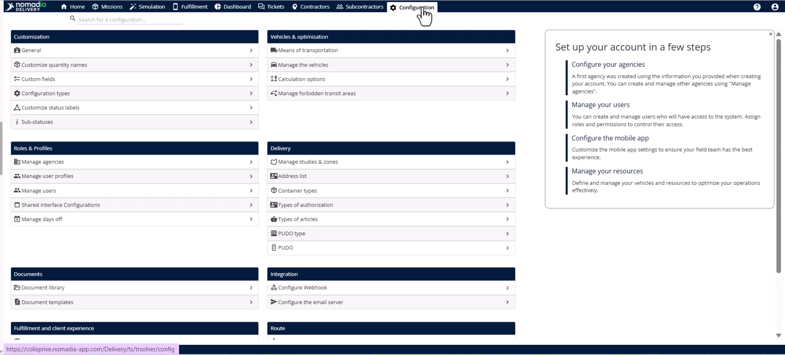

2. Select the **Manage users** page.

3. Edit the specific user and navigate to the **Roles and rights** tab.

4. Assign the necessary rights related to the zone module and click **Save**.

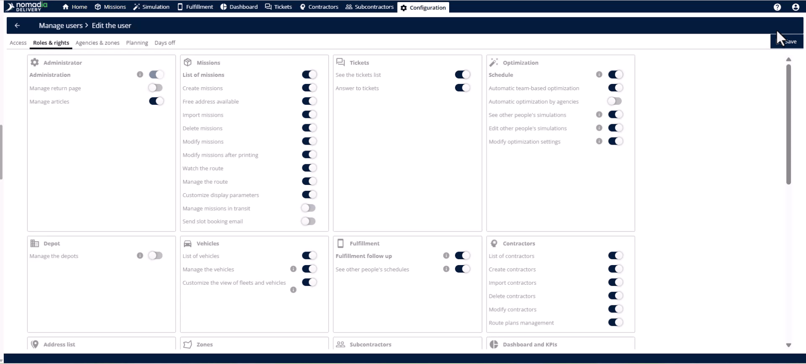

### Feature Overview

* **Study Management Page**: Your central hub for creating and editing all studies and zones.

* **Actions Menu**: A dropdown in the top right used to trigger creation and import tasks.

.png>)

* **Validity Start/End Date**: Fields defining the total lifespan of a study.

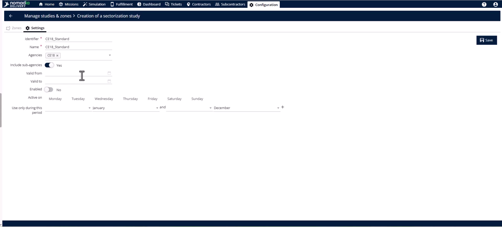

* **Zone Tab**: A sub-section within a study used to manage specific geographic areas.

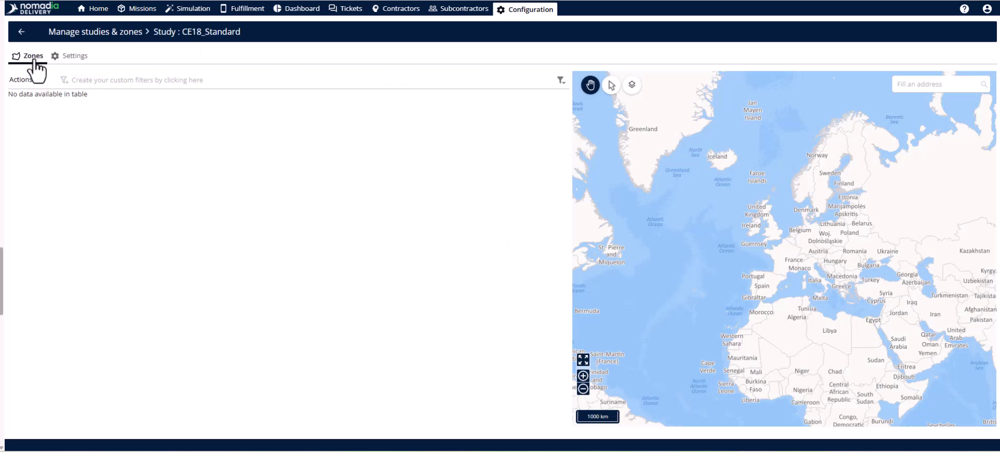

* **Assignment Mode**: A critical setting to designate a zone as a **Primary Zone** (top level).

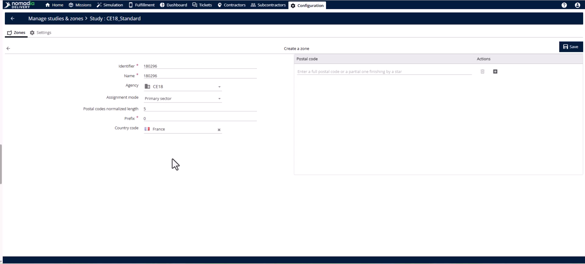

* **Map View**: A visual pane that automatically renders polygons for entered postal codes.

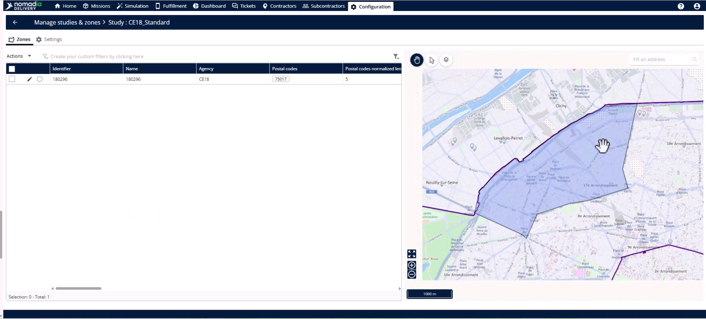

### How To: Create an Empty Study

1. Open the **Configuration module** and select **Studies and Zones** under the **Delivery** section.

2. Click the **Actions Menu** and select **Create empty study**.

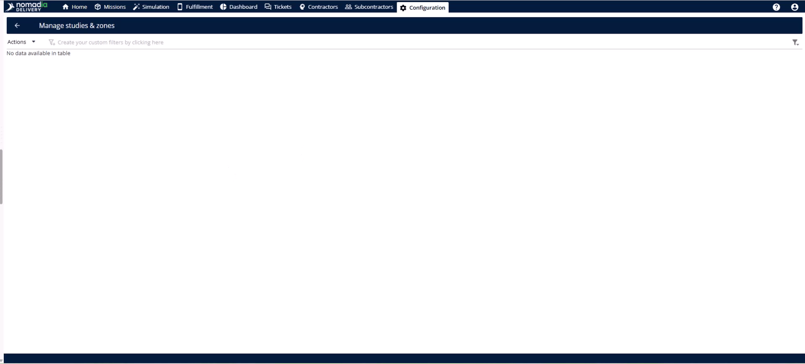

3. Enter the **Identifier**, **Name**, and select the **Agency**.

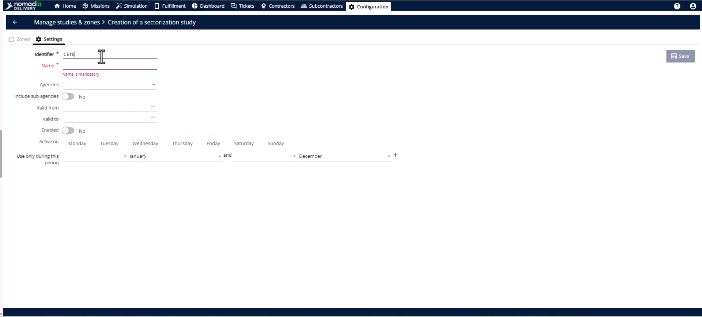

4. Set the **Validity start date** and **Validity end date**.

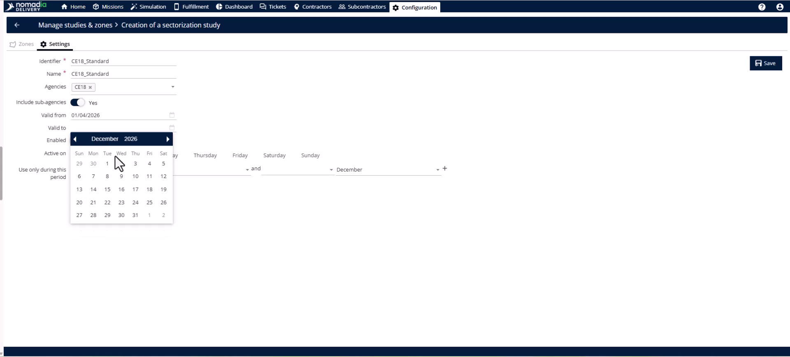

5. Toggle the switch to **Enable** the study.

6. Select specific active days (e.g., Monday to Friday).

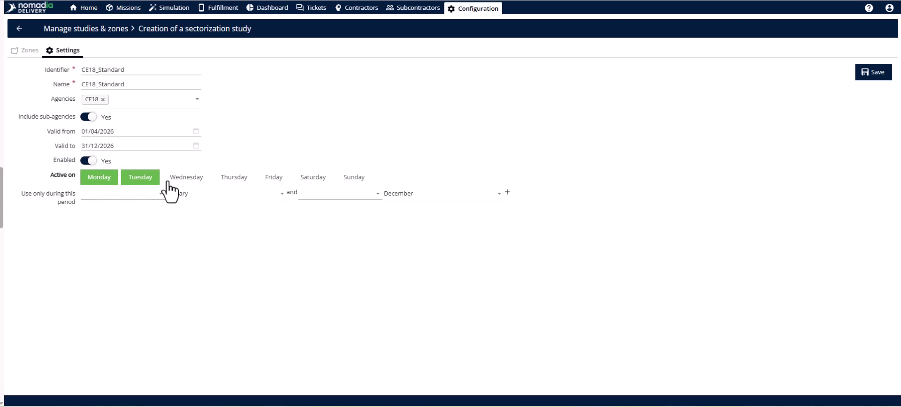

7. Configure the seasonal activation period within the year.

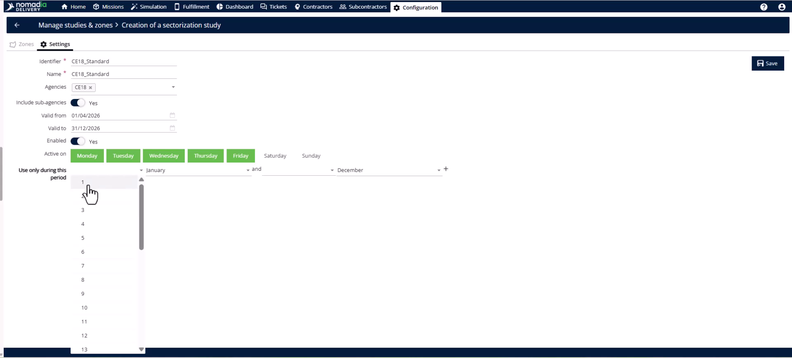

8. Click the **Save** button.

### How To: Add a Primary Zone

1. Navigate to the **Zone Tab** within your created study.

2. Open the **Actions Menu** and select **Add a postal code zone**.

3. Enter the **Identifier**, **Name**, and **Agency**.

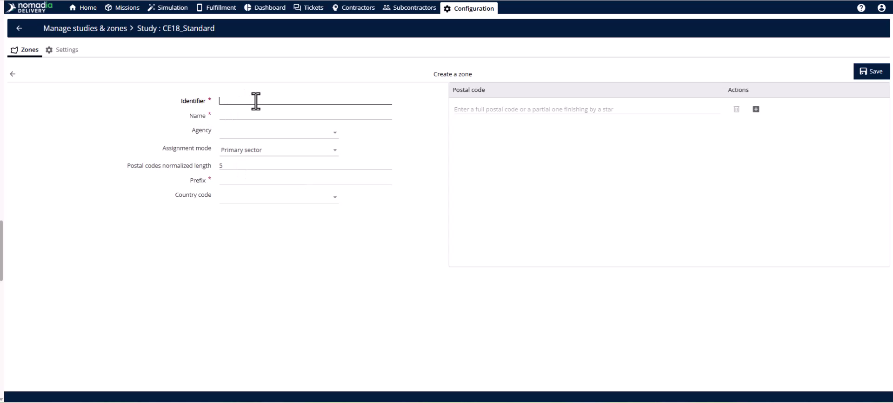

4. Select the **Country** and ensure **Assignment mode** is set to **Primary Zone**.

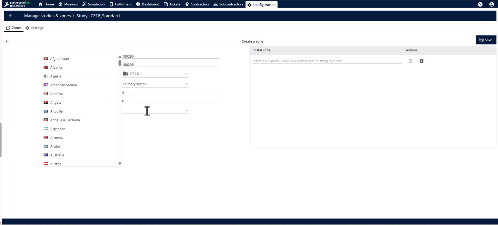

5. Enter postal codes one by one using the **Plus button**.

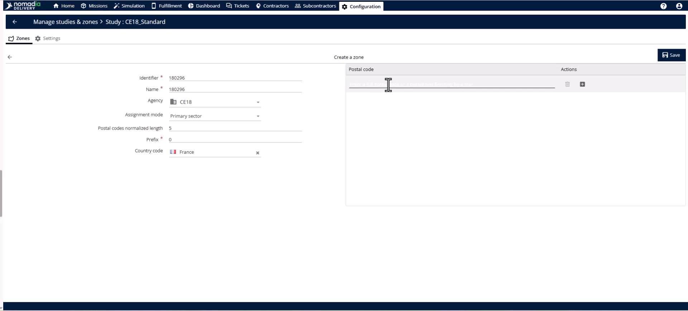

6. Click the **Save** button to render the zone on the map.

### Productivity Tips

* 💡 **Bulk Import**: Use the **Import** option in the **Actions Menu** to upload large lists of postal codes instantly.
* 💡 **Automatic Geometry**: The platform automatically renders map polygons from postal codes, removing the need for manual drawing.
* 💡 **API Integration**: Automate seasonal study creation by using the **Create Study** API endpoint.
