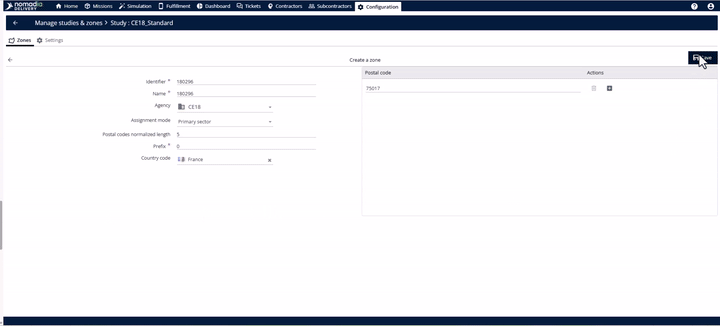

# Study Creation With Primary Zone

Understanding these two core concepts will help you manage your delivery areas more effectively:

* **Studies**: Think of a study as a "master plan" for your territories. You can create different plans for different times of the year—such as a specific plan for the holiday rush—and set them to activate automatically.
* **Primary Zones**: These are the main geographical areas (like a city or region) assigned to a specific team. They are defined by postal codes and appear instantly as visual shapes on your map.

**Why use this?** Instead of having a static map that doesn't account for busy seasons, you can switch between studies to match your actual field reality, reducing errors and ensuring orders land in the right areas.

***

## Setting Your Access

Before you can create anything, you need the right permissions in the system.

1. Navigate to the **Configuration** module in the top banner.
2. Go to the **Manage users** page and select the user you want to edit.
3. Click the **Roles and rights** tab.
4. ⚠️ **Important**: Ensure the following rights are enabled: **List of zones**, **Assign zones**, **Create and update zones**, **Access to sectorization tool**, and **Delete zones/studies**.
5. Click **Save**.

***

## How to Create a New Study

A study holds your seasonal delivery rules.

1. In the **Configuration** module, under the **Delivery** section, click on **Studies and zones**.

3. Click the **Actions** menu and select **Create empty study**.
4. Fill in the basic details: **Identifier**, **Name**, and the **Agency** it belongs to.
5. Set the **Validity start and end dates** (e.g., April 1st to December 31st).
6. 💡 **Tip**: You can activate the study only for specific days. For example, toggle it on for Monday through Friday if you have a different plan for weekends.
7. Define your **Activation Window** to set exactly when this plan should run during the year (e.g., January to April).
8. Click **Save**.

***

## Adding a Primary Zone to Your Study

Once your study is ready, you need to define the actual geographical area.

1. Inside your new study, click the **Zone** tab.
2. Open the **Actions** menu and select **Add a postal code zone**.
3. Enter the **Identifier**, **Name**, and select your **Country**.
4. ⚠️ **Critical Step**: In the **Assignment mode** field, you must select **Primary zone**. This tells the system this is a top-level area and not a smaller subzone.
5. Add your postal codes:
   * **Manual**: Click the **+** button to add codes one by one.
   * **Bulk**: Use the **Import** option in the actions menu to upload a large list instantly.
6. Click **Save**.

***

## Productivity Tips

* **Bulk Uploading**: If you are setting up zones for an entire region, don't type them manually. Use the **Import** function to save hours of work.
* **API Automation**: For technical teams, you can automate the creation of studies using the **create study endpoint**, which is perfect for onboarding new seasonal workflows programmatically.
* **Layering**: As your business grows, you can start breaking your **Primary Zones** down into **Subzones** for even finer control over your team's movements.
