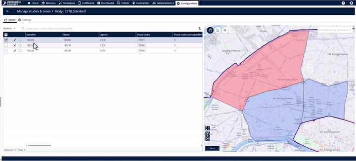
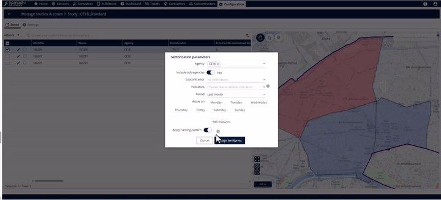
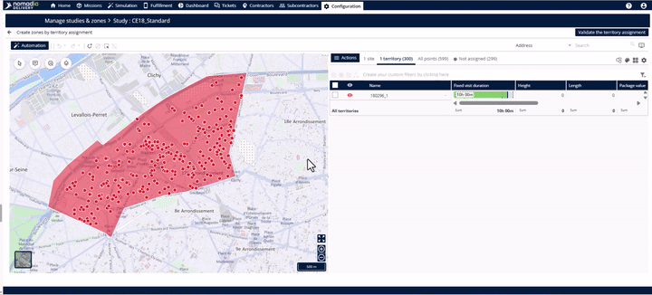
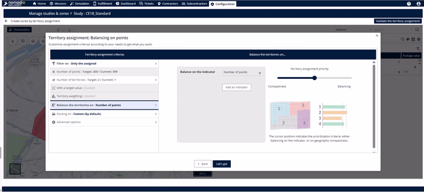
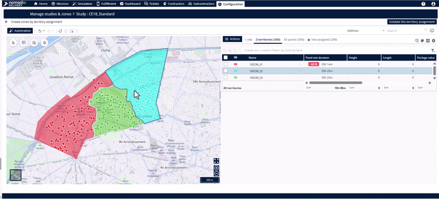

# Subsectorize Primary Zone

Subsectorization is the process of splitting a primary zone into smaller areas called "subzones".

* **Fairness**: Use actual delivery data (stops, coordinates, and times) to ensure every agent has a manageable workload.
* **Logical Boundaries**: The system creates geographically sensible splits, so agents aren't crossing over each other.
* **Automation**: No more manual drawing on maps; the system does the heavy lifting for you.

***

## **Creating Your Subzones**

### **Selecting Your Zone and Filtering Data**

1. Open your **Study** and navigate to the **Zone** tab.
2. Select your **Primary Zone** from the list.

3. In the **Sectorization Parameters** pop-up, use the filters to choose which data to use (e.g., filtering by a specific agency, subcontractor, or a period like "Monday missions").
4. 💡 **Tip**: Toggle on the **Naming Pattern** option. This automatically names your subzones based on the primary zone (e.g., "North Paris\_01"), saving you manual work later.

### **Automating the Split**

1. Select **Balance Points** as your balancing method and click **Start**.
2. Go to the **Number of Territories** tab and set your target (e.g., "3").
3. Go to the **Balance the Territories On** tab and choose your indicator.
   * _Example_: Select **Number of Points** to distribute missions evenly by count.
   * 💡 **Tip**: You can also balance by **Delivery Duration** or **Service Time** if those metrics are more important for your operation.

### **Review and Finalize**

1. Review the map. Each new subzone will be shown in a different color so you can easily see the new boundaries.

2. On the **Assignment Page**, use the drop-down menus next to each subzone to link them to a specific agency or team.
3. Choose your save method:
   * **Save and Assign**: Use this if you are ready to go live immediately.
   * **Save**: Use this to store the boundaries now and assign teams later.

***

## **Productivity Tips for Success**

* **Real-World Scenario**: If you manage "North Paris," using the **Naming Pattern** will automatically create "North Paris\_01," "North Paris\_02," etc., keeping your database clean and organized.
* **Flexible Metrics**: Don't feel restricted to just counting delivery points. If some areas have high traffic, try balancing by **Delivery Duration** to keep workloads fair for your drivers.
* **No Manual Drawing**: Trust the system! It uses actual delivery coordinates on the ground to draw the most efficient lines for your field teams.
