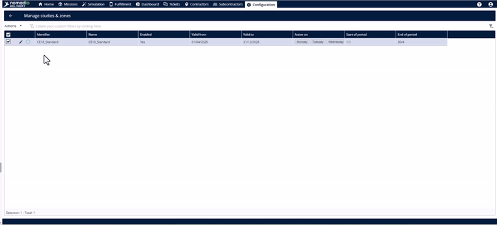
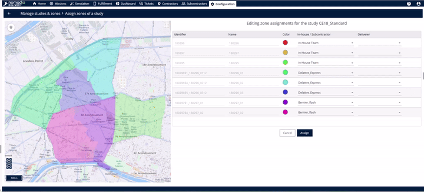
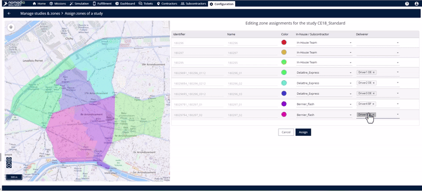
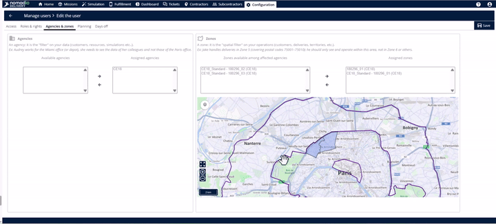

# Assigning Sub Zones

Assigning subzones is the final step in making your delivery plan operational.

* **Operational Clarity**: Deliverers gain a clear understanding of their geographical boundaries.
* **Accountability**: Each territory has a designated owner (either in-house or a subcontractor), ensuring no zone is left unmanaged.
* **Automated Synchronization**: Once assigned, the data flows instantly across the platform to the deliverer's profile and subcontractor records.

***

### Assigning Your Territories

Follow these steps to link your subzones to the right teams and individuals.

1. **Access the Assignment Menu**
   * Navigate to the **Study Table** where your created subzones are listed.

2. **Configure Ownership for Each Subzone**
   * On the assignment page, you will see one row for every subzone, including its name and map color.
   * Use the first drop-down to select the **Team Type**: Choose between your **In-house team** or a **Subcontractor team** based on who is operationally responsible for that area.

3. **Confirm and Save**

> 💡 **Tip**: You can assign different subcontractor teams to different zones within the same study to spread the workload.

***

### Verifying Your Assignments

The system synchronizes automatically, but you can double-check the results in two places.

#### 1. Checking the Deliverer’s Profile

* Go to the **Configuration** module and select **Manage Users**.

#### 2. Checking the Subcontractor Record

***

### 🚀 Productivity Tips: The Delegation Model

If you work with external partners, you can save time by delegating the fine details.

* **The Split Responsibility**: As the logistical operator, you can simply assign a **Subcontractor Team** to a subzone and let _them_ decide which of their specific drivers covers it.
* **Autonomy**: If the subcontractor has "assign" rights on the platform, they can manage their own internal assignments without your involvement.

⚠️ **Warning**: Subcontractor delegation only works if you have granted them the specific rights to assign subzones within the platform.
