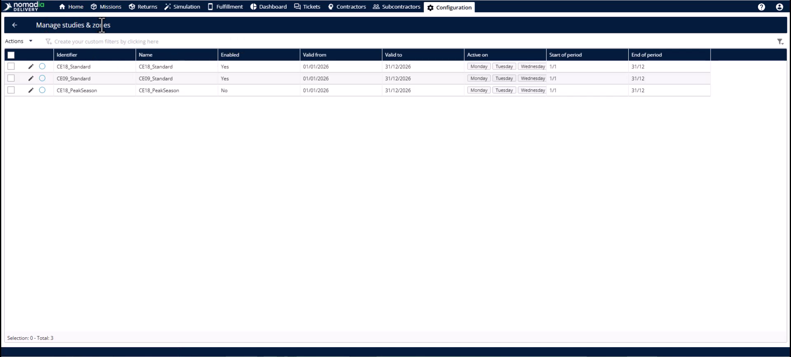
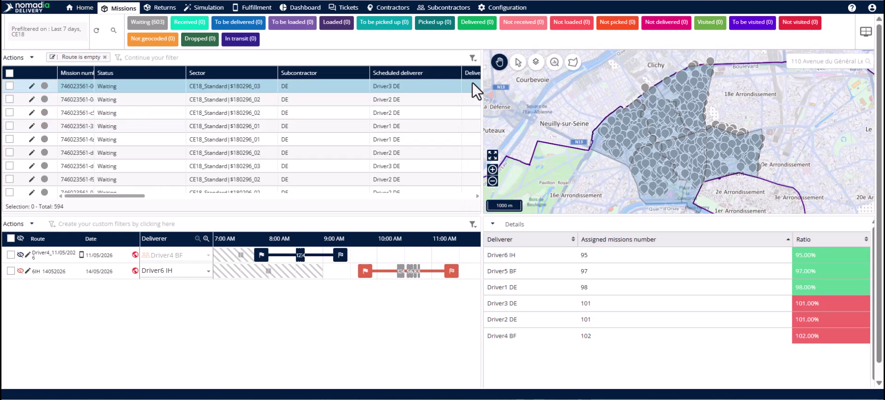
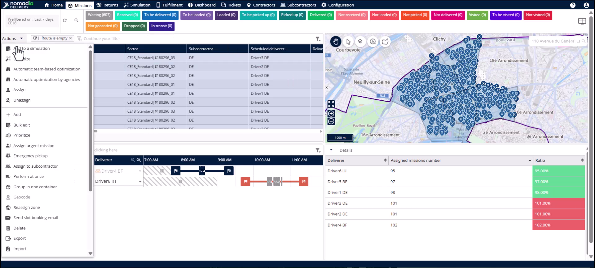
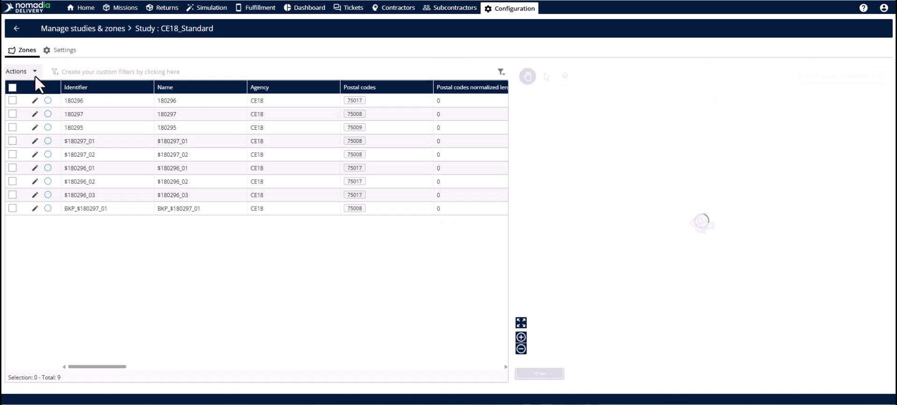
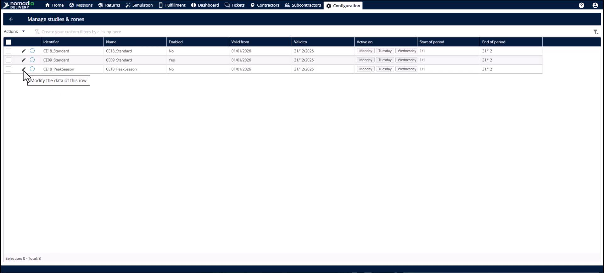
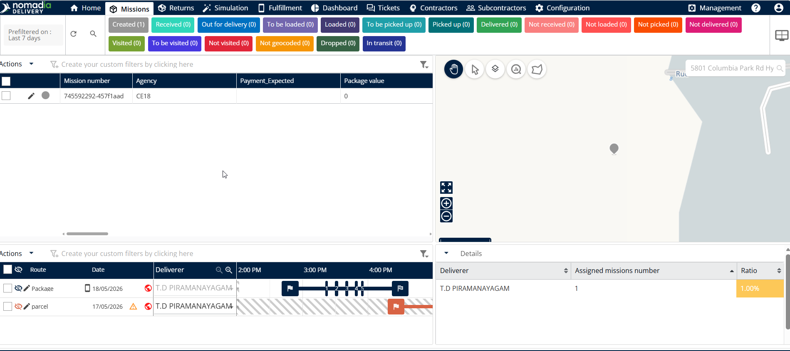
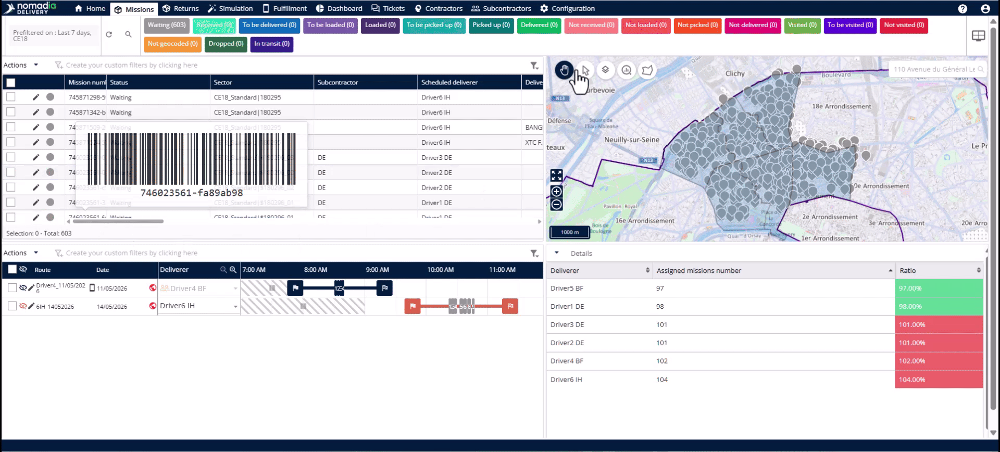
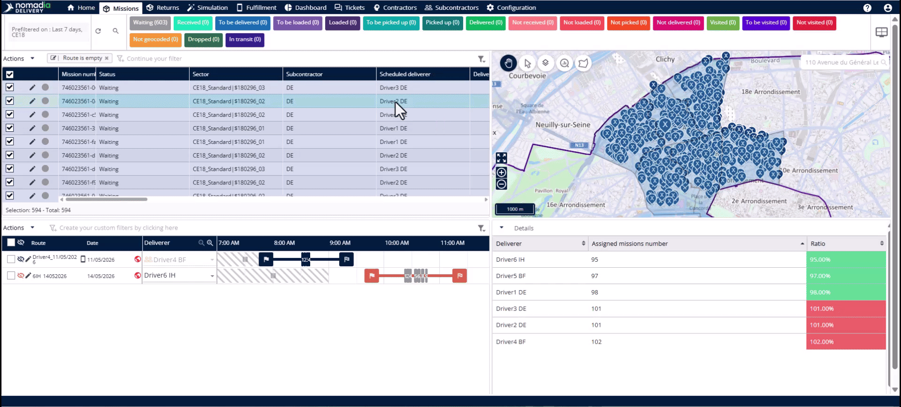
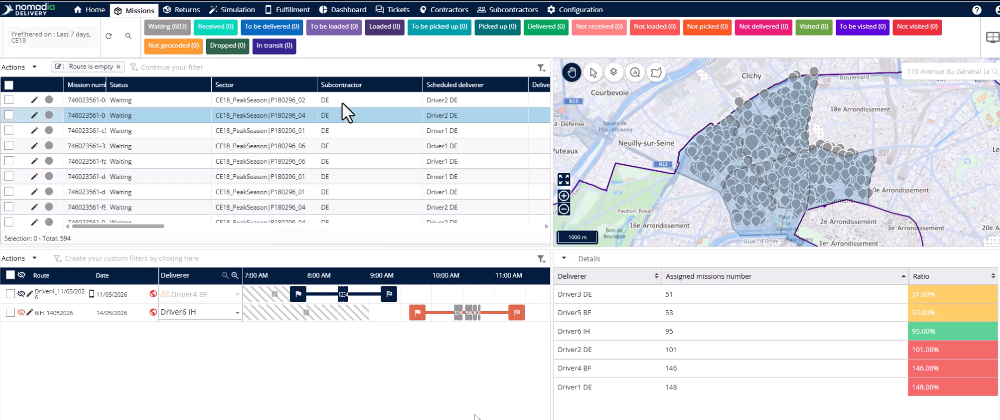

# Reassign Zones Manually

Manual zone reassignment allows you to move missions to a new territory layout on your own terms. Use this when switching between different studies or seasonal configurations where automatic triggers do not apply. You will achieve accurate mission records and uninterrupted planning cycles.

#### Getting Started

* At least two studies configured for the same area.
* A set of active missions needing reassignment.

- Navigate to the **Configuration** module.
- Click on **Manage studies and zones**.

#### Feature Overview

* **Enable toggle**: Activates or deactivates a specific study configuration.

* **Saved filter**: Isolates specific missions based on predefined criteria like old zone assignments.

* **Reassign zone**: Instantly updates selected missions to reflect the currently active study geometry.

#### How To: Switch Mission Studies

1. Click the **edit** button and select **Settings** tab.

2. Deactivate the **Enable toggle** and click **Save**.

3. Find the new experimental study and click **Edit**.

4. Switch the **Enable toggle** to active and click **Save**.

5. Head to the **Missions** tab.

<figure><figcaption></figcaption></figure>

6. Apply a **Filter** to isolate missions assigned to the old study.

7. Select all relevant missions in the table.

8. Open the **Actions** menu and click **Reassign zone**.

9. Click **Yes** to confirm the reassignment.

10. The selected missions are reassigned to the chosen study.

<figure><figcaption></figcaption></figure>

#### Productivity Tips

* 💡 **Safe Testing**: Test new layouts by reassigning a sample of missions before committing the whole fleet.
* 💡 **Seasonal Transitions**: Use manual reassignment to switch between summer and winter configurations instantly.
* ⚠️ **Automation Limits**: The system only auto-updates for geometry changes, not for new study activations.
* ⚠️ **Human Oversight**: Always review the filtered list to ensure only the intended missions move.
