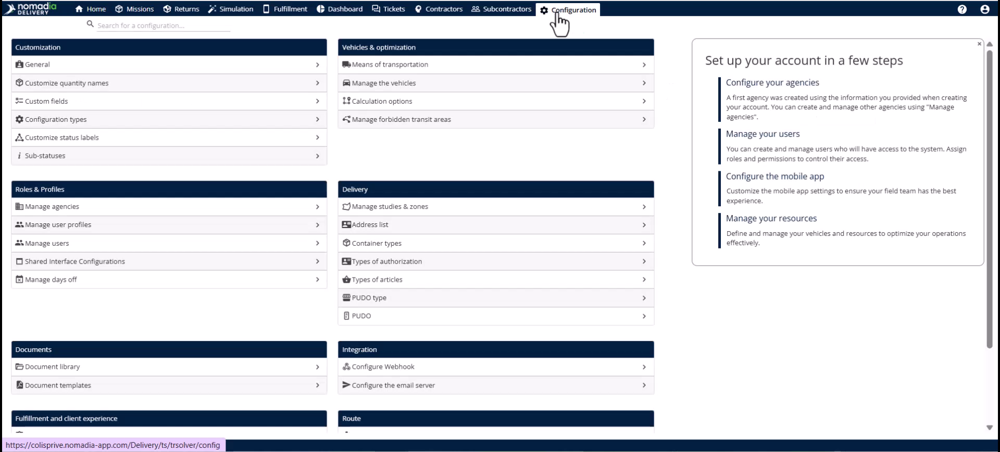
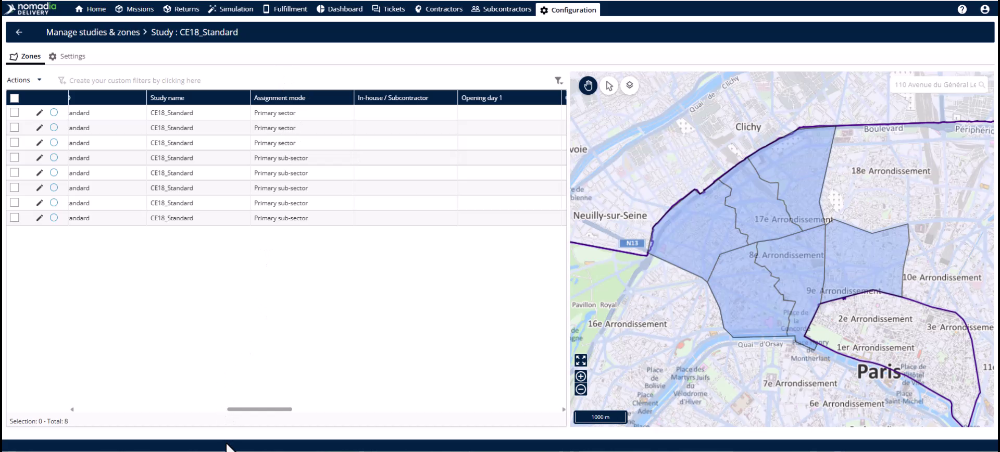
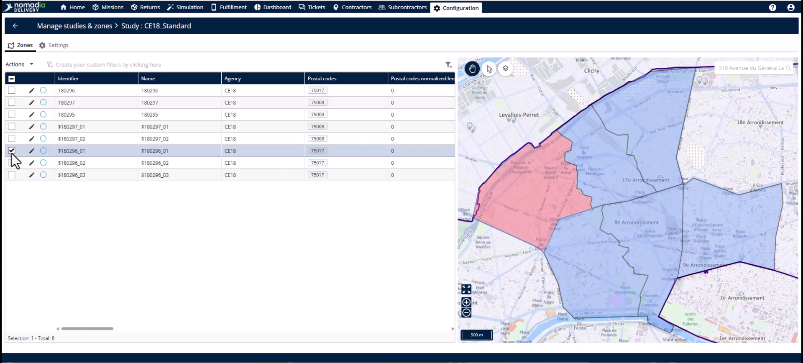
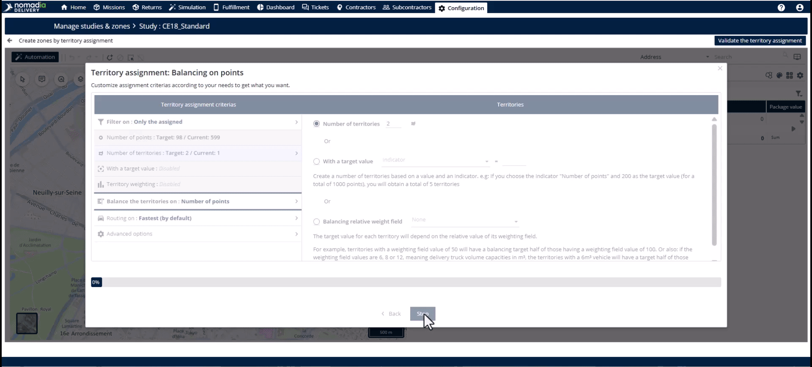
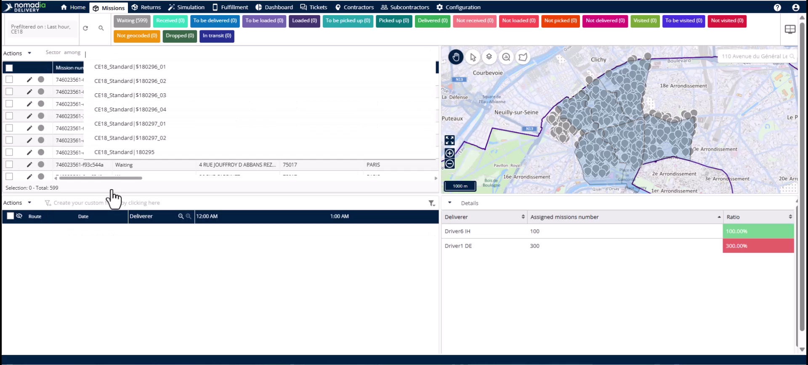

# Case_studies-Dividing_Sub_Zones
# Case-Studies

Subzone division allows you to split an overloaded territory into two balanced zones instantly. Use this feature to handle demand surges, bulk orders, or seasonal spikes without overloading drivers. You will achieve balanced mission counts and automated driver reassignments to maintain your service levels.

### Getting Started

Before dividing a territory, ensure your setup meets these requirements:
*   A primary zone must already be subsectorized through the territory manager.
*   Target subzones must have an established link to a primary zone.

1.  Open the **Configuration module**.

2.  Click on **Manage studies and zones**.

3.  Select the **Edit** icon for the study containing the overloaded zone.

### Feature Overview

*   **Assignment Mode**: This field displays "primary subzone" to confirm the territory is part of a larger hierarchy.

*   **Main Zone Field**: This stores the unique identifier of the parent primary zone to keep the structure intact.

*   **Actions Menu**: This provides the **Subsectorize** command to begin the division process.

*   **Sectorization Parameters**: This pop-up allows you to filter missions by agency, period, or specific days.

*   **Automation Button**: This launches the territory wizard to calculate new boundaries automatically.

### How To: Divide an Overloaded Subzone

1.  Identify the overloaded subzone in the **Zone tab**.

2.  Open the **Actions menu** and click **Subsectorize**.

3.  Set your filters in **Sectorization parameters** and click **Assign territories**.

4.  Click the **Automation button** located above the map in **Territory Manager**.

5.  Select **Balance point** as the methodology in the **Territory assignment wizard**.

6.  Click **Start**.

7.  Enter the number "2" in the **Number of territories** section.

8.  Click **Let's go** to trigger the calculation.

9.  Review the split on the map and click **Validate territory assignment**.

10. Click **Save** on the **Modify territory assignment** page.

### How To: Verify Automated Mission Reassignment

1.  Navigate to the **Mission tab**.

2.  Click the **Sector** field to view mission assignments.

3.  Confirm missions show the names of the new subzones.

### Productivity Tips

*   💡 **Hierarchy Preservation**: The system uses the **Main zone field** to ensure your zone hierarchy remains consistent during edits.
*   💡 **Automated Updates**: Missions reassign themselves based on geographical delivery addresses, removing the need for manual data entry.
*   💡 **Immediate Optimization**: Planners can move directly to route optimization since the system handles all retagging automatically.
*   ⚠️ **Static Bottlenecks**: Avoid manual reassignments during surges to prevent data bottlenecks and undelivered missions.

