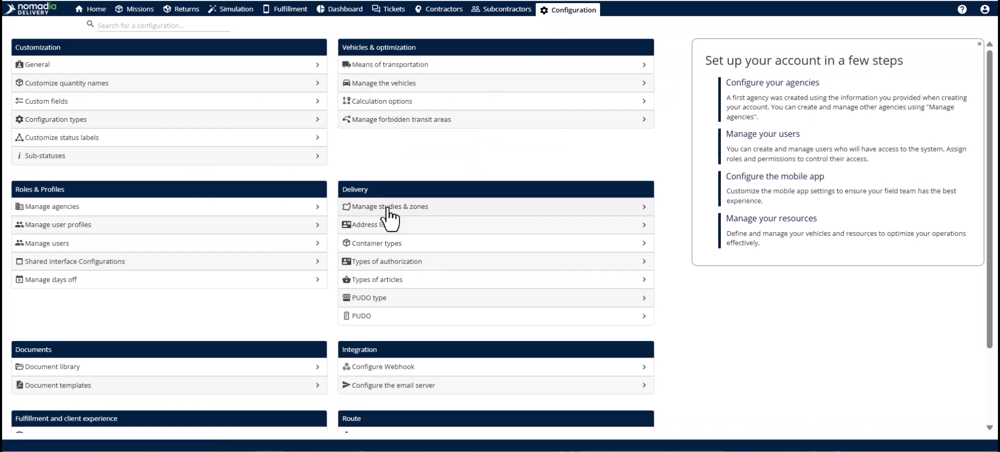
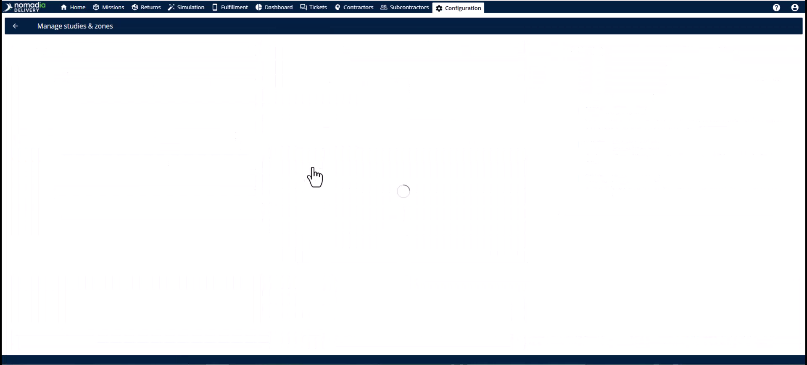
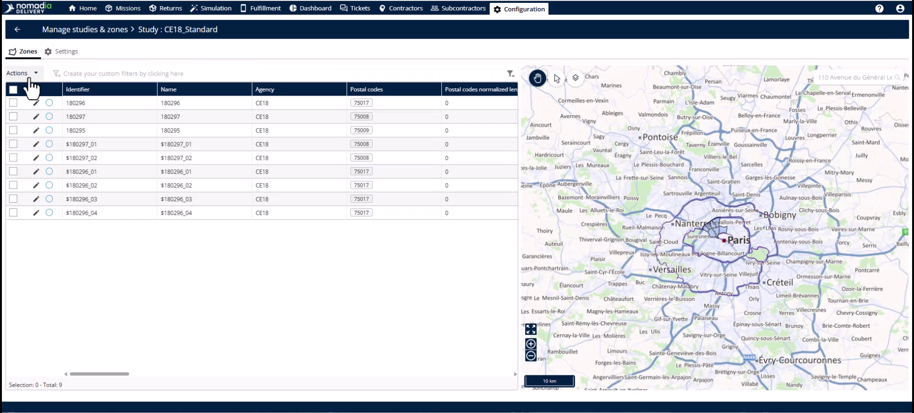
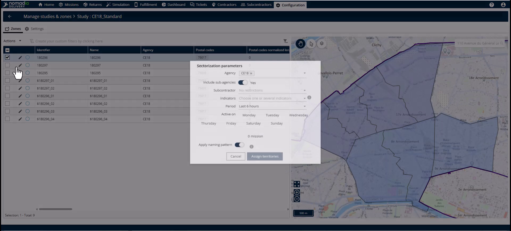
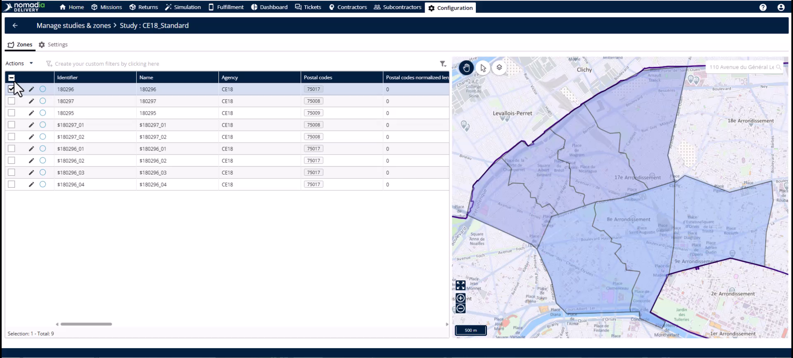
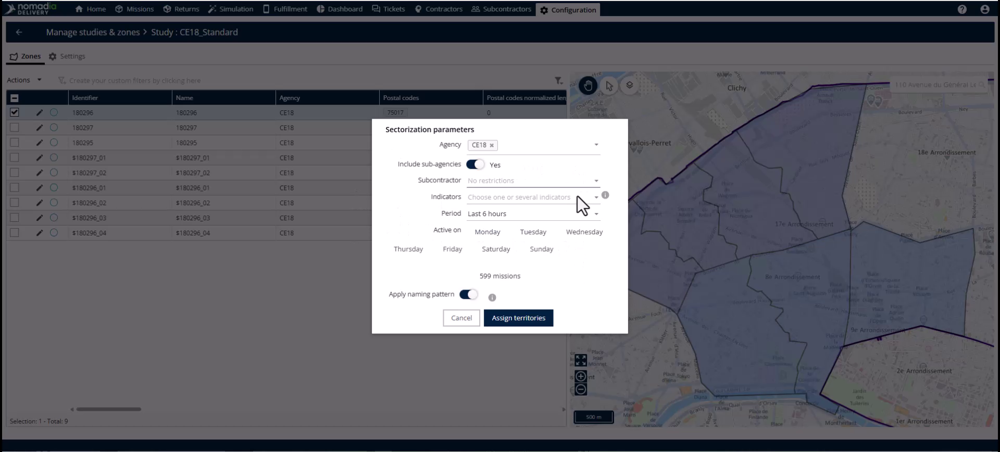
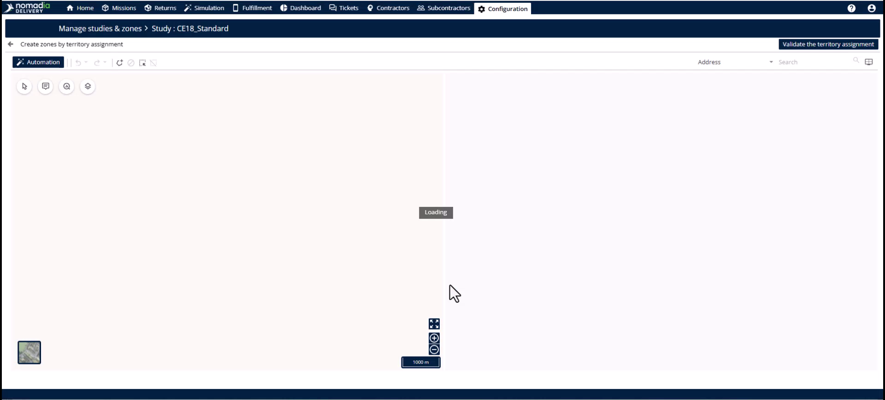
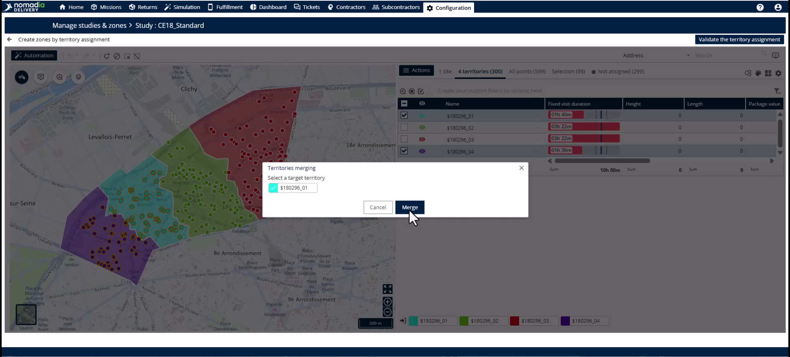
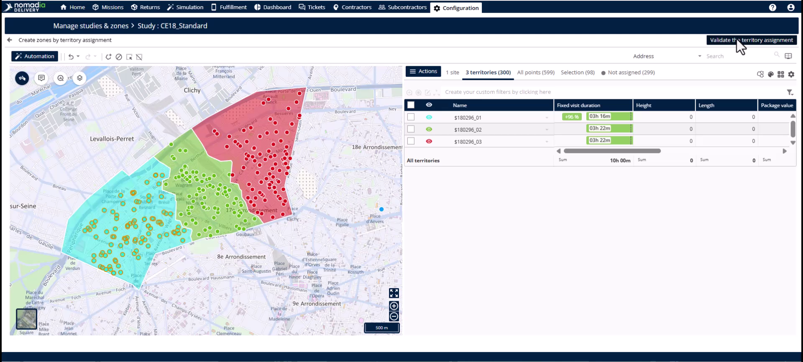

# Merging Sub Zones

Merging sub-zones recombines divided territories once a demand surge has passed. This feature helps you maintain a lean zone structure and ensures efficient driver routes. By merging, you reduce planning overhead and return to a simplified one-driver, one-territory configuration.

#### Getting Started

* Ensure you have access to the **Configuration** module.
* Identify the **Primary Zone** containing the sub-zones you want to merge.
* The **Primary Zone** must have the assignment mode set to **primary sector**.

1. Click on the **Configuration** module in the main navigation.

2. Select **Manage zones and studies** from the menu.

3. Click **Edit** on the specific study containing your sub-zones.

#### Feature Overview

* **Primary Zone**: The high-level territory required to view and manage all contained sub-zones simultaneously.

* **Subsectorize**: The action button used to launch the **Territory Manager** for the selected zone.

* **Territory Manager**: A workspace showing the map and zone table for active modifications.

* **Merge Territories**: The command that combines two selected sub-zones into a single contiguous geography.

* **Identifier**: The unique name or label assigned to the newly merged sub-zone.

#### How To: Merge Sub-Zones

1. Navigate to the **Zones** tab.
2. Select the **Primary Zone**.

3. Click the **Action** button and select **Subsectorize**.

4. Enter your **Pre-filter** values for agency, period, and relevant days.

5. Click **Assign** to open the map view.

6. In the table next to the map, select the two sub-zones you want to merge.

7. Click **Actions** and select **Merge territories**.

8. Select the **Identifier** you wish to keep for the new zone.

9. Click **Merge**.

10. Review the new unified geography on the map.

11. Click **Validate the sectorization** in the top right corner.

12. Click **Save** on the review page to update the zone table.

#### Productivity Tips

* 💡 **Operational Efficiency**: Recombine zones as soon as demand normalizes to avoid half-empty routes.
* 💡 **Consistent Naming**: Choose the identifier your team is most familiar with when prompted during a merge.
* ⚠️ **Selection Level**: Never select a sub-zone level to start a merge; the merge option will not appear.
