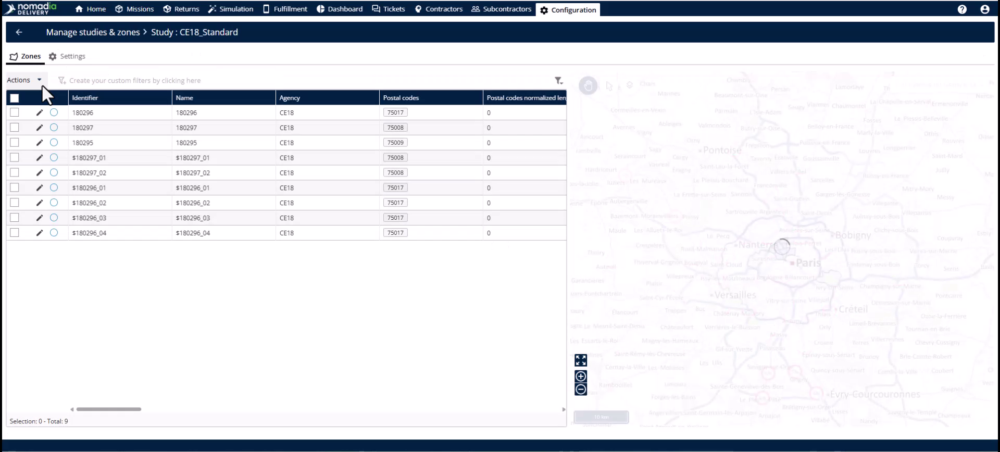
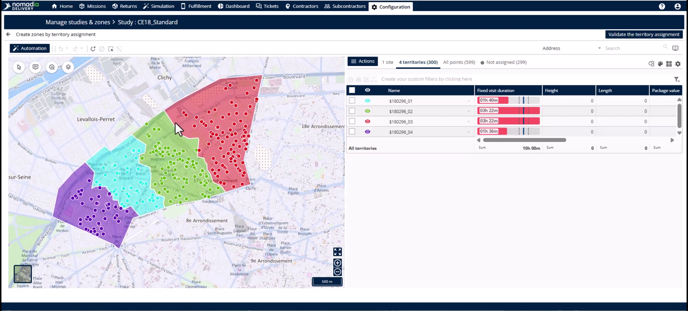
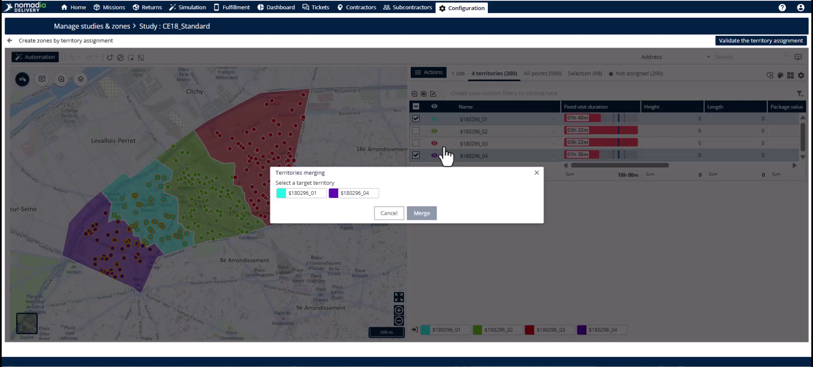
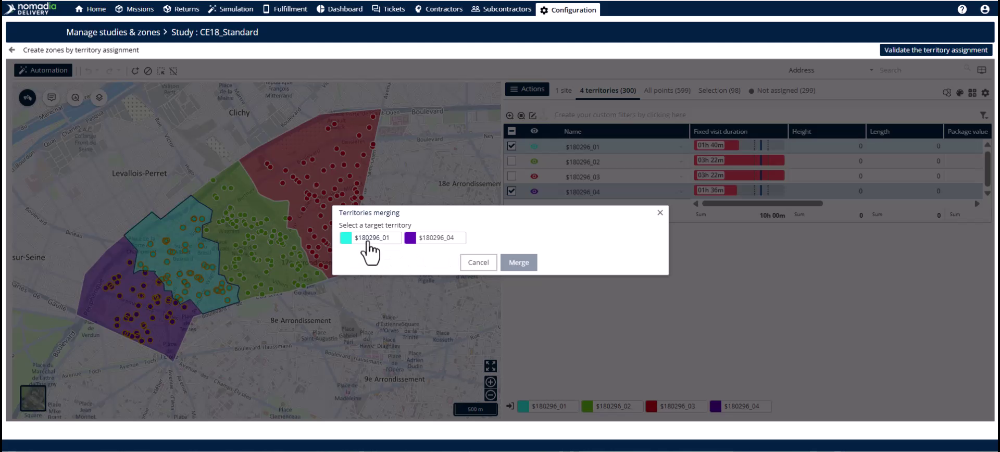
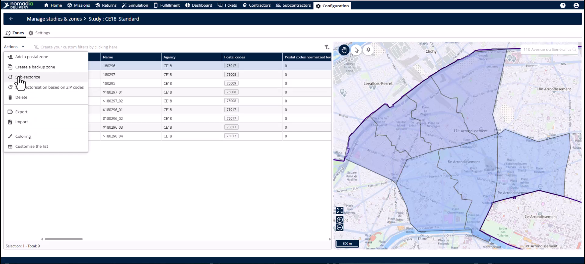
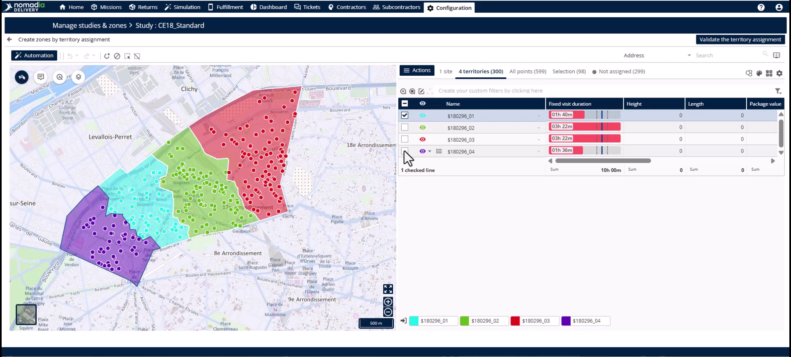
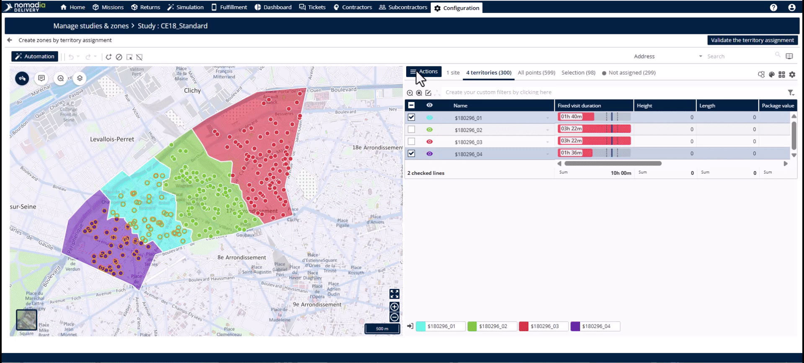
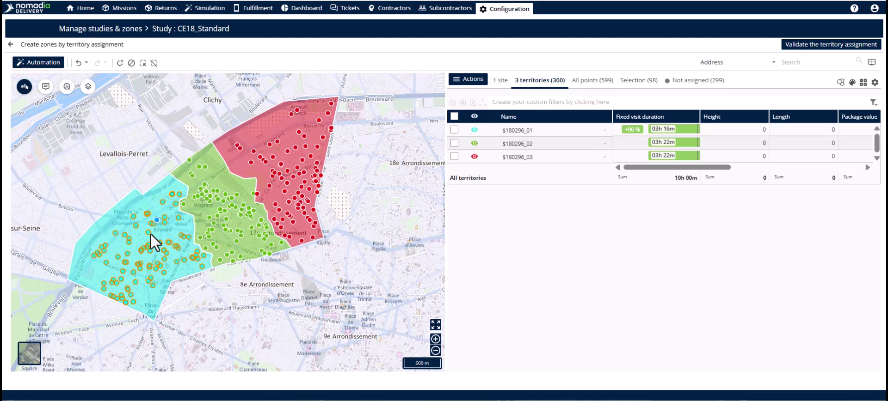
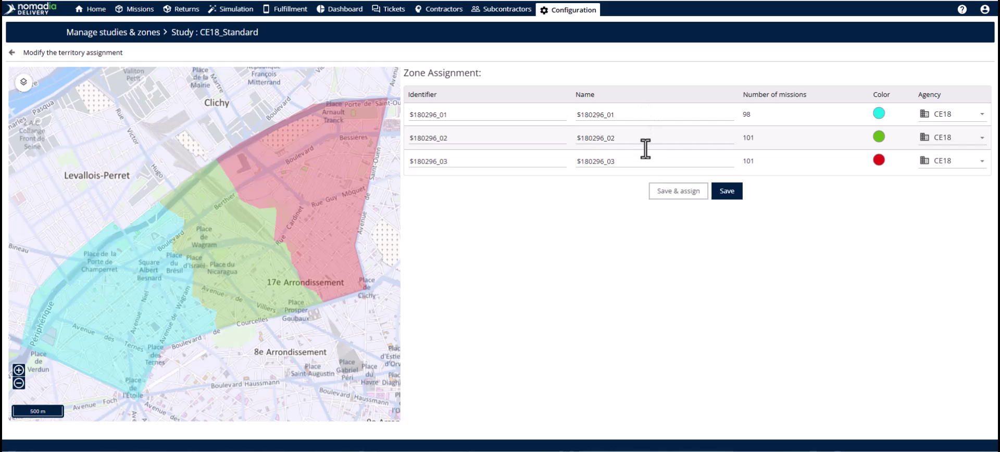

# Case_studies-Merging_Sub_Zones
# Case-Studies

Merging sub-zones recombines divided territories once a demand surge has passed. This feature helps you maintain a lean zone structure and ensures efficient driver routes. By merging, you reduce planning overhead and return to a simplified one-driver, one-territory configuration.

### Getting Started

*   Ensure you have access to the **Configuration** module.
*   Identify the **Primary Zone** containing the sub-zones you want to merge.
*   The **Primary Zone** must have the assignment mode set to **primary sector**.

1.  Click on the **Configuration** module in the main navigation.

2.  Select **Manage zones and studies** from the menu.

3.  Click **Edit** on the specific study containing your sub-zones.

### Feature Overview

*   **Primary Zone**: The high-level territory required to view and manage all contained sub-zones simultaneously.

*   **Subsectorize**: The action button used to launch the **Territory Manager** for the selected zone.

*   **Territory Manager**: A workspace showing the map and zone table for active modifications.

*   **Merge Territories**: The command that combines two selected sub-zones into a single contiguous geography.

*   **Identifier**: The unique name or label assigned to the newly merged sub-zone.

### How To: Merge Sub-Zones

1.  Navigate to the **Zones** tab.

2.  Select the **Primary Zone**.

3.  Click the **Action** button and select **Subsectorize**.

4.  Enter your **Pre-filter** values for agency, period, and relevant days.

5.  Click **Assign** to open the map view.

6.  In the table next to the map, select the two sub-zones you want to merge.

7.  Click **Actions** and select **Merge territories**.

8.  Select the **Identifier** you wish to keep for the new zone.

9.  Click **Merge**.

10. Review the new unified geography on the map.

11. Click **Validate the sectorization** in the top right corner.

12. Click **Save** on the review page to update the zone table.

### Productivity Tips

*   💡 **Operational Efficiency**: Recombine zones as soon as demand normalizes to avoid half-empty routes.
*   💡 **Consistent Naming**: Choose the identifier your team is most familiar with when prompted during a merge.
*   ⚠️ **Selection Level**: Never select a sub-zone level to start a merge; the merge option will not appear.

