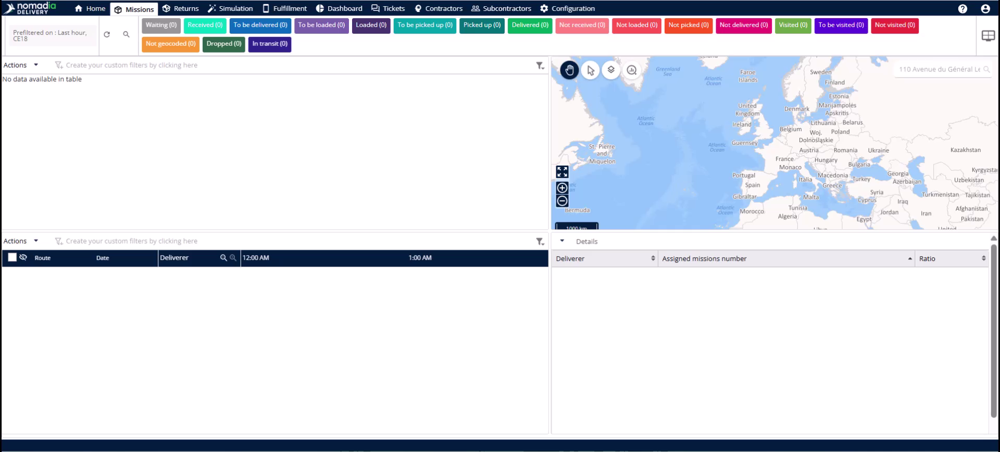
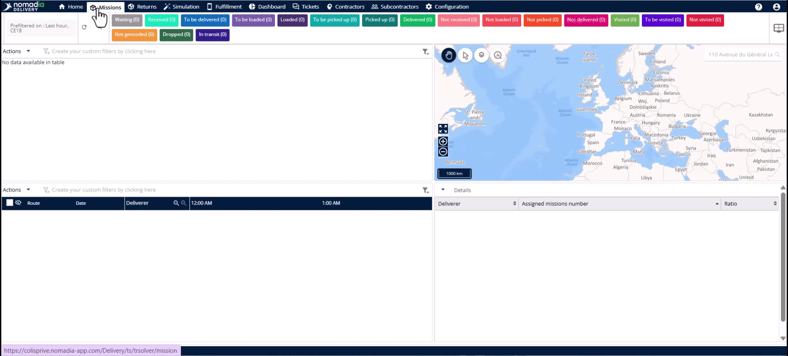
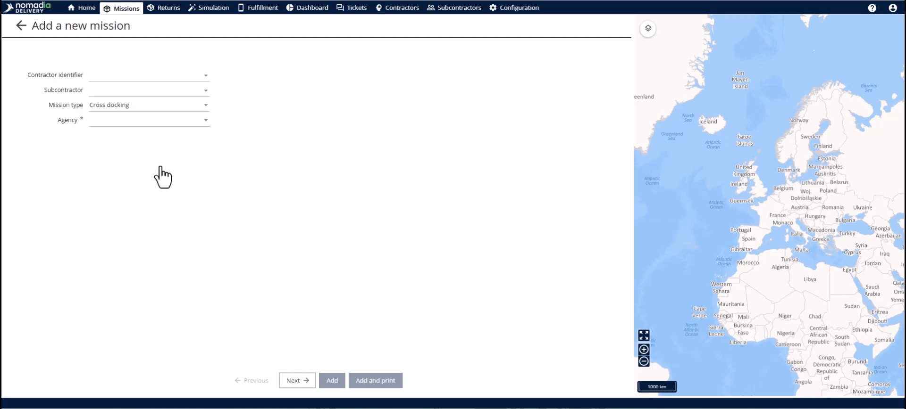
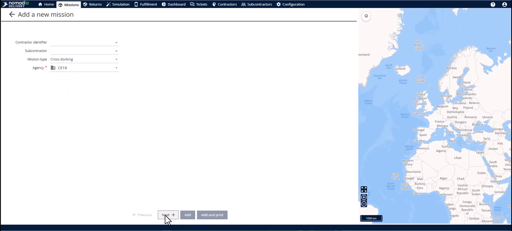
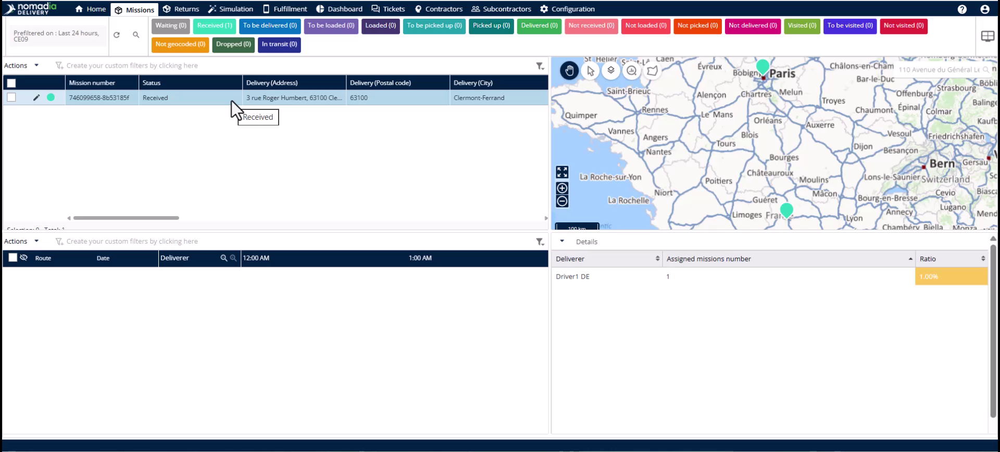

# Case_studies-Multi_Leg_Missions
# Case-Studies

**Nomadia Delivery** uses multi-leg missions to track parcels across multiple hubs and agencies from first-mile pickup to last-mile delivery. This feature provides end-to-end visibility for complex supply chain operations by following a mission through every touchpoint. You will achieve a complete, trackable chain of custody for every parcel in your network.

### Getting Started

To use this feature, ensure you have a user account with permissions for your specific agency.

*   Access to the **Nomadia Delivery** back office.
*   User account assigned to an **Origin Agency**.
*   Configured routing infrastructure for automated zone assignment.

1. Log in to **Nomadia Delivery** as a user from the **Origin Agency**.

### Feature Overview

*   **Agency**: Displays the current location of the mission and determines user visibility.

*   **Origin Agency**: Marks the hub where the first-mile pickup begins.

*   **Destination Agency**: Marks the final hub from which the customer receives the parcel.

*   **Leg**: Indicates the current phase: Collection, Distribution, or Delivery.

### How To: Create a Multi-Leg Mission

1. Click on the **Mission** tab.

2. Select **Add** from the **Actions** menu.

3. Choose the **Agency** and click **Next**.

4. Switch the **Configuration** from **Default** to **Multi-leg**.

5. Select the **Origin Agency** and the **Destination Agency**.

6. Set the **Leg** to **Collection**.

7. Enter the pickup and delivery location details.

8. Click **Add** to save the mission.

### How To: Update Mission Legs and Visibility

1. Use the **Update multi-leg status information** endpoint to transition between legs.

2. Set the **Leg** to **Distribution** when the item is ready for mid-mile transit.

3. Navigate to the **Configuration** module to manage user visibility.

4. Select **Edit** for a specific user on the **Manage Users** page.

5. Open the **Rules and Rights** tab.

6. Activate the **Manage missions in transit** right.

7. Click **Save** to allow the user to see missions that have left their hub.

8. Update the **Leg** to **Delivery** when the mission arrives at the final hub.

9. Set the **Status** to **Received** for the destination agency user.

### How To: Audit Mission History

1. Open a mission in the **Editor**.

2. Select the **Logs** tab to view every status change and agency transition.

### Productivity Tips

- 💡 **Automated Assignment**: Routing infrastructure automatically fills agents and sub-zones as soon as you create the mission.
- 💡 **Flexible Entry**: Create missions directly in distribution or delivery status if subcontractors handled the initial collection.
- ⚠️ **Visibility Loss**: Missions normally disappear from the origin view once they leave the hub unless specific rights are enabled.

