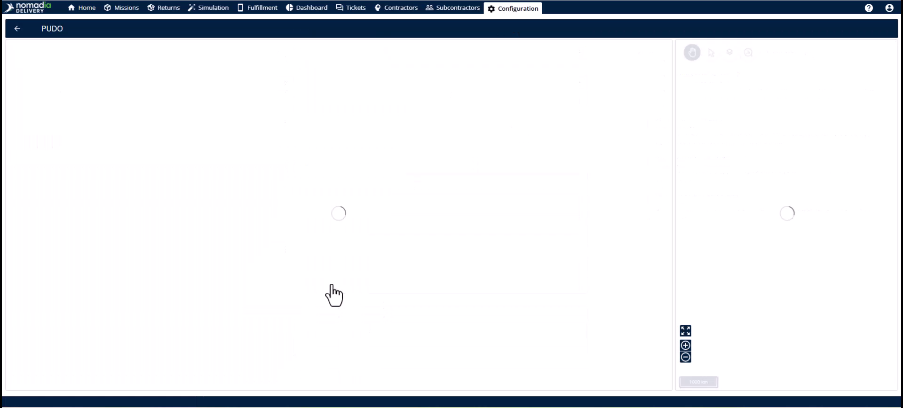
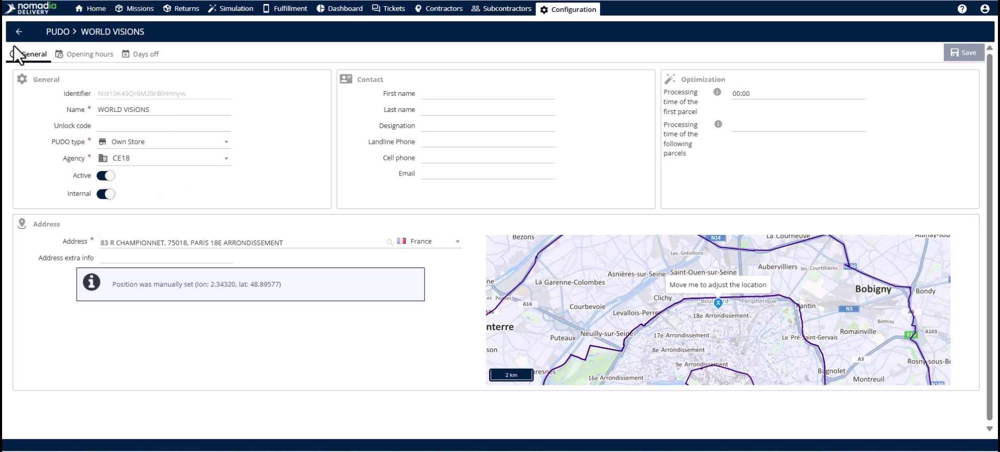
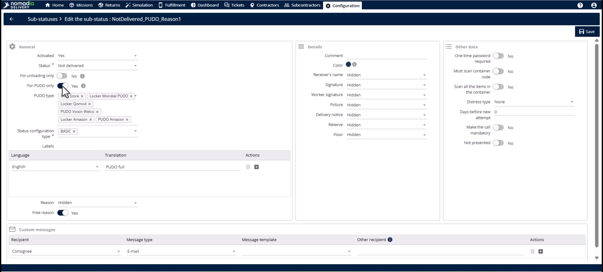
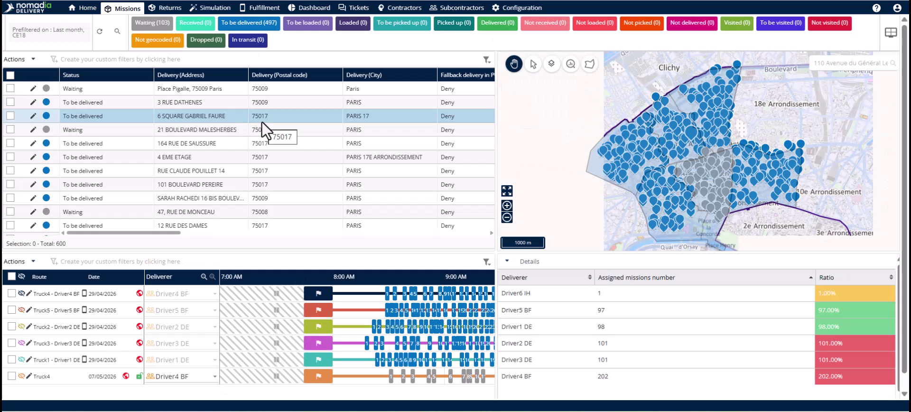
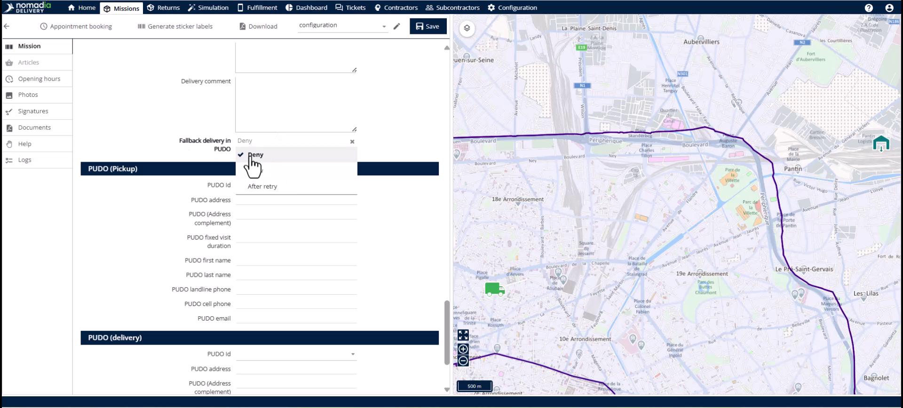

# Pudo configuration

PUDO (Pickup and Drop-off Points) allows drivers to leave packages at secure locations when customers are unavailable. This feature eliminates expensive redelivery costs and reduces vehicle emissions. You will achieve higher first-attempt success rates and improved customer convenience.

#### Getting Started

* A prepared list of PUDO locations including names and addresses.
* Defined categories for your network, such as lockers or retail stores.
* Access to the **Configuration** module in Nomadia Delivery.

1. Open the **Configuration** module.

2. Select the **PUDO type** page to define your categories.

3. Navigate to the **PUDO** page to upload your physical locations.

#### Feature Overview

* **PUDO Types**: Categories like stores or lockers with specific handling requirements.

* **PUDO List**: The database of actual locations and addresses your operation uses.

* **PUDO Substatus**: Custom labels for the mobile app that apply only during PUDO interactions.

* **Fallback PUDO**: A mission-level field that determines if a PUDO drop is permitted.

#### How To: Configure PUDO Types

1. Go to the **Configuration** module.

2. Click on **PUDO type**.
3. Define categories such as supermarkets, partner retailers, or lockers.

#### How To: Upload the PUDO List

1. Navigate to the **PUDO** page in the **Configuration** module.

2. Open the **Actions** menu.
3. Select the **Import** action to upload your list in bulk.

#### How To: Set Up PUDO Substatuses

1. Click the **Substatus** page in the **Configuration** module.

2. Toggle the **PUDO only** switch.

3. Enter operational labels like "Locker Deposited" or "PUDO Point Full".
4. Click the **Save** button.

#### How To: Enable Fallback PUDO on a Mission

1. Find the **Fallback delivery in PUDO** field in the **Mission Table**.

2. Click the **Edit** button to open the **Mission Editor**.

3. Select the **Delivery information** section.
4. Set the fallback characteristic to **Allow**, **Deny**, or **After retry**.

#### Productivity Tips

* 💡 **Multi-Mission Support**: Use PUDO for both pickup and delivery missions to increase operational flexibility.
* 💡 **Bulk Updates**: Manage fallback permissions at scale using the **Import template** or the API during mission creation.
* ⚠️ **Data Maintenance**: Keep the **PUDO list** current or drivers will be unable to find nearby drop-off points.
* ⚠️ **Type Distinctions**: Always differentiate between stores and lockers as they require different handling processes like **OTP** codes.
