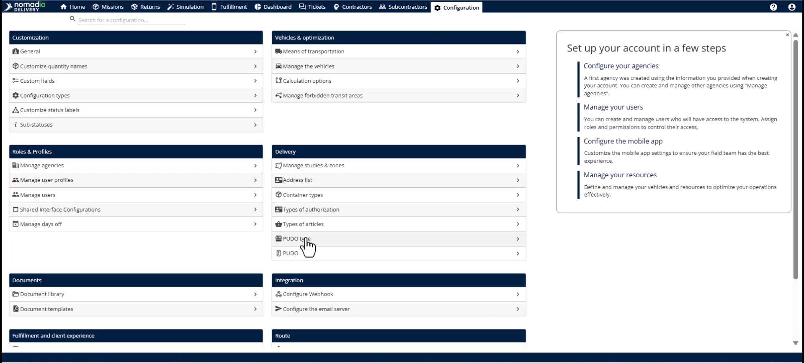
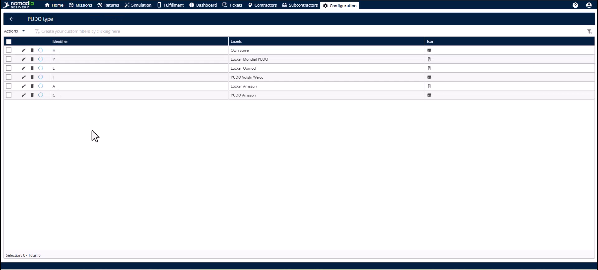
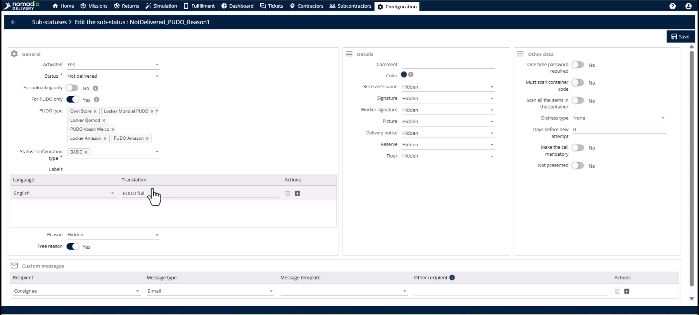
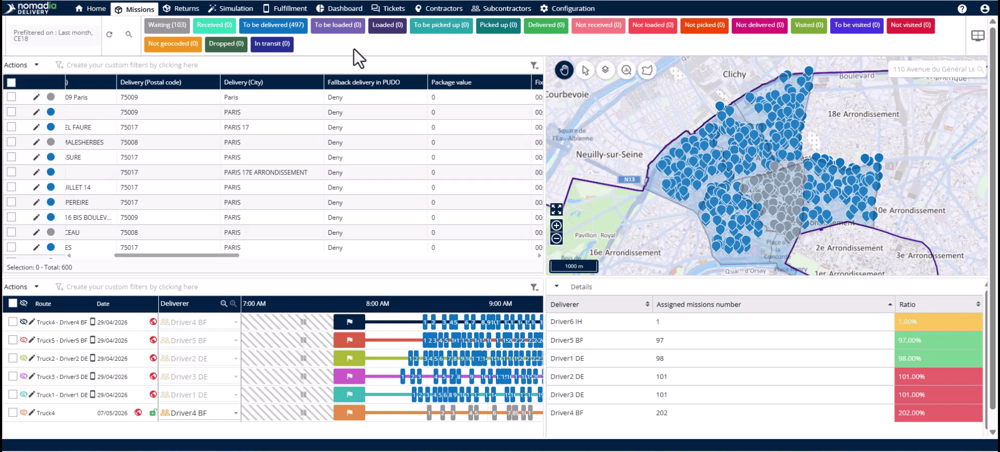

# Case_studies-PUDO_Configuration
# Case-Studies

PUDO (Pickup and Drop-off Points) allows drivers to leave packages at secure locations when customers are unavailable. This feature eliminates expensive redelivery costs and reduces vehicle emissions. You will achieve higher first-attempt success rates and improved customer convenience.

### Getting Started

*   A prepared list of PUDO locations including names and addresses.
*   Defined categories for your network, such as lockers or retail stores.
*   Access to the **Configuration** module in Nomadia Delivery.

1.  Open the **Configuration** module.

    

2.  Select the **PUDO type** page to define your categories.

    

3.  Navigate to the **PUDO** page to upload your physical locations.

    

### Feature Overview

*   **PUDO Types**: Categories like stores or lockers with specific handling requirements.

    

*   **PUDO List**: The database of actual locations and addresses your operation uses.

    

*   **PUDO Substatus**: Custom labels for the mobile app that apply only during PUDO interactions.

    

*   **Fallback PUDO**: A mission-level field that determines if a PUDO drop is permitted.

    

### How To: Configure PUDO Types

1.  Go to the **Configuration** module.

    

2.  Click on **PUDO type**.
3.  Define categories such as supermarkets, partner retailers, or lockers.

    

### How To: Upload the PUDO List

1.  Navigate to the **PUDO** page in the **Configuration** module.

    

2.  Open the **Actions** menu.
3.  Select the **Import** action to upload your list in bulk.

    

### How To: Set Up PUDO Substatuses

1.  Click the **Substatus** page in the **Configuration** module.

    

2.  Toggle the **PUDO only** switch.

    

3.  Enter operational labels like "Locker Deposited" or "PUDO Point Full".
4.  Click the **Save** button.

    

### How To: Enable Fallback PUDO on a Mission

1.  Find the **Fallback delivery in PUDO** field in the **Mission Table**.

    

2.  Click the **Edit** button to open the **Mission Editor**.

    

3.  Select the **Delivery information** section.
4.  Set the fallback characteristic to **Allow**, **Deny**, or **After retry**.

    

### Productivity Tips

*   💡 **Multi-Mission Support**: Use PUDO for both pickup and delivery missions to increase operational flexibility.
*   💡 **Bulk Updates**: Manage fallback permissions at scale using the **Import template** or the API during mission creation.
*   ⚠️ **Data Maintenance**: Keep the **PUDO list** current or drivers will be unable to find nearby drop-off points.
*   ⚠️ **Type Distinctions**: Always differentiate between stores and lockers as they require different handling processes like **OTP** codes.

