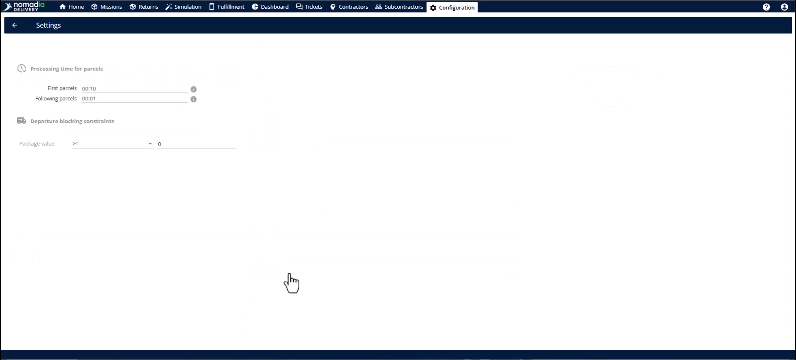
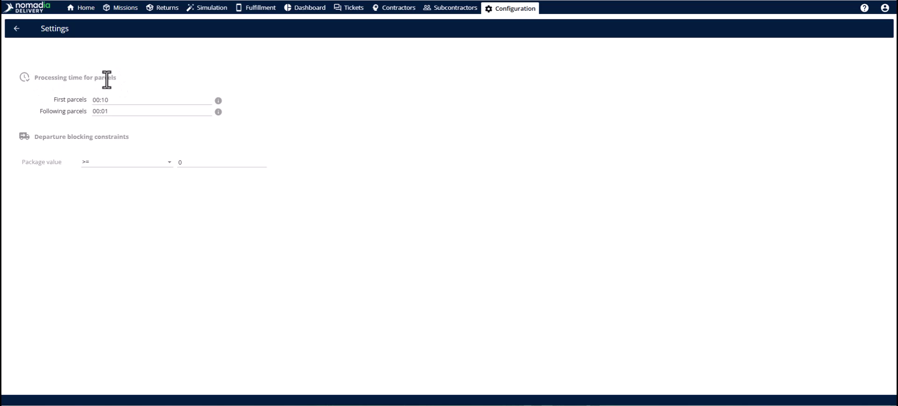
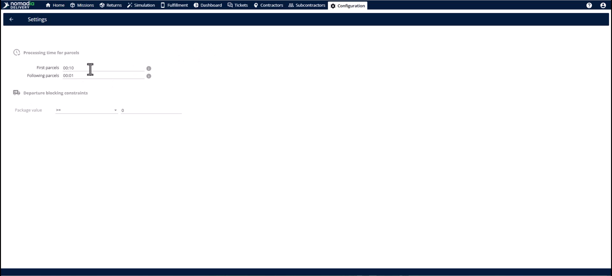
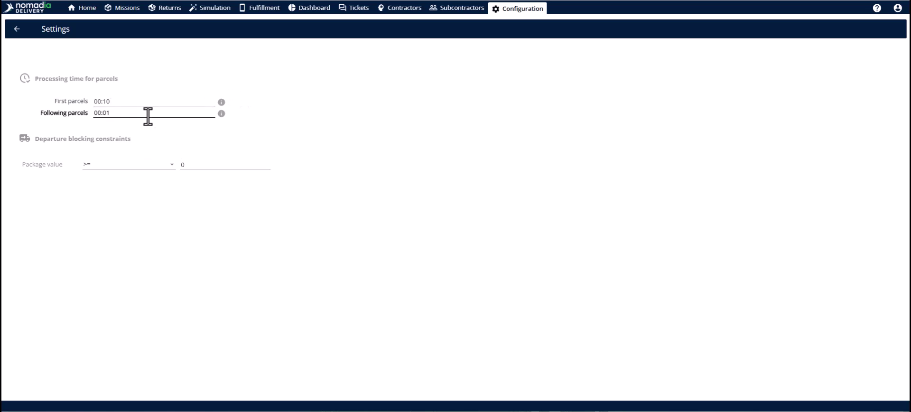
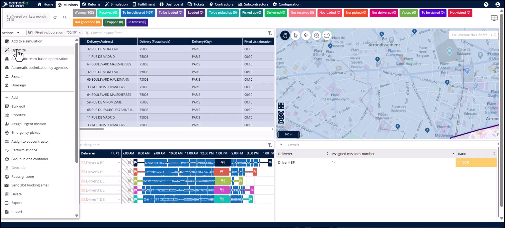

# Reduced fixed duration

The Reduced Fixed Duration feature optimizes bulk deliveries by adjusting time estimates for multiple packages at a single location. It eliminates "paper" time gaps that occur when the system overestimates the duration of subsequent drops. This allows you to plan more missions daily and maximize your actual fleet capacity.

#### Getting Started

**Prerequisites**:

* Missions sharing a **Delivery Address**, **Pickup Address**, or **Group Identifier**.
* Operational data regarding realistic delivery times for first and subsequent packages.

**Steps**:

1. Open the **Configuration** module.

2. Find the **Route** section in the left panel.

3. Click on **Settings**.

#### Feature Overview

* **Processing time for parcels**: This section defines how the optimization engine calculates time for grouped stops.

* **First mission in the group**: This field sets the full duration for the initial delivery at a location.

* **Following parcels in the group**: This field sets the reduced time for each additional package in the same group.

#### How To: Set Up Reduced Fixed Duration

1. Navigate to **Configuration** > **Route** > **Settings**.

2. Locate the **Processing time for parcels** section.
3. Enter the full delivery time in the first field.
4. Enter the reduced time for additional packages in the second field.
5. Click the **Save** button to apply the changes.

#### How To: Apply Optimized Durations

1. Open the **Mission** tab.

2. Select the missions you want to optimize.

3. Click the **Actions** menu.

4. Select your preferred optimization algorithm.
5. Review the updated durations in the **Simulation** module.

#### Productivity Tips

* 💡 **Capacity Gains**: Matching system data to road reality unlocks capacity for missions that otherwise remain unassigned.
* 💡 **Automatic Grouping**: The system automatically identifies stops at the same address even without a specific group identifier.
* ⚠️ **Lost Productivity**: Using default settings for bulk orders overestimates route times and reduces your daily delivery volume.
