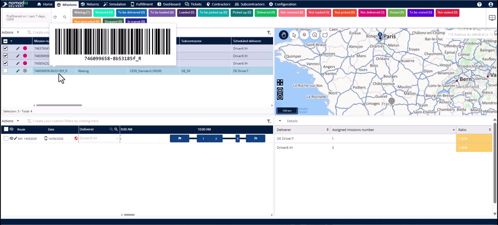
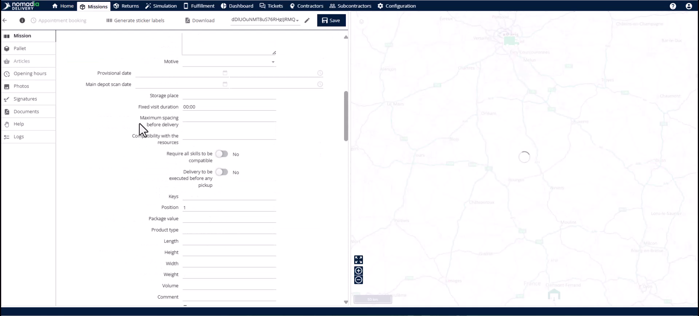
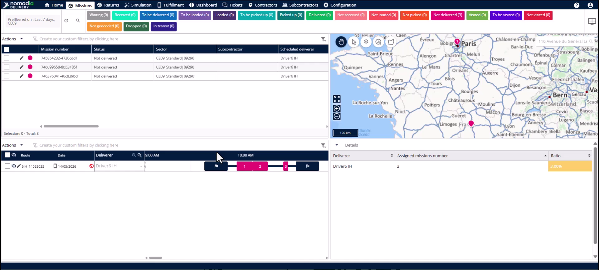
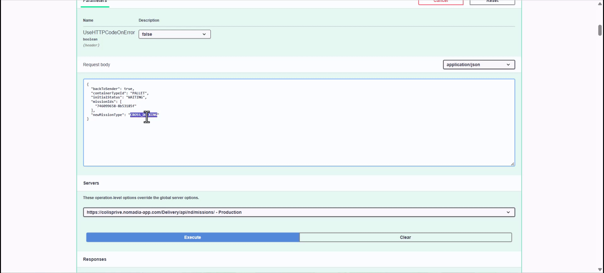

# Reverse Logistics

Nomadia Delivery integrates reverse logistics directly into your standard mission lifecycle. This feature allows you to trigger, plan, and execute returns without leaving the platform. You will achieve full visibility and optimized routing for every return journey.

#### Getting Started

* Access to the **Nomadia Delivery Back Office**.
* The **Mission Identifier** of the failed or uncollected delivery.
* API access to the **Reverse Logistics** endpoint.

- Open the **Back Office** and locate the specific route containing the mission to return.
- Identify if the item needs to go to the original sender or just the agency.

#### Feature Overview

* **Mission Identifier**: A unique code with an **\_r** suffix used to track returns back to their origin.

* **Back to Sender**: A parameter determining if an item travels to the sender or stays at the agency.
* **New Mission Type**: Use the **Mission Type** setting to classify the return as a **Cross Docking**, **Delivery**, or **Pickup** mission.
* **Edit Button**: This opens mission details to verify that pickup and delivery addresses have swapped correctly.

#### How To: Create a Cross Docking Return

Use this task when the item must return to the original sender via the agency.

1. Copy the **Mission Identifier** from the original mission in the **Back Office** or Retrieve the list of missions that must be returned to the sender using the API.

2. Include the list of mission identifiers in the Mission Ids array.&#x20;
3. Set the **Back to Sender** parameter to **True**.
4. Set the **New Mission Type** to **Cross Docking**.
5. Select **Execute** to generate the return mission**s in one shot**.

6. **Refresh** the **Back Office** UI to see the new mission with the **\_r** suffix.
7. Include the new **Cross-docking** mission in the next planning cycle for optimization.

#### How To: Create a Delivery Return

Use this task when the item only needs to reach the agency for sender collection.

1. Copy the **Mission Identifier** for the failed delivery mission or retrieve the list of missions that must be returned to the agency using the API.
2. Add the list of mission identifiers to the **Mission IDs** array.
3. Set the **Back to Sender** parameter to **False**.
4. Set the **New Mission Type** to **Pickup**.
5. Select **Execute** to create the mission.
6. Refresh the **Back Office** interface to view the new mission with the `_r` suffix..

#### Productivity Tips

* 💡 **Unified Tracking**: Use the **\_r** suffix to instantly link any return to its original forward delivery.
* 💡 **Seamless Planning**: Treat return missions like standard missions to include them in automated route optimization.
* ⚠️ **Manual Workarounds**: Avoid using spreadsheets to track returns outside the system to prevent data chaos.
