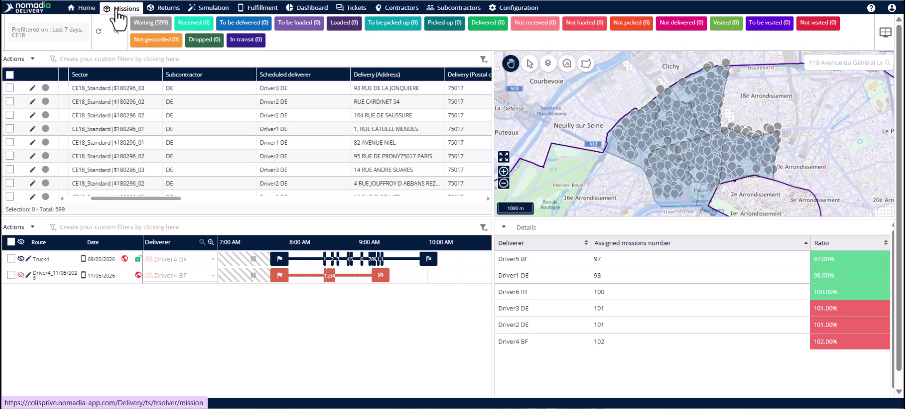
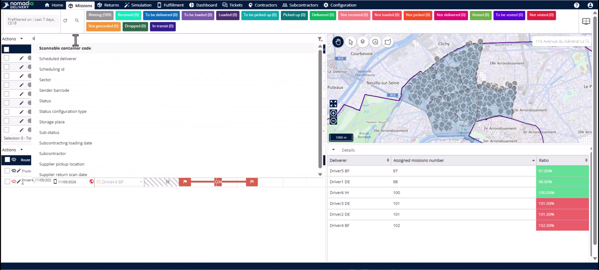
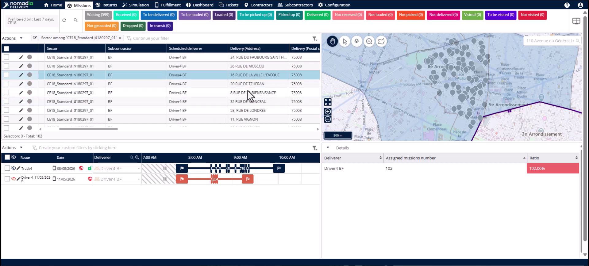
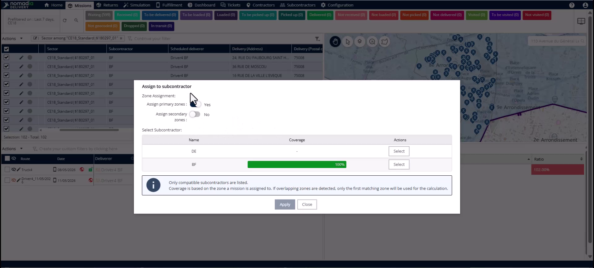
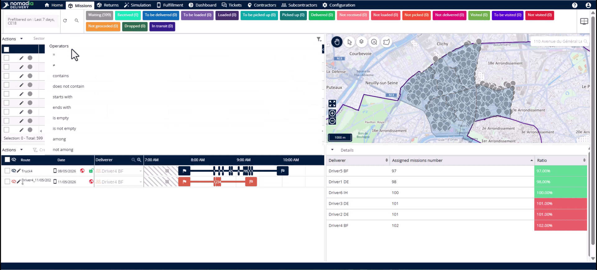
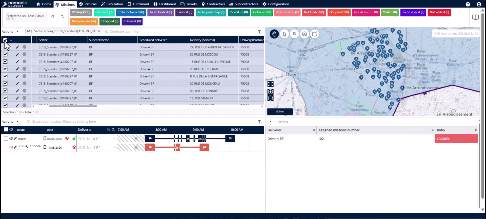
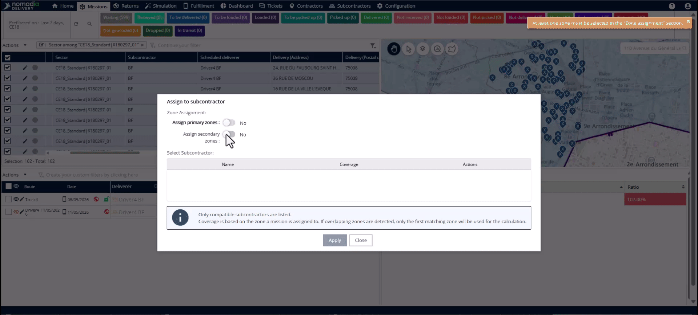
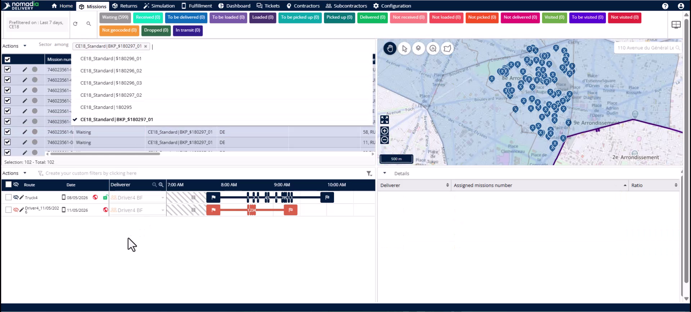

# Case_studies-Subcontractor_Swap_to_Backup_Zone
# Case-Studies

This feature allows you to quickly reassign missions when a primary subcontractor is unavailable. You will remap affected missions to a backup zone and a replacement subcontractor in one action. This ensures your workload remains visible to the replacement team and prevents delivery delays.

### Getting Started

Before starting, ensure the following requirements are met:
*   A backup zone is already created.
*   A replacement subcontractor is assigned to that backup zone.
*   You have identified the primary subzone that needs coverage.

1.  Open the **Missions** tab to begin the swap.

### Feature Overview

*   **Filter panel**: Use this to isolate missions belonging to a specific subzone.

*   **Mission table**: Displays the filtered list of missions requiring reassignment.

*   **Actions menu**: Contains the tool to reassign multiple missions at once.

*   **Assign to subcontractor**: Opens the pop-up to change mission ownership and zones.

*   **Assign primary zones**: A toggle to assign missions to the subcontractor’s main territory.

*   **Assign secondary zone**: A toggle to assign missions specifically to the backup zone.

*   **Select subcontractor table**: Lists available subcontractors and their geographic coverage for selected missions.

*   **Apply**: Executes the change across all selected mission records.

### How To: Isolate Affected Missions

1.  Navigate to the **Filter panel** and type "sector".

2.  Choose the **Among** filter option.

3.  Select the primary subzone that requires a backup swap.

### How To: Swap Subcontractors

1.  Select all missions in the **Mission table**.

2.  Open the **Actions menu** and click **Assign to subcontractor**.

3.  Ensure the **Assign primary zones** toggle is off.

4.  Activate the **Assign secondary zone** toggle.

5.  Select the replacement subcontractor showing 100% coverage in the **Select subcontractor table**.

6.  Click **Apply** to finalize the swap.

### How To: Verify the Swap

1.  Return to the **Filter panel** and search for "sector".

2.  Select the **Among** operator.

3.  Choose the backup zone you just assigned.

4.  Confirm the missions now appear under the correct backup sector and subcontractor.

### Productivity Tips

- 💡 **Efficiency**: One single action simultaneously updates the sector, the subcontractor, and the deliverer for all missions.
- ⚠️ **Driver Routing**: If no deliverer is assigned to the backup zone, the system clears the existing driver. This prevents missions from being routed to drivers no longer responsible for the territory.
- 💡 **Coverage Validation**: Look for 100% coverage in the subcontractor table to ensure their backup zone matches your selected missions.

