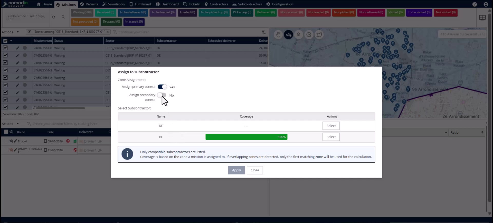
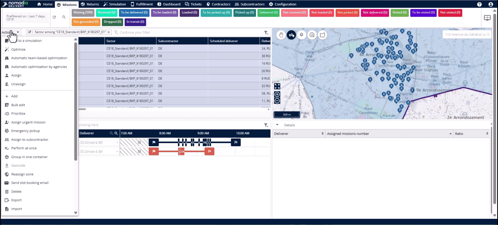
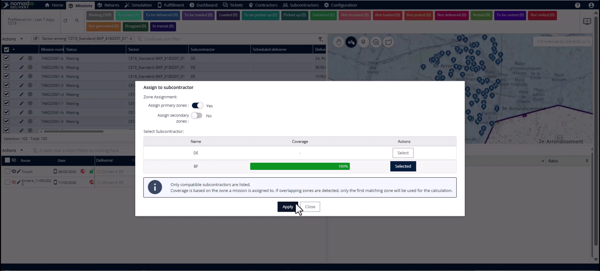
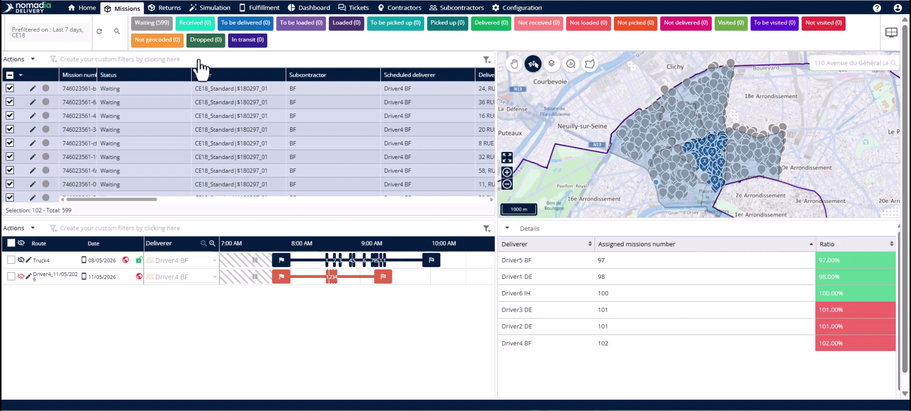

# Subcontractor Swap to Primary Zone

Reversing a subcontractor swap allows you to quickly restore missions to their original primary zone configuration. This process is essential if a swap was made in error or if a delayed subcontractor finally arrives at the depot. You will achieve a full restoration of sectors, subcontractors, and drivers across all missions in a single action.

#### Getting Started

* Access to the **Mission** tab.
* Missions must be currently assigned to a secondary (backup) zone.

1. Navigate to the **Mission** tab.

#### Feature Overview

* **Filter Panel**: Use this panel to isolate missions assigned to specific sectors or subcontractors.

* **Actions Menu**: Open this menu to access bulk operations for selected missions.

* **Assign to Subcontractor Pop-up**: Use this window to change zone assignments and select subcontractors.

* **Primary Zone Toggle**: Activate this switch to restore missions to their original primary configuration.

#### How To: Restore Missions to the Primary Zone

1. Open the **Filter Panel**.

2. Filter by the **Sector** column using the **Among** operator.

3. Select all missions currently assigned to the backup zone.

4. Click the **Actions Menu** and select **Assign to Subcontractor**.

5. Activate the **Primary Zone** toggle in the pop-up.

6. Select the original subcontractor showing 100% coverage.

7. Click **Apply** to complete the restoration.

#### How To: Verify the Restoration

1. Clear the backup zone filter from the mission table.

2. Apply a new filter using the **Sector** field to select the primary subzone.

3. Confirm that **Sector**, **Subcontractor**, and **Scheduled Deliverer** have been restored.

#### Productivity Tips

* 💡 **One-Toggle Restoration**: Reverting a swap is exactly as fast as making one by switching a single toggle.
* 💡 **Automatic Driver Relinking**: The original driver is automatically relinked to the missions when you restore the primary zone.
* 💡 **Bulk Efficiency**: Undo hundreds of mission assignments in seconds without manual editing or data re-importing.
* ⚠️ **Verification via Empty Table**: If the mission table appears empty after clicking apply, it confirms the backup filter no longer applies to those missions.
