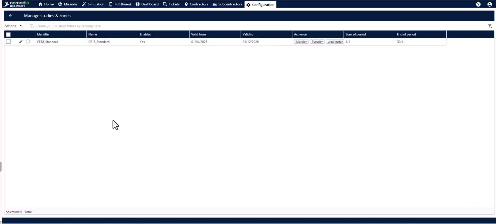
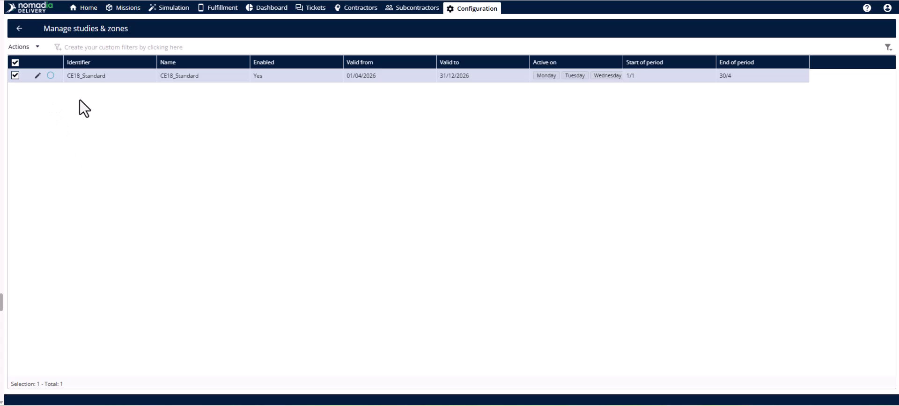
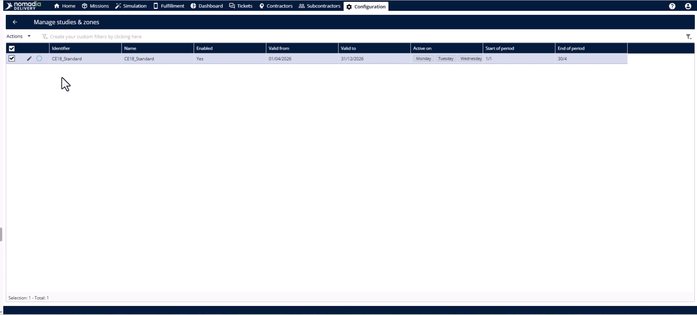
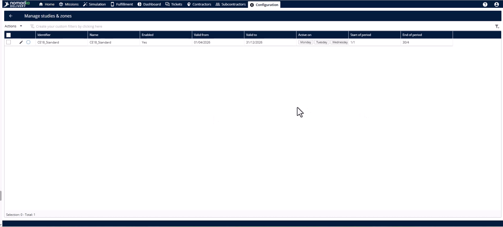
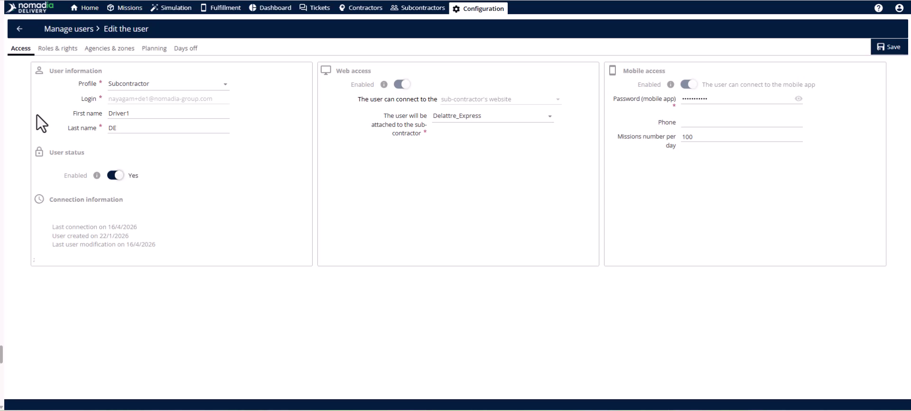
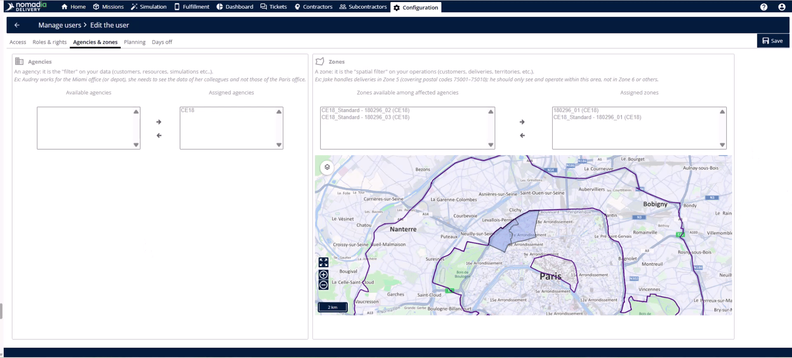

# Case_studies-assigning_sub_zones
# # Case-Studies

Transform map shapes into operational territories by assigning them to specific teams and deliverers. This process ensures every delivery stop has a clear owner and synchronizes data across the entire platform. By completing these assignments, you make the delivery zones live and ready for daily operations.

### Getting Started

*   Ensure subzones are created and geographically balanced.
*   Confirm all internal and subcontractor deliverers are registered in the system.

1.  Navigate to the **study table**.
    
2.  Select the specific study to assign.
    

### Feature Overview

*   **Actions menu**: Access the core assignment tools for your selected study.
    
*   **Assignment page**: The workspace where you define ownership for every individual subzone row.
    
*   **Team dropdown**: Choose between an in-house team or a subcontractor team for a specific territory.
    
*   **Deliverer dropdown**: Link a specific individual on the ground to a geographical boundary.
    

### How To: Assign Subzones and Verify Synchronization

1.  Open the **Actions menu** and click **assign**.
    
2.  Identify each subzone by its unique identifier and **color code**.
3.  Select the **in-house team** or **subcontractor team** for every subzone row.
    
4.  Pick the correct individual from the **Deliverer** dropdown for each row.
    
5.  Click the **assign button** to finalize the ownership.
    
6.  Navigate to the **configuration module** and select the **manage users page** to verify.
    
7.  Click **edit** on the deliverer and view the **agencies and zones tab**.
    
8.  Check the **subcontractor module** to confirm the assignment is reflected in their **profile**.
    

### Productivity Tips

- 💡 **Delegated Assignment**: Grant subcontractors rights to assign subzones so they can manage their own internal deliverers.
- 💡 **Instant Sync**: System data flows automatically across the platform without needing a manual refresh or sync.
- ⚠️ **Unassigned Zones**: Avoid leaving subzones unassigned as they remain non-operational shapes on the map without owners.