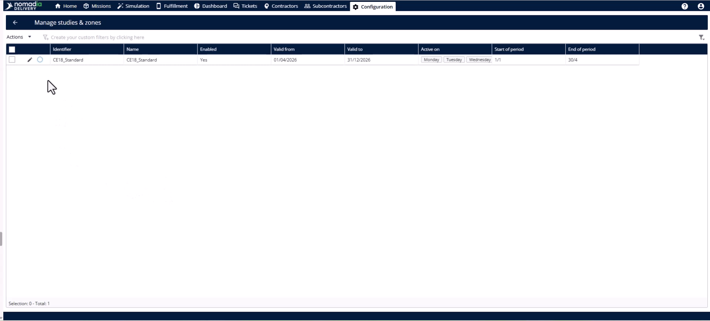
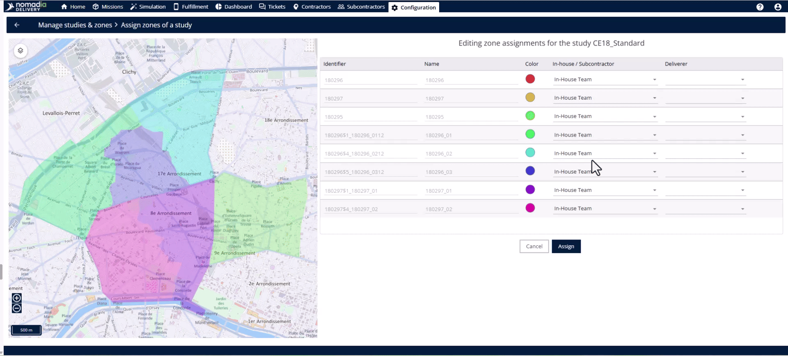

# Assigning Sub Zones

## Case\_studies-assigning\_sub\_zones

## # Case-Studies

Transform map shapes into operational territories by assigning them to specific teams and deliverers. This process ensures every delivery stop has a clear owner and synchronizes data across the entire platform. By completing these assignments, you make the delivery zones live and ready for daily operations.

#### Getting Started

* Ensure subzones are created and geographically balanced.
* Confirm all internal and subcontractor deliverers are registered in the system.

1. Navigate to the **study table**. 
2. Select the specific study to assign. 

#### Feature Overview

* **Actions menu**: Access the core assignment tools for your selected study. 
* **Assignment page**: The workspace where you define ownership for every individual subzone row. 
* **Team dropdown**: Choose between an in-house team or a subcontractor team for a specific territory. 
* **Deliverer dropdown**: Link a specific individual on the ground to a geographical boundary. 

#### How To: Assign Subzones and Verify Synchronization

1. Open the **Actions menu** and click **assign**. 
2. Identify each subzone by its unique identifier and **color code**.
3. Select the **in-house team** or **subcontractor team** for every subzone row. 
4. Pick the correct individual from the **Deliverer** dropdown for each row. 
5. Click the **assign button** to finalize the ownership. 
6. Navigate to the **configuration module** and select the **manage users page** to verify. 
7. Click **edit** on the deliverer and view the **agencies and zones tab**. 
8. Check the **subcontractor module** to confirm the assignment is reflected in their **profile**. 

#### Productivity Tips

* 💡 **Delegated Assignment**: Grant subcontractors rights to assign subzones so they can manage their own internal deliverers.
* 💡 **Instant Sync**: System data flows automatically across the platform without needing a manual refresh or sync.
* ⚠️ **Unassigned Zones**: Avoid leaving subzones unassigned as they remain non-operational shapes on the map without owners.
