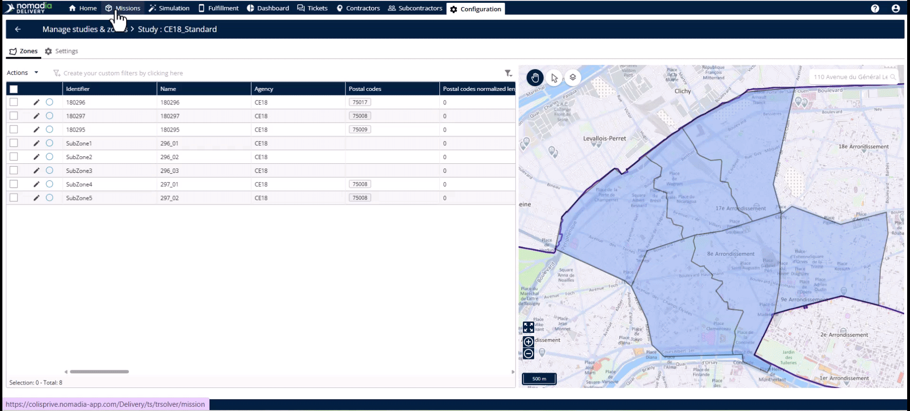
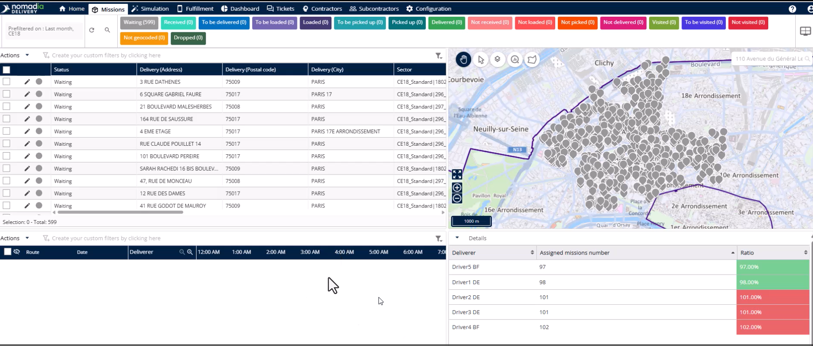
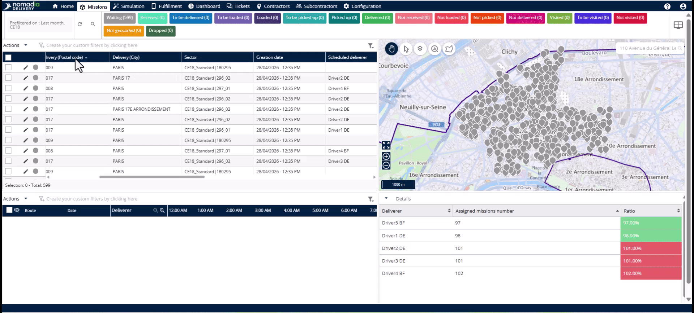
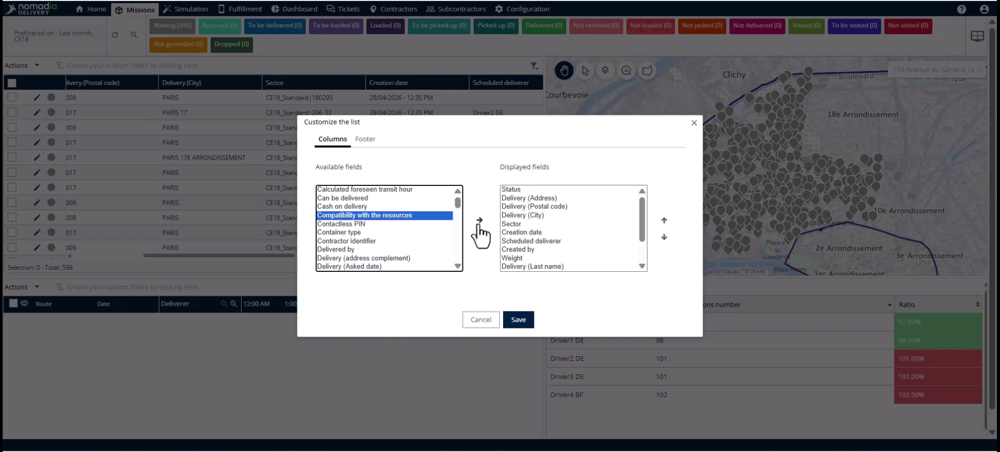

# Assigning zones to missions

This feature automatically associates new missions with predefined delivery sectors the moment they enter the system. It eliminates the need for manual postal code lookups or dispatcher intervention. You will achieve an efficient, fully automated workflow from mission creation to sector assignment in seconds.

#### Getting Started

Before using automatic sector assignment, ensure your operational infrastructure is configured:

* Create your studies.
* Map primary zones.
* Build and balance subzones.
* Assign deliverers to their specific territories.

To begin the setup:

1. Navigate to the **Mission tab**.
2. Click the **Actions menu**.

#### Feature Overview

* **Geocoding**: This process converts address data into latitude and longitude coordinates for geographical map display.
* **Sector Field**: This column displays mission assignments using the format "Study Name | Subzone Name".
* **Zone icon**: Use this map control to toggle the visibility of subzone boundaries.

#### How To: Import Missions and Assign Sectors

Follow these steps to import missions via Excel and trigger automatic assignment.

1. Click the **Import button** in the **Actions menu**.

2. Select the mission file from your computer and click **Open**.
3. Select the desired tab and click the **Validate button**.
4. Review the geocoded mission locations on the map.
5. Click the **Import button** to push the data into **Nomadia Delivery**.

6. The **Sector** and **Scheduled Deliverer** fields are automatically populated based on the configured zone settings.

<figure><figcaption></figcaption></figure>

#### How To: Surface the Sector Column

If the sector information is hidden, follow these steps to display it in your table.

1. Click the **Actions menu**.
2. Select **Customize the list item**.

3. Locate the **Sector** field within the **Available fields** column.
4. Click the **Arrow button** to move it to the **Displayed fields** column.

5. Click **Save** to update the mission table.

#### Productivity Tips

* 💡 **Operational Reviews**: Activate zone boundaries on the map to spot overloaded territories or uneven mission distributions.
* ⚠️ **Static Boundaries**: Avoid using outdated boundaries when demand changes; update your configuration to keep operations dynamic.
