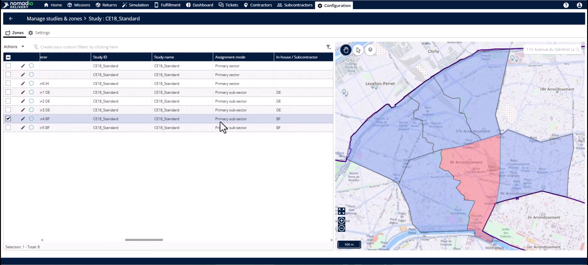
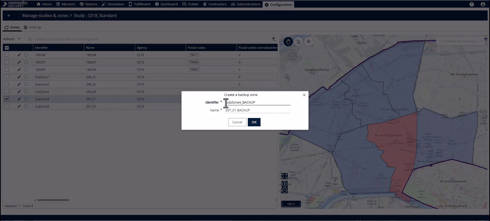
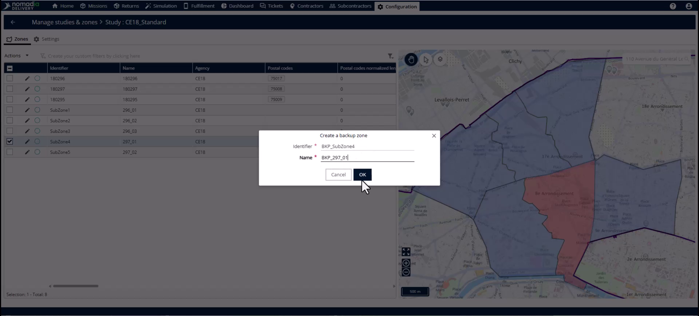
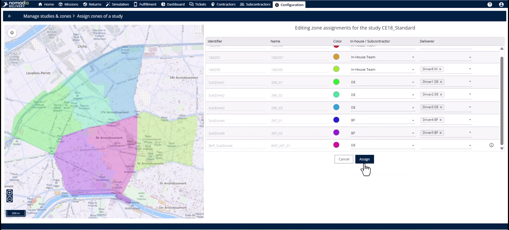
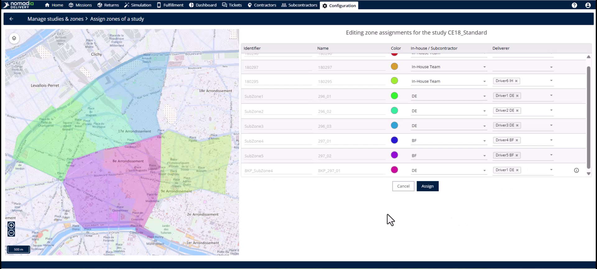
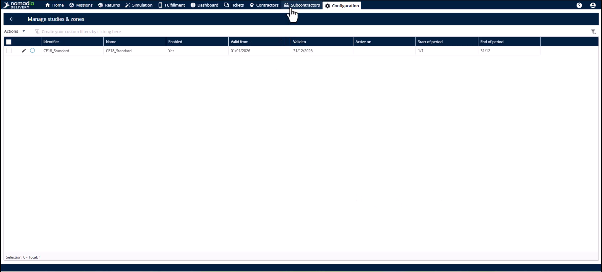
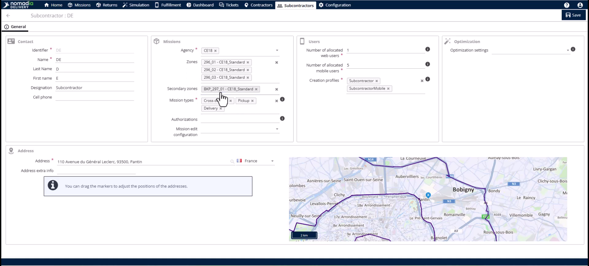

# Creating Backup Zone

The Backup Zone feature allows you to handle emergency subcontractor no-shows by creating temporary secondary sectors. It enables quick hand-offs of existing missions to available teams without changing your primary infrastructure. This ensures your SLAs are met and deliveries arrive on time despite overnight changes.

#### Getting Started

* Access to the **configuration module**.
* An existing primary subzone requiring backup.
* A replacement subcontractor available for assignment.

1. Navigate to the **configuration module**.

2. Click **manage studies and zones**.

3. Select the **pencil icon** next to the relevant study.

#### Feature Overview

* **Primary sub-sector**: The original delivery territory assigned to the first subcontractor.

* **Secondary sub-sector**: The newly created backup zone assignment mode distinguishing it from the original.

* **Identifier**: A unique code field for the backup zone.

* **Zone table**: The list within the study displaying both primary and backup zones.

#### How To: Creating a Backup Zone

1. Click the **primary subzone** you want to back up.

2. Open the **actions menu**.

3. Select **create a backup zone**.

4. Enter a new **identifier** and **name**.

5. Click **OK** to create the zone.

#### How To: Assigning a Backup Subcontractor

1. Open the **actions menu** from the **study table**.

2. Click **assign**.

3. Choose the relevant study.

4. Click **actions** and select **assign** again.

5. Pick a different subcontractor and driver for the backup zone.

6. Click **assign** to link the territory.

#### How To: Verifying the Assignment

1. Navigate to the **subcontractors module**.

2. Click **edit** on the replacement subcontractor.

3. Check the **secondary zones** drop-down.

#### Productivity Tips

* 💡 **Automatic Synchronization**: System updates happen immediately without manual refreshes after clicking assign.
* ⚠️ **Existing Missions Update**: Replacement subcontractors cannot see current missions until you update the sector and deliverer info.
* 💡 **Preserve Infrastructure**: Backup zones are temporary and do not change your primary subzone configurations.
