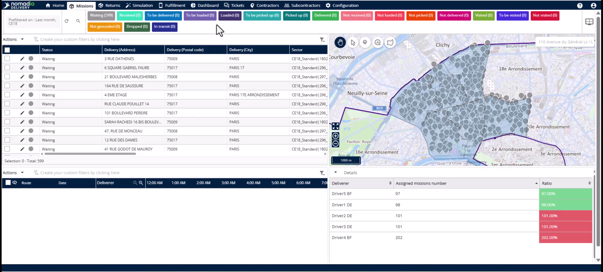
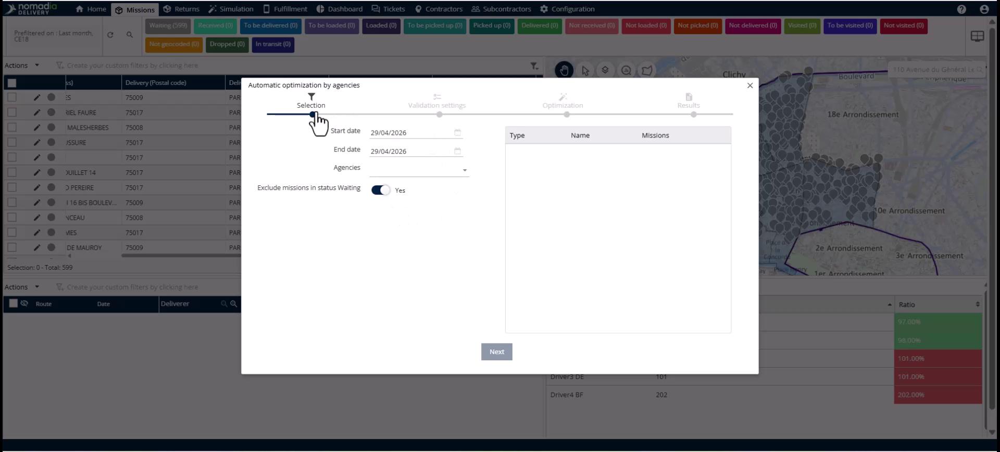

# Optimizing\_missions\_for\_agency

## Case\_studies-optimizing\_missions\_for\_agency

## Case-Studies

Route optimization unlocks operational value by reducing excess kilometers and fuel costs. This feature automates the workflow from mission selection to creating optimized routes for your drivers. You will achieve more efficient sequencing and lower CO2 emissions across your entire fleet.

#### Getting Started

Before launching the optimization wizard, ensure the following requirements are met:

* Missions are loaded into the system.
* Sectors are correctly assigned.
* Deliverers are mapped to their respective teams.

1. Open the **Mission Tab** to view your loaded missions.

<figure><figcaption></figcaption></figure>

2. Click the **Action Menu**.
3. Select **Automatic optimization by agencies** to launch the wizard.

#### Feature Overview

* **From date** and **To date**: Defines the specific window of missions for optimization.

<figure><figcaption></figcaption></figure>

* **Automatically validate the routes**: Toggles automatic finalization of routes without manual review.
* **Minimum validation threshold**: Sets a percentage "quality gate" for automatic validation.
* **Ignore conflicts**: Overrides old mission data with the new optimized plan.
* **Publish routes**: Instantly pushes validated routes to the driver's mobile application.
* **Progress bar**: Displays the real-time status of team and driver optimizations.
* **Open the root plan button**: Allows detailed analysis of individual team simulations.

#### How To: Launch Automatic Optimization

1. Set the **From date** and **To date** for your mission window.

<figure><figcaption></figcaption></figure>

2. Select your desired **Agency** from the list.
3. Choose to include or exclude missions in **waiting status**.
4. Click **Next**.
5. Toggle **Automatically validate the routes** if no manual review is needed.
6. Enter a **Minimum validation threshold** between 50 and 100.
7. Enable **Ignore conflicts** to override existing data with the new plan.
8. Toggle **Publish routes** to send routes to drivers and notifications to customers.
9. Click **Next** to run the optimization.
10. Monitor the **Progress bar** for each team optimization.
11. Click **Open the root plan button** to review details once finished.
12. Close the wizard to create the routes in the system.

**Troubleshooting**

If a route shows an error icon, conflicts in underlying data must be resolved.

1. Click the **Open route plan button** on the route with the error.
2. Click the **Warning button** inside the simulation.
3. Review the reason for the error, such as incompatible time windows or vehicle constraints.

#### Productivity Tips

* 💡 **Automatic Mission Recovery**: The system automatically includes missions with delivery dates earlier than today by default.
* 💡 **Instant Customer Updates**: Enabling **Publish routes** can automatically send email or SMS notifications to customers.
* ⚠️ **Quality Safeguard**: Setting a **Minimum validation threshold** (e.g., 80%) prevents routes with too many unresolved missions from auto-validating.
* ⚠️ **Mandatory Investigation**: Never close optimization errors without investigating, as unresolved conflicts may cause execution failure in the field.
