# Case_studies-optimizing_missions_for_agency
# Case-Studies

Nomadia Delivery automates the process from mission selection to optimized route creation. This feature reduces fuel costs and CO2 emissions by eliminating inefficient sequencing. Planners achieve achievable routes for drivers with minimal manual intervention.

### Getting Started

*   Zones must be built and sectors assigned.
*   Deliverers must be mapped and configured in the system.
*   Missions must be geocoded and loaded.

1. Navigate to the **Mission tab**.

2. Click the **Action menu**.

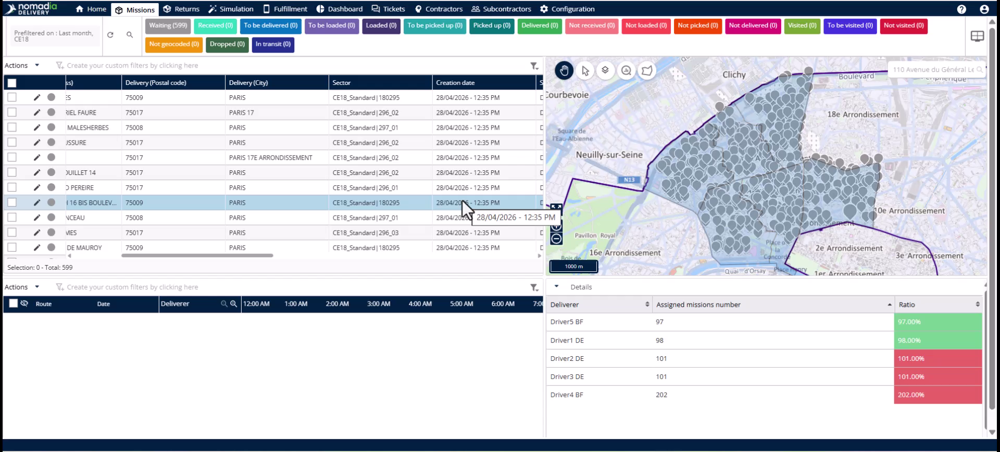

3. Select **Automatic optimization by agencies**.

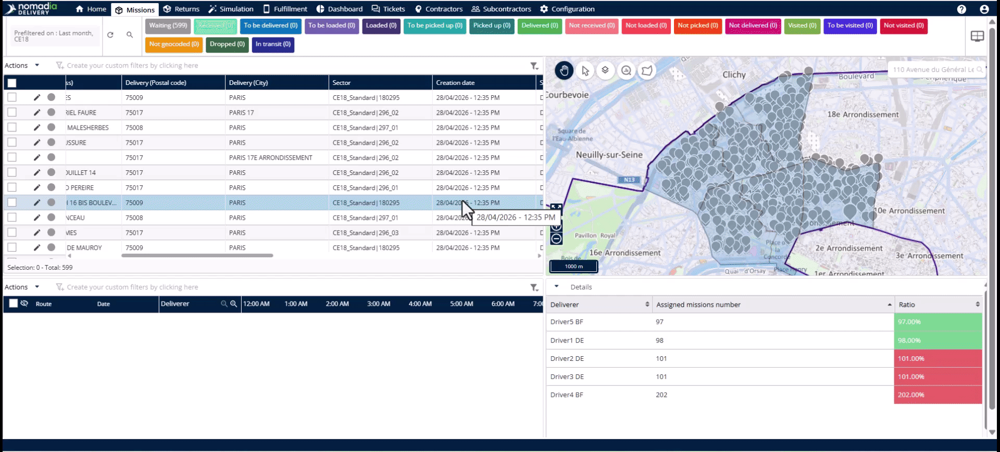

### Feature Overview

*   **From date** and **To date**: Define the specific time window for missions.

*   **Agency** selection: Choose the specific agency to optimize.

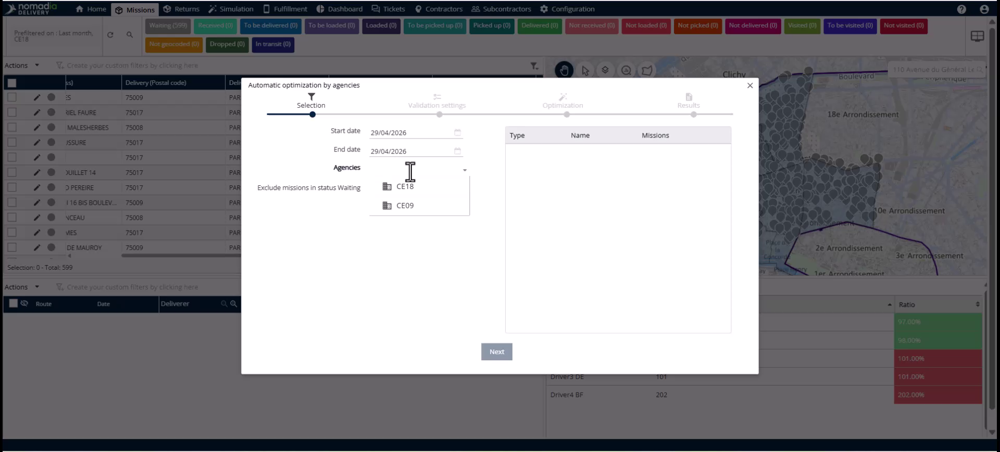

*   **Automatically validate the routes**: Toggle this to finalize routes without manual review.

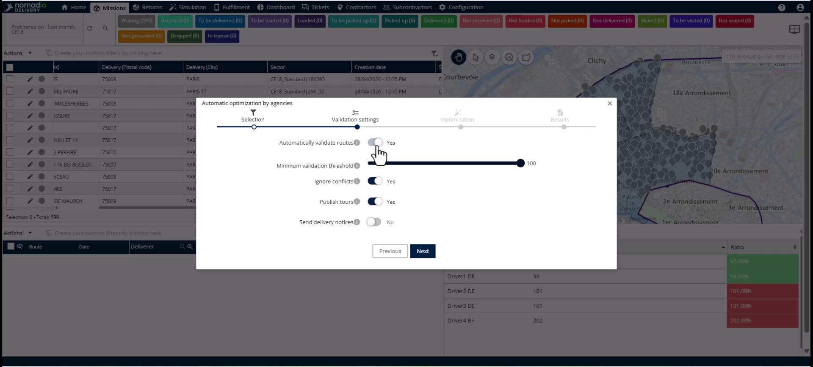

*   **Minimum validation threshold**: Set a quality gate between 50 and 100 percent.

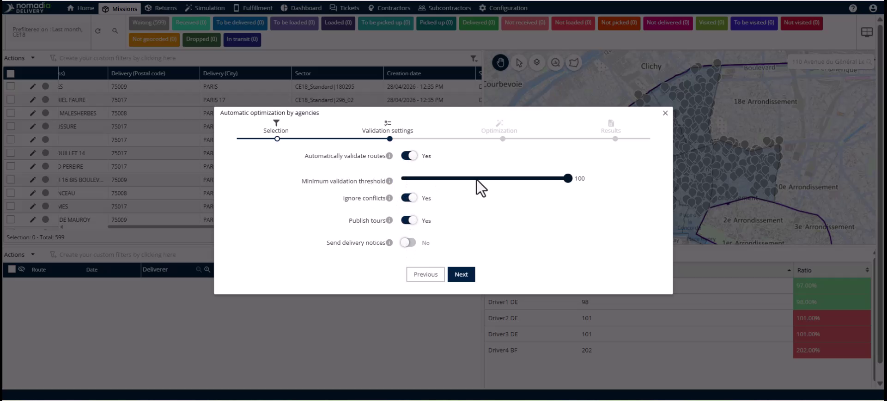

*   **Publish routes**: Instantly pushes validated routes to the driver's mobile application.

*   **Progress bar**: Displays real-time status for each team's optimization.

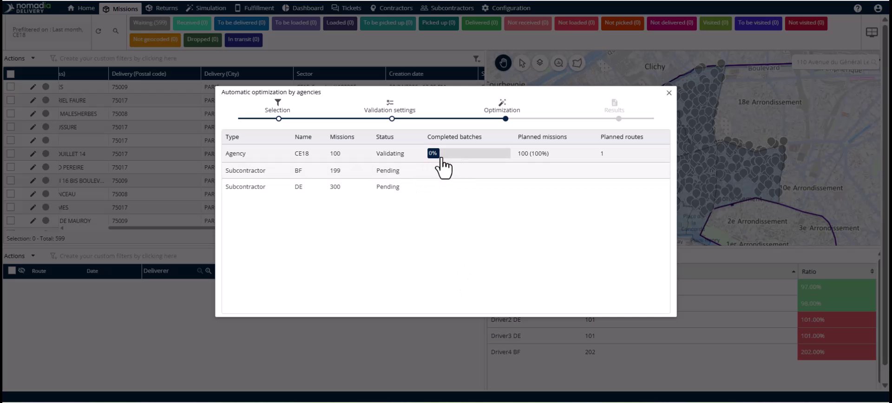

### How To: Launch Optimization

1. Click the **Action menu**.

2. Select **Automatic optimization by agencies**.

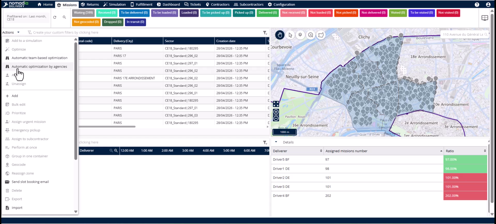

3. Set the **From date** and **To date** for your missions.

4. Select your agency from the **Agency** list.

5. Choose to include or exclude missions in **waiting status**.

6. Click **Next**.

### How To: Configure Validation and Notifications

1. Toggle **Automatically validate the routes** for high-volume operations.

2. Set a **Minimum validation threshold** as a quality gate.

3. Enable **Ignore conflicts** to override existing data with the new plan.

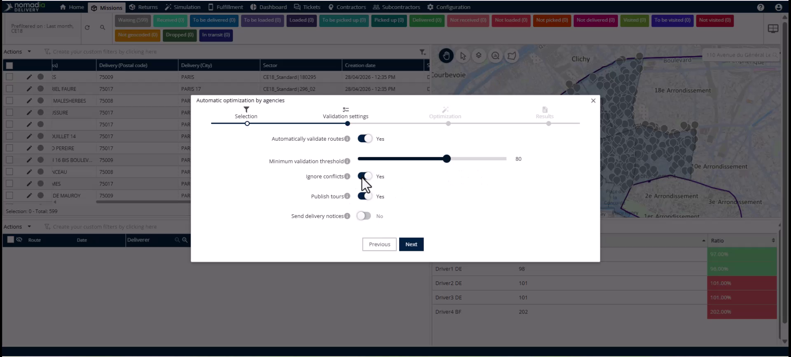

4. Toggle **Publish routes** to push plans to drivers immediately.

5. Opt to send automatic notifications to customers via email or SMS.

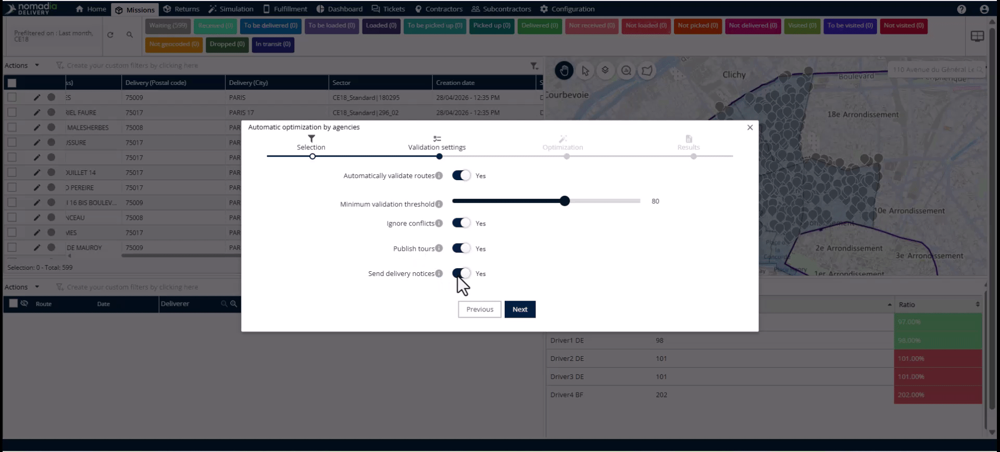

6. Click **Next** to run the optimization.

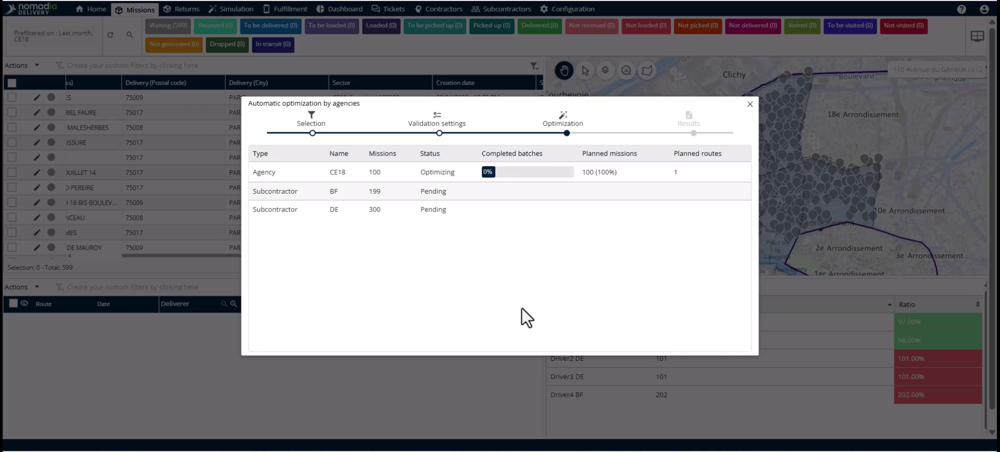

### How To: Monitor and Review

1. Watch the **Progress bar** for live updates on team optimizations.

2. Click the **Open the route plan button** to analyze simulations.

3. Review routes in a **draft state** if publishing was left off.

4. Click on a route and manually publish it if necessary.

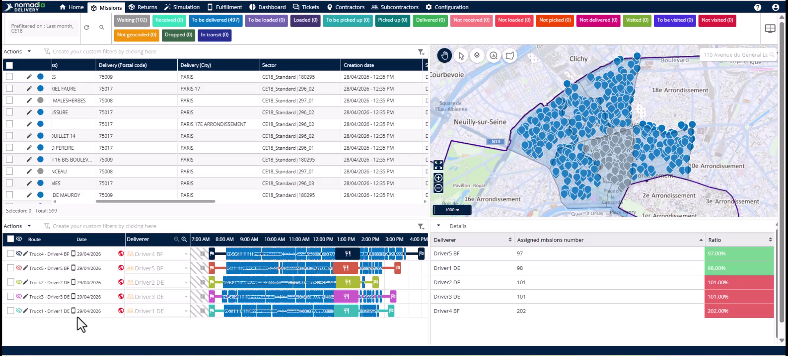

#### Troubleshooting

*   If an error icon appears, click the **Open the route plan button**.
*   Click the **Warning button** inside the simulation to see the error reason.
*   Identify conflicts like incompatible time windows or vehicle constraint mismatches.

### Productivity Tips

*   💡 **Auto-Pull Past Missions**: The system automatically includes missions with delivery dates earlier than today.
*   💡 **Hands-Free Communication**: Enabling route publishing can trigger automatic customer notifications via SMS and email.
*   ⚠️ **Data Conflicts**: Do not close errors without investigating them as unresolved conflicts may hinder field execution.

