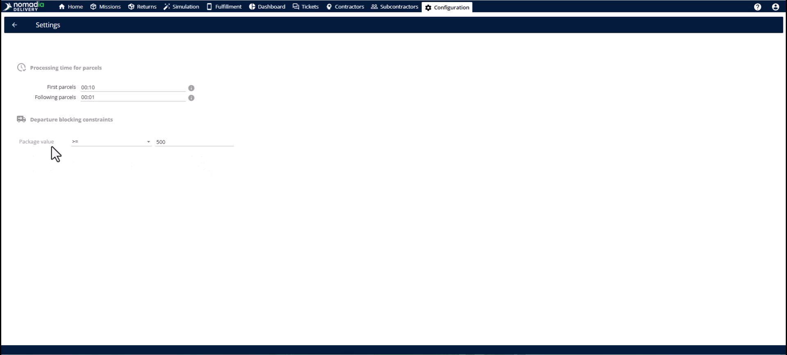
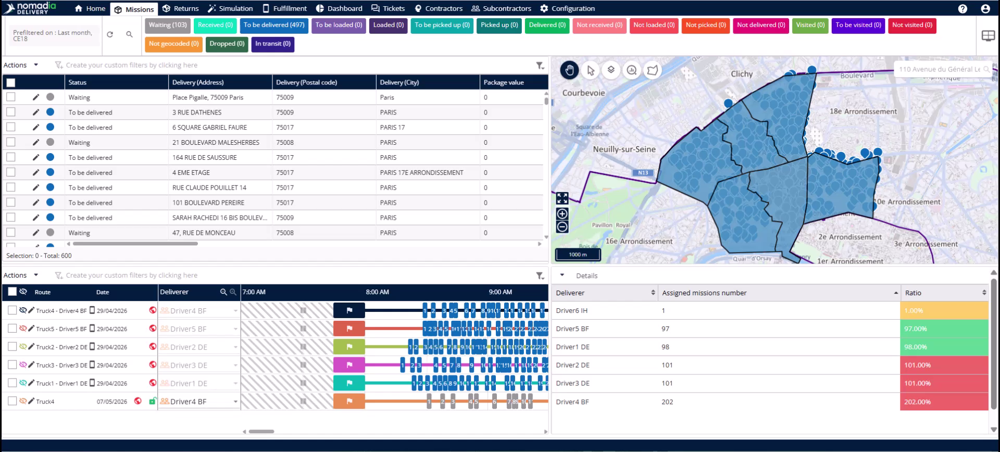
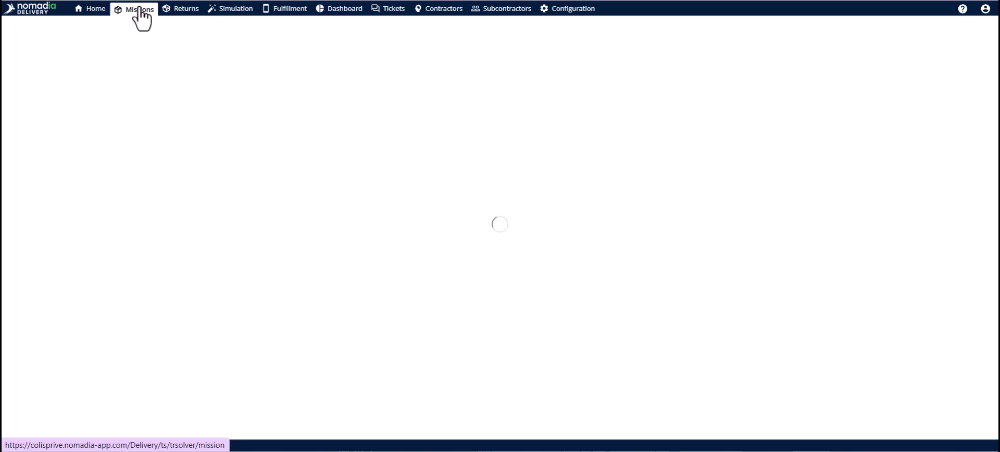
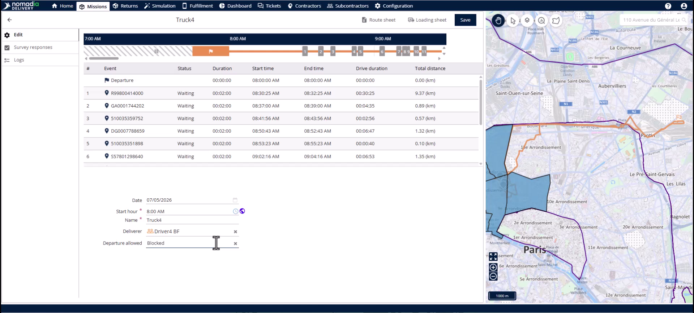
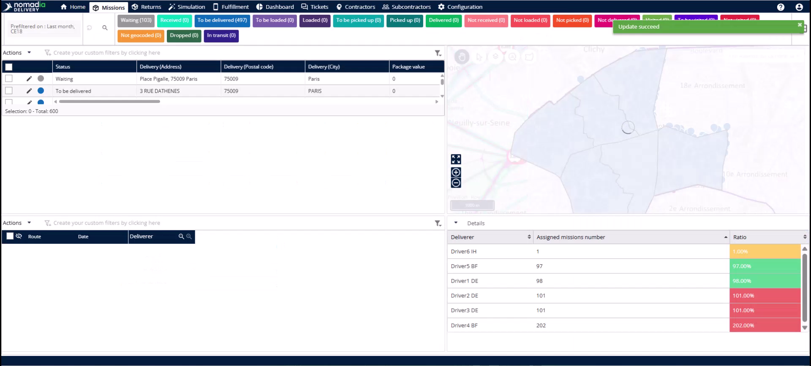

# Route Blocking Settings

##

Route blocking systematically prevents drivers from starting routes containing high-value items until a planner reviews them. This feature minimizes financial risks like cargo theft and ensures security protocols are followed every day. Users achieve a proactive, documented compliance process for every delivery.

#### Getting Started

Requirements:

* Missions must include a **package value** field.
* Access to the **configuration module** is required.

Steps:

1. Open the **configuration module**.

2. Select **settings** under the **route** section.

3. Enter a numerical threshold in the **package value condition** field.

4. Click **save** to apply the configuration.

#### Feature Overview

* **Package value condition**: Define the monetary threshold that triggers an automatic route lock.

* **Lock symbol**: This icon appearing on a route signifies it contains a high-value mission and is blocked.

* **Tooltip**: Hover over the lock to see the specific reason for the block.

* **Departure allowed drop-down**: Select between **No blocking**, **Blocked**, or **Granted** to manage route access.

* **Log section**: Review the history of who approved a route and when it occurred for compliance.

#### How To: Optimize and Identify Blocked Routes

1. Navigate to the **mission tab**.

2. Select missions that exceed your configured **package value**.

3. Click **optimize**.

4. Select the new route and click **validate**.

5. Look for the **lock symbol** in the **mission tab** to confirm the block is active.

#### How To: Grant Access to a Blocked Route

1. Click the **pencil icon** next to the blocked route.

2. Open the **departure allowed drop-down**.

3. Select **granted**.

4. Click the **save button**.

5. Verify the **green unlocked icon** is now displayed.

#### Productivity Tips

* 💡 **Quick Filtering**: Filter by **departure allowed** in the mission tab to instantly see all blocked routes.
* 💡 **Compliance Records**: Use the **log section** to document who reviewed high-value missions for future disputes.
* ⚠️ **Automatic Lock**: Drivers cannot start routes in the mobile app if the status is **Blocked**.
