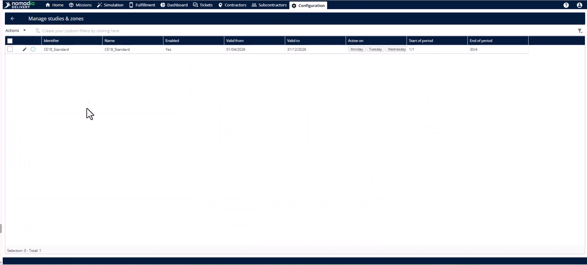
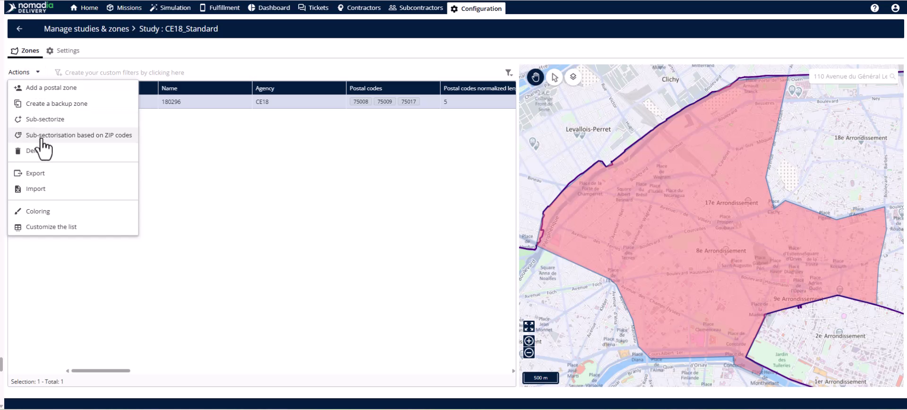
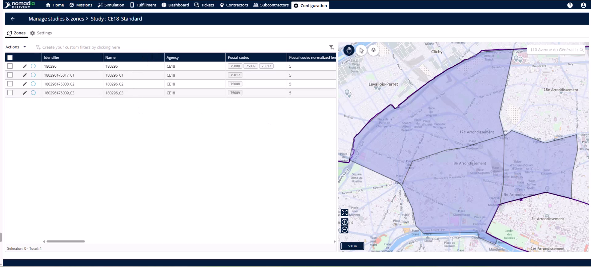

# Case_studies-sub-sector_using_postal_code
# Case-Studies

Subsectorization automatically splits a primary zone into individual subzones based on its associated postal codes. Use this feature to instantly create precise territories without needing mission data or manual balancing. It is the fastest path to a fully structured delivery area.

### Getting Started

Prerequisites and initial setup:
* An existing primary zone with multiple associated postal codes.
* Access to the **Configuration** module.

1. Head to the **Configuration** module and open **Manage Studies and Zones**.

2. Find the study you are working with and click the **Edit** button.

### Feature Overview

* **Zone tab**: The area within a study where you manage primary zones and subzones.

* **Actions menu**: This menu contains tools to modify your selected primary zone.

* **Subsectorize based on zip codes**: This tool instantly generates one subzone for every postal code in your zone.

* **Zone table**: This list displays the generated subzones and their properties immediately.

### How To: Subsectorize a Primary Zone

1. Navigate to the **Zone tab** inside your study.

2. Select the **primary zone** you want to subsectorize.

3. Open the **Actions menu**.

4. Click **Subsectorize based on zip codes**.

5. Review the new subzones listed in the **Zone table**.

6. Verify the geographic boundaries on the **map**.

### Productivity Tips

* 💡 **Instant Setup**: Create dozens of subzones in one click without loading mission data or waiting for processing.
* 💡 **Maximum Precision**: Use this method when postal code boundaries are the most accurate territory markers in your market.
* ⚠️ **Workload Balancing**: Avoid this feature if you must balance workloads across missions; use the Territory Manager instead.

