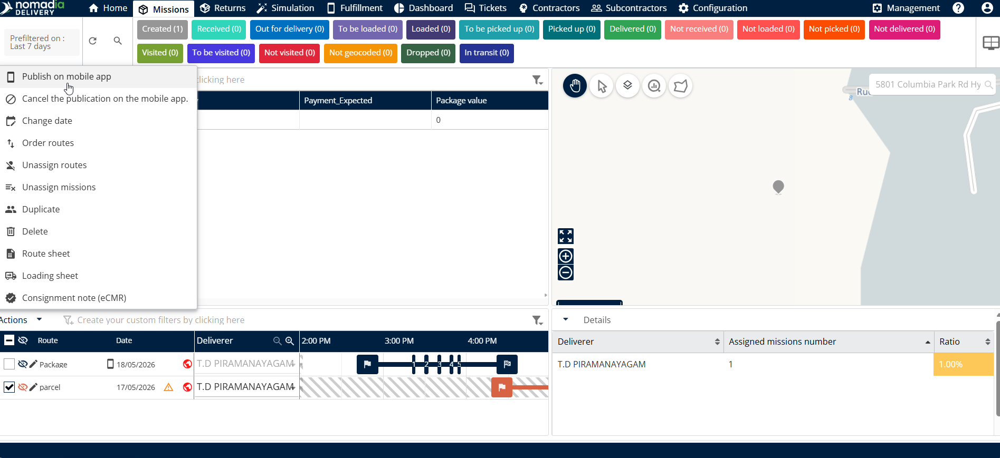
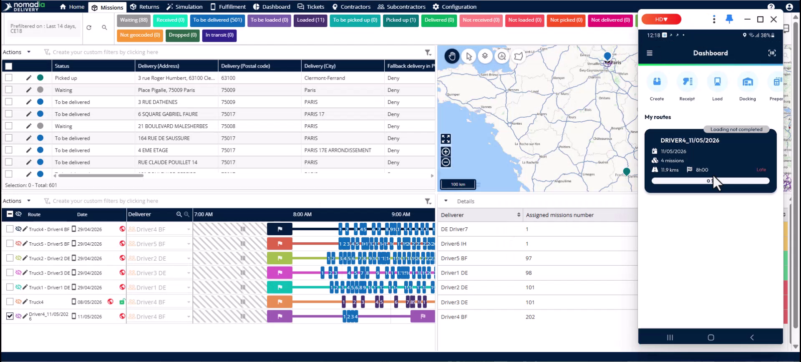
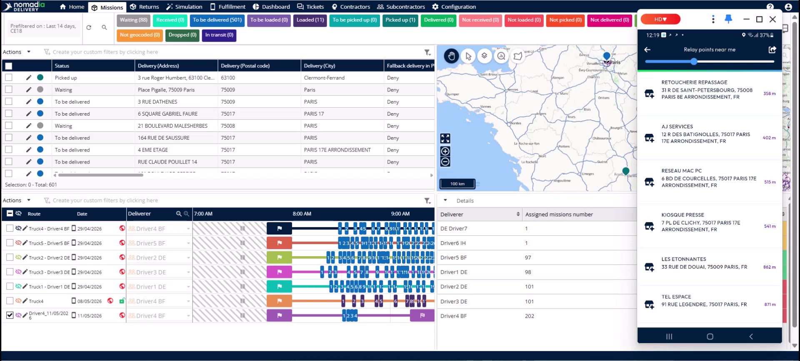
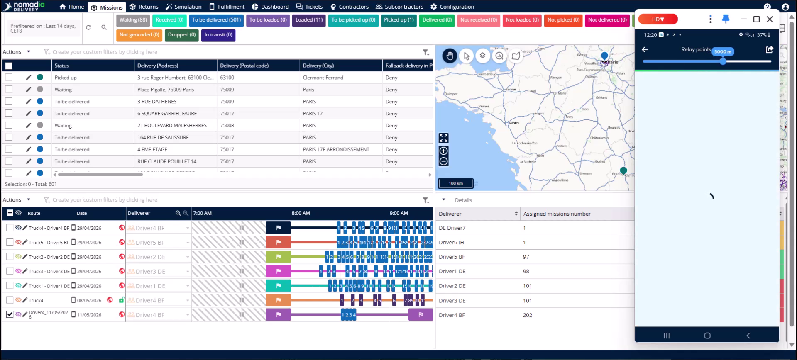
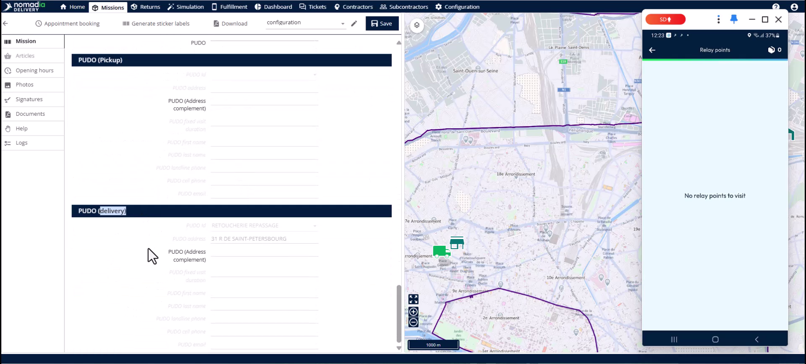
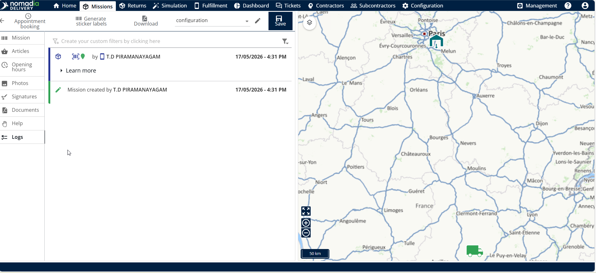
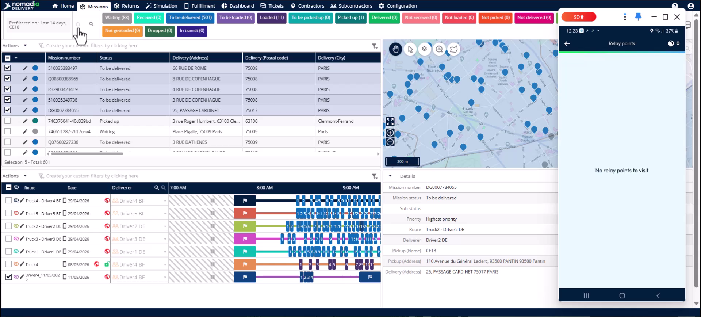

# Delivery at PUDO

The PUDO (Pick-Up Drop-Off) delivery flow allows drivers to redirect parcels to local relay points when customers are unavailable. This feature eliminates the need for expensive re-delivery runs and keeps your depot backlog manageable. You will achieve higher first-attempt resolution rates and provide better flexibility for your customers.

#### Getting Started

Before using this feature, ensure the following requirements are met:

* PUDO network data is configured in the system.
* The **fallback delivery in PUDO** field is enabled for the specific mission.
* Sub-statuses for failed PUDO drops (e.g., "PUDO full") are defined in the **configuration menu**.

- Create a route in the back-office.
- Select the checkbox for the route you want to share in the **route table**.

* Click the **actions** button.

<figure><figcaption></figcaption></figure>

* Select **publish on mobile app**.

* Click **OK** to confirm the publication.

#### Feature Overview

* **PUDO point selection page**: Displays a list of preloaded relay locations near the customer address.

* **Search radius slider**: Allows the driver to increase or decrease the distance to find more relay points.

* **PUDO delivery location ID**: Automatically records the specific point where the driver deposited the parcel.

* **Mission logs tab**: Tracks every action from the first delivery attempt to the final PUDO deposit.

<figure><figcaption></figcaption></figure>

#### How To: Manage Failed Deliveries

**Driver: Redirecting a Parcel**

1. Tap the shared route in the mobile app.
2. Load the vehicle and tap **validate my loading**.

3. Tap **start my route**.
4. At the customer location, select **do not deliver** if the customer is absent.

5. Select the **customer not available** sub-status.
6. Swipe the slider to adjust the search radius if necessary.
7. Select a **PUDO point** from the list.
8. Confirm the status and continue other deliveries.
9. When ready to drop, tap the relay point notification in the **route details**.
10. Select the mission and use the **scanner** to deposit the parcel.

11. Capture the **signature** and a **photograph** to validate the drop.

**Planner: Verifying the Drop**

1. Click the **refresh button** in the back-office to see real-time updates.

2. Open the mission in the **editor** to verify the **PUDO delivery location ID**.
3. Check the **logs tab** for a full sequence of time-stamped actions.

**Troubleshooting: PUDO Issues**

If a PUDO location is full or closed:

1. Mark the mission as **not delivered at the PUDO location**.
2. Select the specific sub-status, such as **PUDO full** or **PUDO closed**.
3. The mission will appear as **unsolved** for the planner.
4. Include the mission in the next **planning cycle** for a redelivery attempt.

#### Productivity Tips

* 💡 **Automatic Detection**: The system automatically identifies PUDO locations within a 5 km radius of the route.
* 💡 **Preloaded Data**: Drivers do not need to search manually as nearest options are preloaded before they open the app.
* 💡 **Real-time Sync**: Information synchronizes with the back-office immediately after the driver confirms the drop.
* ⚠️ **Accurate Sub-statuses**: Always use the correct sub-status for full or closed PUDO points to ensure the mission is tracked for redelivery.
