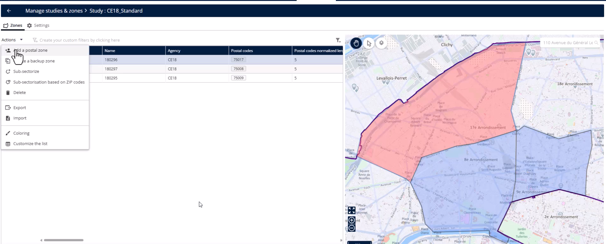
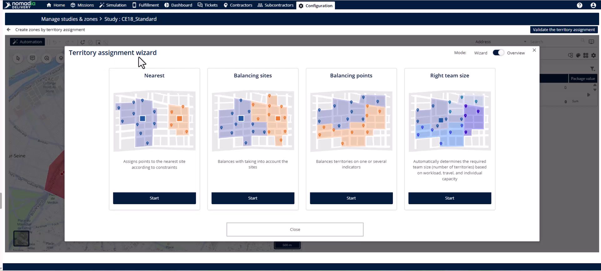
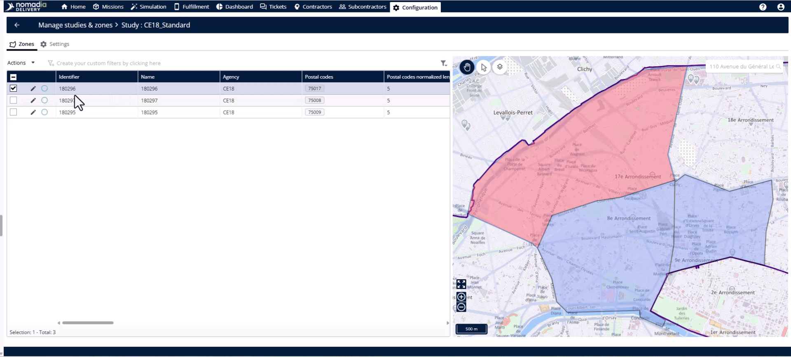
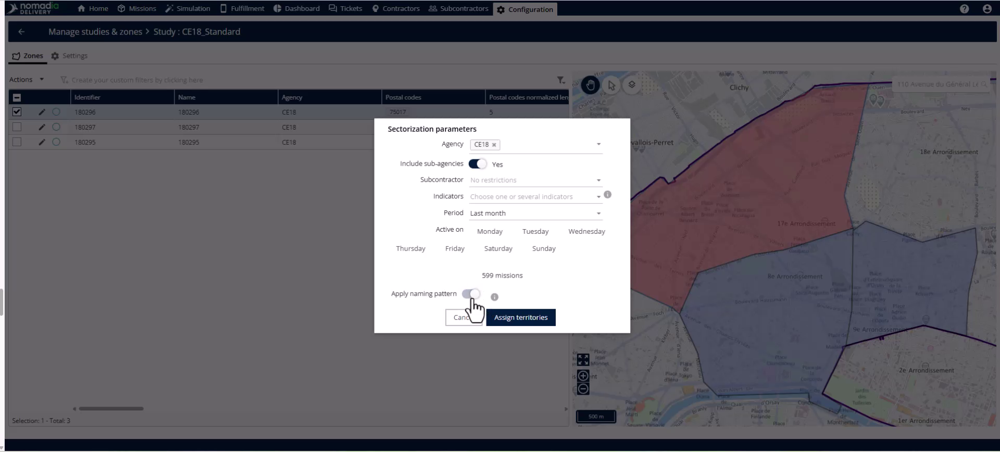
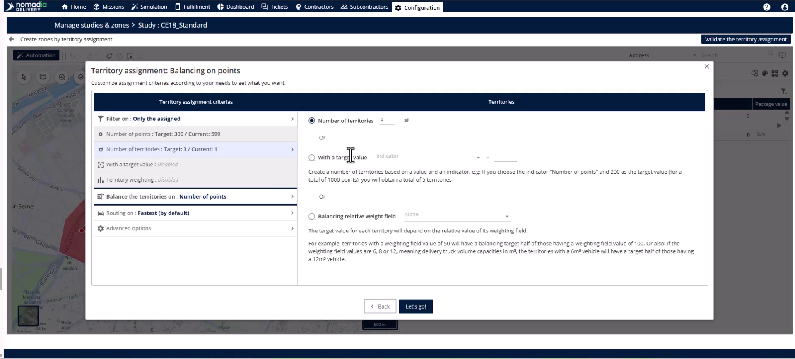
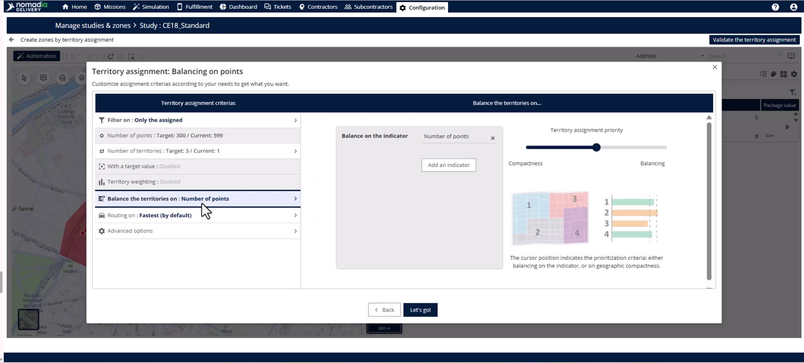
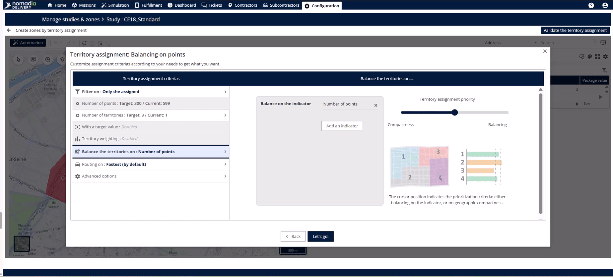
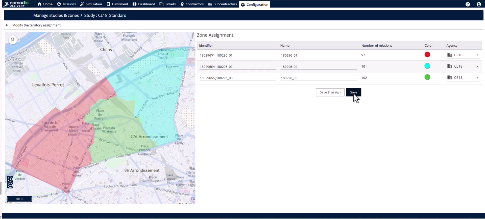

# Sub sectorize primary zone

This feature allows you to split a primary zone into smaller, balanced territories automatically using the territory management module. Dispatchers need this to create fair and logical areas for specific delivery agents or teams. By following this guide, you will achieve three geographically split sub-zones ready for immediate assignment.

#### Getting Started

Before you begin sub-sectoring, ensure your system meets these requirements:

* A primary zone must be built with mapped postal codes and defined geography.
* Historical mission data, including delivery points and coordinates, must be loaded into the mission page.

Follow these initial steps:

1. Open your **study** and navigate to the **zone tab**.

2. Select your **primary zone** from the list.

#### Feature Overview

* **Actions menu**: Provides access to the sub-sectorization tool for the selected zone.

<figure><figcaption></figcaption></figure>

* **Sectorization parameters pop-up**: Allows you to filter which missions the system uses for balancing.

* **Naming pattern toggle**: Automatically names new sub-zones based on the primary zone's name to maintain consistency.

* **Assign territories button**: Launches the territory manager module with your filtered mission data.

* **Automation button**: Opens the territory assignment wizard to start the automated balancing process.

* **Balance points**: A balancing method that distributes missions evenly based on the number of delivery points.

* **Validate territory management button**: Finalizes the automated split and moves you to the assignment stage.

#### How To: Create Balanced Sub-zones

1. Open the **Actions menu** and select **subsectorize**.

2. Use the filters to narrow mission data by **agency**, **subcontractor**, **period**, or **day of the week**.

3. Toggle on the **naming pattern** to automate sub-zone naming.

4. Click **assign territories** to load the filtered missions onto the map.

5. Select the **automation button** located at the top left of the map.

6. Select **balance points** as the balancing method and click **start**.

7. Navigate to the **number of territories tab** and enter your target count (e.g., 3).

8. Move to the **balance the territories on tab** and select your indicator, such as **number of points**.

9. Click **let's go** to start the automated balancing.

10. Review the map split and click **validate territory management**.

11. Link each sub-zone to an **agency** or **subagency** using the drop-down menu.

12. Click **save and assign** to go live immediately, or click **save** to finalize later.

#### Productivity Tips

* 💡 **Intelligent Balancing**: Use historical mission data like stop counts and coordinates to ensure your zones are split accurately based on real-world activity.
* 💡 **Flexible Indicators**: You can balance territories using any numerical data, such as delivery duration or service time, to match your specific operational needs.
* 💡 **Visual Verification**: Use the distinct colors on the map to immediately identify and verify the geographic logic of your new sub-zones.
* ⚠️ **Missing Data Warning**: You cannot perform sub-sectorization if missions are not loaded, as the system will have no data to balance against.
