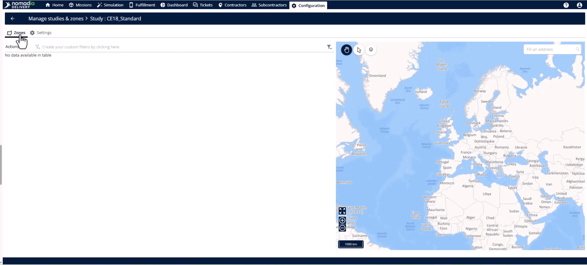

# casestudiesstudycreationwithprimaryzone
# Case-Studies

Studies and zones help you manage delivery territories during peak seasons when volumes fluctuate. This feature allows you to define geographical areas for specific teams and activate them based on seasonality. You will achieve precise coverage and ensure orders land in the correct areas.

### Getting Started

Before creating a study, you must have the correct administrative permissions.

*   Access to the **Study Module**.
*   Permissions for **List of zones**, **Create and update zones**, and **Assign zones**.

1.  Open the **Configuration Module** in the banner of the application.
    
2.  Select the **Manage Users** page.
3.  Edit the specific user and click the **Roles and Rights** tab.
4.  Check the necessary rights related to the **Zone Module**.
5.  Click the **Save** button.

### Feature Overview

*   **Study Management Page**: This is your central hub for building and editing seasonal plans.
*   **Actions Menu**: Use this dropdown to create empty studies or add new zones.
*   **Assignment Mode**: This field determines if a zone is a top-level **Primary Zone** or a subzone.
    
*   **Validity Dates**: These define the overall start and end dates for a specific study.
*   **Activation Windows**: These allow you to set multiple specific time periods for seasonal campaigns within a year.
*   **Map Visualization**: This area automatically renders postal code boundaries as polygons on the map.
    

### How To: Create a Study

1.  Navigate to the **Configuration Module** and click **Studies and Zones** in the **Delivery** section.
2.  Click the **Actions Menu** in the top right and select **Create empty study**.
    
3.  Enter the **Identifier**, **Name**, and **Agency**.
4.  Set the **Validity Start Date** and **Validity End Date**.
5.  Toggle the switch to **Enable** the study.
6.  Select the specific days of the week the study is active.
7.  Define seasonal **Activation Windows** if needed.
8.  Hit the **Save** button.

### How To: Create a Primary Zone

1.  Open your study and switch to the **Zone** tab.
2.  Open the **Actions Menu** and select **Add a postal code zone**.
    
3.  Enter the **Identifier**, **Name**, and **Country**.
4.  Set the **Postal code normalized length** and any necessary **Prefix**.
5.  Select **Primary Zone** in the **Assignment Mode** field.
6.  Add postal codes one by one or use the **Import** option for bulk uploads.
7.  Click the **Save** button to go live.

### Productivity Tips

*   💡 **API Automation**: Trigger study creation programmatically using the **Create Study** endpoint for large seasonal workflows.
*   💡 **Bulk Import**: Save time by using the **Import** tool to upload postal codes for entire regions at once.
*   💡 **Zero-Manual Drawing**: Simply enter postal codes and the system will automatically render the map polygons for you.
*   ⚠️ **Assignment Mode**: Always verify that **Primary Zone** is selected for top-level territories to avoid creating subzones accidentally.

